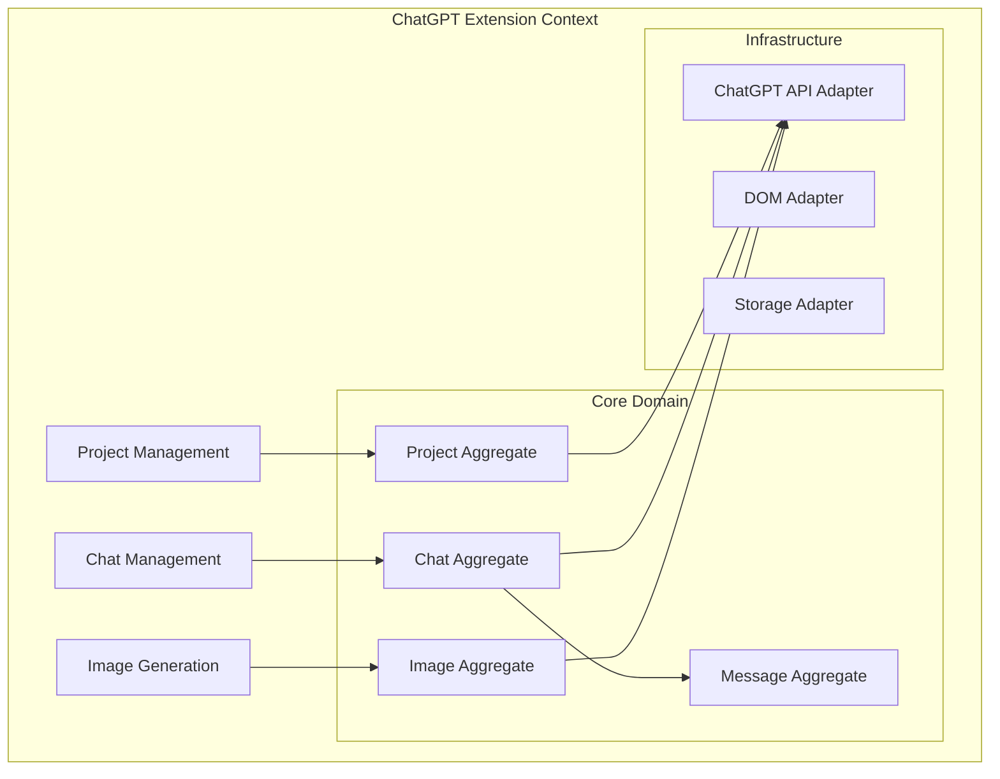

# ChatGPT Extension Architecture & Requirements

## Executive Summary

This document defines comprehensive requirements and architecture for the Semantest ChatGPT Extension, enabling programmatic interaction with ChatGPT through project management, chat automation, and image generation capabilities.

## Table of Contents

1. [Feature Requirements](#feature-requirements)
2. [Domain-Driven Design Architecture](#domain-driven-design-architecture)
3. [Technical Architecture](#technical-architecture)
4. [Interface Definitions](#interface-definitions)
5. [Technical Constraints](#technical-constraints)
6. [Implementation Task Breakdown](#implementation-task-breakdown)
7. [Security Considerations](#security-considerations)
8. [Performance Requirements](#performance-requirements)

## Feature Requirements

### 1. Project Management

#### Create New Project
- **Description**: Programmatically create a new ChatGPT project with a specified name
- **Inputs**: Project name (string, 1-100 characters)
- **Outputs**: Project ID, creation timestamp
- **Validation**: Name uniqueness, character limits, forbidden characters

#### Add Custom Instructions
- **Description**: Add custom system instructions to a project
- **Inputs**: Project ID, instructions (string, up to 1500 characters)
- **Outputs**: Success confirmation, instruction ID
- **Validation**: Project existence, instruction length, content safety

### 2. Chat Management

#### Create New Chat
- **Description**: Create a new chat conversation within a specific project
- **Inputs**: Project ID, optional chat title
- **Outputs**: Chat ID, creation timestamp
- **Validation**: Project existence, title constraints

#### Send Prompt
- **Description**: Send an arbitrary text prompt to a chat
- **Inputs**: Chat ID, prompt text, optional parameters
- **Outputs**: Response text, message ID, tokens used
- **Validation**: Chat existence, prompt length, rate limiting

### 3. Image Generation

#### Send Image Request
- **Description**: Send a prompt specifically for image generation
- **Inputs**: Chat ID, image prompt, style parameters
- **Outputs**: Image generation status, request ID
- **Validation**: Feature availability, prompt appropriateness

#### Download Generated Image
- **Description**: Download the last generated image from a chat
- **Inputs**: Chat ID, download options (format, quality)
- **Outputs**: Image binary data, metadata
- **Validation**: Image existence, download permissions

## Domain-Driven Design Architecture

### Bounded Contexts



### Domain Model

#### 1. Project Aggregate
```typescript
// @semantest/chatgpt/domain/entities/project.entity.ts
export class ChatGPTProject extends AggregateRoot<ChatGPTProject> {
  private constructor(
    private readonly projectId: ProjectId,
    private readonly name: ProjectName,
    private customInstructions: CustomInstructions,
    private readonly createdAt: Date,
    private chatIds: ChatId[] = []
  ) {
    super(projectId.value);
  }

  static create(name: string): ChatGPTProject {
    const projectId = ProjectId.generate();
    const projectName = ProjectName.create(name);
    
    const project = new ChatGPTProject(
      projectId,
      projectName,
      CustomInstructions.empty(),
      new Date()
    );
    
    project.recordEvent(new ProjectCreated(projectId, projectName));
    return project;
  }

  updateCustomInstructions(instructions: string): void {
    const oldInstructions = this.customInstructions;
    this.customInstructions = CustomInstructions.create(instructions);
    
    this.recordEvent(new CustomInstructionsUpdated(
      this.projectId,
      oldInstructions,
      this.customInstructions
    ));
  }

  addChat(chatId: ChatId): void {
    if (this.chatIds.some(id => id.equals(chatId))) {
      throw new DomainError('Chat already exists in project');
    }
    
    this.chatIds.push(chatId);
    this.recordEvent(new ChatAddedToProject(this.projectId, chatId));
  }
}
```

#### 2. Chat Aggregate
```typescript
// @semantest/chatgpt/domain/entities/chat.entity.ts
export class ChatGPTChat extends AggregateRoot<ChatGPTChat> {
  private constructor(
    private readonly chatId: ChatId,
    private readonly projectId: ProjectId,
    private title: ChatTitle,
    private readonly createdAt: Date,
    private messageIds: MessageId[] = [],
    private lastImageMessageId?: MessageId
  ) {
    super(chatId.value);
  }

  static create(projectId: ProjectId, title?: string): ChatGPTChat {
    const chatId = ChatId.generate();
    const chatTitle = title ? ChatTitle.create(title) : ChatTitle.default();
    
    const chat = new ChatGPTChat(
      chatId,
      projectId,
      chatTitle,
      new Date()
    );
    
    chat.recordEvent(new ChatCreated(chatId, projectId, chatTitle));
    return chat;
  }

  addMessage(messageId: MessageId, isImageResponse: boolean = false): void {
    this.messageIds.push(messageId);
    
    if (isImageResponse) {
      this.lastImageMessageId = messageId;
    }
    
    this.recordEvent(new MessageAddedToChat(this.chatId, messageId));
  }

  getLastImageMessageId(): MessageId | undefined {
    return this.lastImageMessageId;
  }
}
```

#### 3. Message Aggregate
```typescript
// @semantest/chatgpt/domain/entities/message.entity.ts
export class ChatGPTMessage extends Entity {
  private constructor(
    private readonly messageId: MessageId,
    private readonly chatId: ChatId,
    private readonly role: MessageRole,
    private readonly content: MessageContent,
    private readonly timestamp: Date,
    private readonly metadata: MessageMetadata
  ) {
    super();
  }

  static createUserMessage(
    chatId: ChatId,
    content: string,
    metadata?: Partial<MessageMetadata>
  ): ChatGPTMessage {
    const messageId = MessageId.generate();
    
    return new ChatGPTMessage(
      messageId,
      chatId,
      MessageRole.USER,
      MessageContent.create(content),
      new Date(),
      MessageMetadata.create(metadata)
    );
  }

  static createAssistantMessage(
    chatId: ChatId,
    content: string,
    metadata?: Partial<MessageMetadata>
  ): ChatGPTMessage {
    const messageId = MessageId.generate();
    
    return new ChatGPTMessage(
      messageId,
      chatId,
      MessageRole.ASSISTANT,
      MessageContent.create(content),
      new Date(),
      MessageMetadata.create(metadata)
    );
  }

  isImageGeneration(): boolean {
    return this.metadata.hasImageGeneration();
  }
}
```

#### 4. Value Objects
```typescript
// @semantest/chatgpt/domain/value-objects/index.ts
export class ProjectId extends ValueObject {
  private constructor(public readonly value: string) {
    super();
  }

  static generate(): ProjectId {
    return new ProjectId(`proj_${generateUUID()}`);
  }

  static fromString(value: string): ProjectId {
    if (!value.startsWith('proj_')) {
      throw new ValidationError('Invalid project ID format');
    }
    return new ProjectId(value);
  }
}

export class ProjectName extends ValueObject {
  private constructor(public readonly value: string) {
    super();
  }

  static create(name: string): ProjectName {
    if (name.length < 1 || name.length > 100) {
      throw new ValidationError('Project name must be 1-100 characters');
    }
    
    if (!/^[a-zA-Z0-9\s\-_]+$/.test(name)) {
      throw new ValidationError('Project name contains invalid characters');
    }
    
    return new ProjectName(name.trim());
  }
}

export class CustomInstructions extends ValueObject {
  private constructor(public readonly value: string) {
    super();
  }

  static create(instructions: string): CustomInstructions {
    if (instructions.length > 1500) {
      throw new ValidationError('Instructions exceed 1500 character limit');
    }
    
    return new CustomInstructions(instructions.trim());
  }

  static empty(): CustomInstructions {
    return new CustomInstructions('');
  }
}

export class MessageContent extends ValueObject {
  private constructor(
    public readonly text: string,
    public readonly attachments: Attachment[] = []
  ) {
    super();
  }

  static create(text: string, attachments?: Attachment[]): MessageContent {
    if (text.length === 0 && (!attachments || attachments.length === 0)) {
      throw new ValidationError('Message must have content or attachments');
    }
    
    return new MessageContent(text, attachments || []);
  }
}
```

### Domain Events
```typescript
// @semantest/chatgpt/domain/events/index.ts
export class ProjectCreated extends DomainEvent {
  constructor(
    public readonly projectId: ProjectId,
    public readonly projectName: ProjectName,
    occurredAt?: Date
  ) {
    super(projectId.value, occurredAt);
  }

  get eventName(): string {
    return 'ChatGPT.ProjectCreated';
  }
}

export class ChatCreated extends DomainEvent {
  constructor(
    public readonly chatId: ChatId,
    public readonly projectId: ProjectId,
    public readonly title: ChatTitle,
    occurredAt?: Date
  ) {
    super(chatId.value, occurredAt);
  }

  get eventName(): string {
    return 'ChatGPT.ChatCreated';
  }
}

export class PromptSent extends DomainEvent {
  constructor(
    public readonly messageId: MessageId,
    public readonly chatId: ChatId,
    public readonly prompt: string,
    public readonly isImageRequest: boolean,
    occurredAt?: Date
  ) {
    super(messageId.value, occurredAt);
  }

  get eventName(): string {
    return 'ChatGPT.PromptSent';
  }
}

export class ResponseReceived extends DomainEvent {
  constructor(
    public readonly messageId: MessageId,
    public readonly chatId: ChatId,
    public readonly response: string,
    public readonly metadata: ResponseMetadata,
    occurredAt?: Date
  ) {
    super(messageId.value, occurredAt);
  }

  get eventName(): string {
    return 'ChatGPT.ResponseReceived';
  }
}

export class ImageGenerated extends DomainEvent {
  constructor(
    public readonly imageId: ImageId,
    public readonly chatId: ChatId,
    public readonly messageId: MessageId,
    public readonly imageUrl: string,
    occurredAt?: Date
  ) {
    super(imageId.value, occurredAt);
  }

  get eventName(): string {
    return 'ChatGPT.ImageGenerated';
  }
}
```

## Technical Architecture

### Infrastructure Layer

#### 1. ChatGPT Communication Adapter
```typescript
// @semantest/chatgpt/infrastructure/adapters/chatgpt-communication.adapter.ts
export interface ChatGPTCommunicationAdapter {
  createProject(name: string): Promise<{ projectId: string }>;
  updateProjectInstructions(projectId: string, instructions: string): Promise<void>;
  createChat(projectId: string, title?: string): Promise<{ chatId: string }>;
  sendPrompt(chatId: string, prompt: string, options?: PromptOptions): Promise<ChatGPTResponse>;
  getLastImage(chatId: string): Promise<ImageData | null>;
}

export class ChatGPTWebAdapter implements ChatGPTCommunicationAdapter {
  constructor(
    private readonly domAdapter: ChatGPTDOMAdapter,
    private readonly networkAdapter: ChatGPTNetworkAdapter
  ) {}

  async createProject(name: string): Promise<{ projectId: string }> {
    // Navigate to project creation UI
    await this.domAdapter.navigateToProjectCreation();
    
    // Fill project name
    await this.domAdapter.fillProjectName(name);
    
    // Submit and wait for creation
    const projectId = await this.domAdapter.submitProjectCreation();
    
    return { projectId };
  }

  async sendPrompt(chatId: string, prompt: string, options?: PromptOptions): Promise<ChatGPTResponse> {
    // Navigate to chat
    await this.domAdapter.navigateToChat(chatId);
    
    // Type prompt
    await this.domAdapter.typePrompt(prompt);
    
    // Send and wait for response
    const response = await this.domAdapter.sendAndWaitForResponse();
    
    return response;
  }
}
```

#### 2. DOM Manipulation Adapter
```typescript
// @semantest/chatgpt/infrastructure/adapters/chatgpt-dom.adapter.ts
export class ChatGPTDOMAdapter {
  private readonly selectors = {
    projectButton: '[data-testid="new-project-button"]',
    projectNameInput: 'input[placeholder*="Project name"]',
    chatInput: 'textarea[data-id="chat-input"]',
    sendButton: 'button[data-testid="send-button"]',
    responseContainer: '[data-testid="conversation-turn"]:last-child',
    imageContainer: 'img[alt*="Generated"]'
  };

  async navigateToProjectCreation(): Promise<void> {
    const button = await this.waitForElement(this.selectors.projectButton);
    button.click();
  }

  async fillProjectName(name: string): Promise<void> {
    const input = await this.waitForElement(this.selectors.projectNameInput);
    await this.setInputValue(input, name);
  }

  async typePrompt(prompt: string): Promise<void> {
    const textarea = await this.waitForElement(this.selectors.chatInput);
    await this.setTextareaValue(textarea, prompt);
  }

  async sendAndWaitForResponse(): Promise<ChatGPTResponse> {
    // Click send
    const sendButton = await this.waitForElement(this.selectors.sendButton);
    sendButton.click();
    
    // Wait for response
    const responseElement = await this.waitForResponse();
    
    return this.parseResponse(responseElement);
  }

  private async waitForElement(selector: string, timeout: number = 10000): Promise<HTMLElement> {
    // Implementation with retry logic
  }

  private async waitForResponse(): Promise<HTMLElement> {
    // Wait for streaming to complete
    return this.waitForElement(this.selectors.responseContainer);
  }
}
```

### Application Services

#### 1. Project Management Service
```typescript
// @semantest/chatgpt/application/project-management.service.ts
export class ProjectManagementService {
  constructor(
    private readonly projectRepository: ChatGPTProjectRepository,
    private readonly communicationAdapter: ChatGPTCommunicationAdapter,
    private readonly eventBus: EventBus
  ) {}

  async createProject(command: CreateProjectCommand): Promise<CreateProjectResult> {
    // Create domain entity
    const project = ChatGPTProject.create(command.name);
    
    // Create in ChatGPT
    const { projectId: externalId } = await this.communicationAdapter.createProject(
      command.name
    );
    
    // Update project with external ID
    project.setExternalId(externalId);
    
    // Save
    await this.projectRepository.save(project);
    
    // Publish events
    await this.eventBus.publishAll(project.getUncommittedEvents());
    
    return {
      projectId: project.id,
      externalId,
      createdAt: project.createdAt
    };
  }

  async updateCustomInstructions(
    command: UpdateInstructionsCommand
  ): Promise<void> {
    const project = await this.projectRepository.findById(command.projectId);
    
    if (!project) {
      throw new NotFoundError('Project not found');
    }
    
    // Update domain
    project.updateCustomInstructions(command.instructions);
    
    // Update in ChatGPT
    await this.communicationAdapter.updateProjectInstructions(
      project.externalId,
      command.instructions
    );
    
    // Save
    await this.projectRepository.save(project);
    
    // Publish events
    await this.eventBus.publishAll(project.getUncommittedEvents());
  }
}
```

#### 2. Chat Management Service
```typescript
// @semantest/chatgpt/application/chat-management.service.ts
export class ChatManagementService {
  constructor(
    private readonly chatRepository: ChatGPTChatRepository,
    private readonly messageRepository: ChatGPTMessageRepository,
    private readonly projectRepository: ChatGPTProjectRepository,
    private readonly communicationAdapter: ChatGPTCommunicationAdapter,
    private readonly eventBus: EventBus
  ) {}

  async createChat(command: CreateChatCommand): Promise<CreateChatResult> {
    // Verify project exists
    const project = await this.projectRepository.findById(command.projectId);
    if (!project) {
      throw new NotFoundError('Project not found');
    }
    
    // Create domain entity
    const chat = ChatGPTChat.create(command.projectId, command.title);
    
    // Create in ChatGPT
    const { chatId: externalId } = await this.communicationAdapter.createChat(
      project.externalId,
      command.title
    );
    
    // Update chat with external ID
    chat.setExternalId(externalId);
    
    // Update project
    project.addChat(chat.id);
    
    // Save
    await this.chatRepository.save(chat);
    await this.projectRepository.save(project);
    
    // Publish events
    await this.eventBus.publishAll([
      ...chat.getUncommittedEvents(),
      ...project.getUncommittedEvents()
    ]);
    
    return {
      chatId: chat.id,
      externalId,
      createdAt: chat.createdAt
    };
  }

  async sendPrompt(command: SendPromptCommand): Promise<SendPromptResult> {
    const chat = await this.chatRepository.findById(command.chatId);
    if (!chat) {
      throw new NotFoundError('Chat not found');
    }
    
    // Create user message
    const userMessage = ChatGPTMessage.createUserMessage(
      command.chatId,
      command.prompt
    );
    
    // Send to ChatGPT
    const response = await this.communicationAdapter.sendPrompt(
      chat.externalId,
      command.prompt,
      command.options
    );
    
    // Create assistant message
    const assistantMessage = ChatGPTMessage.createAssistantMessage(
      command.chatId,
      response.content,
      response.metadata
    );
    
    // Update chat
    chat.addMessage(userMessage.id);
    chat.addMessage(assistantMessage.id, response.hasImage);
    
    // Save
    await this.messageRepository.save(userMessage);
    await this.messageRepository.save(assistantMessage);
    await this.chatRepository.save(chat);
    
    // Publish events
    await this.eventBus.publish(new PromptSent(
      userMessage.id,
      command.chatId,
      command.prompt,
      false
    ));
    
    await this.eventBus.publish(new ResponseReceived(
      assistantMessage.id,
      command.chatId,
      response.content,
      response.metadata
    ));
    
    return {
      userMessageId: userMessage.id,
      assistantMessageId: assistantMessage.id,
      response: response.content,
      tokensUsed: response.metadata.tokensUsed
    };
  }
}
```

#### 3. Image Generation Service
```typescript
// @semantest/chatgpt/application/image-generation.service.ts
export class ImageGenerationService {
  constructor(
    private readonly chatRepository: ChatGPTChatRepository,
    private readonly imageRepository: ChatGPTImageRepository,
    private readonly communicationAdapter: ChatGPTCommunicationAdapter,
    private readonly storageAdapter: StorageAdapter,
    private readonly eventBus: EventBus
  ) {}

  async sendImageRequest(
    command: SendImageRequestCommand
  ): Promise<SendImageRequestResult> {
    const chat = await this.chatRepository.findById(command.chatId);
    if (!chat) {
      throw new NotFoundError('Chat not found');
    }
    
    // Format image generation prompt
    const imagePrompt = this.formatImagePrompt(command.prompt, command.style);
    
    // Send prompt
    const response = await this.communicationAdapter.sendPrompt(
      chat.externalId,
      imagePrompt,
      { isImageGeneration: true }
    );
    
    // Create image entity
    const image = ChatGPTImage.create(
      command.chatId,
      response.imageUrl,
      command.prompt,
      command.style
    );
    
    // Save
    await this.imageRepository.save(image);
    
    // Publish event
    await this.eventBus.publish(new ImageGenerated(
      image.id,
      command.chatId,
      response.messageId,
      response.imageUrl
    ));
    
    return {
      imageId: image.id,
      imageUrl: response.imageUrl,
      messageId: response.messageId
    };
  }

  async downloadGeneratedImage(
    command: DownloadImageCommand
  ): Promise<DownloadImageResult> {
    const chat = await this.chatRepository.findById(command.chatId);
    if (!chat) {
      throw new NotFoundError('Chat not found');
    }
    
    const lastImageMessageId = chat.getLastImageMessageId();
    if (!lastImageMessageId) {
      throw new NotFoundError('No image found in chat');
    }
    
    // Get image data from ChatGPT
    const imageData = await this.communicationAdapter.getLastImage(
      chat.externalId
    );
    
    if (!imageData) {
      throw new NotFoundError('Image data not available');
    }
    
    // Download and store
    const storedImage = await this.storageAdapter.storeImage(
      imageData,
      command.options
    );
    
    return {
      imagePath: storedImage.path,
      size: storedImage.size,
      format: storedImage.format,
      metadata: storedImage.metadata
    };
  }

  private formatImagePrompt(prompt: string, style?: ImageStyle): string {
    const stylePrefix = style ? `[${style.toString()}] ` : '';
    return `${stylePrefix}${prompt}`;
  }
}
```

## Technical Constraints

### 1. Browser Extension Limitations
- **Content Security Policy**: Must work within ChatGPT's CSP
- **DOM Stability**: ChatGPT UI may change without notice
- **Rate Limiting**: Respect ChatGPT's rate limits
- **Authentication**: Must handle session management

### 2. Technical Requirements
- **Browser Support**: Chrome 90+, Firefox 90+, Edge 90+
- **TypeScript**: Version 5.0+
- **Manifest Version**: V3 for Chrome extensions
- **Storage**: IndexedDB for local data persistence

### 3. Performance Constraints
- **Response Time**: < 2s for UI operations
- **Memory Usage**: < 50MB baseline
- **CPU Usage**: < 10% during idle
- **Network**: Handle offline gracefully

### 4. Security Constraints
- **Data Isolation**: Project data isolated per origin
- **Credential Storage**: Secure storage for auth tokens
- **Content Injection**: Safe DOM manipulation
- **XSS Prevention**: Sanitize all user inputs

## Implementation Task Breakdown

### Phase 1: Foundation (Week 1-2)

#### Task 1.1: Project Structure Setup
- Create extension manifest
- Set up TypeScript configuration
- Configure build pipeline
- Implement core domain entities

#### Task 1.2: DOM Adapter Implementation
- Implement element selectors
- Create wait/retry logic
- Build DOM manipulation utilities
- Add error handling

#### Task 1.3: Basic Project Management
- Implement create project functionality
- Add project storage
- Create project repository
- Build project service

### Phase 2: Chat Management (Week 3-4)

#### Task 2.1: Chat Creation
- Implement chat domain model
- Build chat creation adapter
- Create chat repository
- Add chat-project relationship

#### Task 2.2: Message Handling
- Implement message entities
- Build prompt sending logic
- Create response parsing
- Add message storage

#### Task 2.3: Conversation Flow
- Handle streaming responses
- Manage conversation state
- Implement retry logic
- Add error recovery

### Phase 3: Image Generation (Week 5-6)

#### Task 3.1: Image Request Handling
- Create image prompt formatting
- Implement image request logic
- Add style parameter support
- Build image entity model

#### Task 3.2: Image Download
- Implement image detection
- Build download logic
- Add format conversion
- Create storage adapter

#### Task 3.3: Image Management
- Create image repository
- Build image service
- Add metadata extraction
- Implement cleanup logic

### Phase 4: Integration & Testing (Week 7-8)

#### Task 4.1: End-to-End Testing
- Create test scenarios
- Build automation tests
- Add performance tests
- Implement stress tests

#### Task 4.2: Error Handling
- Implement retry strategies
- Add graceful degradation
- Build error reporting
- Create recovery mechanisms

#### Task 4.3: Documentation
- Write API documentation
- Create user guides
- Build example code
- Add troubleshooting guide

## Security Considerations

### 1. Authentication Security
- Secure token storage in extension storage API
- Token refresh mechanism
- Session timeout handling
- Cross-origin protection

### 2. Data Protection
- Encrypt sensitive data at rest
- Sanitize all user inputs
- Validate all API responses
- Implement CSP compliance

### 3. Privacy Compliance
- User consent for data storage
- Data deletion capabilities
- Audit logging
- GDPR compliance

## Performance Requirements

### 1. Response Times
- Project creation: < 3s
- Chat creation: < 2s
- Prompt sending: < 1s to start
- Image download: < 5s

### 2. Resource Usage
- Memory: < 50MB idle, < 100MB active
- CPU: < 5% idle, < 20% active
- Storage: < 10MB per project
- Network: Efficient batching

### 3. Scalability
- Support 100+ projects
- Handle 1000+ chats
- Process 10k+ messages
- Manage 1000+ images

## Conclusion

This architecture provides a comprehensive foundation for building a ChatGPT extension with robust project management, chat automation, and image generation capabilities. The DDD approach ensures maintainability and scalability while respecting technical constraints.

---

**Document Version**: 1.0.0  
**Author**: Semantest Architect  
**Date**: January 18, 2025  
**Status**: Architecture Design Complete