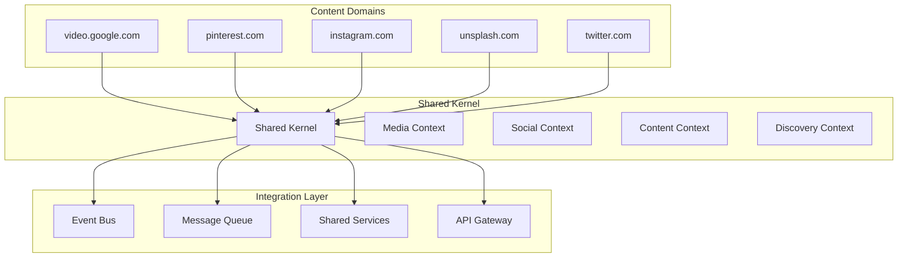

# Semantest Domain Expansion Architecture

Tasks 035-039 - DDD Patterns for New Domain Modules

## Executive Summary

This document defines the Domain-Driven Design architecture for expanding Semantest with five new domain modules: video.google.com, pinterest.com, instagram.com, unsplash.com, and twitter.com. The architecture emphasizes shared patterns, cross-module integration, and maintainable boundaries.

## Table of Contents

1. [Domain Analysis](#domain-analysis)
2. [Shared Kernel Design](#shared-kernel-design)
3. [Domain Models](#domain-models)
4. [Cross-Module Integration](#cross-module-integration)
5. [Implementation Strategy](#implementation-strategy)
6. [Migration Plan](#migration-plan)

## Domain Analysis

### Bounded Context Map



### Domain Commonalities

| Domain | Primary Focus | Media Types | Social Features | Collections |
|--------|---------------|-------------|-----------------|-------------|
| video.google.com | Video content | Videos, thumbnails | Comments, likes | Playlists, channels |
| pinterest.com | Visual discovery | Images, videos | Pins, boards | Collections, topics |
| instagram.com | Social media | Images, videos, stories | Posts, reels | Highlights, albums |
| unsplash.com | Photography | High-res images | Collections, likes | Photos, topics |
| twitter.com | Microblogging | Text, images, videos | Tweets, threads | Lists, moments |

### Cross-Cutting Concerns

1. **Authentication & Authorization** - Platform-specific OAuth flows
2. **Rate Limiting** - API quota management and throttling
3. **Error Handling** - Consistent error recovery patterns
4. **Caching** - Multi-layer caching strategy
5. **Event Processing** - Asynchronous event handling
6. **Media Processing** - Thumbnail generation, format conversion
7. **Search & Discovery** - Unified search across platforms

## Shared Kernel Design

### Core Abstractions

```typescript
// @semantest/core/domain/shared/media.ts
export abstract class MediaContent extends AggregateRoot<MediaContent> {
  constructor(
    protected readonly id: MediaId,
    protected readonly url: MediaUrl,
    protected readonly metadata: MediaMetadata,
    protected readonly platform: Platform
  ) {
    super();
  }

  abstract getDisplayUrl(): string;
  abstract getThumbnailUrl(): string;
  abstract validate(): Result<void, ValidationError>;
}

// @semantest/core/domain/shared/social.ts
export abstract class SocialContent extends AggregateRoot<SocialContent> {
  constructor(
    protected readonly id: ContentId,
    protected readonly author: AuthorProfile,
    protected readonly metrics: SocialMetrics,
    protected readonly platform: Platform
  ) {
    super();
  }

  abstract getEngagementScore(): number;
  abstract canBeShared(): boolean;
  abstract getShareableUrl(): string;
}

// @semantest/core/domain/shared/collection.ts
export abstract class ContentCollection extends AggregateRoot<ContentCollection> {
  protected items: ContentItem[] = [];

  constructor(
    protected readonly id: CollectionId,
    protected readonly name: CollectionName,
    protected readonly owner: UserId,
    protected readonly platform: Platform
  ) {
    super();
  }

  abstract addItem(item: ContentItem): Result<void, DomainError>;
  abstract removeItem(itemId: string): Result<void, DomainError>;
  abstract getItems(): ReadonlyArray<ContentItem>;
}
```

### Shared Value Objects

```typescript
// @semantest/core/domain/shared/value-objects/media-metadata.ts
export class MediaMetadata extends ValueObject<MediaMetadata> {
  constructor(
    public readonly title: string,
    public readonly description: string,
    public readonly tags: readonly string[],
    public readonly dimensions: MediaDimensions,
    public readonly duration?: MediaDuration,
    public readonly fileSize?: number,
    public readonly format?: string,
    public readonly quality?: MediaQuality
  ) {
    super();
  }

  static create(data: MediaMetadataProps): Result<MediaMetadata, ValidationError> {
    // Validation logic
    return Result.ok(new MediaMetadata(
      data.title,
      data.description,
      data.tags,
      data.dimensions,
      data.duration,
      data.fileSize,
      data.format,
      data.quality
    ));
  }

  equals(other: MediaMetadata): boolean {
    return this.title === other.title &&
           this.description === other.description &&
           this.tagsEqual(other.tags) &&
           this.dimensions.equals(other.dimensions);
  }
}

// @semantest/core/domain/shared/value-objects/social-metrics.ts
export class SocialMetrics extends ValueObject<SocialMetrics> {
  constructor(
    public readonly views: number,
    public readonly likes: number,
    public readonly shares: number,
    public readonly comments: number,
    public readonly engagementRate: number,
    public readonly lastUpdated: Date
  ) {
    super();
  }

  static create(data: SocialMetricsProps): Result<SocialMetrics, ValidationError> {
    if (data.views < 0 || data.likes < 0 || data.shares < 0 || data.comments < 0) {
      return Result.fail(new ValidationError('Metrics values cannot be negative'));
    }

    const engagementRate = data.views > 0 
      ? (data.likes + data.shares + data.comments) / data.views 
      : 0;

    return Result.ok(new SocialMetrics(
      data.views,
      data.likes,
      data.shares,
      data.comments,
      engagementRate,
      data.lastUpdated || new Date()
    ));
  }

  calculateTrend(previous: SocialMetrics): TrendDirection {
    const currentTotal = this.likes + this.shares + this.comments;
    const previousTotal = previous.likes + previous.shares + previous.comments;
    
    if (currentTotal > previousTotal) return TrendDirection.Up;
    if (currentTotal < previousTotal) return TrendDirection.Down;
    return TrendDirection.Stable;
  }
}
```

### Shared Domain Services

```typescript
// @semantest/core/domain/shared/services/content-extractor.service.ts
export abstract class ContentExtractorService {
  constructor(
    protected readonly rateLimiter: RateLimiter,
    protected readonly validator: ContentValidator,
    protected readonly logger: Logger
  ) {}

  async extractContent(url: string): Promise<Result<ContentExtractionResult, ExtractionError>> {
    // Rate limiting check
    const rateLimitResult = await this.rateLimiter.checkLimit(this.getPlatform());
    if (rateLimitResult.isFailure()) {
      return Result.fail(new RateLimitExceededError(rateLimitResult.getError()));
    }

    // URL validation
    const urlValidation = this.validator.validateUrl(url);
    if (urlValidation.isFailure()) {
      return Result.fail(urlValidation.getError());
    }

    try {
      // Platform-specific extraction
      const extractionResult = await this.performExtraction(url);
      
      // Content validation
      const contentValidation = this.validator.validateContent(extractionResult);
      if (contentValidation.isFailure()) {
        return Result.fail(contentValidation.getError());
      }

      // Success logging
      this.logger.info('Content extracted successfully', {
        platform: this.getPlatform(),
        url,
        contentType: extractionResult.type
      });

      return Result.ok(extractionResult);
      
    } catch (error) {
      this.logger.error('Content extraction failed', {
        platform: this.getPlatform(),
        url,
        error: error.message
      });
      
      return Result.fail(new ExtractionError(
        `Failed to extract content from ${url}`,
        error as Error
      ));
    }
  }

  abstract getPlatform(): Platform;
  abstract performExtraction(url: string): Promise<ContentExtractionResult>;
}
```

## Domain Models

### Video.Google.com Domain

```typescript
// @semantest/video.google.com/domain/aggregates/video.aggregate.ts
export class Video extends MediaContent {
  private chapters: VideoChapter[] = [];
  private transcripts: VideoTranscript[] = [];

  private constructor(
    id: VideoId,
    url: VideoUrl,
    metadata: VideoMetadata,
    private readonly channel: ChannelInfo,
    private readonly publishedAt: Date,
    private readonly duration: VideoDuration,
    private readonly quality: VideoQuality[]
  ) {
    super(id, url, metadata, Platform.GoogleVideo);
  }

  static create(data: CreateVideoProps): Result<Video, ValidationError> {
    // Validation logic
    const video = new Video(
      data.id,
      data.url,
      data.metadata,
      data.channel,
      data.publishedAt,
      data.duration,
      data.quality
    );

    video.applyEvent(new VideoCreatedEvent(
      video.getId(),
      video.getUrl(),
      video.getMetadata(),
      data.channel.id
    ));

    return Result.ok(video);
  }

  addChapter(chapter: VideoChapter): Result<void, DomainError> {
    if (this.chapters.some(c => c.overlaps(chapter))) {
      return Result.fail(new ChapterOverlapError(chapter.getTitle()));
    }

    this.chapters.push(chapter);
    this.applyEvent(new VideoChapterAddedEvent(
      this.getId(),
      chapter.getTitle(),
      chapter.getStartTime(),
      chapter.getEndTime()
    ));

    return Result.ok();
  }

  addTranscript(transcript: VideoTranscript): Result<void, DomainError> {
    if (this.transcripts.some(t => t.getLanguage() === transcript.getLanguage())) {
      return Result.fail(new DuplicateTranscriptError(transcript.getLanguage()));
    }

    this.transcripts.push(transcript);
    this.applyEvent(new VideoTranscriptAddedEvent(
      this.getId(),
      transcript.getLanguage(),
      transcript.getContent().length
    ));

    return Result.ok();
  }

  getDisplayUrl(): string {
    return this.url.value;
  }

  getThumbnailUrl(): string {
    return this.url.getThumbnailUrl();
  }

  validate(): Result<void, ValidationError> {
    if (this.duration.isZero()) {
      return Result.fail(new ValidationError('Video duration cannot be zero'));
    }

    if (this.quality.length === 0) {
      return Result.fail(new ValidationError('Video must have at least one quality option'));
    }

    return Result.ok();
  }

  getDurationInSeconds(): number {
    return this.duration.toSeconds();
  }

  getAvailableQualities(): ReadonlyArray<VideoQuality> {
    return this.quality;
  }

  getChapters(): ReadonlyArray<VideoChapter> {
    return this.chapters;
  }
}

// @semantest/video.google.com/domain/aggregates/playlist.aggregate.ts
export class Playlist extends ContentCollection {
  private constructor(
    id: PlaylistId,
    name: PlaylistName,
    owner: UserId,
    private readonly description: PlaylistDescription,
    private readonly visibility: PlaylistVisibility,
    private readonly createdAt: Date
  ) {
    super(id, name, owner, Platform.GoogleVideo);
  }

  static create(data: CreatePlaylistProps): Result<Playlist, ValidationError> {
    const playlist = new Playlist(
      data.id,
      data.name,
      data.owner,
      data.description,
      data.visibility,
      new Date()
    );

    playlist.applyEvent(new PlaylistCreatedEvent(
      playlist.getId(),
      playlist.getName(),
      data.owner,
      data.visibility
    ));

    return Result.ok(playlist);
  }

  addItem(item: Video): Result<void, DomainError> {
    if (this.items.length >= 5000) {
      return Result.fail(new PlaylistFullError('Playlist cannot contain more than 5000 videos'));
    }

    if (this.items.some(existingItem => existingItem.getId() === item.getId())) {
      return Result.fail(new DuplicateVideoError(item.getId()));
    }

    this.items.push(item);
    this.applyEvent(new VideoAddedToPlaylistEvent(
      this.getId(),
      item.getId(),
      this.items.length
    ));

    return Result.ok();
  }

  removeItem(itemId: string): Result<void, DomainError> {
    const itemIndex = this.items.findIndex(item => item.getId() === itemId);
    if (itemIndex === -1) {
      return Result.fail(new VideoNotFoundError(itemId));
    }

    this.items.splice(itemIndex, 1);
    this.applyEvent(new VideoRemovedFromPlaylistEvent(
      this.getId(),
      itemId,
      this.items.length
    ));

    return Result.ok();
  }

  getItems(): ReadonlyArray<Video> {
    return this.items as ReadonlyArray<Video>;
  }

  getTotalDuration(): VideoDuration {
    return this.items.reduce(
      (total, video) => total.add(video.getDuration()),
      VideoDuration.zero()
    );
  }
}
```

### Pinterest.com Domain

```typescript
// @semantest/pinterest.com/domain/aggregates/pin.aggregate.ts
export class Pin extends SocialContent {
  private constructor(
    id: PinId,
    author: PinnerProfile,
    metrics: SocialMetrics,
    private readonly image: PinImage,
    private readonly description: PinDescription,
    private readonly originalUrl: PinUrl,
    private readonly board: BoardReference,
    private readonly createdAt: Date
  ) {
    super(id, author, metrics, Platform.Pinterest);
  }

  static create(data: CreatePinProps): Result<Pin, ValidationError> {
    const pin = new Pin(
      data.id,
      data.author,
      data.metrics,
      data.image,
      data.description,
      data.originalUrl,
      data.board,
      new Date()
    );

    pin.applyEvent(new PinCreatedEvent(
      pin.getId(),
      pin.getAuthor().getId(),
      pin.getImage().getUrl(),
      data.board.getId()
    ));

    return Result.ok(pin);
  }

  repin(newBoard: BoardReference, pinner: PinnerProfile): Result<Pin, DomainError> {
    if (this.board.getId() === newBoard.getId()) {
      return Result.fail(new SameBoardError('Cannot repin to the same board'));
    }

    const repinnedPin = new Pin(
      PinId.generate(),
      pinner,
      SocialMetrics.createDefault(),
      this.image,
      this.description,
      this.originalUrl,
      newBoard,
      new Date()
    );

    repinnedPin.applyEvent(new PinRepinnedEvent(
      repinnedPin.getId(),
      this.getId(),
      pinner.getId(),
      newBoard.getId()
    ));

    return Result.ok(repinnedPin);
  }

  updateDescription(newDescription: PinDescription): Result<void, DomainError> {
    if (this.description.equals(newDescription)) {
      return Result.ok();
    }

    this.description = newDescription;
    this.applyEvent(new PinDescriptionUpdatedEvent(
      this.getId(),
      newDescription.value
    ));

    return Result.ok();
  }

  getEngagementScore(): number {
    return this.metrics.engagementRate;
  }

  canBeShared(): boolean {
    return this.author.getAllowsSharing();
  }

  getShareableUrl(): string {
    return `https://pinterest.com/pin/${this.getId()}`;
  }

  getImage(): PinImage {
    return this.image;
  }

  getDescription(): PinDescription {
    return this.description;
  }

  getBoard(): BoardReference {
    return this.board;
  }
}

// @semantest/pinterest.com/domain/aggregates/board.aggregate.ts
export class Board extends ContentCollection {
  private followers: PinnerProfile[] = [];

  private constructor(
    id: BoardId,
    name: BoardName,
    owner: UserId,
    private readonly description: BoardDescription,
    private readonly category: BoardCategory,
    private readonly privacy: BoardPrivacy,
    private readonly createdAt: Date
  ) {
    super(id, name, owner, Platform.Pinterest);
  }

  static create(data: CreateBoardProps): Result<Board, ValidationError> {
    const board = new Board(
      data.id,
      data.name,
      data.owner,
      data.description,
      data.category,
      data.privacy,
      new Date()
    );

    board.applyEvent(new BoardCreatedEvent(
      board.getId(),
      board.getName(),
      data.owner,
      data.category,
      data.privacy
    ));

    return Result.ok(board);
  }

  addItem(item: Pin): Result<void, DomainError> {
    if (this.items.some(existingPin => existingPin.getId() === item.getId())) {
      return Result.fail(new DuplicatePinError(item.getId()));
    }

    this.items.push(item);
    this.applyEvent(new PinAddedToBoardEvent(
      this.getId(),
      item.getId(),
      this.items.length
    ));

    return Result.ok();
  }

  removeItem(itemId: string): Result<void, DomainError> {
    const itemIndex = this.items.findIndex(item => item.getId() === itemId);
    if (itemIndex === -1) {
      return Result.fail(new PinNotFoundError(itemId));
    }

    this.items.splice(itemIndex, 1);
    this.applyEvent(new PinRemovedFromBoardEvent(
      this.getId(),
      itemId,
      this.items.length
    ));

    return Result.ok();
  }

  getItems(): ReadonlyArray<Pin> {
    return this.items as ReadonlyArray<Pin>;
  }

  addFollower(follower: PinnerProfile): Result<void, DomainError> {
    if (this.followers.some(f => f.getId() === follower.getId())) {
      return Result.fail(new AlreadyFollowingError(follower.getId()));
    }

    this.followers.push(follower);
    this.applyEvent(new BoardFollowedEvent(
      this.getId(),
      follower.getId(),
      this.followers.length
    ));

    return Result.ok();
  }

  getFollowerCount(): number {
    return this.followers.length;
  }

  getCategory(): BoardCategory {
    return this.category;
  }

  getPrivacy(): BoardPrivacy {
    return this.privacy;
  }
}
```

### Shared Domain Events

```typescript
// @semantest/core/domain/shared/events/integration.events.ts
export class ContentExtractedEvent extends IntegrationEvent {
  constructor(
    public readonly contentId: string,
    public readonly platform: Platform,
    public readonly contentType: ContentType,
    public readonly extractedAt: Date,
    public readonly metadata: MediaMetadata,
    correlationId?: string
  ) {
    super('content.extracted', correlationId);
  }

  static fromDomainEvent(event: DomainEvent): ContentExtractedEvent {
    // Transform domain event to integration event
    return new ContentExtractedEvent(
      event.aggregateId,
      event.platform,
      event.contentType,
      event.timestamp,
      event.metadata,
      event.correlationId
    );
  }
}

export class MediaDownloadedEvent extends IntegrationEvent {
  constructor(
    public readonly mediaId: string,
    public readonly platform: Platform,
    public readonly downloadUrl: string,
    public readonly fileSize: number,
    public readonly format: string,
    public readonly downloadedAt: Date,
    correlationId?: string
  ) {
    super('media.downloaded', correlationId);
  }
}

export class UserProfileSynchronizedEvent extends IntegrationEvent {
  constructor(
    public readonly userId: string,
    public readonly platform: Platform,
    public readonly profileData: UserProfileData,
    public readonly synchronizedAt: Date,
    correlationId?: string
  ) {
    super('user.profile.synchronized', correlationId);
  }
}
```

## Cross-Module Integration

### Event-Driven Communication

```typescript
// @semantest/core/application/integration/event-handlers/content-synchronization.handler.ts
export class ContentSynchronizationHandler {
  constructor(
    private readonly eventBus: EventBus,
    private readonly contentRepository: ContentRepository,
    private readonly duplicateDetector: DuplicateDetectionService,
    private readonly mediaProcessor: MediaProcessingService
  ) {}

  async handle(event: ContentExtractedEvent): Promise<void> {
    // Cross-platform duplicate detection
    const duplicateResult = await this.duplicateDetector.findDuplicates(
      event.contentId,
      event.platform,
      event.metadata
    );

    if (duplicateResult.isSuccess() && duplicateResult.getValue().length > 0) {
      await this.eventBus.publish(new DuplicateContentDetectedEvent(
        event.contentId,
        event.platform,
        duplicateResult.getValue(),
        event.correlationId
      ));
      return;
    }

    // Media processing for thumbnails and optimization
    if (event.contentType === ContentType.Image || event.contentType === ContentType.Video) {
      await this.mediaProcessor.processMedia(event.contentId, event.metadata);
    }

    // Content enrichment
    await this.enrichContent(event);

    // Publish processed event
    await this.eventBus.publish(new ContentProcessedEvent(
      event.contentId,
      event.platform,
      event.contentType,
      new Date(),
      event.correlationId
    ));
  }

  private async enrichContent(event: ContentExtractedEvent): Promise<void> {
    // AI-powered content enrichment
    // Tags, categories, sentiment analysis, etc.
  }
}
```

### Saga Patterns

```typescript
// @semantest/core/application/sagas/cross-platform-sync.saga.ts
export class CrossPlatformSyncSaga extends Saga {
  constructor(
    private readonly contentRepository: ContentRepository,
    private readonly platformAdapters: Map<Platform, PlatformAdapter>,
    private readonly eventBus: EventBus
  ) {
    super();
  }

  async handle(command: SyncUserContentCommand): Promise<void> {
    const sagaId = SagaId.generate();
    const steps: SagaStep[] = [];

    // Create sync steps for each platform
    for (const platform of command.platforms) {
      steps.push({
        name: `sync-${platform}`,
        execute: async () => {
          const adapter = this.platformAdapters.get(platform);
          if (!adapter) {
            throw new PlatformNotSupportedError(platform);
          }

          const content = await adapter.syncUserContent(command.userId);
          await this.contentRepository.saveAll(content);
          
          return { platform, contentCount: content.length };
        },
        compensate: async (result) => {
          if (result.data) {
            await this.contentRepository.deleteByPlatformAndUser(
              result.data.platform,
              command.userId
            );
          }
        }
      });
    }

    // Execute saga
    await this.executeSteps(sagaId, steps);
  }
}
```

### Anti-Corruption Layers

```typescript
// @semantest/video.google.com/infrastructure/anti-corruption/youtube-api.adapter.ts
export class YouTubeApiAdapter implements VideoContentExtractor {
  constructor(
    private readonly httpClient: HttpClient,
    private readonly apiKey: string,
    private readonly rateLimiter: RateLimiter
  ) {}

  async extractVideo(url: string): Promise<Result<Video, ExtractionError>> {
    // Rate limiting
    await this.rateLimiter.checkLimit(Platform.GoogleVideo);

    try {
      // Extract video ID from URL
      const videoId = this.extractVideoId(url);
      
      // Call YouTube API
      const response = await this.httpClient.get(`/videos/${videoId}`, {
        headers: { 'Authorization': `Bearer ${this.apiKey}` }
      });

      // Transform API response to domain model
      const video = this.transformToVideo(response.data);
      
      return Result.ok(video);
      
    } catch (error) {
      return Result.fail(new ExtractionError(
        'Failed to extract video from YouTube',
        error as Error
      ));
    }
  }

  private transformToVideo(apiData: YouTubeVideoData): Video {
    // Transform YouTube API response to domain Video aggregate
    const metadata = VideoMetadata.create({
      title: apiData.snippet.title,
      description: apiData.snippet.description,
      tags: apiData.snippet.tags || [],
      publishedAt: new Date(apiData.snippet.publishedAt),
      duration: this.parseDuration(apiData.contentDetails.duration),
      thumbnails: this.transformThumbnails(apiData.snippet.thumbnails)
    });

    const channel = ChannelInfo.create({
      id: apiData.snippet.channelId,
      name: apiData.snippet.channelTitle,
      subscriberCount: apiData.statistics?.subscriberCount
    });

    const quality = this.extractQualityOptions(apiData.contentDetails);

    return Video.create({
      id: VideoId.create(apiData.id),
      url: VideoUrl.create(`https://youtube.com/watch?v=${apiData.id}`),
      metadata: metadata.getValue(),
      channel: channel.getValue(),
      publishedAt: new Date(apiData.snippet.publishedAt),
      duration: metadata.getValue().duration,
      quality
    }).getValue();
  }

  private extractVideoId(url: string): string {
    const regex = /(?:youtube\.com\/watch\?v=|youtu\.be\/)([^&\n?#]+)/;
    const match = url.match(regex);
    if (!match) {
      throw new InvalidVideoUrlError(url);
    }
    return match[1];
  }

  private parseDuration(duration: string): VideoDuration {
    // Parse ISO 8601 duration format (PT4M13S)
    const match = duration.match(/PT(?:(\d+)H)?(?:(\d+)M)?(?:(\d+)S)?/);
    if (!match) {
      return VideoDuration.zero();
    }

    const hours = parseInt(match[1] || '0', 10);
    const minutes = parseInt(match[2] || '0', 10);
    const seconds = parseInt(match[3] || '0', 10);

    return VideoDuration.create(hours, minutes, seconds);
  }
}
```

## Implementation Strategy

### Phase 1: Foundation (Weeks 1-2)
- **Shared Kernel Development**
  - Core abstractions (MediaContent, SocialContent, ContentCollection)
  - Shared value objects (MediaMetadata, SocialMetrics)
  - Base domain services (ContentExtractorService, RateLimiter)
  - Integration event definitions

- **Infrastructure Setup**
  - Event bus configuration
  - Message queue setup
  - Database schema migrations
  - Monitoring and logging

### Phase 2: Core Video Domain (Weeks 3-4)
- **video.google.com Module**
  - Video and Playlist aggregates
  - YouTube API adapter with ACL
  - Video-specific value objects
  - Domain event handlers
  - Unit and integration tests

### Phase 3: Visual Content Domains (Weeks 5-7)
- **pinterest.com Module**
  - Pin and Board aggregates
  - Pinterest API adapter
  - Board management features
  - Cross-platform pin detection

- **unsplash.com Module**
  - Photo and Collection aggregates
  - Unsplash API adapter
  - High-resolution image handling
  - Photographer attribution

### Phase 4: Social Media Domains (Weeks 8-10)
- **instagram.com Module**
  - Post and Story aggregates
  - Instagram API adapter
  - Story expiration handling
  - Reel and IGTV support

- **twitter.com Module**
  - Tweet and Thread aggregates
  - Twitter API v2 adapter
  - Thread reconstruction
  - Real-time timeline processing

### Phase 5: Integration & Optimization (Weeks 11-12)
- **Cross-Module Features**
  - Content synchronization sagas
  - Duplicate detection across platforms
  - Unified search implementation
  - Performance optimization

- **Advanced Features**
  - AI-powered content enrichment
  - Cross-platform analytics
  - Bulk content management
  - Advanced filtering and discovery

## Migration Plan

### Backward Compatibility

```typescript
// @semantest/core/application/migration/content-migrator.ts
export class ContentMigrator {
  constructor(
    private readonly legacyRepository: LegacyContentRepository,
    private readonly newRepository: ContentRepository,
    private readonly eventBus: EventBus
  ) {}

  async migrateFromLegacy(): Promise<MigrationResult> {
    const migrationId = MigrationId.generate();
    const results: MigrationStepResult[] = [];

    try {
      // Migrate images.google.com content
      const imagesMigrationResult = await this.migrateImagesGoogleContent();
      results.push(imagesMigrationResult);

      // Migrate shared content
      const sharedMigrationResult = await this.migrateSharedContent();
      results.push(sharedMigrationResult);

      // Validate migration
      const validationResult = await this.validateMigration();
      results.push(validationResult);

      // Publish migration completed event
      await this.eventBus.publish(new MigrationCompletedEvent(
        migrationId,
        results,
        new Date()
      ));

      return MigrationResult.success(migrationId, results);
      
    } catch (error) {
      await this.eventBus.publish(new MigrationFailedEvent(
        migrationId,
        error as Error,
        results
      ));
      
      return MigrationResult.failure(migrationId, error as Error, results);
    }
  }

  private async migrateImagesGoogleContent(): Promise<MigrationStepResult> {
    // Migration logic for existing images.google.com content
    // Transform to new domain model structure
  }
}
```

### Feature Flags

```typescript
// @semantest/core/infrastructure/feature-flags/domain-feature-flags.ts
export class DomainFeatureFlags {
  constructor(private readonly configService: ConfigService) {}

  async isVideoGoogleEnabled(): Promise<boolean> {
    return this.configService.getBoolean('features.video-google.enabled', false);
  }

  async isPinterestEnabled(): Promise<boolean> {
    return this.configService.getBoolean('features.pinterest.enabled', false);
  }

  async isInstagramEnabled(): Promise<boolean> {
    return this.configService.getBoolean('features.instagram.enabled', false);
  }

  async isUnsplashEnabled(): Promise<boolean> {
    return this.configService.getBoolean('features.unsplash.enabled', false);
  }

  async isTwitterEnabled(): Promise<boolean> {
    return this.configService.getBoolean('features.twitter.enabled', false);
  }

  async isCrossPlatformSyncEnabled(): Promise<boolean> {
    return this.configService.getBoolean('features.cross-platform-sync.enabled', false);
  }
}
```

### Performance Monitoring

```typescript
// @semantest/core/infrastructure/monitoring/domain-metrics.ts
export class DomainMetrics {
  constructor(
    private readonly metricsCollector: MetricsCollector,
    private readonly alertManager: AlertManager
  ) {}

  recordContentExtraction(platform: Platform, duration: number, success: boolean): void {
    this.metricsCollector.histogram('content_extraction_duration_ms', duration, {
      platform: platform.toString(),
      success: success.toString()
    });

    if (duration > 30000) { // 30 seconds
      this.alertManager.warning('Slow content extraction', {
        platform: platform.toString(),
        duration
      });
    }
  }

  recordCrossPlatformSync(platforms: Platform[], contentCount: number): void {
    this.metricsCollector.gauge('cross_platform_sync_content_count', contentCount, {
      platforms: platforms.map(p => p.toString()).join(',')
    });
  }

  recordDuplicateDetection(platform: Platform, duplicateCount: number): void {
    this.metricsCollector.counter('duplicate_content_detected', duplicateCount, {
      platform: platform.toString()
    });
  }
}
```

## Testing Strategy

### Domain Testing

```typescript
// @semantest/video.google.com/domain/aggregates/video.aggregate.spec.ts
describe('Video Aggregate', () => {
  describe('create', () => {
    it('should create valid video with metadata', () => {
      // Arrange
      const videoData = TestDataBuilder.createVideoData();
      
      // Act
      const result = Video.create(videoData);
      
      // Assert
      expect(result.isSuccess()).toBe(true);
      const video = result.getValue();
      expect(video.getId()).toBeDefined();
      expect(video.getMetadata().title).toBe(videoData.metadata.title);
      
      // Verify domain event
      const events = video.getUncommittedEvents();
      expect(events).toHaveLength(1);
      expect(events[0]).toBeInstanceOf(VideoCreatedEvent);
    });

    it('should fail with invalid duration', () => {
      // Arrange
      const videoData = TestDataBuilder.createVideoData({
        duration: VideoDuration.zero()
      });
      
      // Act
      const result = Video.create(videoData);
      
      // Assert
      expect(result.isFailure()).toBe(true);
      expect(result.getError()).toBeInstanceOf(ValidationError);
    });
  });

  describe('addChapter', () => {
    it('should add chapter successfully', () => {
      // Arrange
      const video = TestDataBuilder.createVideo();
      const chapter = TestDataBuilder.createVideoChapter();
      
      // Act
      const result = video.addChapter(chapter);
      
      // Assert
      expect(result.isSuccess()).toBe(true);
      expect(video.getChapters()).toHaveLength(1);
      
      // Verify event
      const events = video.getUncommittedEvents();
      expect(events.some(e => e instanceof VideoChapterAddedEvent)).toBe(true);
    });

    it('should fail with overlapping chapters', () => {
      // Arrange
      const video = TestDataBuilder.createVideo();
      const chapter1 = TestDataBuilder.createVideoChapter({ 
        startTime: 0, 
        endTime: 100 
      });
      const chapter2 = TestDataBuilder.createVideoChapter({ 
        startTime: 50, 
        endTime: 150 
      });
      
      video.addChapter(chapter1);
      
      // Act
      const result = video.addChapter(chapter2);
      
      // Assert
      expect(result.isFailure()).toBe(true);
      expect(result.getError()).toBeInstanceOf(ChapterOverlapError);
    });
  });
});
```

### Integration Testing

```typescript
// @semantest/core/application/integration/content-synchronization.integration.spec.ts
describe('Content Synchronization Integration', () => {
  let handler: ContentSynchronizationHandler;
  let mockEventBus: MockEventBus;
  let mockContentRepository: MockContentRepository;
  let mockDuplicateDetector: MockDuplicateDetectionService;

  beforeEach(() => {
    mockEventBus = new MockEventBus();
    mockContentRepository = new MockContentRepository();
    mockDuplicateDetector = new MockDuplicateDetectionService();
    
    handler = new ContentSynchronizationHandler(
      mockEventBus,
      mockContentRepository,
      mockDuplicateDetector,
      new MockMediaProcessingService()
    );
  });

  it('should handle content extraction and detect duplicates', async () => {
    // Arrange
    const event = new ContentExtractedEvent(
      'video-123',
      Platform.GoogleVideo,
      ContentType.Video,
      new Date(),
      TestDataBuilder.createVideoMetadata()
    );

    mockDuplicateDetector.mockFindDuplicates.mockResolvedValue(
      Result.ok([
        { contentId: 'video-456', platform: Platform.Pinterest, similarity: 0.95 }
      ])
    );

    // Act
    await handler.handle(event);

    // Assert
    expect(mockEventBus.getPublishedEvents()).toHaveLength(1);
    expect(mockEventBus.getPublishedEvents()[0]).toBeInstanceOf(DuplicateContentDetectedEvent);
  });

  it('should process media for image and video content', async () => {
    // Arrange
    const event = new ContentExtractedEvent(
      'image-123',
      Platform.Pinterest,
      ContentType.Image,
      new Date(),
      TestDataBuilder.createImageMetadata()
    );

    mockDuplicateDetector.mockFindDuplicates.mockResolvedValue(
      Result.ok([])
    );

    // Act
    await handler.handle(event);

    // Assert
    expect(mockEventBus.getPublishedEvents()).toHaveLength(1);
    expect(mockEventBus.getPublishedEvents()[0]).toBeInstanceOf(ContentProcessedEvent);
  });
});
```

## Summary

This Domain Expansion Architecture provides:

1. **Scalable Foundation** - Shared kernel with reusable patterns
2. **Domain Purity** - Clear boundaries with anti-corruption layers
3. **Event-Driven Integration** - Loose coupling between modules
4. **Consistent Patterns** - Standardized approach across all domains
5. **Performance Focus** - Optimized for high-volume content processing
6. **Testing Strategy** - Comprehensive testing at all levels

The architecture ensures that each new domain module maintains its own business logic while participating in the larger Semantest ecosystem through well-defined integration points.