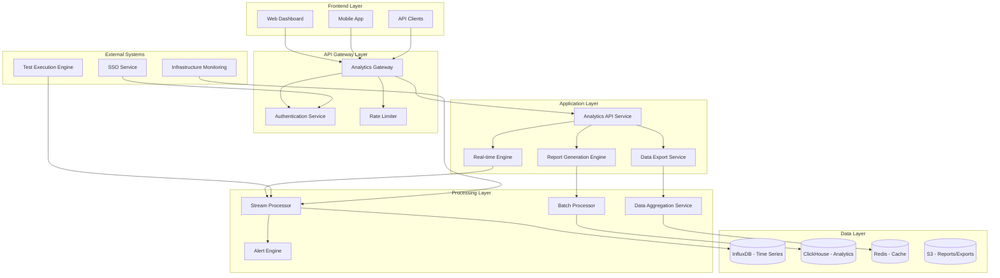

# Enterprise Analytics Dashboard Architecture

## Executive Summary

This document defines the comprehensive Enterprise Analytics Dashboard Architecture for Semantest, designed to provide enterprise customers with powerful real-time analytics, custom reporting, and performance monitoring capabilities. The architecture supports multi-tenant data isolation, real-time visualization, and scalable data processing for millions of test executions across diverse enterprise environments.

## Table of Contents

1. [Architecture Overview](#architecture-overview)
2. [Real-Time Metrics Visualization](#real-time-metrics-visualization)
3. [Custom Report Generation](#custom-report-generation)
4. [Data Export Capabilities](#data-export-capabilities)
5. [Multi-Tenant Data Isolation](#multi-tenant-data-isolation)
6. [Performance Monitoring Dashboards](#performance-monitoring-dashboards)
7. [Technical Implementation](#technical-implementation)
8. [Security & Compliance](#security--compliance)
9. [Implementation Strategy](#implementation-strategy)

---

## Architecture Overview

### System Architecture Diagram



### Core Principles

1. **Real-Time First**: Sub-second data updates for critical metrics
2. **Multi-Tenant Isolation**: Complete data segregation with row-level security
3. **Horizontal Scalability**: Handle millions of events per second
4. **Enterprise Security**: Zero-trust architecture with comprehensive audit
5. **Performance Optimized**: <100ms query response times
6. **Self-Service Analytics**: Intuitive interface for business users

### Technology Stack

| Component | Technology | Purpose |
|-----------|------------|---------|
| **Time Series DB** | InfluxDB 2.0+ | Real-time metrics storage |
| **Analytics DB** | ClickHouse | OLAP queries and aggregations |
| **Cache Layer** | Redis Cluster | High-performance caching |
| **Stream Processing** | Apache Kafka + Kafka Streams | Real-time data processing |
| **Batch Processing** | Apache Spark | Large-scale data processing |
| **API Framework** | Node.js + Fastify | High-performance API services |
| **Frontend** | React + TypeScript | Interactive dashboards |
| **Visualization** | D3.js + Chart.js | Custom data visualizations |
| **Export Storage** | AWS S3 / Azure Blob | Report and export storage |

---

## Real-Time Metrics Visualization

### Architecture Components

#### 1. Real-Time Data Ingestion Pipeline

```typescript
// @semantest/analytics/src/ingestion/real-time-ingestor.ts
export class RealTimeDataIngestor {
  private readonly kafkaProducer: KafkaProducer;
  private readonly influxClient: InfluxDBClient;
  private readonly tenantIsolator: TenantDataIsolator;

  constructor(
    kafkaConfig: KafkaConfig,
    influxConfig: InfluxConfig,
    tenantIsolator: TenantDataIsolator
  ) {
    this.kafkaProducer = new KafkaProducer(kafkaConfig);
    this.influxClient = new InfluxDBClient(influxConfig);
    this.tenantIsolator = tenantIsolator;
  }

  async ingestTestMetrics(
    tenantId: TenantId,
    testMetrics: TestExecutionMetrics
  ): Promise<void> {
    // Validate tenant access
    await this.tenantIsolator.validateTenantAccess(tenantId, testMetrics);
    
    // Create timestamped data points
    const dataPoints = this.createInfluxDataPoints(tenantId, testMetrics);
    
    // Write to time series database
    await this.influxClient.writePoints(dataPoints);
    
    // Stream to real-time processors
    await this.kafkaProducer.send({
      topic: 'test-metrics-realtime',
      messages: [{
        key: tenantId.value,
        value: JSON.stringify({
          tenantId: tenantId.value,
          timestamp: Date.now(),
          metrics: testMetrics
        })
      }]
    });
    
    // Trigger real-time dashboard updates
    await this.notifyDashboardSubscribers(tenantId, testMetrics);
  }

  private createInfluxDataPoints(
    tenantId: TenantId, 
    metrics: TestExecutionMetrics
  ): Point[] {
    return [
      // Test execution metrics
      new Point('test_execution')
        .tag('tenant_id', tenantId.value)
        .tag('project_id', metrics.projectId)
        .tag('test_suite', metrics.testSuite)
        .tag('status', metrics.status)
        .floatField('duration_ms', metrics.durationMs)
        .floatField('success_rate', metrics.successRate)
        .intField('total_tests', metrics.totalTests)
        .intField('passed_tests', metrics.passedTests)
        .intField('failed_tests', metrics.failedTests)
        .timestamp(new Date(metrics.timestamp)),
      
      // Performance metrics
      new Point('performance_metrics')
        .tag('tenant_id', tenantId.value)
        .tag('project_id', metrics.projectId)
        .tag('environment', metrics.environment)
        .floatField('cpu_usage', metrics.performance.cpuUsage)
        .floatField('memory_usage', metrics.performance.memoryUsage)
        .floatField('network_latency', metrics.performance.networkLatency)
        .floatField('page_load_time', metrics.performance.pageLoadTime)
        .timestamp(new Date(metrics.timestamp)),
      
      // Error metrics
      new Point('error_metrics')
        .tag('tenant_id', tenantId.value)
        .tag('project_id', metrics.projectId)
        .tag('error_type', metrics.errors?.type || 'none')
        .intField('error_count', metrics.errors?.count || 0)
        .stringField('error_message', metrics.errors?.message || '')
        .timestamp(new Date(metrics.timestamp))
    ];
  }
}
```

#### 2. WebSocket Real-Time Updates

```typescript
// @semantest/analytics/src/realtime/websocket-manager.ts
export class AnalyticsWebSocketManager {
  private readonly connections: Map<string, WebSocketConnection[]> = new Map();
  private readonly subscriptions: Map<string, DashboardSubscription[]> = new Map();
  private readonly rateLimiter: RateLimiter;

  constructor(
    private readonly influxClient: InfluxDBClient,
    private readonly tenantIsolator: TenantDataIsolator
  ) {
    this.rateLimiter = new RateLimiter({
      windowMs: 1000,
      maxRequests: 100 // 100 updates per second per connection
    });
  }

  async handleConnection(
    connection: WebSocketConnection,
    tenantId: TenantId,
    userId: UserId
  ): Promise<void> {
    // Validate user access to tenant
    await this.tenantIsolator.validateUserAccess(tenantId, userId);
    
    const connectionKey = `${tenantId.value}:${userId.value}`;
    
    // Store connection
    const tenantConnections = this.connections.get(tenantId.value) || [];
    tenantConnections.push(connection);
    this.connections.set(tenantId.value, tenantConnections);
    
    // Send initial dashboard state
    await this.sendInitialDashboardState(connection, tenantId);
    
    // Handle subscription requests
    connection.on('subscribe', async (subscription: DashboardSubscription) => {
      await this.handleSubscription(connectionKey, subscription);
    });
    
    // Handle unsubscription
    connection.on('unsubscribe', async (subscriptionId: string) => {
      await this.handleUnsubscription(connectionKey, subscriptionId);
    });
    
    // Clean up on disconnect
    connection.on('close', () => {
      this.cleanupConnection(tenantId.value, connection);
    });
  }

  async broadcastMetricUpdate(
    tenantId: TenantId,
    metricUpdate: MetricUpdate
  ): Promise<void> {
    const tenantConnections = this.connections.get(tenantId.value) || [];
    
    for (const connection of tenantConnections) {
      if (connection.readyState === WebSocket.OPEN) {
        // Check rate limit
        if (await this.rateLimiter.isAllowed(connection.id)) {
          await connection.send(JSON.stringify({
            type: 'metric_update',
            timestamp: Date.now(),
            data: metricUpdate
          }));
        }
      }
    }
  }

  private async sendInitialDashboardState(
    connection: WebSocketConnection,
    tenantId: TenantId
  ): Promise<void> {
    // Get current metrics for the last 24 hours
    const query = `
      from(bucket: "semantest-metrics")
        |> range(start: -24h)
        |> filter(fn: (r) => r["tenant_id"] == "${tenantId.value}")
        |> aggregateWindow(every: 5m, fn: mean)
        |> group(columns: ["_measurement", "project_id"])
    `;
    
    const results = await this.influxClient.query(query);
    const dashboardState = this.transformQueryResults(results);
    
    await connection.send(JSON.stringify({
      type: 'initial_state',
      timestamp: Date.now(),
      data: dashboardState
    }));
  }
}
```

#### 3. Interactive Dashboard Components

```typescript
// @semantest/analytics-frontend/src/components/real-time-dashboard.tsx
export const RealTimeDashboard: React.FC<RealTimeDashboardProps> = ({
  tenantId,
  userId
}) => {
  const [metrics, setMetrics] = useState<DashboardMetrics>({});
  const [connectionStatus, setConnectionStatus] = useState<'connecting' | 'connected' | 'disconnected'>('connecting');
  const wsRef = useRef<WebSocket | null>(null);

  useEffect(() => {
    const connectWebSocket = () => {
      const ws = new WebSocket(`wss://analytics.semantest.com/ws?tenant=${tenantId}&user=${userId}`);
      
      ws.onopen = () => {
        setConnectionStatus('connected');
        
        // Subscribe to real-time metrics
        ws.send(JSON.stringify({
          type: 'subscribe',
          subscriptions: [
            { type: 'test_execution', aggregation: 'real_time' },
            { type: 'performance_metrics', aggregation: 'real_time' },
            { type: 'error_metrics', aggregation: 'real_time' },
            { type: 'system_health', aggregation: 'real_time' }
          ]
        }));
      };
      
      ws.onmessage = (event) => {
        const message = JSON.parse(event.data);
        
        switch (message.type) {
          case 'initial_state':
            setMetrics(message.data);
            break;
          case 'metric_update':
            setMetrics(prev => updateMetrics(prev, message.data));
            break;
          case 'alert':
            handleRealTimeAlert(message.data);
            break;
        }
      };
      
      ws.onclose = () => {
        setConnectionStatus('disconnected');
        // Attempt to reconnect after 5 seconds
        setTimeout(connectWebSocket, 5000);
      };
      
      wsRef.current = ws;
    };
    
    connectWebSocket();
    
    return () => {
      if (wsRef.current) {
        wsRef.current.close();
      }
    };
  }, [tenantId, userId]);

  return (
    <DashboardContainer>
      <ConnectionStatusIndicator status={connectionStatus} />
      
      {/* Real-time metrics grid */}
      <MetricsGrid>
        <MetricCard title="Test Execution Rate" icon={<TestIcon />}>
          <RealTimeChart
            data={metrics.testExecutionRate}
            type="line"
            updateInterval={1000}
            color="#4CAF50"
          />
          <MetricValue>
            {metrics.testExecutionRate?.current || 0} tests/min
          </MetricValue>
        </MetricCard>
        
        <MetricCard title="Success Rate" icon={<SuccessIcon />}>
          <RealTimeGauge
            value={metrics.successRate?.current || 0}
            min={0}
            max={100}
            thresholds={[
              { value: 95, color: '#4CAF50' },
              { value: 85, color: '#FF9800' },
              { value: 0, color: '#F44336' }
            ]}
          />
          <MetricValue>
            {(metrics.successRate?.current || 0).toFixed(1)}%
          </MetricValue>
        </MetricCard>
        
        <MetricCard title="Average Response Time" icon={<SpeedIcon />}>
          <RealTimeChart
            data={metrics.averageResponseTime}
            type="area"
            updateInterval={1000}
            color="#2196F3"
          />
          <MetricValue>
            {metrics.averageResponseTime?.current || 0}ms
          </MetricValue>
        </MetricCard>
        
        <MetricCard title="Active Tests" icon={<ActivityIcon />}>
          <RealTimeCounter
            value={metrics.activeTests?.current || 0}
            animationDuration={500}
          />
          <MetricTrend
            current={metrics.activeTests?.current || 0}
            previous={metrics.activeTests?.previous || 0}
          />
        </MetricCard>
      </MetricsGrid>
      
      {/* Real-time charts */}
      <ChartsSection>
        <ChartContainer span={2}>
          <ChartTitle>Test Execution Timeline</ChartTitle>
          <TimeSeriesChart
            data={metrics.executionTimeline}
            metrics={['passed', 'failed', 'skipped']}
            timeWindow="1h"
            updateInterval={5000}
            chartType="stacked_area"
          />
        </ChartContainer>
        
        <ChartContainer>
          <ChartTitle>Error Distribution</ChartTitle>
          <RealTimePieChart
            data={metrics.errorDistribution}
            updateInterval={10000}
            showPercentages={true}
          />
        </ChartContainer>
        
        <ChartContainer>
          <ChartTitle>Performance Heatmap</ChartTitle>
          <PerformanceHeatmap
            data={metrics.performanceHeatmap}
            updateInterval={30000}
            dimensions={['browser', 'environment']}
          />
        </ChartContainer>
      </ChartsSection>
      
      {/* Real-time alerts */}
      <AlertsSection>
        <RealTimeAlerts tenantId={tenantId} />
      </AlertsSection>
    </DashboardContainer>
  );
};
```

#### 4. Real-Time Chart Components

```typescript
// @semantest/analytics-frontend/src/components/charts/real-time-chart.tsx
export const RealTimeChart: React.FC<RealTimeChartProps> = ({
  data,
  type,
  updateInterval,
  color,
  height = 300,
  showGrid = true,
  showLegend = true
}) => {
  const chartRef = useRef<HTMLCanvasElement>(null);
  const chartInstanceRef = useRef<Chart | null>(null);
  const [isUpdating, setIsUpdating] = useState(false);

  useEffect(() => {
    if (!chartRef.current) return;

    const ctx = chartRef.current.getContext('2d');
    if (!ctx) return;

    // Initialize Chart.js with real-time configuration
    chartInstanceRef.current = new Chart(ctx, {
      type: type as ChartType,
      data: {
        datasets: [{
          label: 'Real-time Data',
          data: data || [],
          borderColor: color,
          backgroundColor: `${color}20`,
          borderWidth: 2,
          pointRadius: 0,
          tension: 0.4
        }]
      },
      options: {
        responsive: true,
        maintainAspectRatio: false,
        scales: {
          x: {
            type: 'time',
            time: {
              displayFormats: {
                minute: 'HH:mm',
                hour: 'HH:mm'
              }
            },
            grid: {
              display: showGrid
            }
          },
          y: {
            beginAtZero: true,
            grid: {
              display: showGrid
            }
          }
        },
        plugins: {
          legend: {
            display: showLegend
          },
          tooltip: {
            mode: 'nearest',
            intersect: false
          }
        },
        animation: {
          duration: updateInterval / 2, // Smooth transitions
          easing: 'easeInOutQuart'
        },
        interaction: {
          intersect: false,
          mode: 'index'
        }
      }
    });

    return () => {
      if (chartInstanceRef.current) {
        chartInstanceRef.current.destroy();
      }
    };
  }, []);

  useEffect(() => {
    if (!chartInstanceRef.current || !data) return;

    setIsUpdating(true);
    
    // Update chart data with smooth animation
    const chart = chartInstanceRef.current;
    chart.data.datasets[0].data = data;
    
    // Remove old data points (keep last 100 points for performance)
    if (data.length > 100) {
      chart.data.datasets[0].data = data.slice(-100);
    }
    
    chart.update('none'); // Update without animation for better performance
    
    setTimeout(() => setIsUpdating(false), 100);
  }, [data]);

  return (
    <ChartWrapper height={height}>
      <canvas ref={chartRef} />
      {isUpdating && <UpdateIndicator />}
    </ChartWrapper>
  );
};

// @semantest/analytics-frontend/src/components/charts/real-time-gauge.tsx
export const RealTimeGauge: React.FC<RealTimeGaugeProps> = ({
  value,
  min = 0,
  max = 100,
  thresholds,
  size = 200,
  showValue = true
}) => {
  const [animatedValue, setAnimatedValue] = useState(min);
  
  useEffect(() => {
    // Animate value changes
    const startValue = animatedValue;
    const endValue = value;
    const duration = 1000; // 1 second animation
    const startTime = Date.now();
    
    const animate = () => {
      const now = Date.now();
      const progress = Math.min((now - startTime) / duration, 1);
      const currentValue = startValue + (endValue - startValue) * easeInOutCubic(progress);
      
      setAnimatedValue(currentValue);
      
      if (progress < 1) {
        requestAnimationFrame(animate);
      }
    };
    
    requestAnimationFrame(animate);
  }, [value]);

  const getThresholdColor = (val: number): string => {
    for (const threshold of thresholds.sort((a, b) => b.value - a.value)) {
      if (val >= threshold.value) {
        return threshold.color;
      }
    }
    return thresholds[thresholds.length - 1]?.color || '#666';
  };

  const angle = ((animatedValue - min) / (max - min)) * 180 - 90;
  const color = getThresholdColor(animatedValue);

  return (
    <GaugeContainer size={size}>
      <svg width={size} height={size / 2 + 20}>
        {/* Background arc */}
        <path
          d={`M 20 ${size/2} A ${size/2 - 20} ${size/2 - 20} 0 0 1 ${size - 20} ${size/2}`}
          fill="none"
          stroke="#e0e0e0"
          strokeWidth="8"
        />
        
        {/* Value arc */}
        <path
          d={`M 20 ${size/2} A ${size/2 - 20} ${size/2 - 20} 0 0 1 ${size - 20} ${size/2}`}
          fill="none"
          stroke={color}
          strokeWidth="8"
          strokeDasharray={`${((animatedValue - min) / (max - min)) * Math.PI * (size/2 - 20)} ${Math.PI * (size/2 - 20)}`}
          style={{ transition: 'stroke-dasharray 0.5s ease-in-out' }}
        />
        
        {/* Needle */}
        <line
          x1={size / 2}
          y1={size / 2}
          x2={size / 2 + (size / 2 - 30) * Math.cos(angle * Math.PI / 180)}
          y2={size / 2 + (size / 2 - 30) * Math.sin(angle * Math.PI / 180)}
          stroke={color}
          strokeWidth="3"
          strokeLinecap="round"
          style={{ 
            transformOrigin: `${size / 2}px ${size / 2}px`,
            transition: 'transform 0.5s ease-in-out'
          }}
        />
        
        {/* Center dot */}
        <circle
          cx={size / 2}
          cy={size / 2}
          r="5"
          fill={color}
        />
        
        {/* Value text */}
        {showValue && (
          <text
            x={size / 2}
            y={size / 2 + 35}
            textAnchor="middle"
            fontSize="18"
            fontWeight="bold"
            fill={color}
          >
            {animatedValue.toFixed(1)}
          </text>
        )}
      </svg>
    </GaugeContainer>
  );
};

---

## Custom Report Generation

### Architecture Components

#### 1. Report Definition Engine

```typescript
// @semantest/analytics/src/reports/report-definition.ts
export class ReportDefinition extends Entity<ReportDefinition> {
  private constructor(
    public readonly id: ReportId,
    public readonly tenantId: TenantId,
    public readonly name: string,
    public readonly description: string,
    public readonly reportType: ReportType,
    public readonly dataSource: DataSourceConfiguration,
    public readonly visualization: VisualizationConfiguration,
    public readonly filters: ReportFilter[],
    public readonly schedule?: ReportSchedule,
    public readonly recipients?: ReportRecipient[],
    private createdBy: UserId,
    private createdAt: Date = new Date()
  ) {
    super();
    this.validateReportDefinition();
  }

  static create(
    tenantId: TenantId,
    name: string,
    reportConfig: ReportConfiguration,
    createdBy: UserId
  ): ReportDefinition {
    const reportId = ReportId.generate();
    
    const report = new ReportDefinition(
      reportId,
      tenantId,
      name,
      reportConfig.description,
      reportConfig.reportType,
      reportConfig.dataSource,
      reportConfig.visualization,
      reportConfig.filters || [],
      reportConfig.schedule,
      reportConfig.recipients,
      createdBy
    );

    report.recordEvent(new ReportDefinitionCreated(
      reportId,
      tenantId,
      name,
      reportConfig.reportType,
      createdBy
    ));

    return report;
  }

  updateConfiguration(
    config: Partial<ReportConfiguration>,
    updatedBy: UserId
  ): void {
    const oldConfig = this.toConfiguration();
    
    if (config.name) this.name = config.name;
    if (config.description) this.description = config.description;
    if (config.dataSource) this.dataSource = config.dataSource;
    if (config.visualization) this.visualization = config.visualization;
    if (config.filters) this.filters = config.filters;
    if (config.schedule) this.schedule = config.schedule;
    if (config.recipients) this.recipients = config.recipients;

    this.validateReportDefinition();

    this.recordEvent(new ReportDefinitionUpdated(
      this.id,
      this.tenantId,
      oldConfig,
      this.toConfiguration(),
      updatedBy
    ));
  }

  generateQuery(): AnalyticsQuery {
    const queryBuilder = new AnalyticsQueryBuilder(this.dataSource);
    
    // Add base metrics
    queryBuilder.selectMetrics(this.dataSource.metrics);
    
    // Add dimensions
    if (this.dataSource.dimensions) {
      queryBuilder.addDimensions(this.dataSource.dimensions);
    }
    
    // Add filters
    for (const filter of this.filters) {
      queryBuilder.addFilter(filter.field, filter.operator, filter.value);
    }
    
    // Add time range
    if (this.dataSource.timeRange) {
      queryBuilder.addTimeRange(
        this.dataSource.timeRange.start,
        this.dataSource.timeRange.end
      );
    }
    
    // Add aggregations
    if (this.dataSource.aggregations) {
      queryBuilder.addAggregations(this.dataSource.aggregations);
    }
    
    // Add sorting
    if (this.dataSource.sorting) {
      queryBuilder.addSorting(this.dataSource.sorting);
    }
    
    return queryBuilder.build();
  }

  private validateReportDefinition(): void {
    if (!this.name || this.name.length < 3) {
      throw new ValidationError('Report name must be at least 3 characters');
    }
    
    if (!this.dataSource.metrics || this.dataSource.metrics.length === 0) {
      throw new ValidationError('Report must have at least one metric');
    }
    
    if (this.reportType === ReportType.SCHEDULED && !this.schedule) {
      throw new ValidationError('Scheduled reports must have a schedule configuration');
    }
    
    if (this.schedule && (!this.recipients || this.recipients.length === 0)) {
      throw new ValidationError('Scheduled reports must have at least one recipient');
    }
  }

  getId(): string {
    return this.id.value;
  }
}

// Report types and configurations
export enum ReportType {
  DASHBOARD = 'dashboard',
  TABULAR = 'tabular',
  CHART = 'chart',
  SCHEDULED = 'scheduled',
  ADHOC = 'adhoc'
}

export interface DataSourceConfiguration {
  type: 'influx' | 'clickhouse' | 'combined';
  metrics: MetricDefinition[];
  dimensions?: string[];
  timeRange?: TimeRange;
  aggregations?: AggregationDefinition[];
  sorting?: SortDefinition[];
}

export interface VisualizationConfiguration {
  type: VisualizationType;
  chartConfig?: ChartConfiguration;
  tableConfig?: TableConfiguration;
  customConfig?: Record<string, any>;
}

export enum VisualizationType {
  LINE_CHART = 'line_chart',
  BAR_CHART = 'bar_chart',
  PIE_CHART = 'pie_chart',
  HEATMAP = 'heatmap',
  TABLE = 'table',
  GAUGE = 'gauge',
  TREEMAP = 'treemap',
  SANKEY = 'sankey'
}
```

#### 2. Report Generation Engine

```typescript
// @semantest/analytics/src/reports/report-generator.ts
export class ReportGenerationEngine {
  constructor(
    private readonly influxClient: InfluxDBClient,
    private readonly clickhouseClient: ClickHouseClient,
    private readonly cacheManager: CacheManager,
    private readonly exportService: DataExportService,
    private readonly tenantIsolator: TenantDataIsolator
  ) {}

  async generateReport(
    reportDefinition: ReportDefinition,
    options: ReportGenerationOptions = {}
  ): Promise<GeneratedReport> {
    // Validate tenant access
    await this.tenantIsolator.validateReportAccess(
      reportDefinition.tenantId,
      reportDefinition.id
    );

    const startTime = Date.now();
    
    try {
      // Check cache first
      const cacheKey = this.generateCacheKey(reportDefinition, options);
      const cachedReport = await this.cacheManager.get(cacheKey);
      
      if (cachedReport && !options.bypassCache) {
        return this.deserializeReport(cachedReport);
      }

      // Generate query from report definition
      const query = reportDefinition.generateQuery();
      
      // Execute query based on data source type
      const rawData = await this.executeQuery(
        reportDefinition.dataSource,
        query,
        reportDefinition.tenantId
      );
      
      // Transform data for visualization
      const transformedData = await this.transformDataForVisualization(
        rawData,
        reportDefinition.visualization
      );
      
      // Apply post-processing
      const processedData = await this.applyPostProcessing(
        transformedData,
        reportDefinition,
        options
      );
      
      // Generate visualization
      const visualization = await this.generateVisualization(
        processedData,
        reportDefinition.visualization
      );
      
      // Create report metadata
      const metadata: ReportMetadata = {
        reportId: reportDefinition.id,
        tenantId: reportDefinition.tenantId,
        generatedAt: new Date(),
        executionTime: Date.now() - startTime,
        dataPoints: processedData.length,
        queryPerformance: {
          executionTime: Date.now() - startTime,
          dataSourceType: reportDefinition.dataSource.type,
          cacheHit: false
        }
      };
      
      const generatedReport: GeneratedReport = {
        metadata,
        data: processedData,
        visualization,
        rawQuery: query.toSQL(),
        exportOptions: this.generateExportOptions(reportDefinition)
      };
      
      // Cache the result
      await this.cacheManager.set(
        cacheKey,
        this.serializeReport(generatedReport),
        this.getCacheTTL(reportDefinition)
      );
      
      return generatedReport;
      
    } catch (error) {
      // Log error and create error report
      console.error('Report generation failed:', error);
      
      return {
        metadata: {
          reportId: reportDefinition.id,
          tenantId: reportDefinition.tenantId,
          generatedAt: new Date(),
          executionTime: Date.now() - startTime,
          error: error.message,
          queryPerformance: {
            executionTime: Date.now() - startTime,
            dataSourceType: reportDefinition.dataSource.type,
            cacheHit: false,
            error: error.message
          }
        },
        data: [],
        visualization: { type: 'error', message: error.message },
        rawQuery: '',
        exportOptions: []
      };
    }
  }

  private async executeQuery(
    dataSource: DataSourceConfiguration,
    query: AnalyticsQuery,
    tenantId: TenantId
  ): Promise<QueryResult[]> {
    switch (dataSource.type) {
      case 'influx':
        return await this.executeInfluxQuery(query, tenantId);
      case 'clickhouse':
        return await this.executeClickHouseQuery(query, tenantId);
      case 'combined':
        return await this.executeCombinedQuery(query, tenantId);
      default:
        throw new UnsupportedDataSourceError(dataSource.type);
    }
  }

  private async executeInfluxQuery(
    query: AnalyticsQuery,
    tenantId: TenantId
  ): Promise<QueryResult[]> {
    const fluxQuery = query.toFlux();
    
    // Add tenant isolation
    const isolatedQuery = `
      ${fluxQuery}
      |> filter(fn: (r) => r["tenant_id"] == "${tenantId.value}")
    `;
    
    const results = await this.influxClient.query(isolatedQuery);
    return this.transformInfluxResults(results);
  }

  private async executeClickHouseQuery(
    query: AnalyticsQuery,
    tenantId: TenantId
  ): Promise<QueryResult[]> {
    const sqlQuery = query.toSQL();
    
    // Add tenant isolation to WHERE clause
    const isolatedQuery = sqlQuery.includes('WHERE')
      ? sqlQuery.replace('WHERE', `WHERE tenant_id = '${tenantId.value}' AND`)
      : `${sqlQuery} WHERE tenant_id = '${tenantId.value}'`;
    
    const results = await this.clickhouseClient.query(isolatedQuery);
    return this.transformClickHouseResults(results);
  }

  private async transformDataForVisualization(
    rawData: QueryResult[],
    visualization: VisualizationConfiguration
  ): Promise<VisualizationData> {
    const transformer = VisualizationDataTransformerFactory.create(visualization.type);
    return await transformer.transform(rawData, visualization);
  }

  private async generateVisualization(
    data: VisualizationData,
    config: VisualizationConfiguration
  ): Promise<VisualizationResult> {
    const generator = VisualizationGeneratorFactory.create(config.type);
    return await generator.generate(data, config);
  }
}
```

#### 3. Interactive Report Builder

```typescript
// @semantest/analytics-frontend/src/components/report-builder.tsx
export const ReportBuilder: React.FC<ReportBuilderProps> = ({
  tenantId,
  onReportSave,
  initialReport
}) => {
  const [reportDefinition, setReportDefinition] = useState<ReportDefinition>(
    initialReport || createEmptyReport(tenantId)
  );
  const [previewData, setPreviewData] = useState<GeneratedReport | null>(null);
  const [isGenerating, setIsGenerating] = useState(false);
  const [currentStep, setCurrentStep] = useState(0);

  const steps = [
    'Data Source',
    'Metrics & Dimensions', 
    'Filters',
    'Visualization',
    'Scheduling',
    'Preview & Save'
  ];

  const generatePreview = useCallback(async () => {
    if (!reportDefinition.isValid()) return;
    
    setIsGenerating(true);
    try {
      const preview = await reportService.generateReport(reportDefinition, {
        limit: 100, // Limit preview data
        bypassCache: true
      });
      setPreviewData(preview);
    } catch (error) {
      console.error('Preview generation failed:', error);
    } finally {
      setIsGenerating(false);
    }
  }, [reportDefinition]);

  const handleStepComplete = () => {
    if (currentStep < steps.length - 1) {
      setCurrentStep(currentStep + 1);
    }
  };

  const handleSaveReport = async () => {
    try {
      const savedReport = await reportService.saveReportDefinition(reportDefinition);
      onReportSave(savedReport);
    } catch (error) {
      console.error('Failed to save report:', error);
    }
  };

  return (
    <ReportBuilderContainer>
      <StepIndicator steps={steps} currentStep={currentStep} />
      
      <BuilderContent>
        <ConfigurationPanel>
          {currentStep === 0 && (
            <DataSourceSelector
              value={reportDefinition.dataSource}
              onChange={(dataSource) => 
                setReportDefinition(prev => ({ ...prev, dataSource }))
              }
              tenantId={tenantId}
            />
          )}
          
          {currentStep === 1 && (
            <MetricsAndDimensionsSelector
              metrics={reportDefinition.dataSource.metrics}
              dimensions={reportDefinition.dataSource.dimensions}
              onMetricsChange={(metrics) =>
                setReportDefinition(prev => ({
                  ...prev,
                  dataSource: { ...prev.dataSource, metrics }
                }))
              }
              onDimensionsChange={(dimensions) =>
                setReportDefinition(prev => ({
                  ...prev,
                  dataSource: { ...prev.dataSource, dimensions }
                }))
              }
              availableMetrics={getAvailableMetrics(tenantId)}
              availableDimensions={getAvailableDimensions(tenantId)}
            />
          )}
          
          {currentStep === 2 && (
            <FiltersBuilder
              filters={reportDefinition.filters}
              onChange={(filters) =>
                setReportDefinition(prev => ({ ...prev, filters }))
              }
              availableFields={getAvailableFilterFields(reportDefinition.dataSource)}
            />
          )}
          
          {currentStep === 3 && (
            <VisualizationSelector
              visualization={reportDefinition.visualization}
              onChange={(visualization) =>
                setReportDefinition(prev => ({ ...prev, visualization }))
              }
              dataStructure={getDataStructure(reportDefinition.dataSource)}
            />
          )}
          
          {currentStep === 4 && (
            <SchedulingConfiguration
              schedule={reportDefinition.schedule}
              recipients={reportDefinition.recipients}
              onScheduleChange={(schedule) =>
                setReportDefinition(prev => ({ ...prev, schedule }))
              }
              onRecipientsChange={(recipients) =>
                setReportDefinition(prev => ({ ...prev, recipients }))
              }
            />
          )}
          
          {currentStep === 5 && (
            <ReportPreview
              reportDefinition={reportDefinition}
              previewData={previewData}
              isGenerating={isGenerating}
              onGeneratePreview={generatePreview}
              onSaveReport={handleSaveReport}
            />
          )}
        </ConfigurationPanel>
        
        <PreviewPanel>
          <PreviewHeader>
            <PreviewTitle>Live Preview</PreviewTitle>
            <PreviewActions>
              <Button 
                variant="outlined" 
                onClick={generatePreview}
                disabled={isGenerating || !reportDefinition.isValid()}
              >
                {isGenerating ? <Spinner /> : 'Generate Preview'}
              </Button>
            </PreviewActions>
          </PreviewHeader>
          
          <PreviewContent>
            {previewData ? (
              <ReportVisualization
                data={previewData.data}
                visualization={previewData.visualization}
                interactive={true}
              />
            ) : (
              <EmptyPreview>
                <EmptyIcon />
                <EmptyText>
                  Configure your report to see a live preview
                </EmptyText>
              </EmptyPreview>
            )}
          </PreviewContent>
        </PreviewPanel>
      </BuilderContent>
      
      <BuilderActions>
        <Button
          variant="outlined"
          onClick={() => setCurrentStep(Math.max(0, currentStep - 1))}
          disabled={currentStep === 0}
        >
          Previous
        </Button>
        
        <Button
          variant="contained"
          onClick={handleStepComplete}
          disabled={!isStepValid(currentStep, reportDefinition)}
        >
          {currentStep === steps.length - 1 ? 'Save Report' : 'Next'}
        </Button>
      </BuilderActions>
    </ReportBuilderContainer>
  );
};
```

#### 4. Scheduled Report Engine

```typescript
// @semantest/analytics/src/reports/scheduled-reports.ts
export class ScheduledReportEngine {
  constructor(
    private readonly reportGenerator: ReportGenerationEngine,
    private readonly emailService: EmailService,
    private readonly exportService: DataExportService,
    private readonly scheduler: JobScheduler,
    private readonly auditService: AuditService
  ) {}

  async scheduleReport(reportDefinition: ReportDefinition): Promise<ScheduledJob> {
    if (!reportDefinition.schedule) {
      throw new ValidationError('Report must have schedule configuration');
    }

    const job = await this.scheduler.schedule({
      id: `report-${reportDefinition.id.value}`,
      cronExpression: reportDefinition.schedule.cronExpression,
      jobType: 'scheduled_report',
      payload: {
        reportId: reportDefinition.id.value,
        tenantId: reportDefinition.tenantId.value
      },
      retryOptions: {
        maxRetries: 3,
        retryDelay: 5000,
        exponentialBackoff: true
      }
    });

    // Log scheduling event
    await this.auditService.recordEvent({
      type: AuditEventType.REPORT_SCHEDULED,
      tenantId: reportDefinition.tenantId,
      details: {
        reportId: reportDefinition.id.value,
        schedule: reportDefinition.schedule,
        jobId: job.id
      },
      riskLevel: RiskLevel.LOW
    });

    return job;
  }

  async executeScheduledReport(jobPayload: ScheduledReportPayload): Promise<void> {
    const { reportId, tenantId } = jobPayload;
    
    try {
      // Load report definition
      const reportDefinition = await this.loadReportDefinition(
        new ReportId(reportId),
        new TenantId(tenantId)
      );

      if (!reportDefinition) {
        throw new ReportNotFoundError(reportId);
      }

      // Generate report
      const generatedReport = await this.reportGenerator.generateReport(
        reportDefinition,
        { 
          format: 'production',
          includeMetadata: true 
        }
      );

      // Export report in configured formats
      const exports = await this.generateExports(
        generatedReport,
        reportDefinition.schedule!.exportFormats
      );

      // Send to recipients
      await this.deliverReport(
        reportDefinition,
        generatedReport,
        exports
      );

      // Log successful execution
      await this.auditService.recordEvent({
        type: AuditEventType.SCHEDULED_REPORT_EXECUTED,
        tenantId: new TenantId(tenantId),
        details: {
          reportId,
          executionTime: generatedReport.metadata.executionTime,
          dataPoints: generatedReport.metadata.dataPoints,
          recipients: reportDefinition.recipients?.map(r => r.email) || []
        },
        riskLevel: RiskLevel.LOW
      });

    } catch (error) {
      // Log execution failure
      await this.auditService.recordEvent({
        type: AuditEventType.SCHEDULED_REPORT_FAILED,
        tenantId: new TenantId(tenantId),
        details: {
          reportId,
          error: error.message,
          stackTrace: error.stack
        },
        riskLevel: RiskLevel.MEDIUM
      });

      // Send failure notification
      await this.sendFailureNotification(reportId, tenantId, error);
      
      throw error;
    }
  }

  private async generateExports(
    report: GeneratedReport,
    formats: ExportFormat[]
  ): Promise<ExportResult[]> {
    const exports: ExportResult[] = [];

    for (const format of formats) {
      const exportResult = await this.exportService.exportReport(
        report,
        format
      );
      exports.push(exportResult);
    }

    return exports;
  }

  private async deliverReport(
    reportDefinition: ReportDefinition,
    report: GeneratedReport,
    exports: ExportResult[]
  ): Promise<void> {
    if (!reportDefinition.recipients || reportDefinition.recipients.length === 0) {
      return;
    }

    const emailTemplate = this.buildEmailTemplate(reportDefinition, report);
    const attachments = exports.map(exp => ({
      filename: exp.filename,
      content: exp.content,
      contentType: exp.mimeType
    }));

    for (const recipient of reportDefinition.recipients) {
      await this.emailService.sendEmail({
        to: recipient.email,
        subject: `Scheduled Report: ${reportDefinition.name}`,
        html: emailTemplate,
        attachments: recipient.includeAttachments ? attachments : []
      });
    }
  }

  private buildEmailTemplate(
    reportDefinition: ReportDefinition,
    report: GeneratedReport
  ): string {
    return `
      <html>
        <body style="font-family: Arial, sans-serif;">
          <h2>${reportDefinition.name}</h2>
          <p><strong>Generated:</strong> ${report.metadata.generatedAt.toLocaleString()}</p>
          <p><strong>Execution Time:</strong> ${report.metadata.executionTime}ms</p>
          <p><strong>Data Points:</strong> ${report.metadata.dataPoints}</p>
          
          <div style="margin: 20px 0;">
            ${reportDefinition.description}
          </div>
          
          ${this.generateEmailSummary(report)}
          
          <p style="margin-top: 30px; font-size: 12px; color: #666;">
            This is an automated report from Semantest Analytics.
            <br>
            View the full interactive report in your dashboard.
          </p>
        </body>
      </html>
    `;
  }
}

---

## Data Export Capabilities

### Architecture Components

#### 1. Universal Export Engine

```typescript
// @semantest/analytics/src/export/export-engine.ts
export class DataExportEngine {
  constructor(
    private readonly exportAdapterFactory: ExportAdapterFactory,
    private readonly storageService: CloudStorageService,
    private readonly tenantIsolator: TenantDataIsolator,
    private readonly compressionService: CompressionService,
    private readonly encryptionService: EncryptionService
  ) {}

  async exportData(
    exportRequest: ExportRequest,
    tenantId: TenantId,
    userId: UserId
  ): Promise<ExportResult> {
    // Validate export permissions
    await this.tenantIsolator.validateExportAccess(tenantId, userId, exportRequest);

    const startTime = Date.now();
    
    try {
      // Get appropriate export adapter
      const adapter = this.exportAdapterFactory.getAdapter(exportRequest.format);
      
      // Apply tenant isolation to data query
      const isolatedRequest = await this.applyTenantIsolation(exportRequest, tenantId);
      
      // Execute export with progress tracking
      const exportResult = await this.executeExportWithProgress(
        adapter,
        isolatedRequest,
        (progress) => this.notifyProgress(exportRequest.id, progress)
      );
      
      // Apply post-processing
      const processedResult = await this.applyPostProcessing(
        exportResult,
        exportRequest.options
      );
      
      // Store result in cloud storage
      const storageLocation = await this.storeExportResult(
        processedResult,
        tenantId,
        exportRequest
      );
      
      // Create audit trail
      await this.auditExport(tenantId, userId, exportRequest, storageLocation);
      
      return {
        id: exportRequest.id,
        tenantId,
        format: exportRequest.format,
        status: 'completed',
        downloadUrl: await this.generateSecureDownloadUrl(storageLocation, tenantId),
        metadata: {
          fileSize: processedResult.size,
          recordCount: processedResult.recordCount,
          executionTime: Date.now() - startTime,
          compressionRatio: processedResult.compressionRatio,
          expiresAt: new Date(Date.now() + exportRequest.ttl)
        }
      };
      
    } catch (error) {
      // Handle export failure
      await this.handleExportFailure(exportRequest.id, tenantId, error);
      throw error;
    }
  }

  async scheduleExport(
    exportRequest: ExportRequest,
    schedule: ExportSchedule,
    tenantId: TenantId,
    userId: UserId
  ): Promise<ScheduledExport> {
    // Validate scheduling permissions
    await this.tenantIsolator.validateSchedulingAccess(tenantId, userId);

    const scheduledExport = await this.scheduler.schedule({
      id: `export-${exportRequest.id}`,
      cronExpression: schedule.cronExpression,
      jobType: 'data_export',
      payload: {
        exportRequest,
        tenantId: tenantId.value,
        userId: userId.value
      },
      retryOptions: {
        maxRetries: 3,
        retryDelay: 10000,
        exponentialBackoff: true
      }
    });

    return {
      id: scheduledExport.id,
      exportRequest,
      schedule,
      status: 'scheduled',
      nextExecution: scheduledExport.nextExecution,
      tenantId,
      createdBy: userId
    };
  }

  private async executeExportWithProgress(
    adapter: ExportAdapter,
    request: IsolatedExportRequest,
    onProgress: (progress: ExportProgress) => void
  ): Promise<ProcessedExportResult> {
    const totalSteps = this.calculateExportSteps(request);
    let currentStep = 0;

    // Step 1: Data extraction
    onProgress({ step: ++currentStep, total: totalSteps, message: 'Extracting data' });
    const rawData = await adapter.extractData(request);

    // Step 2: Data transformation
    onProgress({ step: ++currentStep, total: totalSteps, message: 'Transforming data' });
    const transformedData = await adapter.transformData(rawData, request.transformations);

    // Step 3: Format conversion
    onProgress({ step: ++currentStep, total: totalSteps, message: 'Converting format' });
    const formattedData = await adapter.formatData(transformedData, request.format);

    // Step 4: Compression (if enabled)
    if (request.options?.compress) {
      onProgress({ step: ++currentStep, total: totalSteps, message: 'Compressing data' });
      const compressed = await this.compressionService.compress(formattedData);
      return {
        ...compressed,
        originalSize: formattedData.length,
        compressionRatio: compressed.size / formattedData.length
      };
    }

    return {
      data: formattedData,
      size: formattedData.length,
      recordCount: transformedData.length,
      compressionRatio: 1
    };
  }
}

export interface ExportRequest {
  id: ExportId;
  format: ExportFormat;
  dataSource: ExportDataSource;
  filters?: ExportFilter[];
  transformations?: DataTransformation[];
  options?: ExportOptions;
  ttl: number; // Time to live in milliseconds
}

export enum ExportFormat {
  CSV = 'csv',
  XLSX = 'xlsx',
  JSON = 'json',
  PARQUET = 'parquet',
  AVRO = 'avro',
  PDF = 'pdf',
  XML = 'xml'
}

export interface ExportOptions {
  compress?: boolean;
  encrypt?: boolean;
  includeHeaders?: boolean;
  includeMetadata?: boolean;
  chunkSize?: number;
  maxFileSize?: number;
}
```

#### 2. Format-Specific Export Adapters

```typescript
// @semantest/analytics/src/export/adapters/csv-export-adapter.ts
export class CSVExportAdapter implements ExportAdapter {
  async extractData(request: IsolatedExportRequest): Promise<RawData[]> {
    // Implementation depends on data source (InfluxDB, ClickHouse, etc.)
    const queryExecutor = this.getQueryExecutor(request.dataSource.type);
    return await queryExecutor.execute(request.query);
  }

  async transformData(
    rawData: RawData[],
    transformations: DataTransformation[]
  ): Promise<TransformedData[]> {
    let data = rawData;
    
    for (const transformation of transformations) {
      switch (transformation.type) {
        case 'aggregate':
          data = this.applyAggregation(data, transformation.config);
          break;
        case 'filter':
          data = this.applyFilter(data, transformation.config);
          break;
        case 'sort':
          data = this.applySort(data, transformation.config);
          break;
        case 'pivot':
          data = this.applyPivot(data, transformation.config);
          break;
      }
    }
    
    return data;
  }

  async formatData(
    data: TransformedData[],
    format: ExportFormat
  ): Promise<Buffer> {
    const csvWriter = createObjectCsvWriter({
      path: '', // In-memory
      header: this.generateCSVHeaders(data[0])
    });

    const csvContent = await csvWriter.writeRecords(data);
    return Buffer.from(csvContent, 'utf8');
  }

  private generateCSVHeaders(sampleRecord: any): any[] {
    return Object.keys(sampleRecord).map(key => ({
      id: key,
      title: this.formatHeaderName(key)
    }));
  }

  private formatHeaderName(key: string): string {
    // Convert snake_case to Title Case
    return key
      .split('_')
      .map(word => word.charAt(0).toUpperCase() + word.slice(1))
      .join(' ');
  }
}

// @semantest/analytics/src/export/adapters/excel-export-adapter.ts
export class ExcelExportAdapter implements ExportAdapter {
  async formatData(
    data: TransformedData[],
    format: ExportFormat
  ): Promise<Buffer> {
    const workbook = new ExcelJS.Workbook();
    const worksheet = workbook.addWorksheet('Analytics Data');

    if (data.length === 0) {
      return Buffer.alloc(0);
    }

    // Add headers
    const headers = Object.keys(data[0]);
    worksheet.addRow(headers);

    // Style headers
    const headerRow = worksheet.getRow(1);
    headerRow.font = { bold: true };
    headerRow.fill = {
      type: 'pattern',
      pattern: 'solid',
      fgColor: { argb: 'FFE0E0E0' }
    };

    // Add data rows
    data.forEach(record => {
      const row = headers.map(header => this.formatCellValue(record[header]));
      worksheet.addRow(row);
    });

    // Auto-fit columns
    worksheet.columns.forEach(column => {
      let maxLength = 0;
      column.eachCell({ includeEmpty: true }, (cell) => {
        const columnLength = cell.value ? cell.value.toString().length : 10;
        if (columnLength > maxLength) {
          maxLength = columnLength;
        }
      });
      column.width = Math.min(maxLength < 10 ? 10 : maxLength, 50);
    });

    // Add formatting for different data types
    this.applyConditionalFormatting(worksheet, data);

    return await workbook.xlsx.writeBuffer() as Buffer;
  }

  private formatCellValue(value: any): any {
    if (value instanceof Date) {
      return value.toISOString();
    }
    if (typeof value === 'number' && !isFinite(value)) {
      return null;
    }
    return value;
  }

  private applyConditionalFormatting(
    worksheet: ExcelJS.Worksheet,
    data: TransformedData[]
  ): void {
    // Apply number formatting
    const headers = Object.keys(data[0]);
    headers.forEach((header, colIndex) => {
      const sampleValue = data[0][header];
      if (typeof sampleValue === 'number') {
        const column = worksheet.getColumn(colIndex + 1);
        column.numFmt = '#,##0.00';
      }
    });
  }
}

// @semantest/analytics/src/export/adapters/pdf-export-adapter.ts
export class PDFExportAdapter implements ExportAdapter {
  async formatData(
    data: TransformedData[],
    format: ExportFormat
  ): Promise<Buffer> {
    const doc = new PDFDocument({ margin: 50 });
    const chunks: Buffer[] = [];

    doc.on('data', chunk => chunks.push(chunk));
    
    return new Promise<Buffer>((resolve) => {
      doc.on('end', () => resolve(Buffer.concat(chunks)));

      // Add title
      doc.fontSize(20).text('Analytics Report', { align: 'center' });
      doc.moveDown();

      // Add metadata
      doc.fontSize(12)
        .text(`Generated: ${new Date().toLocaleString()}`)
        .text(`Records: ${data.length}`)
        .moveDown();

      // Create table
      if (data.length > 0) {
        this.createPDFTable(doc, data);
      }

      doc.end();
    });
  }

  private createPDFTable(doc: PDFDocument, data: TransformedData[]): void {
    const headers = Object.keys(data[0]);
    const tableTop = doc.y;
    const tableLeft = 50;
    const columnWidth = (doc.page.width - 100) / headers.length;

    // Draw headers
    headers.forEach((header, i) => {
      doc.rect(tableLeft + i * columnWidth, tableTop, columnWidth, 25)
        .fillAndStroke('#f0f0f0', '#000000');
      
      doc.fillColor('#000000')
        .fontSize(10)
        .text(header, tableLeft + i * columnWidth + 5, tableTop + 8, {
          width: columnWidth - 10,
          ellipsis: true
        });
    });

    // Draw data rows
    let currentY = tableTop + 25;
    const maxRows = Math.min(data.length, 50); // Limit for PDF

    for (let rowIndex = 0; rowIndex < maxRows; rowIndex++) {
      const record = data[rowIndex];
      
      headers.forEach((header, colIndex) => {
        doc.rect(tableLeft + colIndex * columnWidth, currentY, columnWidth, 20)
          .stroke('#cccccc');
        
        const value = this.formatPDFValue(record[header]);
        doc.fontSize(9)
          .text(value, tableLeft + colIndex * columnWidth + 5, currentY + 6, {
            width: columnWidth - 10,
            ellipsis: true
          });
      });
      
      currentY += 20;
      
      // Add new page if needed
      if (currentY > doc.page.height - 100) {
        doc.addPage();
        currentY = 50;
      }
    }

    if (data.length > maxRows) {
      doc.fontSize(10)
        .text(`... and ${data.length - maxRows} more records`, {
          align: 'center'
        });
    }
  }

  private formatPDFValue(value: any): string {
    if (value === null || value === undefined) return '';
    if (value instanceof Date) return value.toLocaleDateString();
    if (typeof value === 'number') return value.toLocaleString();
    return String(value);
  }
}
```

#### 3. Cloud Storage Integration

```typescript
// @semantest/analytics/src/export/storage/cloud-storage-service.ts
export class CloudStorageService {
  constructor(
    private readonly s3Client: S3Client,
    private readonly azureBlobClient: BlobServiceClient,
    private readonly gcpStorageClient: Storage,
    private readonly config: CloudStorageConfig
  ) {}

  async storeExportFile(
    fileData: Buffer,
    metadata: ExportMetadata,
    tenantId: TenantId
  ): Promise<StorageLocation> {
    const storageProvider = this.getStorageProvider(tenantId);
    const filePath = this.generateSecureFilePath(metadata, tenantId);
    
    switch (storageProvider) {
      case 'aws':
        return await this.storeInS3(fileData, filePath, metadata);
      case 'azure':
        return await this.storeInAzure(fileData, filePath, metadata);
      case 'gcp':
        return await this.storeInGCP(fileData, filePath, metadata);
      default:
        throw new UnsupportedStorageProviderError(storageProvider);
    }
  }

  async generateSecureDownloadUrl(
    location: StorageLocation,
    tenantId: TenantId,
    expirationTime: Date = new Date(Date.now() + 3600000) // 1 hour default
  ): Promise<string> {
    // Validate tenant access to file
    await this.validateTenantFileAccess(location, tenantId);
    
    switch (location.provider) {
      case 'aws':
        return await this.generateS3PresignedUrl(location, expirationTime);
      case 'azure':
        return await this.generateAzureSasUrl(location, expirationTime);
      case 'gcp':
        return await this.generateGCPSignedUrl(location, expirationTime);
      default:
        throw new UnsupportedStorageProviderError(location.provider);
    }
  }

  private async storeInS3(
    fileData: Buffer,
    filePath: string,
    metadata: ExportMetadata
  ): Promise<StorageLocation> {
    const uploadParams = {
      Bucket: this.config.aws.bucketName,
      Key: filePath,
      Body: fileData,
      ContentType: this.getContentType(metadata.format),
      Metadata: {
        tenantId: metadata.tenantId,
        exportId: metadata.exportId,
        format: metadata.format,
        createdAt: new Date().toISOString()
      },
      ServerSideEncryption: 'AES256',
      StorageClass: 'STANDARD_IA' // Cost-optimized for infrequent access
    };

    const result = await this.s3Client.send(new PutObjectCommand(uploadParams));
    
    return {
      provider: 'aws',
      bucket: this.config.aws.bucketName,
      key: filePath,
      etag: result.ETag,
      versionId: result.VersionId,
      size: fileData.length
    };
  }

  private async storeInAzure(
    fileData: Buffer,
    filePath: string,
    metadata: ExportMetadata
  ): Promise<StorageLocation> {
    const containerClient = this.azureBlobClient.getContainerClient(
      this.config.azure.containerName
    );
    const blockBlobClient = containerClient.getBlockBlobClient(filePath);

    const uploadResponse = await blockBlobClient.upload(
      fileData,
      fileData.length,
      {
        blobHTTPHeaders: {
          blobContentType: this.getContentType(metadata.format)
        },
        metadata: {
          tenantId: metadata.tenantId,
          exportId: metadata.exportId,
          format: metadata.format,
          createdAt: new Date().toISOString()
        }
      }
    );

    return {
      provider: 'azure',
      container: this.config.azure.containerName,
      blob: filePath,
      etag: uploadResponse.etag,
      size: fileData.length
    };
  }

  private generateSecureFilePath(
    metadata: ExportMetadata,
    tenantId: TenantId
  ): string {
    const date = new Date();
    const year = date.getFullYear();
    const month = String(date.getMonth() + 1).padStart(2, '0');
    const day = String(date.getDate()).padStart(2, '0');
    
    // Path includes tenant isolation and date partitioning
    return `exports/${tenantId.value}/${year}/${month}/${day}/${metadata.exportId}.${metadata.format}`;
  }

  private getContentType(format: ExportFormat): string {
    const contentTypes = {
      csv: 'text/csv',
      xlsx: 'application/vnd.openxmlformats-officedocument.spreadsheetml.sheet',
      json: 'application/json',
      pdf: 'application/pdf',
      xml: 'application/xml',
      parquet: 'application/octet-stream',
      avro: 'application/avro'
    };
    
    return contentTypes[format] || 'application/octet-stream';
  }
}
```

#### 4. Export Management Dashboard

```typescript
// @semantest/analytics-frontend/src/components/export-manager.tsx
export const ExportManager: React.FC<ExportManagerProps> = ({
  tenantId
}) => {
  const [exports, setExports] = useState<ExportJob[]>([]);
  const [isCreatingExport, setIsCreatingExport] = useState(false);
  const [exportProgress, setExportProgress] = useState<Map<string, ExportProgress>>(new Map());

  useEffect(() => {
    // Set up WebSocket for real-time export progress
    const ws = new WebSocket(`wss://analytics.semantest.com/exports/progress?tenant=${tenantId}`);
    
    ws.onmessage = (event) => {
      const message = JSON.parse(event.data);
      if (message.type === 'export_progress') {
        setExportProgress(prev => new Map(prev.set(message.exportId, message.progress)));
      } else if (message.type === 'export_completed') {
        setExports(prev => prev.map(exp => 
          exp.id === message.exportId 
            ? { ...exp, status: 'completed', downloadUrl: message.downloadUrl }
            : exp
        ));
      }
    };

    return () => ws.close();
  }, [tenantId]);

  const createNewExport = async (exportRequest: ExportRequest) => {
    setIsCreatingExport(true);
    try {
      const newExport = await exportService.createExport(exportRequest, tenantId);
      setExports(prev => [newExport, ...prev]);
    } catch (error) {
      console.error('Failed to create export:', error);
    } finally {
      setIsCreatingExport(false);
    }
  };

  const downloadExport = async (exportJob: ExportJob) => {
    if (exportJob.downloadUrl) {
      // Create hidden download link
      const link = document.createElement('a');
      link.href = exportJob.downloadUrl;
      link.download = `${exportJob.name}.${exportJob.format}`;
      document.body.appendChild(link);
      link.click();
      document.body.removeChild(link);
    }
  };

  return (
    <ExportManagerContainer>
      <ExportHeader>
        <Title>Data Exports</Title>
        <CreateExportButton
          variant="contained"
          onClick={() => setIsCreatingExport(true)}
          disabled={isCreatingExport}
        >
          {isCreatingExport ? <Spinner /> : 'New Export'}
        </CreateExportButton>
      </ExportHeader>

      <ExportsList>
        {exports.map(exportJob => (
          <ExportCard key={exportJob.id}>
            <ExportInfo>
              <ExportName>{exportJob.name}</ExportName>
              <ExportDetails>
                <DetailItem>
                  <FormatIcon format={exportJob.format} />
                  {exportJob.format.toUpperCase()}
                </DetailItem>
                <DetailItem>
                  <SizeIcon />
                  {formatFileSize(exportJob.fileSize)}
                </DetailItem>
                <DetailItem>
                  <TimeIcon />
                  {formatRelativeTime(exportJob.createdAt)}
                </DetailItem>
              </ExportDetails>
            </ExportInfo>

            <ExportStatus>
              {exportJob.status === 'pending' && (
                <StatusBadge color="orange">
                  <ClockIcon />
                  Pending
                </StatusBadge>
              )}
              
              {exportJob.status === 'processing' && (
                <ProgressContainer>
                  <CircularProgress
                    value={exportProgress.get(exportJob.id)?.percentage || 0}
                    size={24}
                  />
                  <ProgressText>
                    {exportProgress.get(exportJob.id)?.message || 'Processing...'}
                  </ProgressText>
                </ProgressContainer>
              )}
              
              {exportJob.status === 'completed' && (
                <StatusBadge color="green">
                  <CheckIcon />
                  Ready
                </StatusBadge>
              )}
              
              {exportJob.status === 'failed' && (
                <StatusBadge color="red">
                  <ErrorIcon />
                  Failed
                </StatusBadge>
              )}
            </ExportStatus>

            <ExportActions>
              {exportJob.status === 'completed' && (
                <IconButton
                  onClick={() => downloadExport(exportJob)}
                  title="Download"
                >
                  <DownloadIcon />
                </IconButton>
              )}
              
              <IconButton
                onClick={() => retryExport(exportJob.id)}
                disabled={exportJob.status === 'processing'}
                title="Retry"
              >
                <RetryIcon />
              </IconButton>
              
              <IconButton
                onClick={() => deleteExport(exportJob.id)}
                title="Delete"
                color="error"
              >
                <DeleteIcon />
              </IconButton>
            </ExportActions>
          </ExportCard>
        ))}
      </ExportsList>

      {isCreatingExport && (
        <ExportCreationModal
          onClose={() => setIsCreatingExport(false)}
          onSubmit={createNewExport}
          tenantId={tenantId}
        />
      )}
    </ExportManagerContainer>
  );
};

---

## Multi-Tenant Data Isolation

### Architecture Components

#### 1. Tenant Data Isolation Engine

```typescript
// @semantest/analytics/src/isolation/tenant-data-isolator.ts
export class TenantDataIsolator {
  constructor(
    private readonly encryptionService: EncryptionService,
    private readonly accessControlService: AccessControlService,
    private readonly auditService: AuditService,
    private readonly complianceValidator: ComplianceValidator
  ) {}

  async validateTenantAccess(
    tenantId: TenantId,
    userId: UserId,
    operation: DataOperation
  ): Promise<void> {
    // Check basic tenant membership
    const tenantMembership = await this.accessControlService.validateTenantMembership(
      tenantId,
      userId
    );
    
    if (!tenantMembership.isValid) {
      throw new UnauthorizedTenantAccessError(tenantId, userId);
    }

    // Check operation-specific permissions
    const hasPermission = await this.accessControlService.checkPermission(
      userId,
      operation.resource,
      operation.action,
      { tenantId: tenantId.value }
    );

    if (!hasPermission) {
      await this.auditService.recordSecurityViolation({
        type: 'unauthorized_data_access',
        tenantId,
        userId,
        operation,
        riskLevel: RiskLevel.HIGH
      });
      throw new InsufficientPermissionsError(operation);
    }

    // Validate compliance requirements
    await this.complianceValidator.validateDataAccess(tenantId, operation);
  }

  async isolateQuery(
    baseQuery: AnalyticsQuery,
    tenantId: TenantId,
    userId: UserId
  ): Promise<IsolatedQuery> {
    // Add tenant isolation filters
    const isolatedQuery = this.addTenantFilters(baseQuery, tenantId);
    
    // Apply row-level security based on user permissions
    const userRoles = await this.accessControlService.getUserRoles(userId, tenantId);
    const rlsQuery = this.applyRowLevelSecurity(isolatedQuery, userRoles, tenantId);
    
    // Apply data masking for sensitive fields
    const maskedQuery = await this.applyDataMasking(rlsQuery, userRoles, tenantId);
    
    // Add audit tracking
    const auditedQuery = this.addAuditTracking(maskedQuery, userId, tenantId);
    
    return {
      query: auditedQuery,
      tenantId,
      userId,
      appliedFilters: this.getAppliedFilters(rlsQuery),
      maskedFields: this.getMaskedFields(maskedQuery),
      auditId: generateAuditId()
    };
  }

  private addTenantFilters(
    query: AnalyticsQuery,
    tenantId: TenantId
  ): AnalyticsQuery {
    const tenantFilter = new QueryFilter(
      'tenant_id',
      FilterOperator.EQUALS,
      tenantId.value
    );

    return query.addFilter(tenantFilter);
  }

  private applyRowLevelSecurity(
    query: AnalyticsQuery,
    userRoles: Role[],
    tenantId: TenantId
  ): AnalyticsQuery {
    let securedQuery = query;

    for (const role of userRoles) {
      const rlsPolicies = role.getRowLevelSecurityPolicies();
      
      for (const policy of rlsPolicies) {
        if (policy.appliesTo(query.getDataSources())) {
          securedQuery = policy.applyToQuery(securedQuery, tenantId);
        }
      }
    }

    return securedQuery;
  }

  private async applyDataMasking(
    query: AnalyticsQuery,
    userRoles: Role[],
    tenantId: TenantId
  ): Promise<AnalyticsQuery> {
    const maskingPolicies = await this.getMaskingPolicies(tenantId);
    const userPermissions = this.consolidatePermissions(userRoles);
    
    let maskedQuery = query;

    for (const policy of maskingPolicies) {
      if (!userPermissions.canViewSensitiveData(policy.field)) {
        maskedQuery = policy.applyMasking(maskedQuery);
      }
    }

    return maskedQuery;
  }

  async encryptTenantData(
    data: any[],
    tenantId: TenantId,
    encryptionLevel: EncryptionLevel = EncryptionLevel.STANDARD
  ): Promise<EncryptedData[]> {
    const tenantKey = await this.getTenantEncryptionKey(tenantId);
    const encryptedData: EncryptedData[] = [];

    for (const record of data) {
      const sensitiveFields = this.identifySensitiveFields(record);
      const encryptedRecord = { ...record };

      for (const field of sensitiveFields) {
        const fieldValue = record[field];
        if (fieldValue) {
          encryptedRecord[field] = await this.encryptionService.encrypt(
            JSON.stringify(fieldValue),
            tenantKey,
            encryptionLevel
          );
        }
      }

      encryptedData.push({
        data: encryptedRecord,
        encryptedFields: sensitiveFields,
        encryptionLevel,
        tenantId: tenantId.value
      });
    }

    return encryptedData;
  }

  async decryptTenantData(
    encryptedData: EncryptedData[],
    tenantId: TenantId,
    userId: UserId
  ): Promise<any[]> {
    // Validate decryption permissions
    await this.validateDecryptionAccess(tenantId, userId);
    
    const tenantKey = await this.getTenantEncryptionKey(tenantId);
    const decryptedData: any[] = [];

    for (const encryptedRecord of encryptedData) {
      const record = { ...encryptedRecord.data };

      for (const field of encryptedRecord.encryptedFields) {
        if (record[field]) {
          try {
            const decryptedValue = await this.encryptionService.decrypt(
              record[field],
              tenantKey
            );
            record[field] = JSON.parse(decryptedValue);
          } catch (error) {
            // Log decryption failure but don't expose the error
            await this.auditService.recordSecurityEvent({
              type: 'decryption_failure',
              tenantId,
              userId,
              field,
              error: error.message,
              riskLevel: RiskLevel.MEDIUM
            });
            
            // Return masked value instead of failing
            record[field] = this.getMaskedValue(field);
          }
        }
      }

      decryptedData.push(record);
    }

    return decryptedData;
  }
}

export enum EncryptionLevel {
  BASIC = 'basic',      // AES-128
  STANDARD = 'standard', // AES-256
  HIGH = 'high',        // AES-256 + key rotation
  MAXIMUM = 'maximum'   // ChaCha20-Poly1305 + perfect forward secrecy
}

export interface RowLevelSecurityPolicy {
  id: string;
  name: string;
  description: string;
  conditions: PolicyCondition[];
  appliesTo(dataSources: string[]): boolean;
  applyToQuery(query: AnalyticsQuery, tenantId: TenantId): AnalyticsQuery;
}

export interface DataMaskingPolicy {
  id: string;
  field: string;
  maskingType: MaskingType;
  conditions: PolicyCondition[];
  applyMasking(query: AnalyticsQuery): AnalyticsQuery;
}

export enum MaskingType {
  REDACTION = 'redaction',     // Replace with ***
  HASHING = 'hashing',         // One-way hash
  TOKENIZATION = 'tokenization', // Replace with token
  PARTIAL = 'partial',         // Show first/last chars
  ENCRYPTION = 'encryption'    // Symmetric encryption
}
```

#### 2. Row-Level Security Implementation

```typescript
// @semantest/analytics/src/isolation/row-level-security.ts
export class RowLevelSecurityManager {
  constructor(
    private readonly policyRepository: RLSPolicyRepository,
    private readonly roleService: RoleService
  ) {}

  async createPolicy(
    tenantId: TenantId,
    policy: RLSPolicyDefinition,
    createdBy: UserId
  ): Promise<RLSPolicy> {
    // Validate policy definition
    await this.validatePolicyDefinition(policy);
    
    const rlsPolicy = RLSPolicy.create(
      tenantId,
      policy.name,
      policy.description,
      policy.conditions,
      policy.applicableDataSources,
      createdBy
    );

    await this.policyRepository.save(rlsPolicy);
    return rlsPolicy;
  }

  async applyPolicies(
    query: AnalyticsQuery,
    userRoles: Role[],
    tenantId: TenantId
  ): Promise<SecuredQuery> {
    const applicablePolicies = await this.getApplicablePolicies(
      query.getDataSources(),
      userRoles,
      tenantId
    );

    let securedQuery = query;
    const appliedPolicies: AppliedPolicy[] = [];

    for (const policy of applicablePolicies) {
      const previousQuery = securedQuery;
      securedQuery = policy.applyToQuery(securedQuery, tenantId);
      
      appliedPolicies.push({
        policyId: policy.id,
        policyName: policy.name,
        transformations: this.getQueryTransformations(previousQuery, securedQuery)
      });
    }

    return {
      query: securedQuery,
      appliedPolicies,
      securityLevel: this.calculateSecurityLevel(appliedPolicies)
    };
  }

  private async getApplicablePolicies(
    dataSources: string[],
    userRoles: Role[],
    tenantId: TenantId
  ): Promise<RLSPolicy[]> {
    const allPolicies = await this.policyRepository.findByTenant(tenantId);
    const roleIds = userRoles.map(role => role.id);
    
    return allPolicies.filter(policy => {
      // Check if policy applies to these data sources
      if (!policy.appliesTo(dataSources)) {
        return false;
      }
      
      // Check if user's roles are subject to this policy
      return policy.appliesToRoles(roleIds);
    });
  }
}

export class RLSPolicy extends Entity<RLSPolicy> {
  constructor(
    public readonly id: RLSPolicyId,
    public readonly tenantId: TenantId,
    public readonly name: string,
    public readonly description: string,
    public readonly conditions: PolicyCondition[],
    public readonly applicableDataSources: string[],
    public readonly applicableRoles: RoleId[],
    public readonly isActive: boolean = true,
    private readonly createdBy: UserId,
    private readonly createdAt: Date = new Date()
  ) {
    super();
  }

  static create(
    tenantId: TenantId,
    name: string,
    description: string,
    conditions: PolicyCondition[],
    dataSources: string[],
    createdBy: UserId
  ): RLSPolicy {
    const policyId = RLSPolicyId.generate();
    
    const policy = new RLSPolicy(
      policyId,
      tenantId,
      name,
      description,
      conditions,
      dataSources,
      [],
      true,
      createdBy
    );

    policy.recordEvent(new RLSPolicyCreated(
      policyId,
      tenantId,
      name,
      dataSources,
      createdBy
    ));

    return policy;
  }

  appliesTo(dataSources: string[]): boolean {
    return dataSources.some(ds => 
      this.applicableDataSources.includes(ds) ||
      this.applicableDataSources.includes('*')
    );
  }

  appliesToRoles(roleIds: RoleId[]): boolean {
    if (this.applicableRoles.length === 0) {
      return true; // Policy applies to all roles
    }
    
    return roleIds.some(roleId => 
      this.applicableRoles.some(applicableRole => 
        applicableRole.equals(roleId)
      )
    );
  }

  applyToQuery(query: AnalyticsQuery, tenantId: TenantId): AnalyticsQuery {
    let modifiedQuery = query;

    for (const condition of this.conditions) {
      modifiedQuery = condition.applyToQuery(modifiedQuery, tenantId);
    }

    return modifiedQuery;
  }

  getId(): string {
    return this.id.value;
  }
}

export class PolicyCondition {
  constructor(
    public readonly type: ConditionType,
    public readonly field: string,
    public readonly operator: ConditionOperator,
    public readonly value: any,
    public readonly dynamic: boolean = false
  ) {}

  applyToQuery(query: AnalyticsQuery, tenantId: TenantId): AnalyticsQuery {
    const filterValue = this.dynamic 
      ? this.resolveDynamicValue(tenantId)
      : this.value;

    const filter = new QueryFilter(
      this.field,
      this.operator,
      filterValue
    );

    return query.addFilter(filter);
  }

  private resolveDynamicValue(tenantId: TenantId): any {
    switch (this.value) {
      case '${tenant_id}':
        return tenantId.value;
      case '${current_date}':
        return new Date().toISOString().split('T')[0];
      case '${current_month}':
        return new Date().toISOString().substr(0, 7);
      default:
        return this.value;
    }
  }
}

export enum ConditionType {
  FILTER = 'filter',
  JOIN = 'join',
  SUBQUERY = 'subquery',
  FUNCTION = 'function'
}

export enum ConditionOperator {
  EQUALS = '=',
  NOT_EQUALS = '!=',
  GREATER_THAN = '>',
  LESS_THAN = '<',
  GREATER_EQUAL = '>=',
  LESS_EQUAL = '<=',
  IN = 'IN',
  NOT_IN = 'NOT IN',
  LIKE = 'LIKE',
  NOT_LIKE = 'NOT LIKE',
  IS_NULL = 'IS NULL',
  IS_NOT_NULL = 'IS NOT NULL'
}
```

#### 3. Data Encryption and Key Management

```typescript
// @semantest/analytics/src/isolation/encryption-manager.ts
export class TenantEncryptionManager {
  constructor(
    private readonly keyVault: KeyVaultService,
    private readonly cryptoProvider: CryptographicProvider,
    private readonly keyRotationScheduler: KeyRotationScheduler
  ) {}

  async initializeTenantEncryption(
    tenantId: TenantId,
    encryptionPolicy: TenantEncryptionPolicy
  ): Promise<TenantEncryptionContext> {
    // Generate tenant-specific master key
    const masterKey = await this.cryptoProvider.generateKey(
      encryptionPolicy.keySize
    );

    // Generate data encryption keys
    const dataEncryptionKey = await this.cryptoProvider.deriveKey(
      masterKey,
      `tenant:${tenantId.value}:data`,
      encryptionPolicy.keySize
    );

    const metadataEncryptionKey = await this.cryptoProvider.deriveKey(
      masterKey,
      `tenant:${tenantId.value}:metadata`,
      encryptionPolicy.keySize
    );

    // Store keys in secure vault
    await this.keyVault.storeKey(`tenant:${tenantId.value}:master`, masterKey);
    await this.keyVault.storeKey(`tenant:${tenantId.value}:data`, dataEncryptionKey);
    await this.keyVault.storeKey(`tenant:${tenantId.value}:metadata`, metadataEncryptionKey);

    // Set up key rotation schedule
    await this.keyRotationScheduler.scheduleRotation(
      tenantId,
      encryptionPolicy.rotationInterval
    );

    return {
      tenantId,
      masterKeyId: `tenant:${tenantId.value}:master`,
      dataKeyId: `tenant:${tenantId.value}:data`,
      metadataKeyId: `tenant:${tenantId.value}:metadata`,
      encryptionPolicy,
      createdAt: new Date(),
      nextRotation: new Date(Date.now() + encryptionPolicy.rotationInterval)
    };
  }

  async encryptSensitiveData(
    data: Record<string, any>,
    tenantId: TenantId,
    sensitiveFields: string[]
  ): Promise<EncryptedRecord> {
    const dataKey = await this.keyVault.getKey(`tenant:${tenantId.value}:data`);
    const encryptedRecord = { ...data };
    const encryptionMetadata: FieldEncryptionMetadata[] = [];

    for (const field of sensitiveFields) {
      if (data[field] !== undefined && data[field] !== null) {
        const fieldValue = JSON.stringify(data[field]);
        const encrypted = await this.cryptoProvider.encrypt(fieldValue, dataKey);
        
        encryptedRecord[field] = encrypted.ciphertext;
        encryptionMetadata.push({
          field,
          algorithm: encrypted.algorithm,
          iv: encrypted.iv,
          authTag: encrypted.authTag,
          keyVersion: encrypted.keyVersion
        });
      }
    }

    return {
      data: encryptedRecord,
      encryptionMetadata,
      tenantId: tenantId.value,
      encryptedAt: new Date()
    };
  }

  async decryptSensitiveData(
    encryptedRecord: EncryptedRecord,
    tenantId: TenantId,
    requestedFields?: string[]
  ): Promise<Record<string, any>> {
    const dataKey = await this.keyVault.getKey(`tenant:${tenantId.value}:data`);
    const decryptedRecord = { ...encryptedRecord.data };

    const fieldsToDecrypt = requestedFields || 
      encryptedRecord.encryptionMetadata.map(meta => meta.field);

    for (const fieldMeta of encryptedRecord.encryptionMetadata) {
      if (fieldsToDecrypt.includes(fieldMeta.field)) {
        const encryptedValue = encryptedRecord.data[fieldMeta.field];
        
        if (encryptedValue) {
          try {
            const decrypted = await this.cryptoProvider.decrypt({
              ciphertext: encryptedValue,
              algorithm: fieldMeta.algorithm,
              iv: fieldMeta.iv,
              authTag: fieldMeta.authTag,
              keyVersion: fieldMeta.keyVersion
            }, dataKey);
            
            decryptedRecord[fieldMeta.field] = JSON.parse(decrypted);
          } catch (error) {
            // Log error but don't expose details
            console.error(`Decryption failed for field ${fieldMeta.field}:`, error);
            decryptedRecord[fieldMeta.field] = '[DECRYPTION_FAILED]';
          }
        }
      }
    }

    return decryptedRecord;
  }

  async rotateTenantKeys(tenantId: TenantId): Promise<KeyRotationResult> {
    const rotationId = generateRotationId();
    const startTime = Date.now();

    try {
      // Generate new keys
      const newMasterKey = await this.cryptoProvider.generateKey(256);
      const newDataKey = await this.cryptoProvider.deriveKey(
        newMasterKey,
        `tenant:${tenantId.value}:data`,
        256
      );

      // Store new keys with version
      const keyVersion = await this.getNextKeyVersion(tenantId);
      await this.keyVault.storeKey(
        `tenant:${tenantId.value}:master:v${keyVersion}`,
        newMasterKey
      );
      await this.keyVault.storeKey(
        `tenant:${tenantId.value}:data:v${keyVersion}`,
        newDataKey
      );

      // Update current key pointers
      await this.keyVault.updateCurrentKey(
        `tenant:${tenantId.value}:master`,
        keyVersion
      );
      await this.keyVault.updateCurrentKey(
        `tenant:${tenantId.value}:data`,
        keyVersion
      );

      // Schedule old key deletion (after grace period)
      await this.scheduleOldKeyDeletion(tenantId, keyVersion - 1);

      return {
        rotationId,
        tenantId,
        newKeyVersion: keyVersion,
        duration: Date.now() - startTime,
        status: 'completed',
        rotatedAt: new Date()
      };

    } catch (error) {
      return {
        rotationId,
        tenantId,
        duration: Date.now() - startTime,
        status: 'failed',
        error: error.message,
        rotatedAt: new Date()
      };
    }
  }

  private async getNextKeyVersion(tenantId: TenantId): Promise<number> {
    const currentVersion = await this.keyVault.getCurrentKeyVersion(
      `tenant:${tenantId.value}:master`
    );
    return currentVersion + 1;
  }

  private async scheduleOldKeyDeletion(
    tenantId: TenantId,
    keyVersion: number,
    gracePeriodDays: number = 30
  ): Promise<void> {
    const deletionDate = new Date();
    deletionDate.setDate(deletionDate.getDate() + gracePeriodDays);

    await this.keyRotationScheduler.scheduleKeyDeletion(
      tenantId,
      keyVersion,
      deletionDate
    );
  }
}

export interface TenantEncryptionPolicy {
  encryptionLevel: EncryptionLevel;
  keySize: number;
  rotationInterval: number; // milliseconds
  sensitiveFields: string[];
  complianceRequirements: ComplianceRequirement[];
}

export interface FieldEncryptionMetadata {
  field: string;
  algorithm: string;
  iv: string;
  authTag: string;
  keyVersion: number;
}

export interface EncryptedRecord {
  data: Record<string, any>;
  encryptionMetadata: FieldEncryptionMetadata[];
  tenantId: string;
  encryptedAt: Date;
}
```

#### 4. Compliance and Audit Framework

```typescript
// @semantest/analytics/src/isolation/compliance-manager.ts
export class ComplianceManager {
  constructor(
    private readonly auditService: AuditService,
    private readonly policyEngine: PolicyEngine,
    private readonly dataClassificationService: DataClassificationService
  ) {}

  async validateDataAccess(
    tenantId: TenantId,
    operation: DataOperation,
    userData: UserContext
  ): Promise<ComplianceValidationResult> {
    const validations: ComplianceCheck[] = [];

    // GDPR Compliance
    if (await this.isGDPRApplicable(tenantId)) {
      validations.push(await this.validateGDPRCompliance(operation, userData));
    }

    // HIPAA Compliance
    if (await this.isHIPAAApplicable(tenantId)) {
      validations.push(await this.validateHIPAACompliance(operation, userData));
    }

    // SOX Compliance
    if (await this.isSOXApplicable(tenantId)) {
      validations.push(await this.validateSOXCompliance(operation, userData));
    }

    // PCI DSS Compliance
    if (await this.isPCIDSSApplicable(tenantId)) {
      validations.push(await this.validatePCIDSSCompliance(operation, userData));
    }

    // Custom compliance rules
    const customChecks = await this.validateCustomCompliance(tenantId, operation);
    validations.push(...customChecks);

    const overallResult = this.consolidateValidationResults(validations);

    // Log compliance check
    await this.auditService.recordComplianceCheck({
      tenantId,
      operation,
      validations,
      result: overallResult,
      timestamp: new Date()
    });

    return overallResult;
  }

  private async validateGDPRCompliance(
    operation: DataOperation,
    userData: UserContext
  ): Promise<ComplianceCheck> {
    const checks: ValidationCheck[] = [];

    // Check for personal data processing
    if (operation.involvesPII) {
      checks.push({
        name: 'consent_verification',
        passed: await this.verifyGDPRConsent(userData.userId, operation),
        details: 'GDPR consent verification for PII processing'
      });

      checks.push({
        name: 'data_minimization',
        passed: await this.validateDataMinimization(operation),
        details: 'GDPR data minimization principle compliance'
      });

      checks.push({
        name: 'purpose_limitation',
        passed: await this.validatePurposeLimitation(operation),
        details: 'GDPR purpose limitation compliance'
      });
    }

    // Check data retention policies
    checks.push({
      name: 'retention_compliance',
      passed: await this.validateRetentionPolicy(operation),
      details: 'GDPR data retention policy compliance'
    });

    return {
      regulation: 'GDPR',
      passed: checks.every(check => check.passed),
      checks,
      riskLevel: this.calculateGDPRRiskLevel(checks)
    };
  }

  private async validateHIPAACompliance(
    operation: DataOperation,
    userData: UserContext
  ): Promise<ComplianceCheck> {
    const checks: ValidationCheck[] = [];

    if (operation.involvesPHI) {
      checks.push({
        name: 'minimum_necessary',
        passed: await this.validateMinimumNecessary(operation),
        details: 'HIPAA minimum necessary standard'
      });

      checks.push({
        name: 'authorization',
        passed: await this.validateHIPAAAuthorization(userData, operation),
        details: 'HIPAA authorization for PHI access'
      });

      checks.push({
        name: 'audit_trail',
        passed: await this.validateAuditTrail(operation),
        details: 'HIPAA audit trail requirements'
      });
    }

    return {
      regulation: 'HIPAA',
      passed: checks.every(check => check.passed),
      checks,
      riskLevel: this.calculateHIPAARiskLevel(checks)
    };
  }

  async generateComplianceReport(
    tenantId: TenantId,
    timeRange: TimeRange,
    regulations: string[]
  ): Promise<ComplianceReport> {
    const auditEvents = await this.auditService.getComplianceEvents(
      tenantId,
      timeRange,
      regulations
    );

    const violationEvents = auditEvents.filter(event => 
      event.complianceResult && !event.complianceResult.passed
    );

    const complianceMetrics = this.calculateComplianceMetrics(
      auditEvents,
      violationEvents
    );

    return {
      tenantId,
      timeRange,
      regulations,
      totalEvents: auditEvents.length,
      violationCount: violationEvents.length,
      complianceScore: complianceMetrics.overallScore,
      metrics: complianceMetrics,
      violations: violationEvents,
      recommendations: await this.generateComplianceRecommendations(
        tenantId,
        violationEvents
      ),
      generatedAt: new Date()
    };
  }

  private calculateComplianceMetrics(
    allEvents: AuditEvent[],
    violations: AuditEvent[]
  ): ComplianceMetrics {
    const totalEvents = allEvents.length;
    const violationCount = violations.length;
    const complianceRate = totalEvents > 0 ? 
      ((totalEvents - violationCount) / totalEvents) * 100 : 100;

    const violationsByRegulation = violations.reduce((acc, violation) => {
      const regulation = violation.complianceResult?.regulation || 'unknown';
      acc[regulation] = (acc[regulation] || 0) + 1;
      return acc;
    }, {} as Record<string, number>);

    return {
      overallScore: complianceRate,
      totalEvents,
      violationCount,
      complianceRate,
      violationsByRegulation,
      averageRiskLevel: this.calculateAverageRiskLevel(violations),
      trendsLast30Days: this.calculateComplianceTrends(allEvents)
    };
  }
}

export interface ComplianceValidationResult {
  passed: boolean;
  checks: ComplianceCheck[];
  overallRiskLevel: RiskLevel;
  requiredActions: ComplianceAction[];
}

export interface ComplianceCheck {
  regulation: string;
  passed: boolean;
  checks: ValidationCheck[];
  riskLevel: RiskLevel;
}

export interface ValidationCheck {
  name: string;
  passed: boolean;
  details: string;
  recommendation?: string;
}
```
  showValue = true
}) => {
  const [animatedValue, setAnimatedValue] = useState(min);
  
  useEffect(() => {
    // Animate value changes
    const startValue = animatedValue;
    const endValue = value;
    const duration = 1000; // 1 second animation
    const startTime = Date.now();
    
    const animate = () => {
      const now = Date.now();
      const progress = Math.min((now - startTime) / duration, 1);
      const currentValue = startValue + (endValue - startValue) * easeInOutCubic(progress);
      
      setAnimatedValue(currentValue);
      
      if (progress < 1) {
        requestAnimationFrame(animate);
      }
    };
    
    requestAnimationFrame(animate);
  }, [value]);

  const getThresholdColor = (val: number): string => {
    for (const threshold of thresholds.sort((a, b) => b.value - a.value)) {
      if (val >= threshold.value) {
        return threshold.color;
      }
    }
    return thresholds[thresholds.length - 1]?.color || '#666';
  };

  const angle = ((animatedValue - min) / (max - min)) * 180 - 90;
  const color = getThresholdColor(animatedValue);

  return (
    <GaugeContainer size={size}>
      <svg width={size} height={size / 2 + 20}>
        {/* Background arc */}
        <path
          d={`M 20 ${size/2} A ${size/2 - 20} ${size/2 - 20} 0 0 1 ${size - 20} ${size/2}`}
          fill="none"
          stroke="#e0e0e0"
          strokeWidth="8"
        />
        
        {/* Value arc */}
        <path
          d={`M 20 ${size/2} A ${size/2 - 20} ${size/2 - 20} 0 0 1 ${size - 20} ${size/2}`}
          fill="none"
          stroke={color}
          strokeWidth="8"
          strokeDasharray={`${((animatedValue - min) / (max - min)) * Math.PI * (size/2 - 20)} ${Math.PI * (size/2 - 20)}`}
          style={{ transition: 'stroke-dasharray 0.5s ease-in-out' }}
        />
        
        {/* Needle */}
        <line
          x1={size / 2}
          y1={size / 2}
          x2={size / 2 + (size / 2 - 30) * Math.cos(angle * Math.PI / 180)}
          y2={size / 2 + (size / 2 - 30) * Math.sin(angle * Math.PI / 180)}
          stroke={color}
          strokeWidth="3"
          strokeLinecap="round"
          style={{ 
            transformOrigin: `${size / 2}px ${size / 2}px`,
            transition: 'transform 0.5s ease-in-out'
          }}
        />
        
        {/* Center dot */}
        <circle
          cx={size / 2}
          cy={size / 2}
          r="5"
          fill={color}
        />
        
        {/* Value text */}
        {showValue && (
          <text
            x={size / 2}
            y={size / 2 + 35}
            textAnchor="middle"
            fontSize="18"
            fontWeight="bold"
            fill={color}
          >
            {animatedValue.toFixed(1)}
          </text>
        )}
      </svg>
    </GaugeContainer>
  );
};
```

<function_calls>
<invoke name="TodoWrite">
<parameter name="todos">[{"content": "Design real-time metrics visualization system", "status": "completed", "priority": "high", "id": "analytics-arch-001"}, {"content": "Design custom report generation engine", "status": "in_progress", "priority": "high", "id": "analytics-arch-002"}, {"content": "Design data export capabilities", "status": "pending", "priority": "high", "id": "analytics-arch-003"}, {"content": "Design multi-tenant data isolation for analytics", "status": "pending", "priority": "high", "id": "analytics-arch-004"}, {"content": "Design performance monitoring dashboards", "status": "pending", "priority": "high", "id": "analytics-arch-005"}, {"content": "Create enterprise analytics dashboard architecture document", "status": "pending", "priority": "high", "id": "analytics-arch-006"}]