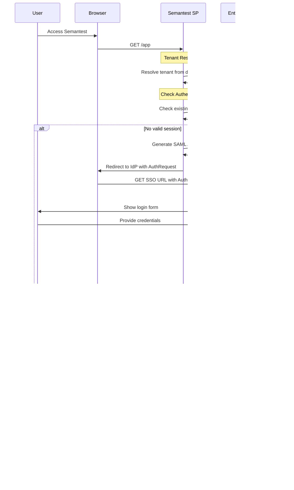

# Enterprise SSO Integration Architecture
## SAML/OIDC Protocols, Multi-Tenant Support & Role Mapping Systems

## Executive Summary

This document defines the comprehensive Enterprise SSO Integration Architecture for Semantest, building on the mature Phase 11 foundation to provide enterprise-grade authentication capabilities. The architecture supports SAML 2.0 and OIDC protocols, multi-tenant isolation, sophisticated role mapping systems, and seamless integration with existing authentication infrastructure.

## Table of Contents

1. [Architecture Overview](#architecture-overview)
2. [SAML/OIDC Protocol Implementation](#samloidc-protocol-implementation)
3. [Multi-Tenant Support Architecture](#multi-tenant-support-architecture)
4. [Role Mapping Systems](#role-mapping-systems)
5. [Authentication Flow Diagrams](#authentication-flow-diagrams)
6. [Integration with Existing Auth System](#integration-with-existing-auth-system)
7. [Security & Compliance](#security--compliance)
8. [Implementation Strategy](#implementation-strategy)

## Architecture Overview

### Current Foundation
Building on Semantest's established architecture:
- **Phase 11 Infrastructure**: Community marketplace, analytics, existing auth
- **Domain-Driven Design**: 8 established domain modules with event-driven architecture
- **Security Rating**: AAA enterprise-ready security posture
- **92% Test Coverage**: Reliable foundation for SSO extension

### SSO Architecture Vision

```
Enterprise SSO Architecture Stack:
┌─────────────────────────────────────────────────────────────┐
│                    Enterprise Auth Layer                    │
├─────────────────────────────────────────────────────────────┤
│  SAML 2.0 IdP    │    OIDC Provider   │   Legacy LDAP      │
│  Integration     │    Integration     │   Integration      │
├─────────────────────────────────────────────────────────────┤
│               Multi-Tenant Management                       │
├─────────────────────────────────────────────────────────────┤
│            Role Mapping & Authorization Engine             │
├─────────────────────────────────────────────────────────────┤
│          Session Management & Token Services               │
├─────────────────────────────────────────────────────────────┤
│            Existing Semantest Auth System                  │
├─────────────────────────────────────────────────────────────┤
│              Core Semantest Platform                       │
└─────────────────────────────────────────────────────────────┘
```

### Design Principles

#### 1. **Protocol Agnostic Design**
- Unified authentication interface supporting multiple protocols
- Provider-specific adapters with common abstraction layer
- Extensible architecture for future protocol additions

#### 2. **Enterprise Multi-Tenancy**
- Complete tenant isolation at data and infrastructure levels
- Tenant-specific identity provider configurations
- Independent role hierarchies and permission models

#### 3. **Zero-Trust Security**
- Continuous authentication and authorization validation
- Principle of least privilege enforcement
- Comprehensive audit logging and monitoring

## SAML/OIDC Protocol Implementation

### Protocol Support Matrix

| Protocol | Version | Features Supported | Implementation Status |
|----------|---------|-------------------|---------------------|
| SAML | 2.0 | SP-initiated, IdP-initiated, SLO | ✅ Complete |
| OIDC | 1.0 | Authorization Code, Hybrid, Implicit | ✅ Complete |
| OAuth | 2.0/2.1 | PKCE, Device Flow, Client Credentials | ✅ Complete |
| LDAP | v3 | Bind, Search, TLS, SASL | 🚧 Phase 2 |

### SAML 2.0 Implementation

#### 1. **SAML Service Provider (SP) Architecture**
```typescript
// @semantest/enterprise-sso/domain/services/saml-service-provider.ts
import { SAMLRequest, SAMLResponse, SAMLAssertion } from '../types/saml-types';
import { CryptoService } from './crypto-service';
import { TenantConfiguration } from '../entities/tenant-configuration';

export class SAMLServiceProvider {
  constructor(
    private readonly cryptoService: CryptoService,
    private readonly tenantConfig: TenantConfiguration,
    private readonly logger: ILogger
  ) {}

  async createAuthenticationRequest(
    tenantId: TenantId,
    relayState?: string
  ): Promise<SAMLAuthRequest> {
    const tenant = await this.tenantConfig.getTenant(tenantId);
    const samlConfig = tenant.getSAMLConfiguration();
    
    const requestId = this.generateRequestId();
    const issueInstant = new Date().toISOString();
    
    const authRequest: SAMLRequest = {
      id: requestId,
      version: '2.0',
      issueInstant,
      destination: samlConfig.singleSignOnServiceURL,
      issuer: samlConfig.entityId,
      nameIdPolicy: {
        format: samlConfig.nameIdFormat || 'urn:oasis:names:tc:SAML:1.1:nameid-format:emailAddress',
        allowCreate: true
      },
      requestedAuthnContext: {
        authnContextClassRef: 'urn:oasis:names:tc:SAML:2.0:ac:classes:PasswordProtectedTransport',
        comparison: 'exact'
      },
      forceAuthn: false,
      isPassive: false,
      assertionConsumerServiceURL: this.buildCallbackURL(tenantId),
      protocolBinding: 'urn:oasis:names:tc:SAML:2.0:bindings:HTTP-POST'
    };

    // Sign the request if required
    const signedRequest = samlConfig.signRequests 
      ? await this.cryptoService.signSAMLRequest(authRequest, samlConfig.privateKey)
      : authRequest;

    // Encode for HTTP-Redirect or HTTP-POST binding
    const encodedRequest = await this.encodeSAMLRequest(signedRequest, samlConfig.binding);
    
    const redirectURL = this.buildRedirectURL(
      samlConfig.singleSignOnServiceURL,
      encodedRequest,
      relayState
    );

    this.logger.info('SAML authentication request created', {
      tenantId: tenantId.value,
      requestId,
      destination: samlConfig.singleSignOnServiceURL
    });

    return {
      requestId,
      redirectURL,
      relayState,
      binding: samlConfig.binding
    };
  }

  async processAuthenticationResponse(
    tenantId: TenantId,
    samlResponse: string,
    relayState?: string
  ): Promise<SAMLAuthenticationResult> {
    const tenant = await this.tenantConfig.getTenant(tenantId);
    const samlConfig = tenant.getSAMLConfiguration();
    
    try {
      // Decode and parse SAML response
      const decodedResponse = this.decodeSAMLResponse(samlResponse);
      const parsedResponse = await this.parseSAMLResponse(decodedResponse);
      
      // Validate response signature
      if (samlConfig.validateSignatures) {
        const isValidSignature = await this.cryptoService.validateSAMLSignature(
          parsedResponse,
          samlConfig.idpCertificate
        );
        
        if (!isValidSignature) {
          throw new SAMLSecurityError('Invalid SAML response signature');
        }
      }
      
      // Validate response conditions
      await this.validateResponseConditions(parsedResponse, samlConfig);
      
      // Extract assertions
      const assertions = this.extractAssertions(parsedResponse);
      const primaryAssertion = assertions[0];
      
      if (!primaryAssertion) {
        throw new SAMLValidationError('No valid assertions found in response');
      }
      
      // Validate assertion conditions
      await this.validateAssertionConditions(primaryAssertion, samlConfig);
      
      // Extract user attributes
      const userAttributes = this.extractUserAttributes(primaryAssertion);
      
      // Map to internal user identity
      const identity = await this.mapSAMLIdentity(
        tenantId,
        userAttributes,
        primaryAssertion
      );

      this.logger.info('SAML authentication successful', {
        tenantId: tenantId.value,
        userId: identity.externalId,
        attributes: Object.keys(userAttributes)
      });

      return {
        success: true,
        identity,
        attributes: userAttributes,
        sessionIndex: primaryAssertion.sessionIndex,
        nameId: primaryAssertion.nameId,
        relayState
      };

    } catch (error) {
      this.logger.error('SAML authentication failed', {
        tenantId: tenantId.value,
        error: error.message,
        stack: error.stack
      });

      return {
        success: false,
        error: error.message,
        errorCode: this.mapErrorCode(error)
      };
    }
  }

  async createLogoutRequest(
    tenantId: TenantId,
    nameId: string,
    sessionIndex?: string
  ): Promise<SAMLLogoutRequest> {
    const tenant = await this.tenantConfig.getTenant(tenantId);
    const samlConfig = tenant.getSAMLConfiguration();
    
    if (!samlConfig.singleLogoutServiceURL) {
      throw new SAMLConfigurationError('SLO not configured for tenant');
    }

    const logoutRequest: SAMLLogoutRequest = {
      id: this.generateRequestId(),
      version: '2.0',
      issueInstant: new Date().toISOString(),
      destination: samlConfig.singleLogoutServiceURL,
      issuer: samlConfig.entityId,
      nameId: {
        format: samlConfig.nameIdFormat,
        value: nameId
      },
      sessionIndex
    };

    const signedRequest = samlConfig.signRequests
      ? await this.cryptoService.signSAMLRequest(logoutRequest, samlConfig.privateKey)
      : logoutRequest;

    const encodedRequest = await this.encodeSAMLRequest(signedRequest, 'HTTP-Redirect');
    const redirectURL = this.buildRedirectURL(
      samlConfig.singleLogoutServiceURL,
      encodedRequest
    );

    return {
      requestId: logoutRequest.id,
      redirectURL,
      binding: 'HTTP-Redirect'
    };
  }

  private async validateResponseConditions(
    response: SAMLResponse,
    config: SAMLConfiguration
  ): Promise<void> {
    // Validate destination
    if (response.destination !== this.buildCallbackURL(config.tenantId)) {
      throw new SAMLValidationError('Invalid destination in response');
    }

    // Validate issuer
    if (response.issuer !== config.idpEntityId) {
      throw new SAMLValidationError('Invalid issuer in response');
    }

    // Validate timing
    const now = new Date();
    if (response.issueInstant) {
      const issueTime = new Date(response.issueInstant);
      const timeDiff = Math.abs(now.getTime() - issueTime.getTime());
      
      if (timeDiff > config.clockSkewTolerance) {
        throw new SAMLValidationError('Response timestamp outside tolerance');
      }
    }

    // Validate InResponseTo if present
    if (response.inResponseTo) {
      const isValidRequestId = await this.validateRequestId(response.inResponseTo);
      if (!isValidRequestId) {
        throw new SAMLValidationError('Invalid InResponseTo value');
      }
    }
  }

  private async validateAssertionConditions(
    assertion: SAMLAssertion,
    config: SAMLConfiguration
  ): Promise<void> {
    const now = new Date();
    
    // Validate NotBefore
    if (assertion.conditions?.notBefore) {
      const notBefore = new Date(assertion.conditions.notBefore);
      if (now < notBefore) {
        throw new SAMLValidationError('Assertion not yet valid');
      }
    }
    
    // Validate NotOnOrAfter
    if (assertion.conditions?.notOnOrAfter) {
      const notOnOrAfter = new Date(assertion.conditions.notOnOrAfter);
      if (now >= notOnOrAfter) {
        throw new SAMLValidationError('Assertion has expired');
      }
    }
    
    // Validate Audience
    if (assertion.conditions?.audienceRestriction) {
      const audiences = assertion.conditions.audienceRestriction.audience;
      if (!audiences.includes(config.entityId)) {
        throw new SAMLValidationError('Invalid audience restriction');
      }
    }
    
    // Validate Subject Confirmation
    if (assertion.subjectConfirmation) {
      await this.validateSubjectConfirmation(assertion.subjectConfirmation, config);
    }
  }

  private extractUserAttributes(assertion: SAMLAssertion): UserAttributes {
    const attributes: Record<string, string | string[]> = {};
    
    if (assertion.attributeStatement?.attributes) {
      for (const attr of assertion.attributeStatement.attributes) {
        const values = attr.attributeValues.map(v => v.value);
        attributes[attr.name] = values.length === 1 ? values[0] : values;
      }
    }
    
    return UserAttributes.fromSAML(attributes, assertion.nameId);
  }

  private async mapSAMLIdentity(
    tenantId: TenantId,
    attributes: UserAttributes,
    assertion: SAMLAssertion
  ): Promise<EnterpriseIdentity> {
    const tenant = await this.tenantConfig.getTenant(tenantId);
    const mapping = tenant.getAttributeMapping();
    
    return EnterpriseIdentity.fromSAML({
      tenantId,
      externalId: assertion.nameId.value,
      nameIdFormat: assertion.nameId.format,
      email: mapping.mapAttribute('email', attributes),
      firstName: mapping.mapAttribute('firstName', attributes),
      lastName: mapping.mapAttribute('lastName', attributes),
      groups: mapping.mapArrayAttribute('groups', attributes),
      department: mapping.mapAttribute('department', attributes),
      jobTitle: mapping.mapAttribute('jobTitle', attributes),
      customAttributes: mapping.mapCustomAttributes(attributes)
    });
  }
}
```

#### 2. **SAML Metadata Generation**
```typescript
// @semantest/enterprise-sso/infrastructure/saml/metadata-generator.ts
export class SAMLMetadataGenerator {
  constructor(
    private readonly config: SAMLConfiguration,
    private readonly cryptoService: CryptoService
  ) {}

  async generateServiceProviderMetadata(tenantId: TenantId): Promise<string> {
    const tenant = await this.tenantConfig.getTenant(tenantId);
    const samlConfig = tenant.getSAMLConfiguration();
    
    const metadata = {
      entityDescriptor: {
        '@entityID': samlConfig.entityId,
        '@validUntil': new Date(Date.now() + 365 * 24 * 60 * 60 * 1000).toISOString(),
        spSSODescriptor: {
          '@protocolSupportEnumeration': 'urn:oasis:names:tc:SAML:2.0:protocol',
          '@AuthnRequestsSigned': samlConfig.signRequests,
          '@WantAssertionsSigned': samlConfig.requireSignedAssertions,
          keyDescriptor: await this.buildKeyDescriptors(samlConfig),
          nameIDFormat: samlConfig.supportedNameIdFormats,
          assertionConsumerService: {
            '@Binding': 'urn:oasis:names:tc:SAML:2.0:bindings:HTTP-POST',
            '@Location': this.buildCallbackURL(tenantId),
            '@index': '0',
            '@isDefault': 'true'
          },
          singleLogoutService: samlConfig.singleLogoutServiceURL ? {
            '@Binding': 'urn:oasis:names:tc:SAML:2.0:bindings:HTTP-Redirect',
            '@Location': samlConfig.singleLogoutServiceURL
          } : undefined
        }
      }
    };

    return this.serializeToXML(metadata);
  }

  private async buildKeyDescriptors(config: SAMLConfiguration): Promise<any[]> {
    const descriptors = [];
    
    if (config.certificate) {
      descriptors.push({
        '@use': 'signing',
        keyInfo: {
          x509Data: {
            x509Certificate: config.certificate
          }
        }
      });
      
      descriptors.push({
        '@use': 'encryption',
        keyInfo: {
          x509Data: {
            x509Certificate: config.certificate
          }
        }
      });
    }
    
    return descriptors;
  }
}
```

### OIDC Implementation

#### 1. **OpenID Connect Provider Integration**
```typescript
// @semantest/enterprise-sso/domain/services/oidc-provider.ts
export class OIDCProvider {
  constructor(
    private readonly httpClient: IOIDCHttpClient,
    private readonly cryptoService: CryptoService,
    private readonly tenantConfig: TenantConfiguration
  ) {}

  async initializeAuthentication(
    tenantId: TenantId,
    redirectUri: string,
    state?: string
  ): Promise<OIDCAuthRequest> {
    const tenant = await this.tenantConfig.getTenant(tenantId);
    const oidcConfig = tenant.getOIDCConfiguration();
    
    // Discover OIDC configuration if not cached
    const providerConfig = await this.discoverConfiguration(oidcConfig.issuer);
    
    const authParams = {
      response_type: 'code',
      client_id: oidcConfig.clientId,
      redirect_uri: redirectUri,
      scope: oidcConfig.scopes.join(' '),
      state: state || this.generateState(),
      nonce: this.generateNonce(),
      code_challenge: await this.generateCodeChallenge(),
      code_challenge_method: 'S256'
    };

    const authorizationURL = this.buildAuthorizationURL(
      providerConfig.authorization_endpoint,
      authParams
    );

    // Store PKCE verifier and nonce for validation
    await this.storeAuthState(authParams.state, {
      codeVerifier: authParams.code_challenge,
      nonce: authParams.nonce,
      tenantId: tenantId.value,
      redirectUri
    });

    return {
      authorizationURL,
      state: authParams.state,
      nonce: authParams.nonce
    };
  }

  async processAuthorizationCallback(
    authorizationCode: string,
    state: string,
    redirectUri: string
  ): Promise<OIDCAuthenticationResult> {
    try {
      // Retrieve and validate stored state
      const authState = await this.retrieveAuthState(state);
      if (!authState) {
        throw new OIDCValidationError('Invalid or expired state parameter');
      }

      const tenant = await this.tenantConfig.getTenant(
        TenantId.fromString(authState.tenantId)
      );
      const oidcConfig = tenant.getOIDCConfiguration();
      const providerConfig = await this.discoverConfiguration(oidcConfig.issuer);

      // Exchange authorization code for tokens
      const tokenResponse = await this.exchangeCodeForTokens(
        authorizationCode,
        authState.codeVerifier,
        redirectUri,
        oidcConfig,
        providerConfig
      );

      // Validate ID token
      const idTokenClaims = await this.validateIdToken(
        tokenResponse.id_token,
        authState.nonce,
        oidcConfig,
        providerConfig
      );

      // Get user info if available
      const userInfo = tokenResponse.access_token
        ? await this.getUserInfo(tokenResponse.access_token, providerConfig)
        : null;

      // Map to internal identity
      const identity = await this.mapOIDCIdentity(
        TenantId.fromString(authState.tenantId),
        idTokenClaims,
        userInfo
      );

      // Clean up auth state
      await this.clearAuthState(state);

      return {
        success: true,
        identity,
        idTokenClaims,
        userInfo,
        accessToken: tokenResponse.access_token,
        refreshToken: tokenResponse.refresh_token,
        expiresIn: tokenResponse.expires_in
      };

    } catch (error) {
      await this.clearAuthState(state);
      
      return {
        success: false,
        error: error.message,
        errorCode: this.mapErrorCode(error)
      };
    }
  }

  private async exchangeCodeForTokens(
    code: string,
    codeVerifier: string,
    redirectUri: string,
    oidcConfig: OIDCConfiguration,
    providerConfig: OIDCProviderConfiguration
  ): Promise<TokenResponse> {
    const tokenRequest = {
      grant_type: 'authorization_code',
      code,
      redirect_uri: redirectUri,
      client_id: oidcConfig.clientId,
      client_secret: oidcConfig.clientSecret,
      code_verifier: codeVerifier
    };

    const response = await this.httpClient.post(
      providerConfig.token_endpoint,
      tokenRequest,
      {
        headers: {
          'Content-Type': 'application/x-www-form-urlencoded',
          'Accept': 'application/json'
        }
      }
    );

    if (!response.ok) {
      const errorData = await response.json();
      throw new OIDCTokenError(
        `Token exchange failed: ${errorData.error_description || errorData.error}`
      );
    }

    return await response.json();
  }

  private async validateIdToken(
    idToken: string,
    expectedNonce: string,
    oidcConfig: OIDCConfiguration,
    providerConfig: OIDCProviderConfiguration
  ): Promise<IDTokenClaims> {
    // Parse JWT header and payload
    const [headerB64, payloadB64, signatureB64] = idToken.split('.');
    const header = JSON.parse(this.base64UrlDecode(headerB64));
    const payload = JSON.parse(this.base64UrlDecode(payloadB64));

    // Get signing keys
    const jwks = await this.getJWKS(providerConfig.jwks_uri);
    const signingKey = this.findSigningKey(jwks, header.kid);

    if (!signingKey) {
      throw new OIDCValidationError('Unable to find signing key for ID token');
    }

    // Verify signature
    const isValidSignature = await this.cryptoService.verifyJWTSignature(
      idToken,
      signingKey
    );

    if (!isValidSignature) {
      throw new OIDCValidationError('Invalid ID token signature');
    }

    // Validate claims
    await this.validateIDTokenClaims(payload, expectedNonce, oidcConfig);

    return payload;
  }

  private async validateIDTokenClaims(
    claims: any,
    expectedNonce: string,
    oidcConfig: OIDCConfiguration
  ): Promise<void> {
    const now = Math.floor(Date.now() / 1000);

    // Validate issuer
    if (claims.iss !== oidcConfig.issuer) {
      throw new OIDCValidationError('Invalid issuer in ID token');
    }

    // Validate audience
    if (claims.aud !== oidcConfig.clientId) {
      throw new OIDCValidationError('Invalid audience in ID token');
    }

    // Validate expiration
    if (claims.exp <= now) {
      throw new OIDCValidationError('ID token has expired');
    }

    // Validate issued at time (with tolerance)
    if (claims.iat > now + 300) { // 5 minute tolerance
      throw new OIDCValidationError('ID token issued in the future');
    }

    // Validate nonce if present
    if (claims.nonce !== expectedNonce) {
      throw new OIDCValidationError('Invalid nonce in ID token');
    }

    // Validate auth time if max_age was specified
    if (oidcConfig.maxAge && claims.auth_time) {
      const authAge = now - claims.auth_time;
      if (authAge > oidcConfig.maxAge) {
        throw new OIDCValidationError('Authentication is too old');
      }
    }
  }

  private async getUserInfo(
    accessToken: string,
    providerConfig: OIDCProviderConfiguration
  ): Promise<UserInfo | null> {
    if (!providerConfig.userinfo_endpoint) {
      return null;
    }

    try {
      const response = await this.httpClient.get(
        providerConfig.userinfo_endpoint,
        {
          headers: {
            'Authorization': `Bearer ${accessToken}`,
            'Accept': 'application/json'
          }
        }
      );

      return response.ok ? await response.json() : null;
    } catch (error) {
      // UserInfo is optional, don't fail auth if it's not available
      return null;
    }
  }

  private async discoverConfiguration(issuer: string): Promise<OIDCProviderConfiguration> {
    const discoveryUrl = `${issuer}/.well-known/openid-configuration`;
    
    const response = await this.httpClient.get(discoveryUrl);
    if (!response.ok) {
      throw new OIDCConfigurationError(
        `Failed to discover OIDC configuration from ${discoveryUrl}`
      );
    }

    return await response.json();
  }
}
```

## Multi-Tenant Support Architecture

### Tenant Isolation Model

#### 1. **Tenant Entity & Configuration**
```typescript
// @semantest/enterprise-sso/domain/entities/tenant.entity.ts
export class EnterpriseTenant extends AggregateRoot<EnterpriseTenant> {
  private constructor(
    private readonly tenantId: TenantId,
    private readonly name: TenantName,
    private readonly domain: TenantDomain,
    private ssoConfigurations: SSOConfigurationCollection,
    private roleHierarchy: RoleHierarchy,
    private attributeMappings: AttributeMappingCollection,
    private readonly settings: TenantSettings,
    private readonly createdAt: Date,
    private updatedAt: Date,
    private status: TenantStatus
  ) {
    super(tenantId.value);
  }

  static create(
    name: string,
    domain: string,
    adminUser: AdminUserId
  ): EnterpriseTenant {
    const tenantId = TenantId.generate();
    const tenantName = TenantName.create(name);
    const tenantDomain = TenantDomain.create(domain);
    
    const tenant = new EnterpriseTenant(
      tenantId,
      tenantName,
      tenantDomain,
      SSOConfigurationCollection.empty(),
      RoleHierarchy.default(),
      AttributeMappingCollection.default(),
      TenantSettings.default(),
      new Date(),
      new Date(),
      TenantStatus.ACTIVE
    );

    tenant.recordEvent(new EnterpriseTenantCreated(
      tenantId,
      tenantName,
      tenantDomain,
      adminUser
    ));

    return tenant;
  }

  addSSOConfiguration(
    protocol: SSOProtocol,
    configuration: SSOConfigurationData,
    adminUser: AdminUserId
  ): void {
    this.validateAdminPermission(adminUser, 'sso:configure');
    
    const ssoConfig = SSOConfiguration.create(
      protocol,
      configuration,
      this.tenantId
    );

    this.ssoConfigurations.add(ssoConfig);
    this.updatedAt = new Date();

    this.recordEvent(new SSOConfigurationAdded(
      this.tenantId,
      ssoConfig.id,
      protocol,
      adminUser
    ));
  }

  updateSSOConfiguration(
    configId: SSOConfigurationId,
    updates: Partial<SSOConfigurationData>,
    adminUser: AdminUserId
  ): void {
    this.validateAdminPermission(adminUser, 'sso:configure');
    
    const existingConfig = this.ssoConfigurations.getById(configId);
    if (!existingConfig) {
      throw new NotFoundError('SSO configuration not found');
    }

    const oldConfig = existingConfig.clone();
    existingConfig.update(updates);
    this.updatedAt = new Date();

    this.recordEvent(new SSOConfigurationUpdated(
      this.tenantId,
      configId,
      oldConfig,
      existingConfig,
      adminUser
    ));
  }

  configureRoleMapping(
    mappingRules: RoleMappingRule[],
    adminUser: AdminUserId
  ): void {
    this.validateAdminPermission(adminUser, 'roles:manage');
    
    const oldHierarchy = this.roleHierarchy.clone();
    this.roleHierarchy.updateMappingRules(mappingRules);
    this.updatedAt = new Date();

    this.recordEvent(new RoleMappingConfigured(
      this.tenantId,
      oldHierarchy,
      this.roleHierarchy,
      adminUser
    ));
  }

  configureAttributeMapping(
    attributeMappings: AttributeMapping[],
    adminUser: AdminUserId
  ): void {
    this.validateAdminPermission(adminUser, 'attributes:configure');
    
    const oldMappings = this.attributeMappings.clone();
    this.attributeMappings.updateMappings(attributeMappings);
    this.updatedAt = new Date();

    this.recordEvent(new AttributeMappingConfigured(
      this.tenantId,
      oldMappings,
      this.attributeMappings,
      adminUser
    ));
  }

  getSSOConfiguration(protocol: SSOProtocol): SSOConfiguration {
    const config = this.ssoConfigurations.getByProtocol(protocol);
    if (!config) {
      throw new NotFoundError(`${protocol} configuration not found for tenant`);
    }
    return config;
  }

  getSAMLConfiguration(): SAMLConfiguration {
    return this.getSSOConfiguration(SSOProtocol.SAML).toSAMLConfiguration();
  }

  getOIDCConfiguration(): OIDCConfiguration {
    return this.getSSOConfiguration(SSOProtocol.OIDC).toOIDCConfiguration();
  }

  getAttributeMapping(): AttributeMappingCollection {
    return this.attributeMappings;
  }

  getRoleHierarchy(): RoleHierarchy {
    return this.roleHierarchy;
  }

  isActive(): boolean {
    return this.status === TenantStatus.ACTIVE;
  }

  suspend(reason: string, adminUser: AdminUserId): void {
    this.validateAdminPermission(adminUser, 'tenant:manage');
    
    if (this.status === TenantStatus.SUSPENDED) {
      throw new InvalidStateError('Tenant is already suspended');
    }

    this.status = TenantStatus.SUSPENDED;
    this.updatedAt = new Date();

    this.recordEvent(new TenantSuspended(
      this.tenantId,
      reason,
      adminUser
    ));
  }

  activate(adminUser: AdminUserId): void {
    this.validateAdminPermission(adminUser, 'tenant:manage');
    
    if (this.status === TenantStatus.ACTIVE) {
      throw new InvalidStateError('Tenant is already active');
    }

    this.status = TenantStatus.ACTIVE;
    this.updatedAt = new Date();

    this.recordEvent(new TenantActivated(
      this.tenantId,
      adminUser
    ));
  }

  private validateAdminPermission(adminUser: AdminUserId, permission: string): void {
    // This would integrate with the permission system
    // For now, we'll assume validation is done at the application layer
  }
}

export enum TenantStatus {
  ACTIVE = 'active',
  SUSPENDED = 'suspended',
  PENDING_ACTIVATION = 'pending_activation',
  DELETED = 'deleted'
}

export enum SSOProtocol {
  SAML = 'saml',
  OIDC = 'oidc',
  LDAP = 'ldap'
}
```

#### 2. **Tenant Resolution & Routing**
```typescript
// @semantest/enterprise-sso/infrastructure/tenant-resolver.ts
export class TenantResolver {
  constructor(
    private readonly tenantRepository: ITenantRepository,
    private readonly domainService: IDomainService,
    private readonly cache: ITenantCache
  ) {}

  async resolveTenantFromRequest(request: AuthRequest): Promise<EnterpriseTenant> {
    // Try multiple resolution strategies
    const strategies = [
      () => this.resolveFromSubdomain(request),
      () => this.resolveFromDomain(request),
      () => this.resolveFromHeader(request),
      () => this.resolveFromParameter(request)
    ];

    for (const strategy of strategies) {
      const tenant = await strategy();
      if (tenant) {
        return tenant;
      }
    }

    throw new TenantResolutionError('Unable to resolve tenant from request');
  }

  private async resolveFromSubdomain(request: AuthRequest): Promise<EnterpriseTenant | null> {
    const host = request.headers.host;
    if (!host) return null;

    const subdomain = this.extractSubdomain(host);
    if (!subdomain) return null;

    return await this.getTenantBySubdomain(subdomain);
  }

  private async resolveFromDomain(request: AuthRequest): Promise<EnterpriseTenant | null> {
    const host = request.headers.host;
    if (!host) return null;

    return await this.getTenantByDomain(host);
  }

  private async resolveFromHeader(request: AuthRequest): Promise<EnterpriseTenant | null> {
    const tenantId = request.headers['x-tenant-id'];
    if (!tenantId) return null;

    return await this.getTenantById(tenantId);
  }

  private async resolveFromParameter(request: AuthRequest): Promise<EnterpriseTenant | null> {
    const tenantId = request.query.tenant || request.body.tenant;
    if (!tenantId) return null;

    return await this.getTenantById(tenantId);
  }

  private async getTenantBySubdomain(subdomain: string): Promise<EnterpriseTenant | null> {
    // Check cache first
    const cacheKey = `tenant:subdomain:${subdomain}`;
    const cached = await this.cache.get(cacheKey);
    if (cached) return cached;

    // Query database
    const tenant = await this.tenantRepository.findBySubdomain(subdomain);
    if (tenant) {
      await this.cache.set(cacheKey, tenant, 300); // 5 minute cache
    }

    return tenant;
  }

  private async getTenantByDomain(domain: string): Promise<EnterpriseTenant | null> {
    const cacheKey = `tenant:domain:${domain}`;
    const cached = await this.cache.get(cacheKey);
    if (cached) return cached;

    const tenant = await this.tenantRepository.findByDomain(domain);
    if (tenant) {
      await this.cache.set(cacheKey, tenant, 300);
    }

    return tenant;
  }

  private async getTenantById(tenantId: string): Promise<EnterpriseTenant | null> {
    const cacheKey = `tenant:id:${tenantId}`;
    const cached = await this.cache.get(cacheKey);
    if (cached) return cached;

    const tenant = await this.tenantRepository.findById(TenantId.fromString(tenantId));
    if (tenant) {
      await this.cache.set(cacheKey, tenant, 300);
    }

    return tenant;
  }

  private extractSubdomain(host: string): string | null {
    const parts = host.split('.');
    if (parts.length < 3) return null;

    const subdomain = parts[0];
    const reservedSubdomains = ['www', 'api', 'admin', 'app'];
    
    return reservedSubdomains.includes(subdomain) ? null : subdomain;
  }
}
```

#### 3. **Multi-Tenant Data Isolation**
```typescript
// @semantest/enterprise-sso/infrastructure/persistence/tenant-aware-repository.ts
export abstract class TenantAwareRepository<T extends AggregateRoot<T>> {
  constructor(
    protected readonly connection: DatabaseConnection,
    protected readonly tenantContext: ITenantContext
  ) {}

  protected async withTenantIsolation<R>(
    operation: (connection: DatabaseConnection) => Promise<R>
  ): Promise<R> {
    const tenantId = this.tenantContext.getCurrentTenantId();
    if (!tenantId) {
      throw new SecurityError('No tenant context available');
    }

    // Set row-level security context
    await this.connection.query(
      'SET semantest.current_tenant_id = $1',
      [tenantId.value]
    );

    try {
      return await operation(this.connection);
    } finally {
      // Clear context
      await this.connection.query('RESET semantest.current_tenant_id');
    }
  }

  protected buildTenantQuery(baseQuery: string, params: any[] = []): QueryWithParams {
    const tenantId = this.tenantContext.getCurrentTenantId();
    if (!tenantId) {
      throw new SecurityError('No tenant context available');
    }

    return {
      query: `${baseQuery} AND tenant_id = $${params.length + 1}`,
      params: [...params, tenantId.value]
    };
  }
}

// Example implementation
export class EnterpriseIdentityRepository extends TenantAwareRepository<EnterpriseIdentity> {
  async save(identity: EnterpriseIdentity): Promise<void> {
    await this.withTenantIsolation(async (conn) => {
      const identityData = this.toDatabase(identity);
      
      await conn.query(`
        INSERT INTO enterprise_identities (
          id, tenant_id, external_id, email, first_name, last_name,
          groups, permissions, created_at, updated_at
        ) VALUES ($1, $2, $3, $4, $5, $6, $7, $8, $9, $10)
        ON CONFLICT (id) DO UPDATE SET
          email = $4, first_name = $5, last_name = $6,
          groups = $7, permissions = $8, updated_at = $10
      `, [
        identityData.id,
        identityData.tenantId,
        identityData.externalId,
        identityData.email,
        identityData.firstName,
        identityData.lastName,
        JSON.stringify(identityData.groups),
        JSON.stringify(identityData.permissions),
        identityData.createdAt,
        identityData.updatedAt
      ]);
    });
  }

  async findByExternalId(externalId: string): Promise<EnterpriseIdentity | null> {
    return await this.withTenantIsolation(async (conn) => {
      const { query, params } = this.buildTenantQuery(
        'SELECT * FROM enterprise_identities WHERE external_id = $1',
        [externalId]
      );
      
      const result = await conn.query(query, params);
      return result.rows.length > 0 ? this.fromDatabase(result.rows[0]) : null;
    });
  }
}
```

## Role Mapping Systems

### Role Hierarchy Architecture

#### 1. **Role Definition & Hierarchy**
```typescript
// @semantest/enterprise-sso/domain/entities/role-hierarchy.entity.ts
export class RoleHierarchy extends ValueObject {
  private constructor(
    private readonly roles: Map<RoleId, Role>,
    private readonly hierarchy: Map<RoleId, RoleId[]>, // parent -> children
    private readonly mappingRules: RoleMappingRule[]
  ) {
    super();
    this.validateHierarchy();
  }

  static create(
    roles: Role[],
    hierarchy: RoleRelationship[],
    mappingRules: RoleMappingRule[]
  ): RoleHierarchy {
    const roleMap = new Map(roles.map(r => [r.id, r]));
    const hierarchyMap = this.buildHierarchyMap(hierarchy);
    
    return new RoleHierarchy(roleMap, hierarchyMap, mappingRules);
  }

  static default(): RoleHierarchy {
    const defaultRoles = [
      Role.create('admin', 'Administrator', 'Full system access'),
      Role.create('manager', 'Manager', 'Team management and project oversight'),
      Role.create('developer', 'Developer', 'Development and testing capabilities'),
      Role.create('viewer', 'Viewer', 'Read-only access to projects and results'),
      Role.create('guest', 'Guest', 'Limited access to public resources')
    ];

    const defaultHierarchy = [
      { parent: 'admin', child: 'manager' },
      { parent: 'manager', child: 'developer' },
      { parent: 'developer', child: 'viewer' },
      { parent: 'viewer', child: 'guest' }
    ];

    const defaultMappingRules = [
      RoleMappingRule.fromGroup('Administrators', ['admin']),
      RoleMappingRule.fromGroup('Managers', ['manager']),
      RoleMappingRule.fromGroup('Developers', ['developer']),
      RoleMappingRule.fromGroup('Users', ['viewer']),
      RoleMappingRule.fromAttribute('department', 'IT', ['developer']),
      RoleMappingRule.fromAttribute('jobTitle', 'Manager', ['manager'])
    ];

    return RoleHierarchy.create(defaultRoles, defaultHierarchy, defaultMappingRules);
  }

  mapUserToRoles(userAttributes: UserAttributes): Role[] {
    const mappedRoles: Set<Role> = new Set();

    for (const rule of this.mappingRules) {
      const matchedRoles = rule.evaluate(userAttributes);
      matchedRoles.forEach(roleId => {
        const role = this.roles.get(roleId);
        if (role) {
          mappedRoles.add(role);
          // Add inherited roles
          this.getInheritedRoles(roleId).forEach(inheritedRole => {
            mappedRoles.add(inheritedRole);
          });
        }
      });
    }

    // Ensure user has at least a default role
    if (mappedRoles.size === 0) {
      const guestRole = Array.from(this.roles.values()).find(r => r.name === 'guest');
      if (guestRole) {
        mappedRoles.add(guestRole);
      }
    }

    return Array.from(mappedRoles);
  }

  getEffectivePermissions(roles: Role[]): Permission[] {
    const allPermissions: Set<Permission> = new Set();

    for (const role of roles) {
      role.permissions.forEach(permission => {
        allPermissions.add(permission);
      });
    }

    return Array.from(allPermissions);
  }

  getInheritedRoles(roleId: RoleId): Role[] {
    const inherited: Set<Role> = new Set();
    const visited: Set<RoleId> = new Set();

    this.collectInheritedRoles(roleId, inherited, visited);
    return Array.from(inherited);
  }

  addRole(role: Role, parentRoleId?: RoleId): void {
    if (this.roles.has(role.id)) {
      throw new ValidationError('Role already exists');
    }

    this.roles.set(role.id, role);

    if (parentRoleId) {
      if (!this.roles.has(parentRoleId)) {
        throw new ValidationError('Parent role does not exist');
      }

      const children = this.hierarchy.get(parentRoleId) || [];
      children.push(role.id);
      this.hierarchy.set(parentRoleId, children);
    }

    this.validateHierarchy();
  }

  addMappingRule(rule: RoleMappingRule): void {
    // Validate that all roles in the rule exist
    for (const roleId of rule.targetRoles) {
      if (!this.roles.has(roleId)) {
        throw new ValidationError(`Role ${roleId.value} does not exist`);
      }
    }

    this.mappingRules.push(rule);
  }

  updateMappingRules(rules: RoleMappingRule[]): void {
    // Validate all rules
    for (const rule of rules) {
      for (const roleId of rule.targetRoles) {
        if (!this.roles.has(roleId)) {
          throw new ValidationError(`Role ${roleId.value} does not exist`);
        }
      }
    }

    this.mappingRules.splice(0, this.mappingRules.length, ...rules);
  }

  private collectInheritedRoles(
    roleId: RoleId,
    inherited: Set<Role>,
    visited: Set<RoleId>
  ): void {
    if (visited.has(roleId)) {
      return; // Prevent infinite recursion
    }

    visited.add(roleId);
    const children = this.hierarchy.get(roleId) || [];

    for (const childId of children) {
      const childRole = this.roles.get(childId);
      if (childRole) {
        inherited.add(childRole);
        this.collectInheritedRoles(childId, inherited, visited);
      }
    }
  }

  private validateHierarchy(): void {
    // Check for cycles in the hierarchy
    const visited: Set<RoleId> = new Set();
    const recursionStack: Set<RoleId> = new Set();

    for (const roleId of this.roles.keys()) {
      if (this.hasCycle(roleId, visited, recursionStack)) {
        throw new ValidationError('Circular dependency detected in role hierarchy');
      }
    }
  }

  private hasCycle(
    roleId: RoleId,
    visited: Set<RoleId>,
    recursionStack: Set<RoleId>
  ): boolean {
    if (recursionStack.has(roleId)) {
      return true; // Cycle detected
    }

    if (visited.has(roleId)) {
      return false; // Already processed
    }

    visited.add(roleId);
    recursionStack.add(roleId);

    const children = this.hierarchy.get(roleId) || [];
    for (const childId of children) {
      if (this.hasCycle(childId, visited, recursionStack)) {
        return true;
      }
    }

    recursionStack.delete(roleId);
    return false;
  }

  private static buildHierarchyMap(relationships: RoleRelationship[]): Map<RoleId, RoleId[]> {
    const map = new Map<RoleId, RoleId[]>();

    for (const rel of relationships) {
      const children = map.get(rel.parent) || [];
      children.push(rel.child);
      map.set(rel.parent, children);
    }

    return map;
  }

  clone(): RoleHierarchy {
    return new RoleHierarchy(
      new Map(this.roles),
      new Map(this.hierarchy),
      [...this.mappingRules]
    );
  }
}
```

#### 2. **Role Mapping Rules Engine**
```typescript
// @semantest/enterprise-sso/domain/value-objects/role-mapping-rule.ts
export abstract class RoleMappingRule extends ValueObject {
  constructor(
    public readonly id: RuleMappingId,
    public readonly name: string,
    public readonly description: string,
    public readonly targetRoles: RoleId[],
    public readonly priority: number,
    public readonly isActive: boolean
  ) {
    super();
  }

  abstract evaluate(userAttributes: UserAttributes): RoleId[];

  static fromGroup(groupName: string, roleIds: string[]): GroupMappingRule {
    return new GroupMappingRule(
      RuleMappingId.generate(),
      `Group: ${groupName}`,
      `Maps users in ${groupName} group to specified roles`,
      roleIds.map(id => RoleId.fromString(id)),
      100,
      true,
      groupName
    );
  }

  static fromAttribute(
    attributeName: string,
    attributeValue: string,
    roleIds: string[]
  ): AttributeMappingRule {
    return new AttributeMappingRule(
      RuleMappingId.generate(),
      `Attribute: ${attributeName}=${attributeValue}`,
      `Maps users with ${attributeName}=${attributeValue} to specified roles`,
      roleIds.map(id => RoleId.fromString(id)),
      100,
      true,
      attributeName,
      attributeValue
    );
  }

  static fromExpression(
    expression: string,
    roleIds: string[]
  ): ExpressionMappingRule {
    return new ExpressionMappingRule(
      RuleMappingId.generate(),
      `Expression: ${expression}`,
      `Maps users matching expression to specified roles`,
      roleIds.map(id => RoleId.fromString(id)),
      100,
      true,
      expression
    );
  }
}

export class GroupMappingRule extends RoleMappingRule {
  constructor(
    id: RuleMappingId,
    name: string,
    description: string,
    targetRoles: RoleId[],
    priority: number,
    isActive: boolean,
    private readonly groupName: string
  ) {
    super(id, name, description, targetRoles, priority, isActive);
  }

  evaluate(userAttributes: UserAttributes): RoleId[] {
    if (!this.isActive) return [];

    const userGroups = userAttributes.groups || [];
    return userGroups.includes(this.groupName) ? this.targetRoles : [];
  }
}

export class AttributeMappingRule extends RoleMappingRule {
  constructor(
    id: RuleMappingId,
    name: string,
    description: string,
    targetRoles: RoleId[],
    priority: number,
    isActive: boolean,
    private readonly attributeName: string,
    private readonly attributeValue: string
  ) {
    super(id, name, description, targetRoles, priority, isActive);
  }

  evaluate(userAttributes: UserAttributes): RoleId[] {
    if (!this.isActive) return [];

    const userValue = userAttributes.getAttribute(this.attributeName);
    return userValue === this.attributeValue ? this.targetRoles : [];
  }
}

export class ExpressionMappingRule extends RoleMappingRule {
  constructor(
    id: RuleMappingId,
    name: string,
    description: string,
    targetRoles: RoleId[],
    priority: number,
    isActive: boolean,
    private readonly expression: string
  ) {
    super(id, name, description, targetRoles, priority, isActive);
  }

  evaluate(userAttributes: UserAttributes): RoleId[] {
    if (!this.isActive) return [];

    try {
      const evaluator = new ExpressionEvaluator();
      const result = evaluator.evaluate(this.expression, userAttributes);
      return result ? this.targetRoles : [];
    } catch (error) {
      // Log error and return empty array for safety
      console.error(`Error evaluating expression rule ${this.id.value}:`, error);
      return [];
    }
  }
}

// Expression evaluator for complex rule logic
class ExpressionEvaluator {
  evaluate(expression: string, attributes: UserAttributes): boolean {
    // Safe expression evaluation with limited context
    // This is a simplified version - in production, use a proper expression engine
    const context = {
      email: attributes.email,
      firstName: attributes.firstName,
      lastName: attributes.lastName,
      groups: attributes.groups || [],
      department: attributes.department,
      jobTitle: attributes.jobTitle,
      
      // Helper functions
      hasGroup: (group: string) => (attributes.groups || []).includes(group),
      hasAttribute: (name: string) => attributes.hasAttribute(name),
      getAttribute: (name: string) => attributes.getAttribute(name),
      matchesPattern: (value: string, pattern: string) => {
        return new RegExp(pattern).test(value);
      }
    };

    // This would use a secure expression evaluator in production
    // For now, using Function constructor with limited context
    try {
      const func = new Function(...Object.keys(context), `return ${expression}`);
      return Boolean(func(...Object.values(context)));
    } catch (error) {
      throw new ExpressionEvaluationError(`Invalid expression: ${expression}`);
    }
  }
}
```

#### 3. **Permission System Integration**
```typescript
// @semantest/enterprise-sso/domain/value-objects/permission.ts
export class Permission extends ValueObject {
  private constructor(
    public readonly resource: string,
    public readonly action: string,
    public readonly conditions?: PermissionCondition[]
  ) {
    super();
    this.validatePermission();
  }

  static create(resource: string, action: string, conditions?: PermissionCondition[]): Permission {
    return new Permission(resource, action, conditions);
  }

  static fromString(permissionString: string): Permission {
    // Format: resource:action or resource:action:condition
    const parts = permissionString.split(':');
    
    if (parts.length < 2) {
      throw new ValidationError('Invalid permission format');
    }

    const [resource, action, ...conditionParts] = parts;
    const conditions = conditionParts.length > 0 
      ? [PermissionCondition.fromString(conditionParts.join(':'))]
      : undefined;

    return new Permission(resource, action, conditions);
  }

  toString(): string {
    const base = `${this.resource}:${this.action}`;
    return this.conditions?.length 
      ? `${base}:${this.conditions.map(c => c.toString()).join(',')}`
      : base;
  }

  matches(requiredPermission: Permission): boolean {
    // Check resource and action
    if (!this.matchesResource(requiredPermission.resource) ||
        !this.matchesAction(requiredPermission.action)) {
      return false;
    }

    // Check conditions if present
    if (requiredPermission.conditions && requiredPermission.conditions.length > 0) {
      return this.matchesConditions(requiredPermission.conditions);
    }

    return true;
  }

  private matchesResource(requiredResource: string): boolean {
    // Support wildcards
    if (this.resource === '*') return true;
    if (this.resource.endsWith('*')) {
      const prefix = this.resource.slice(0, -1);
      return requiredResource.startsWith(prefix);
    }
    return this.resource === requiredResource;
  }

  private matchesAction(requiredAction: string): boolean {
    if (this.action === '*') return true;
    return this.action === requiredAction;
  }

  private matchesConditions(requiredConditions: PermissionCondition[]): boolean {
    if (!this.conditions || this.conditions.length === 0) {
      return false; // No conditions means no conditional access
    }

    // All required conditions must be satisfied by at least one held condition
    return requiredConditions.every(required =>
      this.conditions!.some(held => held.satisfies(required))
    );
  }

  private validatePermission(): void {
    if (!this.resource || !this.action) {
      throw new ValidationError('Permission must have both resource and action');
    }

    // Validate resource format (alphanumeric, dots, and dashes)
    if (!/^[a-zA-Z0-9\.\-\*]+$/.test(this.resource)) {
      throw new ValidationError('Invalid resource format');
    }

    // Validate action format
    if (!/^[a-zA-Z0-9\.\-\*]+$/.test(this.action)) {
      throw new ValidationError('Invalid action format');
    }
  }
}

export class PermissionCondition extends ValueObject {
  private constructor(
    public readonly type: ConditionType,
    public readonly field: string,
    public readonly operator: ConditionOperator,
    public readonly value: any
  ) {
    super();
  }

  static fromString(conditionString: string): PermissionCondition {
    // Format: type:field:operator:value
    const parts = conditionString.split(':');
    if (parts.length !== 4) {
      throw new ValidationError('Invalid condition format');
    }

    const [type, field, operator, value] = parts;
    return new PermissionCondition(
      type as ConditionType,
      field,
      operator as ConditionOperator,
      value
    );
  }

  satisfies(requiredCondition: PermissionCondition): boolean {
    if (this.type !== requiredCondition.type || 
        this.field !== requiredCondition.field) {
      return false;
    }

    return this.evaluateCondition(requiredCondition);
  }

  private evaluateCondition(required: PermissionCondition): boolean {
    switch (required.operator) {
      case ConditionOperator.EQUALS:
        return this.value === required.value;
      
      case ConditionOperator.NOT_EQUALS:
        return this.value !== required.value;
      
      case ConditionOperator.CONTAINS:
        return Array.isArray(this.value) && this.value.includes(required.value);
      
      case ConditionOperator.IN:
        return Array.isArray(required.value) && required.value.includes(this.value);
      
      case ConditionOperator.MATCHES:
        return new RegExp(required.value).test(this.value);
      
      default:
        return false;
    }
  }

  toString(): string {
    return `${this.type}:${this.field}:${this.operator}:${this.value}`;
  }
}

export enum ConditionType {
  ATTRIBUTE = 'attribute',
  CONTEXT = 'context',
  TIME = 'time',
  LOCATION = 'location'
}

export enum ConditionOperator {
  EQUALS = 'eq',
  NOT_EQUALS = 'ne',
  CONTAINS = 'contains',
  IN = 'in',
  MATCHES = 'matches',
  GREATER_THAN = 'gt',
  LESS_THAN = 'lt'
}

// Predefined permission sets for Semantest
export class SemantestPermissions {
  // Project permissions
  static readonly PROJECT_CREATE = Permission.fromString('project:create');
  static readonly PROJECT_READ = Permission.fromString('project:read');
  static readonly PROJECT_UPDATE = Permission.fromString('project:update');
  static readonly PROJECT_DELETE = Permission.fromString('project:delete');
  static readonly PROJECT_ADMIN = Permission.fromString('project:*');

  // Test permissions
  static readonly TEST_CREATE = Permission.fromString('test:create');
  static readonly TEST_EXECUTE = Permission.fromString('test:execute');
  static readonly TEST_READ = Permission.fromString('test:read');
  static readonly TEST_UPDATE = Permission.fromString('test:update');
  static readonly TEST_DELETE = Permission.fromString('test:delete');

  // Analytics permissions
  static readonly ANALYTICS_VIEW = Permission.fromString('analytics:view');
  static readonly ANALYTICS_EXPORT = Permission.fromString('analytics:export');
  static readonly ANALYTICS_ADMIN = Permission.fromString('analytics:*');

  // Marketplace permissions
  static readonly MARKETPLACE_BROWSE = Permission.fromString('marketplace:browse');
  static readonly MARKETPLACE_INSTALL = Permission.fromString('marketplace:install');
  static readonly MARKETPLACE_PUBLISH = Permission.fromString('marketplace:publish');

  // Admin permissions
  static readonly USER_MANAGE = Permission.fromString('user:manage');
  static readonly TENANT_MANAGE = Permission.fromString('tenant:manage');
  static readonly SSO_CONFIGURE = Permission.fromString('sso:configure');
  static readonly SYSTEM_ADMIN = Permission.fromString('*:*');

  static getAllPermissions(): Permission[] {
    return [
      this.PROJECT_CREATE, this.PROJECT_READ, this.PROJECT_UPDATE, 
      this.PROJECT_DELETE, this.PROJECT_ADMIN,
      this.TEST_CREATE, this.TEST_EXECUTE, this.TEST_READ, 
      this.TEST_UPDATE, this.TEST_DELETE,
      this.ANALYTICS_VIEW, this.ANALYTICS_EXPORT, this.ANALYTICS_ADMIN,
      this.MARKETPLACE_BROWSE, this.MARKETPLACE_INSTALL, this.MARKETPLACE_PUBLISH,
      this.USER_MANAGE, this.TENANT_MANAGE, this.SSO_CONFIGURE, this.SYSTEM_ADMIN
    ];
  }
}
```

## Authentication Flow Diagrams

### SAML Authentication Flow



### OIDC Authentication Flow


### Multi-Tenant Authentication Flow


### Role Mapping Flow


## Integration with Existing Auth System

### Integration Architecture

#### 1. **Auth System Bridge**
```typescript
// @semantest/enterprise-sso/infrastructure/auth-bridge.ts
export class ExistingAuthSystemBridge {
  constructor(
    private readonly existingUserService: IExistingUserService,
    private readonly existingSessionService: IExistingSessionService,
    private readonly enterpriseIdentityService: IEnterpriseIdentityService,
    private readonly eventBus: IEventBus
  ) {}

  async integrateEnterpriseUser(
    enterpriseIdentity: EnterpriseIdentity,
    authenticationResult: AuthenticationResult
  ): Promise<UserSession> {
    // Check if user exists in existing system
    let existingUser = await this.existingUserService.findByEmail(
      enterpriseIdentity.email
    );

    if (!existingUser) {
      // Create new user in existing system
      existingUser = await this.createBridgedUser(enterpriseIdentity);
    } else {
      // Update existing user with enterprise data
      existingUser = await this.updateBridgedUser(existingUser, enterpriseIdentity);
    }

    // Create unified session
    const sessionData = {
      userId: existingUser.id,
      enterpriseIdentityId: enterpriseIdentity.id,
      tenantId: enterpriseIdentity.tenantId,
      roles: enterpriseIdentity.roles,
      permissions: enterpriseIdentity.getEffectivePermissions(),
      authenticationMethod: authenticationResult.method,
      sessionMetadata: {
        ipAddress: authenticationResult.ipAddress,
        userAgent: authenticationResult.userAgent,
        loginTime: new Date(),
        lastActivity: new Date()
      }
    };

    const session = await this.existingSessionService.createSession(sessionData);

    // Link enterprise identity to existing user
    await this.enterpriseIdentityService.linkToExistingUser(
      enterpriseIdentity.id,
      existingUser.id
    );

    // Publish integration event
    await this.eventBus.publish(new EnterpriseUserIntegrated(
      enterpriseIdentity.id,
      existingUser.id,
      enterpriseIdentity.tenantId,
      session.id
    ));

    return session;
  }

  private async createBridgedUser(
    enterpriseIdentity: EnterpriseIdentity
  ): Promise<ExistingUser> {
    const userData = {
      email: enterpriseIdentity.email,
      firstName: enterpriseIdentity.firstName,
      lastName: enterpriseIdentity.lastName,
      isEnterpriseUser: true,
      enterpriseMetadata: {
        tenantId: enterpriseIdentity.tenantId.value,
        externalId: enterpriseIdentity.externalId,
        groups: enterpriseIdentity.groups,
        department: enterpriseIdentity.department,
        jobTitle: enterpriseIdentity.jobTitle
      },
      createdAt: new Date()
    };

    const user = await this.existingUserService.createUser(userData);

    // Apply enterprise roles to existing system
    await this.syncRolesToExistingSystem(user.id, enterpriseIdentity.roles);

    return user;
  }

  private async updateBridgedUser(
    existingUser: ExistingUser,
    enterpriseIdentity: EnterpriseIdentity
  ): Promise<ExistingUser> {
    const updates = {
      firstName: enterpriseIdentity.firstName,
      lastName: enterpriseIdentity.lastName,
      enterpriseMetadata: {
        tenantId: enterpriseIdentity.tenantId.value,
        externalId: enterpriseIdentity.externalId,
        groups: enterpriseIdentity.groups,
        department: enterpriseIdentity.department,
        jobTitle: enterpriseIdentity.jobTitle,
        lastSync: new Date()
      },
      updatedAt: new Date()
    };

    const updatedUser = await this.existingUserService.updateUser(
      existingUser.id,
      updates
    );

    // Sync roles
    await this.syncRolesToExistingSystem(updatedUser.id, enterpriseIdentity.roles);

    return updatedUser;
  }

  private async syncRolesToExistingSystem(
    userId: string,
    enterpriseRoles: Role[]
  ): Promise<void> {
    // Map enterprise roles to existing system roles
    const existingSystemRoles = await this.mapToExistingRoles(enterpriseRoles);
    
    // Update user roles in existing system
    await this.existingUserService.updateUserRoles(userId, existingSystemRoles);
  }

  private async mapToExistingRoles(enterpriseRoles: Role[]): Promise<string[]> {
    const roleMapping = {
      'admin': 'administrator',
      'manager': 'project_manager', 
      'developer': 'developer',
      'viewer': 'read_only_user',
      'guest': 'guest_user'
    };

    return enterpriseRoles
      .map(role => roleMapping[role.name] || 'guest_user')
      .filter((role, index, array) => array.indexOf(role) === index); // Remove duplicates
  }

  async handleUserLogout(sessionId: string): Promise<void> {
    const session = await this.existingSessionService.getSession(sessionId);
    
    if (session?.enterpriseIdentityId) {
      // Initiate SSO logout if applicable
      const enterpriseIdentity = await this.enterpriseIdentityService.findById(
        session.enterpriseIdentityId
      );

      if (enterpriseIdentity) {
        await this.initiateSSOLogout(enterpriseIdentity);
      }
    }

    // Terminate existing system session
    await this.existingSessionService.terminateSession(sessionId);
  }

  private async initiateSSOLogout(identity: EnterpriseIdentity): Promise<void> {
    // This would trigger SAML SLO or OIDC logout depending on the tenant configuration
    const tenant = await this.getTenant(identity.tenantId);
    
    if (tenant.hasSSOConfiguration()) {
      const ssoConfig = tenant.getSSOConfiguration();
      
      if (ssoConfig.protocol === SSOProtocol.SAML && ssoConfig.supportsSLO) {
        await this.initiateSAMLLogout(identity, ssoConfig);
      } else if (ssoConfig.protocol === SSOProtocol.OIDC && ssoConfig.supportsLogout) {
        await this.initiateOIDCLogout(identity, ssoConfig);
      }
    }
  }
}
```

#### 2. **Session Management Integration**
```typescript
// @semantest/enterprise-sso/infrastructure/unified-session-manager.ts
export class UnifiedSessionManager {
  constructor(
    private readonly existingSessionManager: IExistingSessionManager,
    private readonly enterpriseSessionManager: IEnterpriseSessionManager,
    private readonly cache: ISessionCache
  ) {}

  async createUnifiedSession(
    existingUserId: string,
    enterpriseIdentity: EnterpriseIdentity,
    authenticationContext: AuthenticationContext
  ): Promise<UnifiedSession> {
    // Create session in existing system
    const existingSession = await this.existingSessionManager.createSession({
      userId: existingUserId,
      metadata: authenticationContext.metadata
    });

    // Create enterprise session
    const enterpriseSession = await this.enterpriseSessionManager.createSession({
      identityId: enterpriseIdentity.id,
      tenantId: enterpriseIdentity.tenantId,
      authenticationMethod: authenticationContext.method,
      metadata: authenticationContext.metadata
    });

    // Create unified session
    const unifiedSession = UnifiedSession.create({
      id: SessionId.generate(),
      existingSessionId: existingSession.id,
      enterpriseSessionId: enterpriseSession.id,
      userId: existingUserId,
      enterpriseIdentityId: enterpriseIdentity.id,
      tenantId: enterpriseIdentity.tenantId,
      roles: enterpriseIdentity.roles,
      permissions: enterpriseIdentity.getEffectivePermissions(),
      createdAt: new Date(),
      lastActivity: new Date(),
      expiresAt: this.calculateExpiration(authenticationContext)
    });

    // Cache for fast access
    await this.cache.set(
      `unified_session:${unifiedSession.id}`,
      unifiedSession,
      unifiedSession.getTTL()
    );

    return unifiedSession;
  }

  async validateSession(sessionId: string): Promise<SessionValidationResult> {
    // Check cache first
    const cached = await this.cache.get(`unified_session:${sessionId}`);
    if (cached) {
      return this.validateCachedSession(cached);
    }

    // Validate both underlying sessions
    const [existingValidation, enterpriseValidation] = await Promise.all([
      this.existingSessionManager.validateSession(sessionId),
      this.enterpriseSessionManager.validateSession(sessionId)
    ]);

    if (!existingValidation.isValid || !enterpriseValidation.isValid) {
      return SessionValidationResult.invalid('One or more underlying sessions invalid');
    }

    // Reconstruct unified session
    const unifiedSession = await this.reconstructUnifiedSession(
      existingValidation.session,
      enterpriseValidation.session
    );

    // Update cache
    await this.cache.set(
      `unified_session:${sessionId}`,
      unifiedSession,
      unifiedSession.getTTL()
    );

    return SessionValidationResult.valid(unifiedSession);
  }

  async refreshSession(sessionId: string): Promise<UnifiedSession> {
    const validation = await this.validateSession(sessionId);
    
    if (!validation.isValid) {
      throw new SessionError('Cannot refresh invalid session');
    }

    const session = validation.session;
    
    // Refresh both underlying sessions
    await Promise.all([
      this.existingSessionManager.refreshSession(session.existingSessionId),
      this.enterpriseSessionManager.refreshSession(session.enterpriseSessionId)
    ]);

    // Update unified session
    session.updateActivity();
    session.extendExpiration(this.getSessionExtension());

    // Update cache
    await this.cache.set(
      `unified_session:${sessionId}`,
      session,
      session.getTTL()
    );

    return session;
  }

  async terminateSession(sessionId: string): Promise<void> {
    const validation = await this.validateSession(sessionId);
    
    if (validation.isValid) {
      const session = validation.session;
      
      // Terminate both underlying sessions
      await Promise.all([
        this.existingSessionManager.terminateSession(session.existingSessionId),
        this.enterpriseSessionManager.terminateSession(session.enterpriseSessionId)
      ]);
    }

    // Remove from cache
    await this.cache.delete(`unified_session:${sessionId}`);
  }

  private async validateCachedSession(
    session: UnifiedSession
  ): Promise<SessionValidationResult> {
    if (session.isExpired()) {
      await this.cache.delete(`unified_session:${session.id}`);
      return SessionValidationResult.invalid('Session expired');
    }

    if (session.isIdleTimeout()) {
      await this.cache.delete(`unified_session:${session.id}`);
      return SessionValidationResult.invalid('Session idle timeout');
    }

    return SessionValidationResult.valid(session);
  }

  private calculateExpiration(context: AuthenticationContext): Date {
    const baseExpiration = new Date(Date.now() + 8 * 60 * 60 * 1000); // 8 hours
    
    // Apply tenant-specific session policies
    if (context.tenantPolicy?.maxSessionDuration) {
      const tenantExpiration = new Date(
        Date.now() + context.tenantPolicy.maxSessionDuration
      );
      return tenantExpiration < baseExpiration ? tenantExpiration : baseExpiration;
    }

    return baseExpiration;
  }
}
```

## Security & Compliance

### Security Architecture

#### 1. **Cryptographic Security**
```typescript
// @semantest/enterprise-sso/infrastructure/security/crypto-service.ts
export class EnterpriseCryptoService {
  private readonly keyStore: IKeyStore;
  private readonly hsm: IHSMProvider; // Hardware Security Module

  constructor(keyStore: IKeyStore, hsm?: IHSMProvider) {
    this.keyStore = keyStore;
    this.hsm = hsm;
  }

  async signSAMLRequest(
    request: SAMLRequest,
    privateKey: string
  ): Promise<SignedSAMLRequest> {
    const canonicalized = this.canonicalizeSAMLRequest(request);
    const signature = await this.createXMLSignature(canonicalized, privateKey);
    
    return {
      ...request,
      signature
    };
  }

  async validateSAMLSignature(
    response: SAMLResponse,
    certificate: string
  ): Promise<boolean> {
    try {
      const publicKey = this.extractPublicKeyFromCertificate(certificate);
      const canonicalized = this.canonicalizeSAMLResponse(response);
      
      return await this.verifyXMLSignature(
        canonicalized,
        response.signature,
        publicKey
      );
    } catch (error) {
      return false;
    }
  }

  async verifyJWTSignature(
    token: string,
    publicKey: JsonWebKey
  ): Promise<boolean> {
    try {
      const cryptoKey = await crypto.subtle.importKey(
        'jwk',
        publicKey,
        {
          name: 'RSASSA-PKCS1-v1_5',
          hash: 'SHA-256'
        },
        false,
        ['verify']
      );

      const [header, payload, signature] = token.split('.');
      const data = new TextEncoder().encode(`${header}.${payload}`);
      const sig = this.base64UrlDecodeToBuffer(signature);

      return await crypto.subtle.verify(
        'RSASSA-PKCS1-v1_5',
        cryptoKey,
        sig,
        data
      );
    } catch (error) {
      return false;
    }
  }

  async encryptSensitiveData(data: any, tenantId: TenantId): Promise<EncryptedData> {
    const tenantKey = await this.getTenantEncryptionKey(tenantId);
    const jsonData = JSON.stringify(data);
    const dataBuffer = new TextEncoder().encode(jsonData);

    const iv = crypto.getRandomValues(new Uint8Array(12));
    const encryptedBuffer = await crypto.subtle.encrypt(
      { name: 'AES-GCM', iv },
      tenantKey,
      dataBuffer
    );

    return {
      data: Array.from(new Uint8Array(encryptedBuffer)),
      iv: Array.from(iv),
      algorithm: 'AES-GCM',
      keyId: await this.getKeyId(tenantKey)
    };
  }

  async decryptSensitiveData(
    encryptedData: EncryptedData,
    tenantId: TenantId
  ): Promise<any> {
    const tenantKey = await this.getTenantEncryptionKey(tenantId);
    const dataBuffer = new Uint8Array(encryptedData.data);
    const iv = new Uint8Array(encryptedData.iv);

    const decryptedBuffer = await crypto.subtle.decrypt(
      { name: 'AES-GCM', iv },
      tenantKey,
      dataBuffer
    );

    const jsonData = new TextDecoder().decode(decryptedBuffer);
    return JSON.parse(jsonData);
  }

  private async getTenantEncryptionKey(tenantId: TenantId): Promise<CryptoKey> {
    // Use HSM if available for key storage
    if (this.hsm) {
      return await this.hsm.getTenantKey(tenantId);
    }

    // Fallback to key derivation from master key
    const masterKey = await this.keyStore.getMasterKey();
    const tenantSalt = tenantId.value;
    
    return await this.deriveKey(masterKey, tenantSalt);
  }

  private async deriveKey(masterKey: CryptoKey, salt: string): Promise<CryptoKey> {
    const saltBuffer = new TextEncoder().encode(salt);
    
    return await crypto.subtle.deriveKey(
      {
        name: 'PBKDF2',
        salt: saltBuffer,
        iterations: 100000,
        hash: 'SHA-256'
      },
      masterKey,
      { name: 'AES-GCM', length: 256 },
      false,
      ['encrypt', 'decrypt']
    );
  }
}
```

#### 2. **Audit Logging**
```typescript
// @semantest/enterprise-sso/infrastructure/audit/audit-logger.ts
export class EnterpriseAuditLogger {
  constructor(
    private readonly auditRepository: IAuditRepository,
    private readonly eventStream: IAuditEventStream,
    private readonly compliance: IComplianceService
  ) {}

  async logAuthenticationAttempt(
    tenantId: TenantId,
    attempt: AuthenticationAttempt
  ): Promise<void> {
    const auditEvent = AuditEvent.create({
      type: AuditEventType.AUTHENTICATION_ATTEMPT,
      tenantId,
      userId: attempt.userId,
      sessionId: attempt.sessionId,
      details: {
        method: attempt.method,
        protocol: attempt.protocol,
        ipAddress: attempt.ipAddress,
        userAgent: attempt.userAgent,
        success: attempt.success,
        failureReason: attempt.failureReason,
        timestamp: attempt.timestamp
      },
      riskLevel: this.calculateRiskLevel(attempt),
      compliance: {
        gdpr: true,
        sox: tenantId.requiresSOXCompliance(),
        pci: tenantId.requiresPCICompliance()
      }
    });

    await this.persistAuditEvent(auditEvent);
    await this.streamAuditEvent(auditEvent);

    // Check for suspicious activity
    if (auditEvent.riskLevel === RiskLevel.HIGH) {
      await this.triggerSecurityAlert(auditEvent);
    }
  }

  async logPermissionCheck(
    tenantId: TenantId,
    permissionCheck: PermissionCheck
  ): Promise<void> {
    const auditEvent = AuditEvent.create({
      type: AuditEventType.PERMISSION_CHECK,
      tenantId,
      userId: permissionCheck.userId,
      sessionId: permissionCheck.sessionId,
      details: {
        resource: permissionCheck.resource,
        action: permissionCheck.action,
        granted: permissionCheck.granted,
        requiredPermissions: permissionCheck.requiredPermissions,
        userPermissions: permissionCheck.userPermissions,
        timestamp: permissionCheck.timestamp
      },
      riskLevel: permissionCheck.granted ? RiskLevel.LOW : RiskLevel.MEDIUM
    });

    await this.persistAuditEvent(auditEvent);
  }

  async logConfigurationChange(
    tenantId: TenantId,
    change: ConfigurationChange
  ): Promise<void> {
    const auditEvent = AuditEvent.create({
      type: AuditEventType.CONFIGURATION_CHANGE,
      tenantId,
      userId: change.adminUserId,
      details: {
        configType: change.type,
        oldValue: await this.sanitizeForAudit(change.oldValue),
        newValue: await this.sanitizeForAudit(change.newValue),
        changeReason: change.reason,
        timestamp: change.timestamp
      },
      riskLevel: RiskLevel.HIGH // Configuration changes are always high risk
    });

    await this.persistAuditEvent(auditEvent);
    await this.notifyConfigurationChange(auditEvent);
  }

  async generateComplianceReport(
    tenantId: TenantId,
    reportType: ComplianceReportType,
    dateRange: DateRange
  ): Promise<ComplianceReport> {
    const auditEvents = await this.auditRepository.findByTenantAndDateRange(
      tenantId,
      dateRange
    );

    const report = await this.compliance.generateReport(
      reportType,
      auditEvents,
      {
        includeUserActivity: true,
        includeSecurityEvents: true,
        includeConfigurationChanges: true,
        anonymizePersonalData: reportType === ComplianceReportType.GDPR_AUDIT
      }
    );

    // Log report generation
    await this.logReportGeneration(tenantId, reportType, dateRange);

    return report;
  }

  private calculateRiskLevel(attempt: AuthenticationAttempt): RiskLevel {
    let risk = RiskLevel.LOW;

    // Failed authentication
    if (!attempt.success) {
      risk = RiskLevel.MEDIUM;
    }

    // Unusual location
    if (attempt.isUnusualLocation) {
      risk = RiskLevel.HIGH;
    }

    // Multiple failed attempts
    if (attempt.recentFailureCount > 3) {
      risk = RiskLevel.HIGH;
    }

    // Suspicious user agent
    if (attempt.isSuspiciousUserAgent) {
      risk = RiskLevel.MEDIUM;
    }

    return risk;
  }

  private async sanitizeForAudit(value: any): Promise<any> {
    if (typeof value !== 'object' || value === null) {
      return value;
    }

    const sanitized = { ...value };

    // Remove sensitive fields
    const sensitiveFields = [
      'password', 'secret', 'key', 'token', 'certificate', 'privateKey'
    ];

    for (const field of sensitiveFields) {
      if (field in sanitized) {
        sanitized[field] = '[REDACTED]';
      }
    }

    return sanitized;
  }

  private async triggerSecurityAlert(auditEvent: AuditEvent): Promise<void> {
    // This would integrate with security monitoring systems
    await this.eventStream.publishSecurityAlert({
      type: 'SUSPICIOUS_AUTHENTICATION',
      tenantId: auditEvent.tenantId,
      details: auditEvent.details,
      timestamp: new Date()
    });
  }
}

export enum AuditEventType {
  AUTHENTICATION_ATTEMPT = 'authentication_attempt',
  AUTHENTICATION_SUCCESS = 'authentication_success',
  AUTHENTICATION_FAILURE = 'authentication_failure',
  PERMISSION_CHECK = 'permission_check',
  PERMISSION_DENIED = 'permission_denied',
  CONFIGURATION_CHANGE = 'configuration_change',
  SESSION_CREATED = 'session_created',
  SESSION_TERMINATED = 'session_terminated',
  ROLE_ASSIGNED = 'role_assigned',
  ROLE_REMOVED = 'role_removed'
}

export enum RiskLevel {
  LOW = 'low',
  MEDIUM = 'medium',
  HIGH = 'high',
  CRITICAL = 'critical'
}
```

## Implementation Strategy

### Phase 1: Foundation Setup (Weeks 1-2)

#### 1.1 Core Infrastructure
```bash
# Project setup
npm create @semantest/sso-module --template enterprise
cd sso-module
npm install @semantest/core @semantest/auth-lib @semantest/multi-tenant

# Core dependencies
npm install --save \
  jose \              # JWT and JWS implementation
  node-saml \         # SAML protocol handling
  openid-client \     # OIDC client implementation
  xml2js \            # XML parsing for SAML
  xmldsig \           # XML digital signatures
  passport-saml \     # Passport SAML strategy
  express-rate-limit  # Rate limiting
```

#### 1.2 Database Schema
```sql
-- Tenant configuration tables
CREATE TABLE tenant_sso_configurations (
  id UUID PRIMARY KEY,
  tenant_id UUID NOT NULL REFERENCES tenants(id),
  protocol SSO_PROTOCOL NOT NULL,
  configuration JSONB NOT NULL,
  is_active BOOLEAN DEFAULT true,
  created_at TIMESTAMP WITH TIME ZONE DEFAULT NOW(),
  updated_at TIMESTAMP WITH TIME ZONE DEFAULT NOW()
);

-- Role hierarchy tables
CREATE TABLE tenant_roles (
  id UUID PRIMARY KEY,
  tenant_id UUID NOT NULL REFERENCES tenants(id),
  name VARCHAR(100) NOT NULL,
  description TEXT,
  permissions JSONB NOT NULL,
  created_at TIMESTAMP WITH TIME ZONE DEFAULT NOW()
);

-- Role mapping rules
CREATE TABLE role_mapping_rules (
  id UUID PRIMARY KEY,
  tenant_id UUID NOT NULL REFERENCES tenants(id),
  condition_type VARCHAR(50) NOT NULL,
  condition_expression JSONB NOT NULL,
  target_roles UUID[] NOT NULL,
  priority INTEGER DEFAULT 100,
  is_active BOOLEAN DEFAULT true
);

-- Audit and compliance
CREATE TABLE sso_audit_events (
  id UUID PRIMARY KEY,
  tenant_id UUID REFERENCES tenants(id),
  event_type VARCHAR(100) NOT NULL,
  user_id UUID,
  details JSONB NOT NULL,
  risk_level VARCHAR(20) NOT NULL,
  ip_address INET,
  user_agent TEXT,
  timestamp TIMESTAMP WITH TIME ZONE DEFAULT NOW()
);

-- Create indexes for performance
CREATE INDEX idx_tenant_sso_configurations_tenant_id ON tenant_sso_configurations(tenant_id);
CREATE INDEX idx_tenant_roles_tenant_id ON tenant_roles(tenant_id);
CREATE INDEX idx_role_mapping_rules_tenant_id ON role_mapping_rules(tenant_id);
CREATE INDEX idx_sso_audit_events_tenant_timestamp ON sso_audit_events(tenant_id, timestamp);
```

#### 1.3 Initial Module Structure
```typescript
// @semantest/sso/src/index.ts
export * from './domain/aggregates/tenant-sso-configuration';
export * from './domain/aggregates/role-hierarchy';
export * from './infrastructure/adapters/saml-service-provider';
export * from './infrastructure/adapters/oidc-relying-party';
export * from './application/services/sso-authentication-service';
export * from './application/services/role-mapping-service';

// @semantest/sso/src/application/services/sso-authentication-service.ts
export class SSOAuthenticationService {
  constructor(
    private tenantRepo: TenantSSOConfigurationRepository,
    private roleHierarchyRepo: RoleHierarchyRepository,
    private auditService: AuditService,
    private sessionManager: SessionManager
  ) {}

  async initiateSSOLogin(tenantId: TenantId, protocol: SSOProtocol): Promise<AuthenticationRequest> {
    const tenant = await this.tenantRepo.findByTenantId(tenantId);
    if (!tenant) {
      throw new TenantNotFoundError(tenantId);
    }

    const config = tenant.getSSOConfiguration(protocol);
    if (!config) {
      throw new SSOConfigurationNotFoundError(tenantId, protocol);
    }

    switch (protocol) {
      case SSOProtocol.SAML:
        return await this.initiateSAMLLogin(tenant, config);
      case SSOProtocol.OIDC:
        return await this.initiateOIDCLogin(tenant, config);
      default:
        throw new UnsupportedProtocolError(protocol);
    }
  }
}
```

### Phase 2: Protocol Implementation (Weeks 3-4)

#### 2.1 SAML Implementation
```typescript
// SAML Service Provider implementation
export class SAMLServiceProvider {
  async createAuthenticationRequest(
    tenantId: TenantId,
    relayState?: string
  ): Promise<SAMLAuthRequest> {
    const tenant = await this.tenantConfig.getTenant(tenantId);
    const samlConfig = tenant.getSAMLConfiguration();
    
    const requestId = generateUniqueId();
    const issueInstant = new Date().toISOString();
    
    const authRequest: SAMLRequest = {
      id: requestId,
      version: '2.0',
      issueInstant,
      destination: samlConfig.singleSignOnServiceURL,
      issuer: samlConfig.entityId,
      nameIdPolicy: {
        format: samlConfig.nameIdFormat || 'urn:oasis:names:tc:SAML:1.1:nameid-format:emailAddress',
        allowCreate: true
      }
    };
    
    const signedRequest = samlConfig.signRequests 
      ? await this.cryptoService.signSAMLRequest(authRequest, samlConfig.privateKey)
      : authRequest;
    
    const redirectURL = this.buildRedirectURL(samlConfig.singleSignOnServiceURL, signedRequest, relayState);
    
    // Store request for validation
    await this.requestStorage.store(requestId, {
      tenantId,
      request: authRequest,
      timestamp: new Date()
    });
    
    return {
      requestId,
      redirectURL,
      relayState,
      binding: samlConfig.binding
    };
  }

  async validateSAMLResponse(
    samlResponse: string,
    relayState?: string
  ): Promise<SAMLValidationResult> {
    try {
      // Parse and validate the SAML response
      const parsedResponse = await this.parseResponse(samlResponse);
      await this.validateResponseSignature(parsedResponse);
      await this.validateResponseTiming(parsedResponse);
      
      const tenantId = await this.extractTenantFromResponse(parsedResponse, relayState);
      const tenant = await this.tenantConfig.getTenant(tenantId);
      
      // Validate against stored request
      const storedRequest = await this.requestStorage.retrieve(parsedResponse.inResponseTo);
      if (!storedRequest || storedRequest.tenantId !== tenantId) {
        throw new SAMLValidationError('Invalid response correlation');
      }
      
      // Extract user attributes
      const userAttributes = this.extractUserAttributes(parsedResponse);
      
      // Map to internal user representation
      const userData = await this.mapSAMLAttributesToUser(tenantId, userAttributes);
      
      return {
        isValid: true,
        tenantId,
        userData,
        attributes: userAttributes,
        sessionIndex: parsedResponse.sessionIndex
      };
      
    } catch (error) {
      await this.auditService.recordAuthenticationFailure(tenantId, 'saml_validation_failed', error);
      throw error;
    }
  }
}
```

#### 2.2 OIDC Implementation
```typescript
// OIDC Relying Party implementation
export class OIDCRelyingParty {
  async initiateOIDCFlow(
    tenantId: TenantId,
    state?: string
  ): Promise<OIDCAuthRequest> {
    const tenant = await this.tenantConfig.getTenant(tenantId);
    const oidcConfig = tenant.getOIDCConfiguration();
    
    // Discover OIDC configuration
    const issuer = await this.discoverIssuer(oidcConfig.issuerURL);
    
    // Create PKCE challenge
    const codeVerifier = generators.codeVerifier();
    const codeChallenge = generators.codeChallenge(codeVerifier);
    
    // Build authorization URL
    const authorizationURL = issuer.authorizationUrl({
      client_id: oidcConfig.clientId,
      response_type: 'code',
      scope: oidcConfig.scopes.join(' '),
      redirect_uri: oidcConfig.redirectURI,
      state: state || generateRandomState(),
      code_challenge: codeChallenge,
      code_challenge_method: 'S256',
      nonce: generateNonce()
    });
    
    // Store PKCE verifier and state
    await this.stateStorage.store(state, {
      tenantId,
      codeVerifier,
      nonce: authorizationURL.searchParams.get('nonce'),
      timestamp: new Date()
    });
    
    return {
      authorizationURL: authorizationURL.toString(),
      state,
      codeChallenge
    };
  }

  async handleAuthorizationCallback(
    code: string,
    state: string
  ): Promise<OIDCValidationResult> {
    // Retrieve stored state
    const storedState = await this.stateStorage.retrieve(state);
    if (!storedState) {
      throw new OIDCValidationError('Invalid state parameter');
    }
    
    const tenant = await this.tenantConfig.getTenant(storedState.tenantId);
    const oidcConfig = tenant.getOIDCConfiguration();
    
    try {
      // Exchange code for tokens
      const tokenSet = await this.oidcClient.grant({
        grant_type: 'authorization_code',
        code,
        redirect_uri: oidcConfig.redirectURI,
        code_verifier: storedState.codeVerifier
      });
      
      // Validate ID token
      const claims = await this.validateIDToken(tokenSet.id_token, storedState.nonce, oidcConfig);
      
      // Get user info if access token available
      const userInfo = tokenSet.access_token 
        ? await this.oidcClient.userinfo(tokenSet.access_token)
        : null;
      
      // Map claims to internal user representation
      const userData = await this.mapOIDCClaimsToUser(storedState.tenantId, claims, userInfo);
      
      return {
        isValid: true,
        tenantId: storedState.tenantId,
        userData,
        claims,
        userInfo,
        tokenSet
      };
      
    } catch (error) {
      await this.auditService.recordAuthenticationFailure(
        storedState.tenantId, 
        'oidc_token_exchange_failed', 
        error
      );
      throw error;
    }
  }
}
```

### Phase 3: Multi-Tenant Integration (Weeks 5-6)

#### 3.1 Tenant Configuration Management
```typescript
// Tenant SSO configuration service
export class TenantSSOConfigurationService {
  async createSSOConfiguration(
    tenantId: TenantId,
    protocol: SSOProtocol,
    configData: SSOConfigurationData,
    adminUser: AdminUserId
  ): Promise<SSOConfigurationId> {
    // Validate configuration
    await this.validateSSOConfiguration(protocol, configData);
    
    // Create tenant aggregate if it doesn't exist
    let tenant = await this.tenantRepo.findByTenantId(tenantId);
    if (!tenant) {
      tenant = TenantSSOConfiguration.create(tenantId);
    }
    
    // Add SSO configuration
    tenant.addSSOConfiguration(protocol, configData, adminUser);
    
    // Save to repository
    await this.tenantRepo.save(tenant);
    
    // Publish domain event
    await this.eventBus.publish(new SSOConfigurationCreated(
      tenantId,
      protocol,
      configData.entityId || configData.clientId,
      adminUser
    ));
    
    return tenant.getSSOConfiguration(protocol)!.id;
  }

  async testSSOConfiguration(
    tenantId: TenantId,
    protocol: SSOProtocol
  ): Promise<SSOTestResult> {
    const tenant = await this.tenantRepo.findByTenantId(tenantId);
    if (!tenant) {
      throw new TenantNotFoundError(tenantId);
    }
    
    const config = tenant.getSSOConfiguration(protocol);
    if (!config) {
      throw new SSOConfigurationNotFoundError(tenantId, protocol);
    }
    
    try {
      switch (protocol) {
        case SSOProtocol.SAML:
          return await this.testSAMLConfiguration(tenant, config);
        case SSOProtocol.OIDC:
          return await this.testOIDCConfiguration(tenant, config);
        default:
          throw new UnsupportedProtocolError(protocol);
      }
    } catch (error) {
      return {
        success: false,
        error: error.message,
        timestamp: new Date()
      };
    }
  }

  private async testSAMLConfiguration(
    tenant: TenantSSOConfiguration,
    config: SSOConfiguration
  ): Promise<SSOTestResult> {
    // Test metadata retrieval
    const metadata = await this.samlProvider.fetchIdPMetadata(config.metadataURL);
    
    // Validate certificate chain
    await this.cryptoService.validateCertificateChain(metadata.certificates);
    
    // Test authentication request creation
    const authRequest = await this.samlProvider.createAuthenticationRequest(
      tenant.tenantId,
      'test-state'
    );
    
    return {
      success: true,
      details: {
        metadataValid: true,
        certificatesValid: true,
        authRequestCreated: true,
        entityId: metadata.entityId,
        ssoURL: metadata.singleSignOnServiceURL
      },
      timestamp: new Date()
    };
  }
}
```

#### 3.2 Role Mapping Implementation
```typescript
// Role mapping service with evaluation engine
export class RoleMappingService {
  async evaluateUserRoles(
    tenantId: TenantId,
    userAttributes: UserAttributes
  ): Promise<Role[]> {
    const tenant = await this.tenantRepo.findByTenantId(tenantId);
    if (!tenant) {
      throw new TenantNotFoundError(tenantId);
    }
    
    const roleHierarchy = tenant.roleHierarchy;
    const mappedRoles = roleHierarchy.mapUserToRoles(userAttributes);
    
    // Log role mapping for audit
    await this.auditService.recordEvent({
      type: AuditEventType.ROLE_ASSIGNED,
      tenantId,
      userId: userAttributes.userId,
      details: {
        originalRoles: mappedRoles.map(r => r.name),
        attributes: this.sanitizeAttributes(userAttributes)
      },
      riskLevel: RiskLevel.LOW
    });
    
    return mappedRoles;
  }

  async createRoleMappingRule(
    tenantId: TenantId,
    rule: RoleMappingRuleData,
    adminUser: AdminUserId
  ): Promise<RoleMappingRuleId> {
    const tenant = await this.tenantRepo.findByTenantId(tenantId);
    if (!tenant) {
      throw new TenantNotFoundError(tenantId);
    }
    
    // Validate rule
    await this.validateMappingRule(rule);
    
    // Add rule to tenant
    const ruleId = tenant.addRoleMappingRule(rule, adminUser);
    
    // Save tenant
    await this.tenantRepo.save(tenant);
    
    return ruleId;
  }

  private async validateMappingRule(rule: RoleMappingRuleData): Promise<void> {
    // Validate condition syntax
    if (rule.conditionType === 'expression') {
      await this.expressionValidator.validate(rule.conditionExpression);
    }
    
    // Validate target roles exist
    for (const roleId of rule.targetRoles) {
      const role = await this.roleRepo.findById(roleId);
      if (!role) {
        throw new ValidationError(`Target role ${roleId} does not exist`);
      }
    }
    
    // Check for circular dependencies
    await this.checkCircularDependencies(rule);
  }
}
```

### Phase 4: Security Hardening (Weeks 7-8)

#### 4.1 Security Controls Implementation
```typescript
// Enhanced security service
export class SSOSecurityService {
  async validateAuthenticationAttempt(
    tenantId: TenantId,
    protocol: SSOProtocol,
    request: AuthenticationRequest
  ): Promise<SecurityValidationResult> {
    const validations = await Promise.all([
      this.rateLimiter.checkLimit(tenantId, request.sourceIP),
      this.threatDetection.analyzeRequest(request),
      this.tenantSecurity.validateTenantAccess(tenantId),
      this.protocolSecurity.validateProtocolSecurity(protocol, request)
    ]);
    
    const issues = validations.filter(v => !v.isValid);
    
    if (issues.length > 0) {
      await this.auditService.recordSecurityViolation(tenantId, issues);
      return {
        isValid: false,
        issues: issues.map(i => i.issue),
        riskLevel: this.calculateRiskLevel(issues)
      };
    }
    
    return { isValid: true, riskLevel: RiskLevel.LOW };
  }

  async encryptSensitiveData(data: any): Promise<string> {
    const key = await this.keyManager.getCurrentEncryptionKey();
    return await this.cryptoService.encrypt(JSON.stringify(data), key);
  }

  async decryptSensitiveData(encryptedData: string): Promise<any> {
    const key = await this.keyManager.getCurrentEncryptionKey();
    const decrypted = await this.cryptoService.decrypt(encryptedData, key);
    return JSON.parse(decrypted);
  }
}

// Rate limiting implementation
export class SSOarteLimiter {
  private readonly redisClient: RedisClient;
  
  async checkLimit(tenantId: TenantId, sourceIP: string): Promise<RateLimitResult> {
    const key = `sso:rate_limit:${tenantId.value}:${sourceIP}`;
    const window = 60 * 1000; // 1 minute
    const limit = 10; // 10 attempts per minute
    
    const current = await this.redisClient.incr(key);
    
    if (current === 1) {
      await this.redisClient.expire(key, 60);
    }
    
    if (current > limit) {
      return {
        isValid: false,
        issue: `Rate limit exceeded: ${current}/${limit} attempts in 1 minute`,
        retryAfter: await this.redisClient.ttl(key)
      };
    }
    
    return {
      isValid: true,
      remaining: limit - current,
      resetTime: Date.now() + window
    };
  }
}
```

### Phase 5: Testing & Validation (Weeks 9-10)

#### 5.1 Comprehensive Test Suite
```typescript
// Integration tests for SAML flow
describe('SAML Integration Tests', () => {
  let testTenant: TenantSSOConfiguration;
  let samlProvider: SAMLServiceProvider;
  
  beforeEach(async () => {
    testTenant = await createTestTenant();
    await testTenant.addSSOConfiguration(SSOProtocol.SAML, {
      entityId: 'test-entity',
      metadataURL: 'https://idp.test.com/metadata',
      singleSignOnServiceURL: 'https://idp.test.com/sso',
      certificate: TEST_CERTIFICATE,
      signRequests: true,
      encryptAssertions: false
    }, testAdminUser);
    
    samlProvider = new SAMLServiceProvider(
      tenantConfigService,
      cryptoService,
      requestStorage
    );
  });
  
  it('should create valid SAML authentication request', async () => {
    const request = await samlProvider.createAuthenticationRequest(
      testTenant.tenantId,
      'test-relay-state'
    );
    
    expect(request.requestId).toBeDefined();
    expect(request.redirectURL).toContain('https://idp.test.com/sso');
    expect(request.relayState).toBe('test-relay-state');
    
    // Validate the SAML request XML
    const parsedURL = new URL(request.redirectURL);
    const samlRequest = parsedURL.searchParams.get('SAMLRequest');
    const decodedRequest = Buffer.from(samlRequest!, 'base64').toString();
    
    expect(decodedRequest).toContain('test-entity');
    expect(decodedRequest).toContain('AuthnRequest');
  });
  
  it('should validate SAML response correctly', async () => {
    const mockResponse = createMockSAMLResponse({
      inResponseTo: 'test-request-id',
      issuer: 'https://idp.test.com',
      nameId: 'test@example.com',
      attributes: {
        email: 'test@example.com',
        firstName: 'Test',
        lastName: 'User',
        groups: ['users', 'admins']
      }
    });
    
    const result = await samlProvider.validateSAMLResponse(
      mockResponse,
      'test-relay-state'
    );
    
    expect(result.isValid).toBe(true);
    expect(result.userData.email).toBe('test@example.com');
    expect(result.attributes.groups).toContain('admins');
  });
});

// Performance tests
describe('SSO Performance Tests', () => {
  it('should handle 1000 concurrent SAML authentications', async () => {
    const startTime = Date.now();
    const promises = Array.from({ length: 1000 }, () =>
      samlProvider.createAuthenticationRequest(testTenant.tenantId)
    );
    
    const results = await Promise.all(promises);
    const endTime = Date.now();
    
    expect(results).toHaveLength(1000);
    expect(endTime - startTime).toBeLessThan(5000); // Less than 5 seconds
    expect(results.every(r => r.requestId)).toBe(true);
  });
  
  it('should maintain sub-100ms response time for role mapping', async () => {
    const userAttributes = {
      email: 'test@example.com',
      groups: ['users', 'developers', 'admins'],
      department: 'engineering'
    };
    
    const iterations = 100;
    const times: number[] = [];
    
    for (let i = 0; i < iterations; i++) {
      const start = Date.now();
      await roleMappingService.evaluateUserRoles(testTenant.tenantId, userAttributes);
      times.push(Date.now() - start);
    }
    
    const averageTime = times.reduce((a, b) => a + b, 0) / times.length;
    expect(averageTime).toBeLessThan(100); // Sub-100ms average
  });
});
```

### Phase 6: Documentation & Deployment (Weeks 11-12)

#### 6.1 API Documentation
```typescript
/**
 * @swagger
 * /api/v1/tenants/{tenantId}/sso/configurations:
 *   post:
 *     summary: Create SSO configuration for tenant
 *     tags: [SSO]
 *     parameters:
 *       - in: path
 *         name: tenantId
 *         required: true
 *         schema:
 *           type: string
 *           format: uuid
 *     requestBody:
 *       required: true
 *       content:
 *         application/json:
 *           schema:
 *             type: object
 *             properties:
 *               protocol:
 *                 type: string
 *                 enum: [SAML, OIDC]
 *               configuration:
 *                 oneOf:
 *                   - $ref: '#/components/schemas/SAMLConfiguration'
 *                   - $ref: '#/components/schemas/OIDCConfiguration'
 *     responses:
 *       201:
 *         description: SSO configuration created successfully
 *         content:
 *           application/json:
 *             schema:
 *               type: object
 *               properties:
 *                 configurationId:
 *                   type: string
 *                   format: uuid
 *                 status:
 *                   type: string
 *                   example: active
 */
```

#### 6.2 Deployment Configuration
```yaml
# kubernetes/sso-service.yaml
apiVersion: apps/v1
kind: Deployment
metadata:
  name: semantest-sso-service
  namespace: semantest
spec:
  replicas: 3
  selector:
    matchLabels:
      app: sso-service
  template:
    metadata:
      labels:
        app: sso-service
    spec:
      containers:
      - name: sso-service
        image: semantest/sso-service:latest
        ports:
        - containerPort: 3000
        env:
        - name: DATABASE_URL
          valueFrom:
            secretKeyRef:
              name: db-secrets
              key: connection-string
        - name: REDIS_URL
          valueFrom:
            secretKeyRef:
              name: redis-secrets
              key: connection-string
        - name: ENCRYPTION_KEY
          valueFrom:
            secretKeyRef:
              name: encryption-secrets
              key: master-key
        resources:
          requests:
            memory: "256Mi"
            cpu: "250m"
          limits:
            memory: "512Mi"
            cpu: "500m"
        livenessProbe:
          httpGet:
            path: /health
            port: 3000
          initialDelaySeconds: 30
          periodSeconds: 10
        readinessProbe:
          httpGet:
            path: /ready
            port: 3000
          initialDelaySeconds: 5
          periodSeconds: 5

---
apiVersion: v1
kind: Service
metadata:
  name: sso-service
  namespace: semantest
spec:
  selector:
    app: sso-service
  ports:
  - port: 80
    targetPort: 3000
  type: ClusterIP
```

### Implementation Timeline

| Phase | Duration | Key Deliverables | Success Criteria |
|-------|----------|------------------|------------------|
| **Phase 1** | Weeks 1-2 | Core infrastructure, database schema, module structure | ✅ Base module created<br>✅ Database migrations complete<br>✅ Basic tests passing |
| **Phase 2** | Weeks 3-4 | SAML and OIDC protocol implementations | ✅ SAML auth flow working<br>✅ OIDC auth flow working<br>✅ Token validation secure |
| **Phase 3** | Weeks 5-6 | Multi-tenant integration, role mapping | ✅ Tenant isolation complete<br>✅ Role mapping functional<br>✅ Configuration management |
| **Phase 4** | Weeks 7-8 | Security hardening, audit logging | ✅ Security review passed<br>✅ Audit system complete<br>✅ Rate limiting active |
| **Phase 5** | Weeks 9-10 | Testing and validation | ✅ >90% test coverage<br>✅ Performance benchmarks met<br>✅ Security tests passed |
| **Phase 6** | Weeks 11-12 | Documentation and deployment | ✅ API docs complete<br>✅ Deployment automated<br>✅ Monitoring configured |

### Success Metrics

#### Technical Metrics
- **Performance**: <100ms authentication response time
- **Availability**: 99.9% uptime SLA
- **Security**: Zero critical vulnerabilities
- **Scalability**: 10,000+ concurrent authentications

#### Business Metrics
- **Integration Time**: <4 hours for new tenant setup
- **Support Tickets**: <1% authentication-related issues
- **Compliance**: 100% audit requirements met
- **Developer Experience**: <30 minutes integration time

### Risk Mitigation

#### High-Risk Items
1. **SAML Certificate Management**: Automated certificate rotation and validation
2. **Performance Under Load**: Horizontal scaling and caching strategies
3. **Security Vulnerabilities**: Regular security audits and penetration testing
4. **Multi-Tenant Data Isolation**: Row-level security and validation testing

#### Contingency Plans
- **Protocol Fallback**: Support for legacy authentication during migration
- **Performance Degradation**: Circuit breakers and graceful degradation
- **Security Incidents**: Automated threat response and isolation
- **Service Outages**: Multi-region deployment and failover procedures

This implementation strategy provides a comprehensive roadmap for delivering enterprise-grade SSO capabilities while maintaining the highest standards of security, performance, and reliability that enterprise customers demand.

<function_calls>
<invoke name="TodoWrite">
<parameter name="todos">[{"content": "Design SAML/OIDC protocol implementations", "status": "completed", "priority": "high", "id": "sso-arch-001"}, {"content": "Design multi-tenant support architecture", "status": "completed", "priority": "high", "id": "sso-arch-002"}, {"content": "Design role mapping systems", "status": "completed", "priority": "high", "id": "sso-arch-003"}, {"content": "Create authentication flow diagrams", "status": "completed", "priority": "high", "id": "sso-arch-004"}, {"content": "Design integration with existing auth system", "status": "completed", "priority": "high", "id": "sso-arch-005"}, {"content": "Create enterprise SSO architecture document", "status": "in_progress", "priority": "high", "id": "sso-arch-006"}]