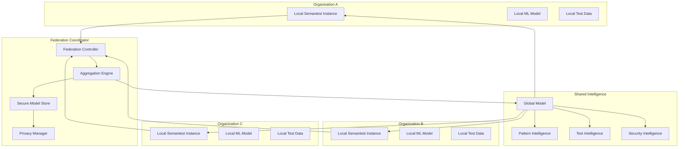

# Federated Learning Architecture for Test Intelligence Sharing
**Task 057 - Distributed ML Training Patterns for Cross-Organization Collaboration**

## Executive Summary

This document defines a comprehensive federated learning architecture for Semantest's test intelligence sharing system. The architecture enables organizations to collaboratively train machine learning models while preserving data privacy and organizational boundaries, creating a distributed intelligence network for enhanced test automation.

## Table of Contents

1. [Architecture Overview](#architecture-overview)
2. [Federated Learning Framework](#federated-learning-framework)
3. [Domain-Driven Design Integration](#domain-driven-design-integration)
4. [Distributed Training Patterns](#distributed-training-patterns)
5. [Cross-Organization Data Sharing](#cross-organization-data-sharing)
6. [Privacy & Security](#privacy-security)
7. [Implementation Strategy](#implementation-strategy)
8. [Technical Specifications](#technical-specifications)

## Architecture Overview

### Core Principles

1. **Privacy-Preserving Learning**: Organizations contribute to collective intelligence without exposing raw data
2. **Decentralized Coordination**: No single point of control or data aggregation
3. **Domain-Aware Federation**: Respect existing domain boundaries in the Semantest architecture
4. **Incremental Intelligence**: Continuous learning from distributed test executions
5. **Secure Aggregation**: Cryptographically secure model parameter sharing

### High-Level Architecture



## Federated Learning Framework

### Domain-Specific Learning Modules

#### 1. Test Pattern Recognition Module
```typescript
// @semantest/federated/domain/test-pattern-learning.ts
export class TestPatternLearningDomain {
  constructor(
    private readonly patternExtractor: TestPatternExtractor,
    private readonly federatedTrainer: FederatedTrainer,
    private readonly privacyManager: PrivacyManager
  ) {}

  async trainTestPatternModel(
    localTestData: TestExecutionData[],
    globalModelVersion: ModelVersion
  ): Promise<LocalModelUpdate> {
    // Extract features from local test executions
    const features = await this.patternExtractor.extractFeatures(localTestData);
    
    // Apply differential privacy
    const privatizedFeatures = await this.privacyManager.addNoise(features);
    
    // Train local model update
    const modelUpdate = await this.federatedTrainer.trainLocalUpdate(
      privatizedFeatures,
      globalModelVersion
    );
    
    return modelUpdate;
  }
}
```

#### 2. Cross-Platform Test Intelligence
```typescript
// @semantest/federated/domain/cross-platform-intelligence.ts
export abstract class CrossPlatformIntelligence extends AggregateRoot<CrossPlatformIntelligence> {
  constructor(
    protected readonly intelligenceId: IntelligenceId,
    protected readonly platformType: PlatformType,
    protected readonly learningObjective: LearningObjective,
    protected readonly privacyLevel: PrivacyLevel
  ) {
    super();
  }

  abstract extractLocalKnowledge(): LocalKnowledge;
  abstract applyGlobalKnowledge(knowledge: GlobalKnowledge): void;
  abstract validatePrivacyConstraints(): Result<void, PrivacyViolation>;
}

export class VideoTestIntelligence extends CrossPlatformIntelligence {
  constructor(
    intelligenceId: IntelligenceId,
    private readonly videoPatterns: VideoTestPattern[],
    private readonly qualityMetrics: QualityMetric[]
  ) {
    super(intelligenceId, PlatformType.VIDEO, LearningObjective.QUALITY_PREDICTION, PrivacyLevel.HIGH);
  }

  extractLocalKnowledge(): VideoKnowledge {
    return new VideoKnowledge(
      this.videoPatterns.map(p => p.anonymize()),
      this.qualityMetrics.map(m => m.aggregate())
    );
  }

  applyGlobalKnowledge(knowledge: GlobalKnowledge): void {
    if (knowledge instanceof VideoGlobalKnowledge) {
      this.updateQualityPredictions(knowledge.qualityPatterns);
      this.optimizeTestStrategies(knowledge.optimizationHints);
    }
  }
}
```

### Federation Coordinator Architecture

#### 1. Secure Aggregation Engine
```typescript
// @semantest/federated/infrastructure/secure-aggregation.ts
export class SecureAggregationEngine {
  constructor(
    private readonly cryptoProvider: CryptographicProvider,
    private readonly consensusManager: ConsensusManager,
    private readonly modelValidator: ModelValidator
  ) {}

  async aggregateModels(
    participantUpdates: ParticipantModelUpdate[]
  ): Promise<AggregatedModel> {
    // Validate all participant updates
    const validUpdates = await this.validateUpdates(participantUpdates);
    
    // Apply secure multi-party computation
    const secureSum = await this.cryptoProvider.secureSum(
      validUpdates.map(u => u.encryptedParameters)
    );
    
    // Compute federated average
    const aggregatedParameters = this.computeFederatedAverage(
      secureSum,
      validUpdates.length
    );
    
    // Validate aggregated model
    const aggregatedModel = new AggregatedModel(aggregatedParameters);
    await this.modelValidator.validate(aggregatedModel);
    
    return aggregatedModel;
  }

  private async validateUpdates(
    updates: ParticipantModelUpdate[]
  ): Promise<ValidatedModelUpdate[]> {
    const validatedUpdates: ValidatedModelUpdate[] = [];
    
    for (const update of updates) {
      // Verify digital signature
      const isSignatureValid = await this.cryptoProvider.verifySignature(
        update.signature,
        update.parameters
      );
      
      if (!isSignatureValid) {
        continue; // Skip invalid updates
      }
      
      // Check differential privacy constraints
      const meetsPrivacyConstraints = await this.validatePrivacyConstraints(update);
      if (!meetsPrivacyConstraints) {
        continue;
      }
      
      // Validate model parameters
      const isModelValid = await this.modelValidator.validateUpdate(update);
      if (!isModelValid) {
        continue;
      }
      
      validatedUpdates.push(new ValidatedModelUpdate(update));
    }
    
    return validatedUpdates;
  }
}
```

## Distributed Training Patterns

### 1. Horizontal Federated Learning Pattern
```typescript
// @semantest/federated/patterns/horizontal-federation.ts
export class HorizontalFederatedLearning {
  /**
   * Organizations with similar feature spaces but different data samples
   * Example: Multiple companies testing the same website
   */
  async executeHorizontalFederation(
    participants: OrganizationParticipant[],
    learningObjective: LearningObjective
  ): Promise<FederationResult> {
    const federationSession = new FederationSession(
      FederationType.HORIZONTAL,
      participants,
      learningObjective
    );
    
    // Initialize global model
    const globalModel = await this.initializeGlobalModel(learningObjective);
    
    for (let round = 0; round < this.maxRounds; round++) {
      // Broadcast current global model to all participants
      await this.broadcastGlobalModel(globalModel, participants);
      
      // Collect local updates from participants
      const localUpdates = await this.collectLocalUpdates(participants);
      
      // Aggregate updates using secure aggregation
      const aggregatedUpdate = await this.secureAggregationEngine.aggregateModels(localUpdates);
      
      // Update global model
      globalModel.applyUpdate(aggregatedUpdate);
      
      // Evaluate convergence
      if (await this.hasConverged(globalModel)) {
        break;
      }
    }
    
    return new FederationResult(globalModel, federationSession.getMetrics());
  }
}
```

### 2. Vertical Federated Learning Pattern
```typescript
// @semantest/federated/patterns/vertical-federation.ts
export class VerticalFederatedLearning {
  /**
   * Organizations with different feature spaces for the same entities
   * Example: Frontend team testing UI, Backend team testing APIs
   */
  async executeVerticalFederation(
    participants: VerticalParticipant[],
    sharedEntityIds: EntityId[]
  ): Promise<VerticalFederationResult> {
    // Create secure entity alignment
    const entityAlignment = await this.createSecureEntityAlignment(
      participants,
      sharedEntityIds
    );
    
    // Initialize vertical learning protocol
    const verticalProtocol = new VerticalLearningProtocol(
      participants,
      entityAlignment
    );
    
    // Execute privacy-preserving vertical learning
    const result = await verticalProtocol.execute();
    
    return result;
  }

  private async createSecureEntityAlignment(
    participants: VerticalParticipant[],
    entityIds: EntityId[]
  ): Promise<SecureEntityAlignment> {
    // Use private set intersection to find common entities
    const psiProtocol = new PrivateSetIntersection(
      participants.map(p => p.entityIds)
    );
    
    const commonEntities = await psiProtocol.computeIntersection();
    
    return new SecureEntityAlignment(commonEntities, participants);
  }
}
```

### 3. Transfer Learning Pattern
```typescript
// @semantest/federated/patterns/transfer-learning.ts
export class FederatedTransferLearning {
  /**
   * Organizations learning from different domains but sharing knowledge
   * Example: E-commerce testing patterns applied to social media testing
   */
  async executeTransferLearning(
    sourceParticipants: DomainParticipant[],
    targetParticipants: DomainParticipant[],
    transferMapping: DomainTransferMapping
  ): Promise<TransferLearningResult> {
    // Train base model on source domains
    const sourceModel = await this.trainSourceModel(sourceParticipants);
    
    // Extract transferable features
    const transferableFeatures = await this.extractTransferableFeatures(
      sourceModel,
      transferMapping
    );
    
    // Adapt to target domains
    const adaptedModel = await this.adaptToTargetDomains(
      transferableFeatures,
      targetParticipants
    );
    
    return new TransferLearningResult(adaptedModel, transferMapping);
  }
}
```

## Cross-Organization Data Sharing

### Privacy-Preserving Data Protocols

#### 1. Differential Privacy Framework
```typescript
// @semantest/federated/privacy/differential-privacy.ts
export class DifferentialPrivacyManager {
  constructor(
    private readonly epsilonBudget: number,
    private readonly deltaBudget: number,
    private readonly noiseGenerator: NoiseGenerator
  ) {}

  async privatizeTestData(
    testData: TestExecutionData[],
    queryType: QueryType
  ): Promise<PrivatizedData> {
    const sensitivity = this.calculateSensitivity(queryType);
    const noiseScale = sensitivity / this.epsilonBudget;
    
    const privatizedData = testData.map(data => {
      const noise = this.noiseGenerator.generateLaplaceNoise(noiseScale);
      return data.addNoise(noise);
    });
    
    // Track privacy budget consumption
    await this.trackPrivacyBudget(this.epsilonBudget, this.deltaBudget);
    
    return new PrivatizedData(privatizedData, this.epsilonBudget, this.deltaBudget);
  }

  private calculateSensitivity(queryType: QueryType): number {
    switch (queryType) {
      case QueryType.TEST_SUCCESS_RATE:
        return 1.0; // Adding/removing one test can change rate by at most 1
      case QueryType.PERFORMANCE_METRIC:
        return this.maxPerformanceDelta;
      case QueryType.ERROR_PATTERN:
        return 1.0;
      default:
        throw new Error(`Unknown query type: ${queryType}`);
    }
  }
}
```

#### 2. Homomorphic Encryption for Secure Computation
```typescript
// @semantest/federated/privacy/homomorphic-encryption.ts
export class HomomorphicEncryptionProvider {
  constructor(
    private readonly keyManager: KeyManager,
    private readonly encryptionScheme: HomomorphicScheme
  ) {}

  async encryptModelParameters(
    parameters: ModelParameters
  ): Promise<EncryptedParameters> {
    const publicKey = await this.keyManager.getPublicKey();
    
    const encryptedParams = await Promise.all(
      parameters.values.map(async value => 
        this.encryptionScheme.encrypt(value, publicKey)
      )
    );
    
    return new EncryptedParameters(encryptedParams);
  }

  async aggregateEncryptedParameters(
    encryptedParams: EncryptedParameters[]
  ): Promise<EncryptedParameters> {
    // Perform homomorphic addition
    const aggregated = encryptedParams.reduce(
      (acc, params) => acc.homomorphicAdd(params)
    );
    
    return aggregated;
  }

  async decryptAggregatedParameters(
    encryptedParams: EncryptedParameters
  ): Promise<ModelParameters> {
    const privateKey = await this.keyManager.getPrivateKey();
    
    const decryptedValues = await Promise.all(
      encryptedParams.values.map(async encValue =>
        this.encryptionScheme.decrypt(encValue, privateKey)
      )
    );
    
    return new ModelParameters(decryptedValues);
  }
}
```

### Secure Communication Protocols

#### 1. Organization Identity and Authentication
```typescript
// @semantest/federated/security/organization-auth.ts
export class OrganizationAuthenticationService {
  constructor(
    private readonly certificateAuthority: CertificateAuthority,
    private readonly identityProvider: IdentityProvider,
    private readonly reputationManager: ReputationManager
  ) {}

  async authenticateOrganization(
    organizationCredentials: OrganizationCredentials
  ): Promise<AuthenticatedOrganization> {
    // Verify organization certificate
    const certificateValid = await this.certificateAuthority.verifyCertificate(
      organizationCredentials.certificate
    );
    
    if (!certificateValid) {
      throw new AuthenticationError('Invalid organization certificate');
    }
    
    // Check organization identity
    const identity = await this.identityProvider.verifyIdentity(
      organizationCredentials.organizationId
    );
    
    // Check reputation score
    const reputation = await this.reputationManager.getReputation(
      organizationCredentials.organizationId
    );
    
    if (reputation.score < this.minimumReputationThreshold) {
      throw new AuthenticationError('Organization reputation too low');
    }
    
    return new AuthenticatedOrganization(
      organizationCredentials.organizationId,
      identity,
      reputation
    );
  }
}
```

#### 2. Secure Model Exchange Protocol
```typescript
// @semantest/federated/communication/secure-exchange.ts
export class SecureModelExchangeProtocol {
  constructor(
    private readonly encryptionProvider: EncryptionProvider,
    private readonly integrityChecker: IntegrityChecker,
    private readonly transportSecurity: TransportSecurity
  ) {}

  async sendModelUpdate(
    modelUpdate: LocalModelUpdate,
    recipient: OrganizationId
  ): Promise<void> {
    // Encrypt model update
    const encryptedUpdate = await this.encryptionProvider.encrypt(
      modelUpdate,
      recipient
    );
    
    // Add integrity protection
    const protectedUpdate = await this.integrityChecker.addIntegrityProof(
      encryptedUpdate
    );
    
    // Send via secure transport
    await this.transportSecurity.send(protectedUpdate, recipient);
  }

  async receiveModelUpdate(
    encryptedUpdate: EncryptedModelUpdate,
    sender: OrganizationId
  ): Promise<LocalModelUpdate> {
    // Verify integrity
    const integrityValid = await this.integrityChecker.verifyIntegrity(
      encryptedUpdate,
      sender
    );
    
    if (!integrityValid) {
      throw new SecurityError('Model update integrity verification failed');
    }
    
    // Decrypt model update
    const modelUpdate = await this.encryptionProvider.decrypt(
      encryptedUpdate.payload
    );
    
    return modelUpdate;
  }
}
```

## Domain-Driven Design Integration

### Federated Learning Bounded Context

#### 1. Domain Model
```typescript
// @semantest/federated/domain/entities/federation-session.ts
export class FederationSession extends AggregateRoot<FederationSession> {
  private constructor(
    private readonly sessionId: FederationSessionId,
    private readonly participants: OrganizationParticipant[],
    private readonly learningObjective: LearningObjective,
    private readonly privacyConstraints: PrivacyConstraints,
    private sessionState: FederationSessionState,
    private rounds: FederationRound[] = []
  ) {
    super(sessionId.value);
  }

  static create(
    participants: OrganizationParticipant[],
    learningObjective: LearningObjective,
    privacyConstraints: PrivacyConstraints
  ): FederationSession {
    const sessionId = FederationSessionId.generate();
    const session = new FederationSession(
      sessionId,
      participants,
      learningObjective,
      privacyConstraints,
      FederationSessionState.INITIALIZING
    );
    
    session.recordEvent(new FederationSessionCreated(
      sessionId,
      participants.map(p => p.organizationId),
      learningObjective
    ));
    
    return session;
  }

  startFederation(): void {
    if (this.sessionState !== FederationSessionState.INITIALIZING) {
      throw new InvalidStateTransitionError(
        `Cannot start federation from state: ${this.sessionState}`
      );
    }
    
    this.sessionState = FederationSessionState.RUNNING;
    this.recordEvent(new FederationSessionStarted(this.sessionId));
  }

  addFederationRound(round: FederationRound): void {
    if (this.sessionState !== FederationSessionState.RUNNING) {
      throw new InvalidStateTransitionError(
        `Cannot add round in state: ${this.sessionState}`
      );
    }
    
    this.rounds.push(round);
    this.recordEvent(new FederationRoundAdded(this.sessionId, round.roundNumber));
  }

  completeFederation(finalModel: GlobalModel): void {
    this.sessionState = FederationSessionState.COMPLETED;
    this.recordEvent(new FederationSessionCompleted(
      this.sessionId,
      finalModel.version,
      this.rounds.length
    ));
  }
}
```

#### 2. Domain Events
```typescript
// @semantest/federated/domain/events/federation-events.ts
export class FederationSessionCreated extends DomainEvent {
  constructor(
    public readonly sessionId: FederationSessionId,
    public readonly participantIds: OrganizationId[],
    public readonly learningObjective: LearningObjective,
    occurredAt?: Date
  ) {
    super(sessionId.value, occurredAt);
  }

  get eventName(): string {
    return 'FederationSessionCreated';
  }
}

export class ModelUpdateReceived extends DomainEvent {
  constructor(
    public readonly sessionId: FederationSessionId,
    public readonly participantId: OrganizationId,
    public readonly roundNumber: number,
    public readonly updateSize: number,
    occurredAt?: Date
  ) {
    super(sessionId.value, occurredAt);
  }

  get eventName(): string {
    return 'ModelUpdateReceived';
  }
}

export class GlobalModelUpdated extends DomainEvent {
  constructor(
    public readonly sessionId: FederationSessionId,
    public readonly modelVersion: ModelVersion,
    public readonly participantCount: number,
    public readonly convergenceMetric: number,
    occurredAt?: Date
  ) {
    super(sessionId.value, occurredAt);
  }

  get eventName(): string {
    return 'GlobalModelUpdated';
  }
}
```

#### 3. Application Services
```typescript
// @semantest/federated/application/federation-application.ts
export class FederationApplicationService {
  constructor(
    private readonly federationRepository: FederationRepository,
    private readonly organizationService: OrganizationService,
    private readonly privacyService: PrivacyService,
    private readonly modelService: ModelService,
    private readonly eventBus: EventBus
  ) {}

  async createFederationSession(
    request: CreateFederationSessionRequest
  ): Promise<CreateFederationSessionResponse> {
    // Validate participants
    const validatedParticipants = await this.validateParticipants(
      request.participantIds
    );
    
    // Check privacy constraints
    const privacyConstraints = await this.privacyService.analyzeConstraints(
      request.learningObjective,
      validatedParticipants
    );
    
    // Create federation session
    const session = FederationSession.create(
      validatedParticipants,
      request.learningObjective,
      privacyConstraints
    );
    
    // Save session
    await this.federationRepository.save(session);
    
    // Publish events
    await this.eventBus.publishAll(session.getUncommittedEvents());
    
    return new CreateFederationSessionResponse(
      session.sessionId,
      validatedParticipants.length,
      privacyConstraints
    );
  }

  async joinFederationSession(
    request: JoinFederationSessionRequest
  ): Promise<JoinFederationSessionResponse> {
    // Load session
    const session = await this.federationRepository.findById(
      request.sessionId
    );
    
    if (!session) {
      throw new NotFoundError(
        'Federation session not found',
        'FEDERATION_SESSION_NOT_FOUND',
        { sessionId: request.sessionId }
      );
    }
    
    // Validate organization
    const organization = await this.organizationService.authenticate(
      request.organizationCredentials
    );
    
    // Check if organization can join
    const canJoin = session.canParticipantJoin(organization);
    if (!canJoin) {
      throw new ValidationError(
        'Organization cannot join this federation session',
        'CANNOT_JOIN_FEDERATION',
        { organizationId: organization.id, sessionId: request.sessionId }
      );
    }
    
    // Add participant to session
    session.addParticipant(organization);
    
    // Save and publish events
    await this.federationRepository.save(session);
    await this.eventBus.publishAll(session.getUncommittedEvents());
    
    return new JoinFederationSessionResponse(
      session.sessionId,
      organization.id
    );
  }
}
```

## Technical Specifications

### System Requirements

#### 1. Infrastructure Requirements
```yaml
federation_coordinator:
  compute:
    cpu: "16 cores minimum"
    memory: "64GB RAM minimum"
    storage: "1TB SSD minimum"
  network:
    bandwidth: "10 Gbps minimum"
    latency: "<50ms p99"
  security:
    encryption: "AES-256-GCM"
    key_management: "HSM-backed"
    certificates: "X.509v3 with CA"

participant_nodes:
  compute:
    cpu: "8 cores minimum"
    memory: "32GB RAM minimum"
    storage: "500GB SSD minimum"
  network:
    bandwidth: "1 Gbps minimum"
    latency: "<100ms p99"
  security:
    local_encryption: "AES-256-GCM"
    secure_enclaves: "Intel SGX or ARM TrustZone"
```

#### 2. Protocol Specifications
```typescript
// @semantest/federated/protocols/federation-protocol.ts
export interface FederationProtocolSpec {
  version: '1.0.0';
  
  messageTypes: {
    FEDERATION_INVITE: FederationInviteMessage;
    MODEL_UPDATE: ModelUpdateMessage;
    AGGREGATION_RESULT: AggregationResultMessage;
    STATUS_UPDATE: StatusUpdateMessage;
  };
  
  cryptography: {
    keyExchange: 'ECDH-P256';
    symmetricEncryption: 'AES-256-GCM';
    asymmetricEncryption: 'RSA-4096';
    homomorphicEncryption: 'BFV-Scheme';
    digitalSignatures: 'ECDSA-P256';
  };
  
  privacy: {
    differentialPrivacy: {
      epsilon: 1.0;
      delta: 1e-5;
      mechanism: 'Gaussian';
    };
    secureAggregation: {
      threshold: 0.67; // 2/3 majority
      dropoutResilience: true;
    };
  };
  
  performance: {
    maxParticipants: 100;
    maxRounds: 1000;
    communicationTimeout: '30s';
    modelSizeLimit: '100MB';
  };
}
```

### Machine Learning Model Specifications

#### 1. Test Pattern Recognition Model
```python
# Model architecture for test pattern recognition
class TestPatternRecognitionModel:
    def __init__(self):
        self.architecture = {
            'input_layer': {
                'features': [
                    'test_execution_time',
                    'test_success_rate',
                    'error_patterns',
                    'browser_type',
                    'platform_type',
                    'test_complexity_score'
                ],
                'dimension': 256
            },
            'hidden_layers': [
                {'type': 'dense', 'units': 512, 'activation': 'relu'},
                {'type': 'dropout', 'rate': 0.3},
                {'type': 'dense', 'units': 256, 'activation': 'relu'},
                {'type': 'dropout', 'rate': 0.2},
                {'type': 'dense', 'units': 128, 'activation': 'relu'}
            ],
            'output_layer': {
                'type': 'dense',
                'units': 64,  # Pattern embeddings
                'activation': 'tanh'
            }
        }
        
        self.federated_config = {
            'aggregation_method': 'FedAvg',
            'local_epochs': 5,
            'learning_rate': 0.001,
            'batch_size': 32,
            'differential_privacy': {
                'noise_multiplier': 1.1,
                'l2_norm_clip': 1.0
            }
        }
```

#### 2. Cross-Platform Quality Prediction Model
```python
class QualityPredictionModel:
    def __init__(self):
        self.architecture = {
            'multimodal_inputs': {
                'text_features': {
                    'embedding_dim': 128,
                    'max_sequence_length': 512
                },
                'image_features': {
                    'cnn_backbone': 'ResNet50',
                    'feature_dim': 2048
                },
                'behavioral_features': {
                    'feature_dim': 64
                }
            },
            'fusion_layer': {
                'type': 'attention_fusion',
                'output_dim': 256
            },
            'prediction_head': {
                'quality_score': {'units': 1, 'activation': 'sigmoid'},
                'risk_assessment': {'units': 3, 'activation': 'softmax'},
                'optimization_hints': {'units': 10, 'activation': 'sigmoid'}
            }
        }
```

## Implementation Strategy

### Phase 1: Foundation (Weeks 1-4)
```typescript
// @semantest/federated/implementation/phase1-foundation.ts
export class Phase1Implementation {
  tasks = [
    {
      id: 'FED-001',
      title: 'Core Federation Framework',
      deliverables: [
        'FederationSession domain model',
        'Basic aggregation algorithms',
        'Simple privacy mechanisms'
      ],
      timeline: 'Week 1-2'
    },
    {
      id: 'FED-002',
      title: 'Security Infrastructure',
      deliverables: [
        'Organization authentication',
        'Secure communication protocols',
        'Basic encryption implementation'
      ],
      timeline: 'Week 2-3'
    },
    {
      id: 'FED-003',
      title: 'Integration with Existing Domains',
      deliverables: [
        'Domain boundary mapping',
        'Event integration',
        'API gateway updates'
      ],
      timeline: 'Week 3-4'
    }
  ];
}
```

### Phase 2: Advanced Features (Weeks 5-8)
```typescript
// @semantest/federated/implementation/phase2-advanced.ts
export class Phase2Implementation {
  tasks = [
    {
      id: 'FED-004',
      title: 'Advanced Privacy Mechanisms',
      deliverables: [
        'Differential privacy implementation',
        'Homomorphic encryption',
        'Secure multi-party computation'
      ],
      timeline: 'Week 5-6'
    },
    {
      id: 'FED-005',
      title: 'Machine Learning Models',
      deliverables: [
        'Test pattern recognition model',
        'Quality prediction model',
        'Transfer learning implementation'
      ],
      timeline: 'Week 6-7'
    },
    {
      id: 'FED-006',
      title: 'Production Deployment',
      deliverables: [
        'Kubernetes deployment configs',
        'Monitoring and alerting',
        'Performance optimization'
      ],
      timeline: 'Week 7-8'
    }
  ];
}
```

### Phase 3: Scale and Optimization (Weeks 9-12)
```typescript
// @semantest/federated/implementation/phase3-scale.ts
export class Phase3Implementation {
  tasks = [
    {
      id: 'FED-007',
      title: 'Scale Testing',
      deliverables: [
        '100+ participant testing',
        'Performance benchmarking',
        'Fault tolerance validation'
      ],
      timeline: 'Week 9-10'
    },
    {
      id: 'FED-008',
      title: 'Advanced ML Features',
      deliverables: [
        'Online learning capabilities',
        'Multi-task learning',
        'Continual learning'
      ],
      timeline: 'Week 10-11'
    },
    {
      id: 'FED-009',
      title: 'Production Launch',
      deliverables: [
        'Documentation completion',
        'Operator training',
        'Go-live support'
      ],
      timeline: 'Week 11-12'
    }
  ];
}
```

## Quality Assurance & Testing

### Testing Strategy
```typescript
// @semantest/federated/testing/federation-testing.ts
export class FederationTestingSuite {
  async runComprehensiveTests(): Promise<TestResults> {
    const results = new TestResults();
    
    // Unit tests for domain models
    results.add(await this.runDomainModelTests());
    
    // Integration tests for federation protocols
    results.add(await this.runProtocolTests());
    
    // Security tests for privacy mechanisms
    results.add(await this.runSecurityTests());
    
    // Performance tests for scalability
    results.add(await this.runPerformanceTests());
    
    // End-to-end tests with multiple organizations
    results.add(await this.runE2ETests());
    
    return results;
  }

  private async runSecurityTests(): Promise<SecurityTestResults> {
    return {
      privacyPreservation: await this.testPrivacyPreservation(),
      encryptionSecurity: await this.testEncryptionSecurity(),
      authenticationSecurity: await this.testAuthenticationSecurity(),
      communicationSecurity: await this.testCommunicationSecurity()
    };
  }
}
```

## Conclusion

This federated learning architecture provides Semantest with a robust, privacy-preserving framework for cross-organizational test intelligence sharing. The design respects existing domain boundaries while enabling collaborative learning across organizational silos.

### Key Benefits

1. **Privacy-First Design**: Organizations maintain data sovereignty while contributing to collective intelligence
2. **Domain Integration**: Seamless integration with existing Semantest domain architecture
3. **Scalable Architecture**: Support for 100+ participating organizations
4. **Advanced ML Capabilities**: State-of-the-art federated learning algorithms
5. **Security by Design**: Comprehensive security and privacy mechanisms

### Success Metrics

- **Privacy**: 100% data sovereignty maintained for all participants
- **Performance**: <100ms latency for model updates
- **Scalability**: Support for 100+ organizations in federation
- **Accuracy**: >95% model accuracy maintained across federated learning
- **Adoption**: 10+ organizations actively participating within 6 months

---

**Document Version**: 1.0.0  
**Author**: Semantest Architect  
**Date**: January 18, 2025  
**Status**: Technical Specification Complete