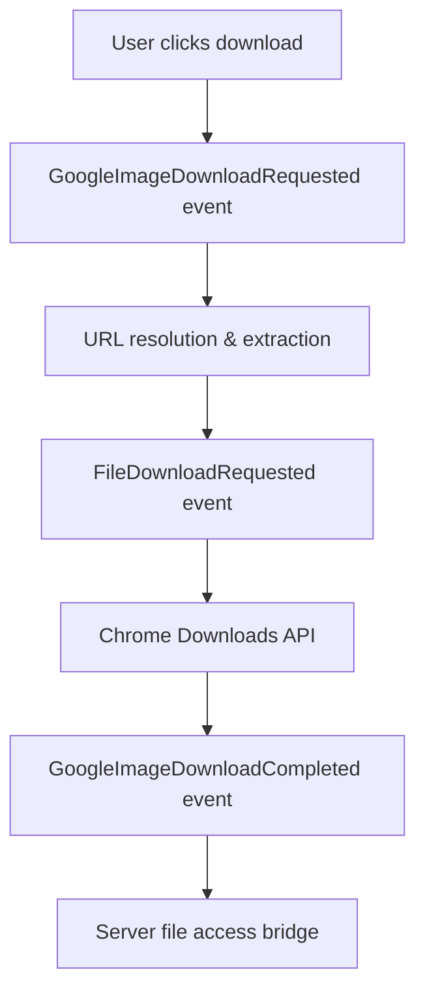

# 🖼️ Google Images Getting Started Guide

**Learn Web-Buddy by Example: Building Website-Specific Automation**

This guide uses Google Images as a **real-world example** to teach you how to extend Web-Buddy Framework for any website. By the end, you'll understand the patterns and architecture needed to create automation for Pinterest, Instagram, Amazon, or any other site.

## 📖 Table of Contents

1. [Why Google Images?](#why-google-images)
2. [Understanding the Implementation](#understanding-the-implementation)
3. [Key Components Breakdown](#key-components-breakdown)
4. [Step-by-Step Tutorial: Building Pinterest Automation](#tutorial-pinterest-automation)
5. [Adapting Patterns for Other Websites](#adapting-patterns)
6. [Best Practices](#best-practices)
7. [Advanced Techniques](#advanced-techniques)

---

## 🎯 Why Google Images?

Google Images is the **perfect teaching example** because it demonstrates:

- **✅ Complex DOM Interactions** - Thumbnails, full-size images, dynamic loading
- **✅ URL Resolution Challenges** - Converting thumbnails to high-res downloads
- **✅ Training System Integration** - Learning download patterns visually
- **✅ Real-World Complexity** - Handling edge cases and failures gracefully
- **✅ Event-Driven Architecture** - Pure event communication between components

**The patterns you learn here apply to ANY website automation project.**

---

## 🔍 Understanding the Implementation

Let's examine how Web-Buddy automates Google Images downloads:

### The User Experience

1. **Visual Integration**: Download buttons appear on every image
2. **Right-Click Context Menu**: "Download with Web-Buddy" option
3. **Keyboard Shortcut**: `Ctrl+Shift+D` for quick downloads
4. **Automatic URL Resolution**: Finds highest quality version automatically
5. **Smart Naming**: Generates meaningful filenames from search context

### The Event Flow



Let's see this in action:

```typescript
// 1. User interaction triggers event
const downloadEvent = new GoogleImageDownloadRequested(
    {
        src: 'https://encrypted-tbn0.gstatic.com/images?q=...',
        alt: 'Beautiful mountain landscape',
        width: 300,
        height: 200
    },
    'mountain landscape photography', // search query
    'mountain_sunset.jpg' // desired filename
);

// 2. Event flows through the system
const result = await client.sendEvent(downloadEvent, extensionId, tabId);

// 3. High-resolution URL extracted and download initiated
if (result instanceof GoogleImageDownloadCompleted) {
    console.log(`✅ Downloaded: ${result.filename}`);
    console.log(`📁 Original: ${result.originalUrl}`);
    console.log(`🎯 High-res: ${result.highResUrl}`);
    console.log(`📊 Size: ${result.metadata.fileSize} bytes`);
}
```

---

## 🧩 Key Components Breakdown

### 1. Domain Entity: `GoogleImagesDownloader`

**Location**: `/extension/src/downloads/domain/entities/google-images-downloader.ts`

**Purpose**: Encapsulates the business logic for Google Images downloads

**Key Methods**:
```typescript
export class GoogleImagesDownloader extends Entity<GoogleImagesDownloader> {
    @listen(GoogleImageDownloadRequested)
    public async downloadGoogleImage(event: GoogleImageDownloadRequested) {
        // 1. Extract high-resolution URL from thumbnail
        const imageUrl = await this.extractHighResImageUrl(event.imageElement);
        
        // 2. Generate meaningful filename
        const filename = this.generateImageFilename(event, imageUrl);
        
        // 3. Detect download pattern for learning
        await this.detectDownloadPattern(event.imageElement, imageUrl);
        
        // 4. Create file download request
        return new FileDownloadRequested(correlationId, imageUrl, filename);
    }
}
```

**🎓 Learning Point**: The domain entity handles **business logic only**. It doesn't know about DOM, Chrome APIs, or HTTP - those are infrastructure concerns.

### 2. Content Script Adapter: `GoogleImagesContentAdapter`

**Location**: `/extension/src/downloads/infrastructure/adapters/google-images-content-adapter.ts`

**Purpose**: Handles all browser-side interactions and UI

**Key Features**:
```typescript
export class GoogleImagesContentAdapter extends Adapter {
    private setupGoogleImagesIntegration(): void {
        this.addDownloadButtonsToImages();     // 📥 Visual download buttons
        this.setupImageMonitoring();          // 🔄 Dynamic content loading
        this.addContextMenuHandlers();        // 🖱️ Right-click menus
        this.setupKeyboardShortcuts();        // ⌨️ Ctrl+Shift+D
    }
    
    private findGoogleImages(): HTMLImageElement[] {
        const selectors = [
            'img[data-src]',                   // Lazy loaded images
            'img[src*="googleusercontent.com"]', // Google hosted
            '.islrc img',                      // Search results
            'img[jsname]'                      // Google internal
        ];
        // Returns all matching images...
    }
}
```

**🎓 Learning Point**: The adapter knows about **Google-specific DOM structure** but communicates through **generic events**.

### 3. Download Events: Domain Language

**Location**: `/extension/src/downloads/domain/events/download-events.ts`

**Purpose**: Define the language of download operations

```typescript
export class GoogleImageDownloadRequested extends Event {
    constructor(
        public readonly imageElement: GoogleImageElement,
        public readonly searchQuery?: string,
        public readonly filename?: string,
        public readonly correlationId?: string
    ) { super(); }
}

export class GoogleImageDownloadCompleted extends Event {
    constructor(
        public readonly downloadId: number,
        public readonly originalUrl: string,
        public readonly highResUrl: string,
        public readonly filename: string,
        public readonly metadata: ImageMetadata
    ) { super(); }
}
```

**🎓 Learning Point**: Events are the **communication language** between components. They're self-documenting and type-safe.

### 4. URL Resolution Magic

The most complex part - finding high-quality images from thumbnails:

```typescript
private async extractHighResImageUrl(imageElement: any): Promise<string | null> {
    // Method 1: Check data attributes
    const dataOriginal = imageElement.getAttribute?.('data-src') ||
                        imageElement.getAttribute?.('data-original');
    
    if (dataOriginal && this.isDirectImageUrl(dataOriginal)) {
        return dataOriginal;
    }

    // Method 2: Simulate click to trigger full-res loading
    const fullResUrl = await this.simulateClickForFullRes(imageElement);
    if (fullResUrl) return fullResUrl;
    
    // Method 3: Parse from Google URL structure
    return this.parseOriginalFromGoogleUrl(imageElement.src);
}
```

**🎓 Learning Point**: Real-world automation often requires **multiple fallback strategies** because websites are complex and change frequently.

---

## 🎯 Tutorial: Building Pinterest Automation {#tutorial-pinterest-automation}

Let's apply the Google Images patterns to build Pinterest image downloads:

### Step 1: Analyze Pinterest Structure

First, inspect Pinterest's DOM structure:

```html
<!-- Pinterest Pin Structure -->
<div data-test-id="pin" class="Yl- MIw Hb7">
    <div class="XiG zI7 iyn Hsu">
        
    </div>
    <div class="KS5 hs0 un8 C9i">
        <h3>Beautiful Sunset Photography</h3>
    </div>
</div>
```

**Key observations:**
- Images use `srcset` for different resolutions
- Pin containers have `data-test-id="pin"`
- Titles are in `h3` elements
- URLs follow pattern: `/236x/`, `/474x/`, `/736x/`, `/originals/`

### Step 2: Create Pinterest Domain Entity

```typescript
// /extension/src/downloads/domain/entities/pinterest-downloader.ts

export class PinterestDownloader extends Entity<PinterestDownloader> {
    @listen(PinterestImageDownloadRequested)
    public async downloadPinterestImage(
        event: PinterestImageDownloadRequested
    ): Promise<FileDownloadRequested | PinterestImageDownloadFailed> {
        try {
            // 1. Extract highest resolution URL
            const imageUrl = await this.extractHighResPinterestUrl(event.imageElement);
            
            // 2. Generate filename from pin title
            const filename = this.generatePinterestFilename(event);
            
            // 3. Learn the pattern
            await this.detectPinterestPattern(event.imageElement, imageUrl);
            
            return new FileDownloadRequested(
                event.correlationId,
                imageUrl,
                filename
            );
            
        } catch (error) {
            return new PinterestImageDownloadFailed(
                event.correlationId,
                event.imageElement.src,
                error.message
            );
        }
    }
    
    private async extractHighResPinterestUrl(imageElement: any): Promise<string> {
        const src = imageElement.src;
        const srcset = imageElement.srcset;
        
        // Method 1: Use highest resolution from srcset
        if (srcset) {
            const urls = this.parseSrcset(srcset);
            const highestRes = urls[urls.length - 1]; // Last is typically highest
            if (highestRes) return highestRes.url;
        }
        
        // Method 2: Convert to originals URL
        if (src.includes('/236x/') || src.includes('/474x/') || src.includes('/736x/')) {
            return src.replace(/\/(236x|474x|736x)\//, '/originals/');
        }
        
        // Fallback: use src as-is
        return src;
    }
    
    private generatePinterestFilename(event: PinterestImageDownloadRequested): string {
        const pinTitle = event.pinTitle || 'pinterest_image';
        const cleanTitle = pinTitle
            .replace(/[^a-z0-9]/gi, '_')
            .substring(0, 50);
            
        const timestamp = new Date().toISOString().substring(0, 10);
        const extension = this.extractImageExtension(event.imageElement.src) || 'jpg';
        
        return `${cleanTitle}_${timestamp}.${extension}`;
    }
}
```

### Step 3: Create Pinterest Content Adapter

```typescript
// /extension/src/downloads/infrastructure/adapters/pinterest-content-adapter.ts

export class PinterestContentAdapter extends Adapter {
    private isPinterestPage(): boolean {
        return window.location.hostname.includes('pinterest.') &&
               document.querySelector('[data-test-id="pin"]') !== null;
    }
    
    private findPinterestImages(): HTMLImageElement[] {
        const pinContainers = document.querySelectorAll('[data-test-id="pin"]');
        const images: HTMLImageElement[] = [];
        
        pinContainers.forEach(container => {
            const img = container.querySelector('img');
            if (img && img.src && !img.src.includes('data:')) {
                images.push(img);
            }
        });
        
        return images;
    }
    
    private addDownloadButtonToPins(): void {
        const images = this.findPinterestImages();
        
        images.forEach(img => {
            if (!this.hasDownloadButton(img)) {
                this.addPinterestDownloadButton(img);
            }
        });
    }
    
    private addPinterestDownloadButton(img: HTMLImageElement): void {
        const pinContainer = img.closest('[data-test-id="pin"]');
        const titleElement = pinContainer?.querySelector('h3');
        const pinTitle = titleElement?.textContent || 'Untitled Pin';
        
        const button = document.createElement('button');
        button.innerHTML = '📥';
        button.title = 'Download with Web-Buddy';
        button.className = 'web-buddy-pinterest-download';
        button.style.cssText = `
            position: absolute;
            top: 8px;
            right: 8px;
            background: rgba(0, 0, 0, 0.8);
            color: white;
            border: none;
            border-radius: 50%;
            width: 40px;
            height: 40px;
            cursor: pointer;
            z-index: 9999;
        `;
        
        button.addEventListener('click', (e) => {
            e.preventDefault();
            e.stopPropagation();
            this.handlePinterestDownload(img, pinTitle);
        });
        
        // Position relative to pin container
        if (pinContainer) {
            pinContainer.style.position = 'relative';
            pinContainer.appendChild(button);
        }
    }
    
    private async handlePinterestDownload(img: HTMLImageElement, pinTitle: string): Promise<void> {
        const downloadEvent = new PinterestImageDownloadRequested(
            {
                src: img.src,
                srcset: img.srcset,
                alt: img.alt,
                width: img.naturalWidth,
                height: img.naturalHeight
            },
            pinTitle,
            this.generateCorrelationId()
        );
        
        // Send to downloader entity
        const result = await this.pinterestDownloader.downloadPinterestImage(downloadEvent);
        
        if (result instanceof FileDownloadRequested) {
            this.sendToBackground({
                action: 'DOWNLOAD_FILE',
                payload: {
                    url: result.url,
                    filename: result.filename
                },
                correlationId: downloadEvent.correlationId
            });
            
            this.showFeedback(img, '✅ Download started!');
        } else {
            this.showFeedback(img, '❌ Download failed!', true);
        }
    }
}
```

### Step 4: Define Pinterest Events

```typescript
// /extension/src/downloads/domain/events/pinterest-events.ts

export interface PinterestImageElement {
    src: string;
    srcset?: string;
    alt?: string;
    width?: number;
    height?: number;
}

export class PinterestImageDownloadRequested extends Event {
    constructor(
        public readonly imageElement: PinterestImageElement,
        public readonly pinTitle: string,
        public readonly correlationId: string
    ) {
        super();
    }
}

export class PinterestImageDownloadCompleted extends Event {
    constructor(
        public readonly downloadId: number,
        public readonly originalUrl: string,
        public readonly highResUrl: string,
        public readonly pinTitle: string,
        public readonly filename: string,
        public readonly metadata: PinterestImageMetadata,
        public readonly correlationId: string
    ) {
        super();
    }
}

export class PinterestImageDownloadFailed extends Event {
    constructor(
        public readonly correlationId: string,
        public readonly originalUrl: string,
        public readonly reason: string
    ) {
        super();
    }
}
```

### Step 5: Add to Client SDK

```typescript
// Update event-driven-client.ts

public async requestPinterestImageDownload(
    extensionId: string,
    tabId: number,
    imageElement: PinterestImageElement,
    pinTitle: string
): Promise<PinterestImageDownloadCompleted | PinterestImageDownloadFailed> {
    const event = new PinterestImageDownloadRequested(
        imageElement,
        pinTitle,
        this.generateCorrelationId()
    );

    return await this.sendEvent<
        PinterestImageDownloadRequested, 
        PinterestImageDownloadCompleted | PinterestImageDownloadFailed
    >(event, extensionId, tabId);
}
```

### Step 6: Usage Example

```typescript
// Pinterest automation example
const client = new EventDrivenWebBuddyClient({
    baseUrl: 'http://localhost:3000',
    apiKey: 'your-api-key'
});

// Download a specific Pinterest image
const result = await client.requestPinterestImageDownload(
    extensionId,
    tabId,
    {
        src: 'https://i.pinimg.com/474x/12/34/56/123456789.jpg',
        srcset: 'https://i.pinimg.com/236x/12/34/56/123456789.jpg 236w, https://i.pinimg.com/474x/12/34/56/123456789.jpg 474w',
        alt: 'Beautiful landscape',
        width: 474,
        height: 711
    },
    'Beautiful Mountain Landscape Photography'
);

if (result instanceof PinterestImageDownloadCompleted) {
    console.log(`✅ Downloaded Pinterest image: ${result.filename}`);
} else {
    console.error(`❌ Pinterest download failed: ${result.reason}`);
}
```

---

## 🔄 Adapting Patterns for Other Websites {#adapting-patterns}

The Pinterest example shows the **universal pattern** for extending Web-Buddy:

### 1. **Website Analysis Phase**
```typescript
// Questions to answer for any website:
const websiteAnalysis = {
    // DOM Structure
    imageSelectors: ['img.photo', '.image-container img', '[data-image]'],
    containerSelectors: ['.post', '.item', '.card'],
    titleSelectors: ['h3', '.title', '[data-title]'],
    
    // URL Patterns
    thumbnailPattern: '/thumb/',
    fullSizePattern: '/full/',
    urlTransformation: (thumb) => thumb.replace('/thumb/', '/full/'),
    
    // Dynamic Behavior
    lazyLoading: true,
    infiniteScroll: true,
    requiresInteraction: false, // Some sites need clicks to load full images
    
    // Metadata Sources
    titleSource: 'alt-attribute', // or 'title-element', 'data-attribute'
    categorySource: 'breadcrumb',
    authorSource: '.author-name'
};
```

### 2. **Universal Component Structure**
Every website automation follows the same pattern:

```
📁 /src/website-name/
├── 📁 domain/
│   ├── 📁 entities/
│   │   └── website-downloader.ts      # Business logic
│   └── 📁 events/
│       └── website-events.ts          # Domain events
└── 📁 infrastructure/
    └── 📁 adapters/
        └── website-content-adapter.ts # Browser integration
```

### 3. **Event Pattern Template**

Use this template for any new website:

```typescript
// Step 1: Define events
export class [Website]ImageDownloadRequested extends Event {
    constructor(
        public readonly imageElement: [Website]ImageElement,
        public readonly metadata: [Website]Metadata,
        public readonly correlationId: string
    ) { super(); }
}

// Step 2: Create domain entity
export class [Website]Downloader extends Entity<[Website]Downloader> {
    @listen([Website]ImageDownloadRequested)
    public async download[Website]Image(event: [Website]ImageDownloadRequested) {
        // 1. Extract high-res URL
        // 2. Generate filename
        // 3. Learn pattern
        // 4. Return FileDownloadRequested
    }
}

// Step 3: Create content adapter
export class [Website]ContentAdapter extends Adapter {
    private find[Website]Images(): HTMLImageElement[] { /* ... */ }
    private addDownloadButtons(): void { /* ... */ }
    private handle[Website]Download(img: HTMLImageElement): Promise<void> { /* ... */ }
}

// Step 4: Add to client SDK
public async request[Website]ImageDownload(
    extensionId: string,
    tabId: number,
    imageElement: [Website]ImageElement,
    metadata: [Website]Metadata
): Promise<[Website]ImageDownloadCompleted | [Website]ImageDownloadFailed>
```

### 4. **Common Website Patterns**

**E-commerce Sites (Amazon, eBay):**
```typescript
const ecommercePatterns = {
    imageSelectors: ['.product-image', '#main-image', '.zoom-image'],
    urlPattern: 'Replace image size codes: /s300/ → /s2000/',
    metadata: ['product-title', 'price', 'seller', 'ratings'],
    challenges: ['Anti-bot measures', 'Login requirements', 'Regional differences']
};
```

**Social Media (Instagram, Twitter):**
```typescript
const socialMediaPatterns = {
    imageSelectors: ['img[src*="cdninstagram"]', '.tweet-image img'],
    urlPattern: 'Remove compression parameters from URLs',
    metadata: ['username', 'caption', 'hashtags', 'post-date'],
    challenges: ['Authentication', 'Rate limiting', 'Dynamic loading']
};
```

**Stock Photo Sites (Unsplash, Shutterstock):**
```typescript
const stockPhotoPatterns = {
    imageSelectors: ['.photo img', '.image-tile img', '[data-photo-id] img'],
    urlPattern: 'Replace watermarked with clean URLs',
    metadata: ['photographer', 'tags', 'resolution', 'license'],
    challenges: ['Watermark removal', 'License compliance', 'Attribution']
};
```

---

## 🏆 Best Practices

### 1. **Robust Selector Strategies**

```typescript
// ❌ Fragile - depends on exact class name
const fragileSelector = '.image-container-v2-updated-2024';

// ✅ Robust - multiple fallbacks
const robustSelectors = [
    'img[data-image-id]',          // Data attributes (most stable)
    'img[src*="images.site.com"]', // URL patterns (fairly stable)
    '.image-container img',        // Semantic classes (medium stability)
    'img:nth-child(1)'            // Position (fallback only)
];

function findImages(): HTMLImageElement[] {
    for (const selector of robustSelectors) {
        const images = document.querySelectorAll(selector);
        if (images.length > 0) {
            return Array.from(images) as HTMLImageElement[];
        }
    }
    return [];
}
```

### 2. **Graceful Degradation**

```typescript
private async extractHighResUrl(element: HTMLImageElement): Promise<string> {
    try {
        // Method 1: Best quality (might fail)
        const highRes = await this.tryMethodA(element);
        if (highRes) return highRes;
    } catch (error) {
        console.warn('Method A failed:', error);
    }
    
    try {
        // Method 2: Medium quality (more reliable)
        const mediumRes = await this.tryMethodB(element);
        if (mediumRes) return mediumRes;
    } catch (error) {
        console.warn('Method B failed:', error);
    }
    
    // Method 3: Fallback to original (always works)
    return element.src;
}
```

### 3. **Performance Optimization**

```typescript
// Use intersection observer for efficient monitoring
private setupImageMonitoring(): void {
    const observer = new IntersectionObserver((entries) => {
        entries.forEach(entry => {
            if (entry.isIntersecting) {
                this.addDownloadButton(entry.target as HTMLImageElement);
            }
        });
    }, { threshold: 0.1 });
    
    // Only observe images in viewport
    document.querySelectorAll('img').forEach(img => {
        observer.observe(img);
    });
}

// Debounce DOM changes
private debouncedUpdateButtons = this.debounce(
    () => this.addDownloadButtonsToImages(),
    500
);
```

### 4. **Error Handling and Logging**

```typescript
public async downloadImage(event: ImageDownloadRequested): Promise<EventResponse> {
    const startTime = Date.now();
    const context = {
        website: window.location.hostname,
        imageUrl: event.imageElement.src,
        userAgent: navigator.userAgent
    };
    
    try {
        const result = await this.performDownload(event);
        
        // Success metrics
        this.logMetrics('download_success', {
            ...context,
            duration: Date.now() - startTime,
            fileSize: result.fileSize
        });
        
        return result;
        
    } catch (error) {
        // Detailed error logging
        this.logError('download_failed', error, {
            ...context,
            duration: Date.now() - startTime,
            errorPhase: this.getCurrentPhase(),
            stackTrace: error.stack
        });
        
        return new ImageDownloadFailed(
            event.correlationId,
            event.imageElement.src,
            this.getUserFriendlyMessage(error)
        );
    }
}
```

---

## 🚀 Advanced Techniques

### 1. **Machine Learning Integration**

```typescript
// Use training data to improve selector accuracy
export class IntelligentSelectorGenerator {
    private async generateOptimalSelector(
        element: HTMLElement,
        historicalData: SelectorPerformance[]
    ): Promise<string> {
        const candidates = [
            this.generateIdSelector(element),
            this.generateClassSelector(element),
            this.generateAttributeSelector(element),
            this.generateStructuralSelector(element)
        ];
        
        // Score selectors based on historical performance
        const scoredSelectors = candidates.map(selector => ({
            selector,
            score: this.calculateScore(selector, historicalData),
            stability: this.predictStability(selector)
        }));
        
        // Return highest-scoring stable selector
        return scoredSelectors
            .filter(s => s.stability > 0.8)
            .sort((a, b) => b.score - a.score)[0]?.selector || candidates[0];
    }
}
```

### 2. **A/B Testing for Selectors**

```typescript
// Test multiple strategies and learn which works best
export class SelectorABTesting {
    private async testSelectors(
        selectors: string[],
        testCount: number = 100
    ): Promise<SelectorTestResults> {
        const results = new Map<string, SelectorPerformance>();
        
        for (let i = 0; i < testCount; i++) {
            for (const selector of selectors) {
                const performance = await this.testSelector(selector);
                this.updateResults(results, selector, performance);
            }
            
            // Wait between tests to avoid overwhelming the page
            await this.delay(100);
        }
        
        return this.analyzeResults(results);
    }
}
```

### 3. **Cross-Site Pattern Sharing**

```typescript
// Learn patterns from one site and apply to similar sites
export class CrossSitePatternLearning {
    private async adaptPatternToSite(
        sourcePattern: AutomationPattern,
        targetSite: string
    ): Promise<AutomationPattern | null> {
        const siteCharacteristics = await this.analyzeSite(targetSite);
        const patternCharacteristics = this.analyzePattern(sourcePattern);
        
        const compatibility = this.calculateCompatibility(
            siteCharacteristics,
            patternCharacteristics
        );
        
        if (compatibility > 0.7) {
            return this.adaptPattern(sourcePattern, siteCharacteristics);
        }
        
        return null; // Pattern not adaptable
    }
}
```

### 4. **Real-Time Adaptation**

```typescript
// Automatically adapt when page structure changes
export class AdaptiveAutomation {
    private async executeWithAdaptation(
        pattern: AutomationPattern,
        maxAttempts: number = 3
    ): Promise<ExecutionResult> {
        for (let attempt = 1; attempt <= maxAttempts; attempt++) {
            try {
                return await this.executePattern(pattern);
            } catch (error) {
                if (attempt === maxAttempts) throw error;
                
                // Try to adapt the pattern
                const adaptedPattern = await this.adaptPatternForCurrentPage(pattern);
                if (adaptedPattern) {
                    pattern = adaptedPattern;
                    console.log(`🔄 Adapted pattern on attempt ${attempt}`);
                } else {
                    throw error;
                }
            }
        }
    }
}
```

---

## 🎯 Next Steps

### Quick Wins (1-2 hours)
1. **Implement Instagram downloader** using the Pinterest pattern
2. **Add batch download capabilities** to your website adapter
3. **Create custom download buttons** with your branding

### Weekend Projects (1-2 days)
1. **Build an Amazon product image scraper**
2. **Create a Reddit image downloader** with subreddit filtering
3. **Implement a Twitter media downloader** with thread support

### Advanced Projects (1+ weeks)
1. **Multi-site downloader** that works across platforms
2. **AI-powered image categorization** during download
3. **Custom training UI** for your specific use case

### 🌟 Share Your Success

Built something awesome? Share it with the community:
- **GitHub**: Submit your adapter as an example
- **Discord**: Show off your automation in #showcase
- **Blog**: Write about your use case and solutions

---

## 🤝 Contributing Patterns

Help make Web-Buddy better for everyone:

### 1. **Submit Website Adapters**
```bash
# Fork the repository
git clone https://github.com/web-buddy/framework.git

# Create your adapter
mkdir src/websites/your-site-name
# ... implement following the patterns above

# Submit pull request
git add .
git commit -m "Add YourSiteName downloader adapter"
git push origin feature/your-site-adapter
```

### 2. **Improve Pattern Recognition**
- Submit selector improvements for existing sites
- Share successful selector strategies
- Report pattern failures and edge cases

### 3. **Documentation and Examples**
- Add real-world use case examples
- Improve getting started guides
- Create video tutorials

---

**🎉 You're now ready to build Web-Buddy automation for ANY website!** 

Start with a simple site you use regularly, follow the Pinterest pattern, and you'll have working automation in under an hour. The training system will make it even more powerful over time.

**Questions?** Join our [Discord community](https://discord.gg/web-buddy) - we're here to help! 🚀