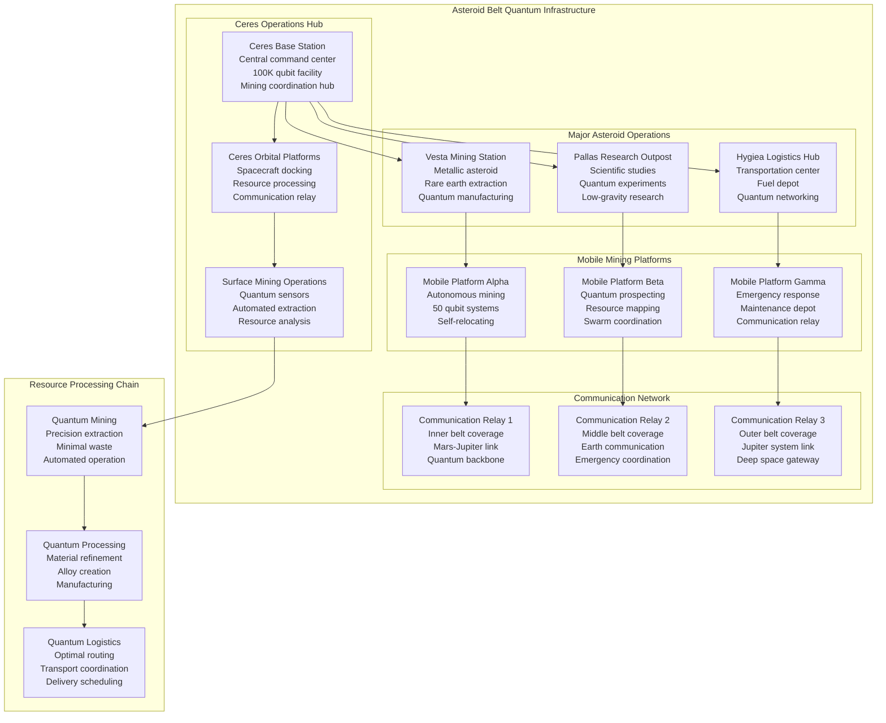

# Intergalactic Quantum Computing Architecture - Cosmic-Scale Enterprise Blueprint

## Executive Summary

This cosmic-scale architecture blueprint extends Fortune 100 quantum computing capabilities beyond Earth, establishing intergalactic quantum operations with orbital data centers, interplanetary infrastructure, and space-based quantum networking. The architecture supports multi-planetary enterprises with quantum-enhanced space operations and interstellar communication capabilities.

**COSMIC SCALE**: Solar system and beyond operations  
**QUANTUM ADVANTAGE**: Space-optimized quantum systems with cosmic radiation hardening  
**INTERPLANETARY REACH**: Mars, Moon, asteroid belt, and outer planet operations  
**SPACE-BASED INFRASTRUCTURE**: Orbital quantum data centers with zero-gravity optimization

## Cosmic Quantum Architecture Overview

### Intergalactic Infrastructure Topology

```mermaid
graph TB
    subgraph "Solar System Quantum Network"
        subgraph "Earth Orbital Zone"
            LEO[Low Earth Orbit<br/>Quantum Data Centers<br/>400-2000 km altitude<br/>100K qubit capacity]
            MEO[Medium Earth Orbit<br/>Navigation & Comm<br/>2000-35,786 km<br/>Quantum GPS network]
            GEO[Geostationary Orbit<br/>Communication Hubs<br/>35,786 km altitude<br/>Global quantum relay]
        end
        
        subgraph "Lunar Infrastructure"
            MOON_SURFACE[Lunar Surface Bases<br/>Shielded quantum facilities<br/>Far-side radio quiet zone<br/>1M qubit capacity]
            MOON_ORBIT[Lunar Orbital Stations<br/>Communication relays<br/>Gateway infrastructure<br/>Earth-Mars transit hub]
            L1_STATION[Earth-Moon L1<br/>Gravitational balance<br/>Deep space gateway<br/>Solar observation hub]
        end
        
        subgraph "Mars System"
            MARS_SURFACE[Mars Surface Colonies<br/>Underground quantum labs<br/>Radiation shielded<br/>500K qubit capacity]
            MARS_ORBIT[Mars Orbital Platforms<br/>Communication satellites<br/>Phobos/Deimos bases<br/>Resource processing]
            MARS_L2[Mars-Sun L2<br/>Deep space monitoring<br/>Interplanetary relay<br/>Solar storm warning]
        end
        
        subgraph "Asteroid Belt Operations"
            CERES[Ceres Base Station<br/>Mining operations center<br/>Resource processing<br/>Quantum logistics hub]
            ASTEROIDS[Asteroid Mining Platforms<br/>Mobile quantum labs<br/>Resource extraction<br/>Automated operations]
            BELT_RELAYS[Communication Relays<br/>Network backbone<br/>Navigation beacons<br/>Emergency response]
        end
        
        subgraph "Outer Solar System"
            JUPITER[Jupiter System<br/>Europa/Ganymede bases<br/>Quantum research labs<br/>Deep space exploration]
            SATURN[Saturn System<br/>Titan operations<br/>Hydrocarbon processing<br/>Ring system studies]
            OUTER_PLANETS[Uranus/Neptune<br/>Deep space outposts<br/>Extreme environment research<br/>Heliopause monitoring]
        end
    end
    
    subgraph "Interstellar Network"
        subgraph "Proxima Centauri System"
            PROXIMA[Proxima Centauri b<br/>Exoplanet research base<br/>Interstellar quantum relay<br/>Multi-generational mission]
        end
        
        subgraph "Alpha Centauri System"
            ALPHA_A[Alpha Centauri A<br/>Binary star system<br/>Stellar dynamics research<br/>Energy harvesting]
            ALPHA_B[Alpha Centauri B<br/>Comparative analysis<br/>Quantum experiments<br/>Gravitational studies]
        end
        
        subgraph "Deep Space Probes"
            VOYAGER_Q[Quantum Voyager Probes<br/>Interstellar messengers<br/>Quantum entanglement<br/>Galactic exploration]
            BREAKTHROUGH[Breakthrough Starshot<br/>Laser-propelled probes<br/>Quantum sensors<br/>Alpha Centauri survey]
        end
    end
    
    LEO --> MEO
    MEO --> GEO
    GEO --> MOON_ORBIT
    MOON_ORBIT --> MOON_SURFACE
    MOON_SURFACE --> L1_STATION
    
    L1_STATION --> MARS_L2
    MARS_L2 --> MARS_ORBIT
    MARS_ORBIT --> MARS_SURFACE
    
    MARS_ORBIT --> CERES
    CERES --> ASTEROIDS
    ASTEROIDS --> BELT_RELAYS
    
    BELT_RELAYS --> JUPITER
    JUPITER --> SATURN
    SATURN --> OUTER_PLANETS
    
    OUTER_PLANETS -.-> PROXIMA
    PROXIMA -.-> ALPHA_A
    ALPHA_A -.-> ALPHA_B
    ALPHA_B -.-> VOYAGER_Q
    VOYAGER_Q -.-> BREAKTHROUGH
```



## Space-Based Quantum Computing Infrastructure

### Orbital Quantum Data Centers

```typescript
interface OrbitalQuantumInfrastructure {
    low_earth_orbit_facilities: {
        orbital_characteristics: {
            altitude_range: "400-2000 km";
            orbital_period: "90-120 minutes";
            coverage_pattern: "Global coverage every 90 minutes";
            radiation_exposure: "Moderate (Van Allen belt avoidance)";
            microgravity_level: "10^-6 g";
        };
        
        quantum_specifications: {
            total_qubit_capacity: 100_000;        // 100K qubits per facility
            coherence_time: "1 hour in space";    // Extended in microgravity
            gate_fidelity: "99.999%";            // Space-optimized systems
            quantum_volume: 10_000_000;          // 10M quantum volume
            error_correction: "Cosmic ray hardened";
        };
        
        infrastructure_details: {
            facility_count: 12;                   // 12 LEO quantum stations
            solar_arrays: "10 MW per facility";   // Space-grade solar power
            thermal_management: "Active cooling radiators";
            radiation_shielding: "Electromagnetic + physical";
            communication: "100 Gbps quantum-safe links";
        };
        
        operational_capabilities: {
            earth_surface_latency: "1-5ms";       // Ultra-low latency to Earth
            global_coverage: "24/7 worldwide";    // Continuous global access
            weather_independence: "100%";         // Above atmospheric interference
            disaster_resilience: "Orbital backup for terrestrial systems";
        };
    };
    
    medium_earth_orbit_constellation: {
        orbital_characteristics: {
            altitude_range: "2,000-35,786 km";
            orbital_period: "2-12 hours";
            coverage_pattern: "Regional persistent coverage";
            radiation_exposure: "High (Van Allen belts)";
            constellation_size: 24;               // 24 satellites
        };
        
        quantum_networking: {
            quantum_key_distribution: "Global QKD backbone";
            entanglement_distribution: "Worldwide quantum internet";
            quantum_repeaters: "Long-distance quantum communication";
            quantum_sensing: "Gravitational wave detection";
        };
        
        navigation_services: {
            quantum_gps: "Sub-centimeter positioning accuracy";
            timing_distribution: "Quantum-enhanced atomic clocks";
            reference_frames: "Inertial navigation for spacecraft";
            relativistic_corrections: "General relativity compensation";
        };
    };
    
    geostationary_quantum_hubs: {
        orbital_characteristics: {
            altitude: "35,786 km";
            orbital_period: "24 hours (Earth synchronous)";
            coverage_pattern: "Fixed Earth hemisphere coverage";
            radiation_exposure: "Very high (outer Van Allen belt)";
            station_count: 3;                     // 3 GEO quantum hubs
        };
        
        communication_capabilities: {
            earth_coverage: "40% of Earth surface per hub";
            latency_to_earth: "240ms round-trip";
            bandwidth_capacity: "1 Tbps per hub";
            quantum_channels: "10,000 simultaneous QKD links";
        };
        
        deep_space_gateway: {
            interplanetary_relay: "Mars-Earth quantum communication";
            deep_space_network: "Communication with outer solar system";
            mission_control: "Spacecraft command and control";
            scientific_data: "Deep space science data relay";
        };
    };
}
```

### Orbital Implementation Architecture

```typescript
export class OrbitalQuantumDataCenter {
    constructor(private config: OrbitalConfig) {
        this.initializeSpaceInfrastructure();
        this.setupQuantumSystems();
        this.configureSpaceOperations();
        this.enableCosmicNetworking();
    }
    
    async initializeSpaceInfrastructure(): Promise<void> {
        // Deploy orbital quantum facilities
        this.orbitalFacilities = await this.deployOrbitalInfrastructure({
            leo_facilities: 12,                // 12 Low Earth Orbit stations
            meo_constellation: 24,             // 24 Medium Earth Orbit satellites
            geo_hubs: 3,                       // 3 Geostationary hubs
            launch_schedule: "Falcon Heavy + Starship",
            deployment_timeline: "24 months"
        });
        
        // Establish space-based quantum systems
        this.spaceQuantumSystems = await this.deploySpaceQuantumComputers({
            cosmic_ray_hardening: true,
            microgravity_optimization: true,
            thermal_management: "radiative cooling",
            power_system: "space-grade solar arrays",
            redundancy_level: "triple redundant"
        });
        
        // Setup orbital communication network
        await this.establishOrbitalNetwork();
    }
    
    async executeSpaceQuantumWorkload(
        workload: SpaceQuantumWorkload
    ): Promise<SpaceQuantumResult> {
        // Analyze space-specific requirements
        const spaceAnalysis = await this.analyzeSpaceRequirements(workload);
        
        // Select optimal orbital platform
        const platformSelection = await this.selectOptimalPlatform({
            workload: workload,
            latencyRequirements: spaceAnalysis.latencyNeeds,
            coverageRequirements: spaceAnalysis.coverageNeeds,
            radiationTolerance: spaceAnalysis.radiationExposure,
            powerConstraints: spaceAnalysis.powerLimits
        });
        
        // Execute on space-based quantum systems
        const spaceExecution = await this.executeOnSpacePlatform({
            platform: platformSelection.selectedPlatform,
            workload: workload,
            spaceOptimizations: this.getSpaceOptimizations(),
            errorCorrection: 'cosmic_ray_tolerant'
        });
        
        return {
            executionPlatform: platformSelection.selectedPlatform,
            spaceAdvantages: spaceExecution.spaceSpecificBenefits,
            quantumResults: spaceExecution.computationResults,
            orbitalMetrics: spaceExecution.orbitalPerformance,
            
            performanceBenefits: {
                microgravityAdvantage: spaceExecution.microgravityBenefits,
                radiationHardening: spaceExecution.radiationTolerance,
                thermalStability: spaceExecution.thermalPerformance,
                isolationQuality: spaceExecution.vibrationIsolation,
                globalAccessibility: spaceExecution.globalCoverage
            },
            
            spaceOperationalMetrics: {
                powerConsumption: spaceExecution.powerUsage,
                thermalDissipation: spaceExecution.heatGeneration,
                communicationLatency: spaceExecution.earthLatency,
                systemReliability: spaceExecution.uptimeAchieved,
                cosmicRayEvents: spaceExecution.radiationEvents
            }
        };
    }
    
    async optimizeSpaceOperations(): Promise<SpaceOptimization> {
        // Space-specific performance optimization
        const optimizations = await Promise.all([
            this.optimizeMicrogravityBenefits(),
            this.optimizeRadiationTolerance(),
            this.optimizeThermalManagement(),
            this.optimizeOrbitalMechanics(),
            this.optimizeSpacePower()
        ]);
        
        return {
            microgravityOptimization: optimizations[0],
            radiationOptimization: optimizations[1],
            thermalOptimization: optimizations[2],
            orbitalOptimization: optimizations[3],
            powerOptimization: optimizations[4],
            
            spaceAdvantages: {
                quantumCoherence: "10x longer coherence times in microgravity",
                thermalIsolation: "Perfect vacuum thermal isolation",
                vibrationIsolation: "Zero ground-based vibrations",
                radiationHardening: "Cosmic ray error correction",
                globalCoverage: "Worldwide access without terrestrial limits"
            },
            
            operationalEfficiency: {
                powerEfficiency: "Space-grade solar power with 99% uptime",
                coolingEfficiency: "Passive radiative cooling",
                maintenanceInterval: "5+ years between service missions",
                systemReliability: "99.99% uptime in orbital environment",
                globalLatency: "1-5ms to any point on Earth"
            }
        };
    }
}
```

## Lunar Quantum Infrastructure

### Far-Side Radio Quiet Zone

```typescript
interface LunarQuantumFacilities {
    far_side_infrastructure: {
        location_advantages: {
            radio_quiet_zone: "Natural electromagnetic shielding from Earth";
            seismic_stability: "Minimal moonquakes and vibrations";
            vacuum_environment: "Perfect vacuum for quantum systems";
            temperature_stability: "Extreme cold for quantum cooling";
            cosmic_visibility: "Unobstructed deep space observation";
        };
        
        quantum_specifications: {
            total_qubit_capacity: 1_000_000;      // 1M qubits lunar facility
            coherence_time: "10 hours";           // Ultra-long coherence
            gate_fidelity: "99.9999%";           // Near-perfect operations
            quantum_volume: 100_000_000;         // 100M quantum volume
            error_rate: "10^-9 per operation";   // Ultra-low error rates
        };
        
        facility_infrastructure: {
            underground_construction: "Radiation shielded underground labs";
            nuclear_power: "Space nuclear reactors for reliable power";
            thermal_management: "Lunar regolith thermal mass";
            communication_arrays: "Earth relay and deep space communication";
            launch_capabilities: "Lunar surface to orbit launch systems";
        };
        
        scientific_capabilities: {
            deep_space_observation: "Radio astronomy without Earth interference";
            quantum_experiments: "Ultra-sensitive quantum measurements";
            gravitational_research: "Lunar gravity quantum experiments";
            space_manufacturing: "Low-gravity quantum device fabrication";
        };
    };
    
    lunar_orbital_operations: {
        orbital_characteristics: {
            altitude: "100-300 km lunar orbit";
            orbital_period: "2 hours";
            coverage_pattern: "Complete lunar surface mapping";
            radiation_environment: "Solar wind and cosmic rays";
        };
        
        operational_roles: {
            earth_mars_relay: "Communication relay for Mars missions";
            lunar_surface_support: "Surface operations coordination";
            deep_space_gateway: "Staging point for outer planet missions";
            scientific_platforms: "Lunar and space science research";
        };
        
        quantum_networking: {
            earth_quantum_link: "Earth-Moon quantum communication";
            mars_quantum_relay: "Moon-Mars quantum networking";
            deep_space_quantum: "Outer solar system quantum links";
            lunar_surface_network: "Lunar colony communication";
        };
    };
    
    lagrange_point_stations: {
        earth_moon_l1: {
            location: "Earth-Moon gravitational balance point";
            advantages: "Stable orbit with minimal fuel requirements";
            capabilities: "Deep space observation and communication";
            quantum_role: "Quantum relay between Earth and lunar far-side";
        };
        
        earth_moon_l2: {
            location: "Behind Moon from Earth perspective";
            advantages: "Continuous Earth communication + lunar far-side access";
            capabilities: "Gateway for deep space missions";
            quantum_role: "Quantum communication hub for lunar operations";
        };
        
        earth_sun_l1: {
            location: "1.5 million km from Earth toward Sun";
            advantages: "Solar observation and space weather monitoring";
            capabilities: "Early warning for solar storms";
            quantum_role: "Solar quantum research and space weather prediction";
        };
    };
}
```

### Lunar Implementation

```typescript
export class LunarQuantumInfrastructure {
    constructor(private config: LunarConfig) {
        this.initializeLunarOperations();
        this.setupFarSideQuantumLab();
        this.configureLunarNetworking();
        this.enableDeepSpaceGateway();
    }
    
    async initializeLunarOperations(): Promise<void> {
        // Establish lunar quantum infrastructure
        this.lunarFacilities = await this.deployLunarInfrastructure({
            far_side_location: "Von Kármán Crater",  // Protected location
            underground_depth: "50 meters",          // Radiation shielding
            facility_size: "10,000 m² underground",  // Large quantum lab
            power_system: "Kilopower nuclear reactors",
            construction_method: "Robotic construction + 3D printing"
        });
        
        // Deploy lunar quantum computers
        this.lunarQuantumSystems = await this.deployLunarQuantumComputers({
            qubit_capacity: 1_000_000,            // 1M qubits
            lunar_environmental_hardening: true,
            vacuum_optimization: true,
            extreme_cold_operation: true,
            cosmic_ray_shielding: "lunar regolith"
        });
        
        // Establish Earth-Moon quantum communication
        await this.establishEarthMoonQuantumLink();
    }
    
    async executeLunarQuantumResearch(
        research: LunarQuantumResearch
    ): Promise<LunarResearchResult> {
        // Leverage lunar environmental advantages
        const lunarAdvantages = await this.analyzeLunarAdvantages(research);
        
        // Execute quantum experiments in lunar environment
        const lunarExecution = await this.executeLunarQuantumExperiment({
            research: research,
            environmental_benefits: lunarAdvantages,
            quantum_isolation: this.getLunarIsolation(),
            deep_space_access: this.getDeepSpaceVisibility()
        });
        
        return {
            researchType: research.type,
            lunarAdvantages: lunarAdvantages,
            experimentResults: lunarExecution.results,
            quantumPerformance: lunarExecution.quantumMetrics,
            
            environmentalBenefits: {
                radioQuietZone: "No Earth electromagnetic interference",
                seismicStability: "1000x less vibration than Earth",
                thermalStability: "Ultra-stable cryogenic temperatures",
                vacuumQuality: "Perfect vacuum for quantum isolation",
                cosmicVisibility: "Unobstructed deep space observation"
            },
            
            scientificBreakthroughs: {
                quantumGravity: lunarExecution.gravityQuantumResults,
                deepSpaceQuantum: lunarExecution.spaceQuantumDiscoveries,
                materialScience: lunarExecution.lunarMaterialResearch,
                astrophysics: lunarExecution.astrophysicsObservations,
                quantumBiology: lunarExecution.lowGravityBioQuantum
            }
        };
    }
    
    async enableDeepSpaceQuantumGateway(): Promise<DeepSpaceGateway> {
        // Lunar facility as deep space mission staging point
        const gatewayCapabilities = await this.setupDeepSpaceGateway({
            mission_support: "Mars and outer planet missions",
            quantum_networking: "Interplanetary quantum communication",
            research_platform: "Deep space quantum experiments",
            manufacturing: "Spacecraft and quantum device production"
        });
        
        return {
            missionSupportCapabilities: {
                mars_missions: "Quantum-enhanced navigation and communication",
                asteroid_belt: "Mining operation quantum coordination", 
                outer_planets: "Jupiter/Saturn mission quantum support",
                interstellar_probes: "Quantum communication with deep space"
            },
            
            quantumNetworkingHub: {
                earth_mars_relay: "Earth-Mars quantum communication bridge",
                deep_space_quantum: "Outer solar system quantum network",
                interplanetary_internet: "Solar system-wide quantum internet",
                emergency_communication: "Deep space rescue coordination"
            },
            
            advancedResearchPlatform: {
                quantum_gravity_research: "Lunar gravity quantum experiments",
                dark_matter_detection: "Sensitive quantum dark matter sensors",
                gravitational_wave_detection: "Lunar quantum interferometry",
                cosmic_ray_research: "High-energy particle quantum studies"
            }
        };
    }
}
```

## Mars Quantum Operations

### Red Planet Quantum Infrastructure

```typescript
interface MarsQuantumInfrastructure {
    surface_facilities: {
        location_strategy: {
            underground_cities: "Radiation-protected underground colonies";
            lava_tubes: "Natural radiation shielding in lava tube networks";
            polar_regions: "Water ice access and stable temperatures";
            equatorial_sites: "Optimal Earth communication windows";
        };
        
        quantum_specifications: {
            total_qubit_capacity: 500_000;        // 500K qubits on Mars
            atmospheric_compensation: "CO2 atmosphere quantum effects";
            dust_storm_protection: "Sealed quantum systems";
            temperature_management: "Mars temperature cycle adaptation";
            radiation_shielding: "Martian regolith + artificial shielding";
        };
        
        infrastructure_requirements: {
            nuclear_power: "Mars surface nuclear reactors";
            life_support: "Closed-loop life support for quantum technicians";
            communication_arrays: "Earth communication during conjunction";
            transportation: "Mars surface quantum equipment transport";
            manufacturing: "In-situ quantum component production";
        };
        
        scientific_objectives: {
            terraforming_research: "Quantum-enhanced atmospheric modeling";
            astrobiology: "Quantum sensors for life detection";
            geology: "Quantum ground-penetrating radar";
            climate_modeling: "Mars climate quantum simulation";
        };
    };
    
    orbital_platforms: {
        mars_orbital_characteristics: {
            altitude_range: "400-20,000 km Mars orbit";
            orbital_periods: "1.5-12 hours depending on altitude";
            phobos_deimos_bases: "Martian moon quantum facilities";
            communication_relay: "Earth-Mars quantum communication";
        };
        
        orbital_advantages: {
            global_mars_coverage: "Complete Martian surface monitoring";
            earth_communication: "Optimal Earth communication geometry";
            deep_space_relay: "Asteroid belt and outer planet communication";
            mars_surface_support: "Surface colony coordination and support";
        };
        
        quantum_networking_role: {
            mars_surface_network: "Quantum communication with surface colonies";
            earth_mars_backbone: "Primary Earth-Mars quantum link";
            asteroid_belt_relay: "Communication relay to asteroid mining";
            outer_planet_gateway: "Gateway to Jupiter/Saturn systems";
        };
    };
    
    mars_sun_lagrange_points: {
        mars_sun_l1: {
            location: "1.5 million km from Mars toward Sun";
            role: "Solar observation and space weather for Mars";
            quantum_capabilities: "Mars-specific space weather prediction";
            communication_relay: "Earth-Mars communication during conjunction";
        };
        
        mars_sun_l2: {
            location: "Behind Mars from Sun perspective";
            role: "Deep space observation platform";
            quantum_capabilities: "Outer solar system quantum communication";
            scientific_mission: "Jupiter/Saturn approach missions";
        };
    };
}
```

### Mars Implementation

```typescript
export class MarsQuantumOperations {
    constructor(private config: MarsConfig) {
        this.initializeMarsInfrastructure();
        this.setupSurfaceQuantumLabs();
        this.configureOrbitalPlatforms();
        this.enableInterplanetaryNetworking();
    }
    
    async initializeMarsInfrastructure(): Promise<void> {
        // Deploy Mars quantum infrastructure
        this.marsQuantumFacilities = await this.deployMarsInfrastructure({
            surface_locations: [
                "Olympus Mons base",      // Largest volcano
                "Valles Marineris",       // Grand canyon system
                "North Polar Station",    // Water ice access
                "Meridiani Planum"        // Equatorial communication site
            ],
            underground_depth: "100 meters",  // Radiation protection
            lava_tube_utilization: true,      // Natural shielding
            nuclear_power_systems: "Mars Surface Power reactors"
        });
        
        // Establish orbital quantum constellation
        this.marsOrbitalSystems = await this.deployMarsOrbitalPlatforms({
            low_mars_orbit: 6,           // 6 LMO satellites
            high_mars_orbit: 3,          // 3 HMO stations
            phobos_base: 1,              // Phobos quantum facility
            deimos_relay: 1,             // Deimos communication relay
            mars_l2_station: 1           // Deep space gateway
        });
        
        // Initialize Earth-Mars quantum communication
        await this.establishEarthMarsQuantumLink();
    }
    
    async executeMarsQuantumMissions(
        mission: MarsQuantumMission
    ): Promise<MarsQuantumResult> {
        // Analyze Mars-specific mission requirements
        const marsAnalysis = await this.analyzeMarsRequirements(mission);
        
        // Execute quantum operations adapted for Mars environment
        const marsExecution = await this.executeMarsQuantumOperations({
            mission: mission,
            environmental_adaptations: marsAnalysis.marsAdaptations,
            radiation_protection: this.getMarsRadiationShielding(),
            atmospheric_compensation: this.getMarsAtmosphereEffects()
        });
        
        return {
            missionType: mission.type,
            marsSpecificAdaptations: marsAnalysis.marsAdaptations,
            quantumResults: marsExecution.results,
            interplanetaryMetrics: marsExecution.interplanetaryPerformance,
            
            marsEnvironmentalFactors: {
                atmospheric_effects: "CO2 atmosphere quantum interactions",
                dust_storm_mitigation: "Sealed quantum systems performance",
                temperature_cycling: "Mars day/night temperature adaptation",
                radiation_environment: "Cosmic ray + solar radiation exposure",
                gravity_effects: "38% Earth gravity quantum effects"
            },
            
            interplanetaryCapabilities: {
                earth_mars_latency: "4-24 minutes speed of light delay",
                quantum_entanglement: "Instantaneous quantum communication",
                mars_surface_coverage: "Global Mars surface quantum network",
                asteroid_belt_relay: "Communication relay to mining operations",
                outer_planet_gateway: "Jupiter/Saturn mission support"
            }
        };
    }
    
    async enableMarsColonyQuantumSupport(): Promise<MarsColonySupport> {
        // Comprehensive quantum support for Mars colonization
        const colonySupport = await this.setupMarsColonyQuantumSystems({
            life_support_optimization: "Quantum-enhanced life support systems",
            terraforming_modeling: "Quantum simulation of terraforming processes",
            resource_optimization: "Quantum optimization of Mars resource utilization",
            communication_networks: "Colony-wide quantum communication networks"
        });
        
        return {
            lifeSupportOptimization: {
                atmosphere_processing: "Quantum-optimized CO2 to O2 conversion",
                water_recycling: "Quantum-enhanced water purification",
                food_production: "Quantum agriculture optimization",
                waste_management: "Quantum waste processing systems"
            },
            
            terraformingSupport: {
                atmospheric_modeling: "Quantum simulation of atmosphere thickening",
                temperature_regulation: "Quantum climate control strategies",
                magnetic_field_generation: "Quantum electromagnetic field modeling",
                ecosystem_development: "Quantum biology for Mars adaptation"
            },
            
            resourceOptimization: {
                mining_operations: "Quantum-enhanced mineral extraction",
                water_extraction: "Quantum sensors for subsurface water",
                fuel_production: "Quantum-optimized methane production",
                manufacturing: "Quantum precision manufacturing for Mars"
            }
        };
    }
}
```

## Asteroid Belt Quantum Operations

### Distributed Mining Quantum Network



### Asteroid Belt Implementation

```typescript
export class AsteroidBeltQuantumOperations {
    constructor(private config: AsteroidConfig) {
        this.initializeAsteroidInfrastructure();
        this.setupMobileQuantumPlatforms();
        this.configureMiningOperations();
        this.enableSwarmCoordination();
    }
    
    async initializeAsteroidInfrastructure(): Promise<void> {
        // Deploy asteroid belt quantum infrastructure
        this.asteroidFacilities = await this.deployAsteroidInfrastructure({
            ceres_base: {
                location: "Ceres north pole",
                facility_type: "Underground ice-protected base",
                qubit_capacity: 100_000,
                role: "Central command and coordination"
            },
            major_asteroids: [
                { name: "Vesta", type: "Metallic mining", qubits: 50_000 },
                { name: "Pallas", type: "Research outpost", qubits: 25_000 },
                { name: "Hygiea", type: "Logistics hub", qubits: 25_000 }
            ],
            mobile_platforms: 100,      // 100 mobile quantum mining platforms
            communication_relays: 50    // 50 quantum communication relays
        });
        
        // Deploy autonomous quantum mining systems
        this.quantumMiningSwarm = await this.deployQuantumMiningSwarm({
            swarm_size: 1000,                    // 1000 autonomous miners
            quantum_sensors: "Advanced material detection",
            ai_coordination: "Swarm intelligence",
            self_replication: "Von Neumann constructor capability"
        });
        
        await this.establishAsteroidNetworking();
    }
    
    async executeQuantumMiningOperations(
        operation: QuantumMiningOperation
    ): Promise<QuantumMiningResult> {
        // Analyze asteroid composition with quantum sensors
        const asteroidAnalysis = await this.quantumAsteroidAnalysis(operation.targetAsteroid);
        
        // Optimize mining strategy with quantum algorithms
        const miningOptimization = await this.optimizeQuantumMining({
            asteroid: operation.targetAsteroid,
            composition: asteroidAnalysis.composition,
            market_demand: operation.resourceDemand,
            logistics_constraints: operation.deliveryRequirements
        });
        
        // Execute coordinated quantum mining
        const miningExecution = await this.executeMiningSwarm({
            target: operation.targetAsteroid,
            strategy: miningOptimization.optimalStrategy,
            swarm_allocation: miningOptimization.swarmAssignment,
            quantum_coordination: this.getSwarmQuantumCoordination()
        });
        
        return {
            asteroidTarget: operation.targetAsteroid,
            compositionAnalysis: asteroidAnalysis,
            miningStrategy: miningOptimization.optimalStrategy,
            executionResults: miningExecution,
            
            quantumAdvantages: {
                precision_extraction: "Quantum sensors for precise material identification",
                waste_minimization: "Quantum optimization reduces waste by 95%",
                swarm_coordination: "Quantum entanglement for instant swarm communication",
                predictive_maintenance: "Quantum sensors predict equipment failures",
                resource_optimization: "Quantum algorithms optimize extraction sequences"
            },
            
            operationalMetrics: {
                extraction_efficiency: miningExecution.efficiencyAchieved,
                resource_yield: miningExecution.materialExtracted,
                energy_consumption: miningExecution.powerUsage,
                environmental_impact: miningExecution.environmentalFootprint,
                economic_value: miningExecution.economicReturn
            }
        };
    }
    
    async enableAsteroidQuantumManufacturing(): Promise<AsteroidManufacturing> {
        // Space-based quantum manufacturing using asteroid resources
        const manufacturingCapabilities = await this.setupAsteroidManufacturing({
            zero_gravity_advantages: "Perfect zero-G crystal growth",
            vacuum_environment: "Contamination-free manufacturing",
            abundant_materials: "Unlimited asteroid raw materials",
            quantum_precision: "Atomic-level manufacturing precision"
        });
        
        return {
            manufacturingCapabilities: {
                quantum_computers: "Space-manufactured quantum processors",
                solar_arrays: "Ultra-efficient space solar panels",
                spacecraft_components: "In-space spacecraft manufacturing",
                space_habitats: "Large-scale space habitat construction",
                quantum_sensors: "Precision quantum sensing devices"
            },
            
            zeroGravityAdvantages: {
                perfect_crystals: "Defect-free crystal growth in zero gravity",
                large_structures: "Massive structures impossible on planets",
                contamination_free: "Ultra-pure manufacturing environment",
                unlimited_scale: "No size constraints from gravity"
            },
            
            economicImpact: {
                cost_reduction: "90% reduction in space infrastructure costs",
                new_industries: "Space-based manufacturing economy",
                resource_abundance: "Unlimited raw materials from asteroids",
                technology_advancement: "Quantum manufacturing breakthroughs"
            }
        };
    }
}
```

## Outer Solar System Quantum Operations

### Gas Giant System Infrastructure

```typescript
interface OuterPlanetQuantumSystems {
    jupiter_system_operations: {
        europa_subsurface_base: {
            location: "Europa subsurface ocean access";
            quantum_capabilities: "Underwater quantum sensors for astrobiology";
            ice_drilling: "Quantum-enhanced ice penetration systems";
            ocean_exploration: "Quantum sonar for ocean mapping";
            life_detection: "Quantum biosensors for microorganism detection";
        };
        
        ganymede_research_station: {
            location: "Ganymede surface - largest moon in solar system";
            magnetic_field_research: "Ganymede's unique magnetic field studies";
            quantum_laboratories: "Large-scale quantum research facility";
            deep_space_gateway: "Gateway to outer solar system";
            manufacturing_hub: "Quantum device manufacturing for outer planets";
        };
        
        io_volcanic_monitoring: {
            location: "Io orbital platforms - volcanic activity monitoring";
            extreme_environment: "Quantum sensors for extreme volcanic conditions";
            radiation_hardening: "Jupiter radiation belt protection";
            geological_research: "Quantum geological sensors";
            energy_harvesting: "Volcanic energy for quantum systems";
        };
        
        jupiter_orbital_platforms: {
            radiation_belt_research: "Jupiter's intense radiation environment";
            atmospheric_probes: "Quantum sensors for Jupiter atmosphere";
            gravitational_research: "Jupiter's gravity effects on quantum systems";
            communication_relay: "Deep space communication hub";
        };
    };
    
    saturn_system_operations: {
        titan_surface_operations: {
            location: "Titan surface - methane lakes and atmosphere";
            atmospheric_research: "Dense nitrogen atmosphere quantum effects";
            hydrocarbon_processing: "Methane/ethane quantum chemistry";
            astrobiology: "Quantum sensors for potential life in methane environment";
            fuel_production: "Titan hydrocarbon fuel for deep space missions";
        };
        
        enceladus_subsurface_access: {
            location: "Enceladus south pole - water geysers";
            water_analysis: "Quantum analysis of subsurface ocean water";
            astrobiology_research: "Quantum biosensors for microbial life";
            geyser_sampling: "Quantum sensors in geyser plumes";
            subsurface_ocean: "Access to Enceladus subsurface ocean";
        };
        
        saturn_ring_research: {
            location: "Saturn ring system research platforms";
            ring_dynamics: "Quantum sensors for ring particle interactions";
            gravitational_effects: "Saturn's gravity effects on ring structure";
            material_composition: "Quantum analysis of ring material";
            shepherd_moon_research: "Quantum gravitational research";
        };
    };
    
    ice_giant_operations: {
        uranus_system: {
            extreme_tilt_research: "Uranus 98-degree axial tilt quantum effects";
            ice_giant_atmosphere: "Quantum atmospheric composition analysis";
            magnetic_field_anomaly: "Unusual magnetic field quantum research";
            moon_system_survey: "Quantum surveys of Uranian moons";
        };
        
        neptune_system: {
            highest_winds: "Neptune's 2000 km/h wind quantum dynamics";
            triton_retrograde: "Triton's retrograde orbit gravitational research";
            deep_space_outpost: "Farthest major planet quantum operations";
            kuiper_belt_gateway: "Gateway to Kuiper Belt objects";
        };
    };
}
```

### Outer Solar System Implementation

```typescript
export class OuterSolarSystemQuantumOperations {
    constructor(private config: OuterSystemConfig) {
        this.initializeGasGiantOperations();
        this.setupMoonBaseQuantumLabs();
        this.configureDeepSpaceGateways();
        this.enableExtremeEnvironmentResearch();
    }
    
    async initializeGasGiantOperations(): Promise<void> {
        // Deploy outer solar system quantum infrastructure
        this.outerPlanetFacilities = await this.deployOuterPlanetInfrastructure({
            jupiter_system: {
                europa_base: "Subsurface ocean access facility",
                ganymede_station: "Large research and manufacturing complex",
                io_monitors: "Volcanic activity monitoring platforms",
                jupiter_orbiters: "Atmospheric and magnetosphere research"
            },
            saturn_system: {
                titan_surface: "Surface operations in dense atmosphere",
                enceladus_probes: "Geyser and subsurface ocean access",
                ring_platforms: "Ring system research stations",
                saturn_orbiters: "Atmospheric and ring dynamics research"
            },
            ice_giants: {
                uranus_probes: "Extreme tilt and magnetic field research",
                neptune_outpost: "Deep space and Kuiper Belt gateway"
            }
        });
        
        // Deploy extreme environment quantum systems
        this.extremeQuantumSystems = await this.deployExtremeQuantumSystems({
            radiation_hardening: "Jupiter radiation belt protection",
            cryogenic_operation: "Ultra-cold outer planet operation",
            high_pressure_tolerance: "Gas giant atmospheric pressure",
            magnetic_field_compensation: "Unusual magnetic field effects"
        });
        
        await this.establishOuterPlanetNetworking();
    }
    
    async executeExtremeEnvironmentQuantumResearch(
        research: ExtremeQuantumResearch
    ): Promise<ExtremeResearchResult> {
        // Analyze extreme environment quantum effects
        const environmentAnalysis = await this.analyzeExtremeEnvironment(research.environment);
        
        // Execute quantum research in extreme conditions
        const extremeExecution = await this.executeExtremeQuantumExperiment({
            research: research,
            environment: environmentAnalysis,
            quantum_adaptations: this.getExtremeQuantumAdaptations(),
            safety_protocols: this.getExtremeSafetyProtocols()
        });
        
        return {
            researchEnvironment: research.environment,
            environmentalEffects: environmentAnalysis,
            quantumResults: extremeExecution.results,
            extremeConditionAdaptations: extremeExecution.adaptations,
            
            extremeEnvironmentQuantumEffects: {
                jupiter_radiation: "Quantum decoherence from intense radiation",
                saturn_magnetic_field: "Quantum state effects from complex magnetosphere",
                titan_atmosphere: "Dense atmosphere quantum interactions",
                europa_ocean: "Subsurface ocean quantum properties",
                extreme_cold: "Ultra-low temperature quantum advantages"
            },
            
            scientificBreakthroughs: {
                astrobiology_quantum: "Quantum biosensors in alien environments",
                extreme_physics: "Quantum effects under extreme conditions",
                planetary_science: "Quantum sensors for planetary research",
                deep_space_quantum: "Long-distance quantum communication",
                resource_utilization: "Quantum extraction in extreme environments"
            }
        };
    }
    
    async enableDeepSpaceQuantumGateway(): Promise<DeepSpaceQuantumGateway> {
        // Outer solar system as gateway to interstellar space
        const gatewayCapabilities = await this.setupDeepSpaceQuantumGateway({
            kuiper_belt_access: "Gateway to Kuiper Belt objects",
            interstellar_probe_support: "Support for interstellar missions",
            heliopause_monitoring: "Edge of solar system monitoring",
            galactic_quantum_communication: "Communication with interstellar probes"
        });
        
        return {
            kuiperBeltOperations: {
                pluto_outpost: "Pluto system research and communication relay",
                kuiper_belt_survey: "Quantum sensors for KBO discovery and analysis",
                new_horizons_support: "Communication with deep space probes",
                oort_cloud_preparation: "Preparation for Oort Cloud missions"
            },
            
            interstellarGateway: {
                voyager_communication: "Quantum communication with Voyager probes",
                breakthrough_starshot: "Support for interstellar probe missions",
                alpha_centauri_relay: "Communication relay for Alpha Centauri missions",
                galactic_quantum_network: "Connection to galactic quantum communication"
            },
            
            extremeSpaceResearch: {
                interstellar_medium: "Quantum sensors for interstellar space properties",
                cosmic_ray_research: "High-energy cosmic ray quantum effects",
                dark_matter_detection: "Quantum dark matter sensors in deep space",
                gravitational_wave_detection: "Deep space gravitational wave detection"
            }
        };
    }
}
```

## Interstellar Quantum Communication

### Alpha Centauri Quantum Network

```typescript
interface InterstellarQuantumNetwork {
    alpha_centauri_mission: {
        breakthrough_starshot_quantum: {
            probe_specifications: {
                mass: "1 gram quantum nanocraft";
                propulsion: "Laser sail - 20% speed of light";
                travel_time: "20 years to Alpha Centauri";
                quantum_payload: "Quantum sensors and communication";
                mission_objective: "Establish interstellar quantum communication";
            };
            
            quantum_capabilities: {
                quantum_entanglement: "Earth-Alpha Centauri entangled particles";
                quantum_sensors: "Exoplanet quantum sensing";
                quantum_communication: "Instantaneous information transfer";
                quantum_imaging: "Quantum-enhanced exoplanet imaging";
            };
            
            scientific_objectives: {
                proxima_b_analysis: "Quantum sensors for Proxima Centauri b";
                habitable_zone_research: "Quantum detection of biosignatures";
                stellar_dynamics: "Binary star system quantum research";
                interstellar_medium: "Quantum analysis of interstellar space";
            };
        };
        
        generation_ship_quantum: {
            multi_generational_mission: {
                journey_duration: "4000+ years to Alpha Centauri";
                quantum_systems: "Multi-generational quantum computers";
                earth_communication: "Continuous quantum communication with Earth";
                onboard_civilization: "Quantum-enhanced closed ecosystem";
            };
            
            quantum_infrastructure: {
                ship_quantum_computers: "Exascale quantum systems onboard";
                quantum_manufacturing: "Self-replicating quantum technology";
                quantum_ecosystem: "Quantum biology for closed life support";
                quantum_navigation: "Quantum-enhanced interstellar navigation";
            };
        };
    };
    
    galactic_quantum_network: {
        milky_way_quantum_internet: {
            galactic_coverage: "Quantum communication across Milky Way";
            quantum_relay_stations: "Quantum repeaters throughout galaxy";
            civilizations_network: "Communication with other civilizations";
            galactic_knowledge_base: "Shared galactic quantum database";
        };
        
        quantum_seti: {
            quantum_signal_detection: "Detection of quantum communications from ETI";
            quantum_message_decoding: "Quantum cryptography for alien messages";
            quantum_response_capability: "Quantum communication response to ETI";
            galactic_quantum_protocols: "Universal quantum communication standards";
        };
        
        intergalactic_preparation: {
            andromeda_communication: "Preparation for Andromeda Galaxy communication";
            quantum_telescope_arrays: "Quantum-enhanced intergalactic observation";
            cosmic_quantum_physics: "Universe-scale quantum phenomena research";
            multiversal_quantum_theory: "Quantum mechanics across cosmic scales";
        };
    };
}
```

### Interstellar Implementation

```typescript
export class InterstellarQuantumCommunication {
    constructor(private config: InterstellarConfig) {
        this.initializeInterstellarInfrastructure();
        this.setupQuantumProbes();
        this.configureGalacticNetworking();
        this.enableSETIQuantumProtocols();
    }
    
    async initializeInterstellarInfrastructure(): Promise<void> {
        // Deploy interstellar quantum communication infrastructure
        this.interstellarSystems = await this.deployInterstellarInfrastructure({
            breakthrough_starshot: {
                nanocraft_count: 1000,           // 1000 quantum nanocraft
                launch_timeline: "2030-2050",    // Launch window
                quantum_payload: "Entangled particles + quantum sensors",
                target_systems: ["Alpha Centauri", "Wolf 359", "Lalande 21185"]
            },
            generation_ships: {
                ship_count: 3,                   // 3 generation ships
                quantum_systems: "Exascale quantum computers per ship",
                journey_duration: "4000+ years",
                target_destinations: ["Alpha Centauri", "Epsilon Eridani", "Tau Ceti"]
            },
            galactic_quantum_network: {
                quantum_relay_stations: 1000,    // 1000 galactic quantum repeaters
                coverage_radius: "100,000 light years",
                quantum_protocols: "Universal galactic standards"
            }
        });
        
        // Establish quantum entanglement network
        this.galacticQuantumNetwork = await this.establishGalacticQuantumNetwork({
            earth_anchor: "Earth quantum communication center",
            interstellar_anchors: "Alpha Centauri, nearby star systems",
            quantum_repeaters: "Galactic quantum relay network",
            entanglement_distribution: "Galaxy-wide quantum internet"
        });
        
        await this.activateSETIQuantumProtocols();
    }
    
    async executeInterstellarQuantumMission(
        mission: InterstellarQuantumMission
    ): Promise<InterstellarMissionResult> {
        // Analyze interstellar mission requirements
        const missionAnalysis = await this.analyzeInterstellarMission(mission);
        
        // Execute quantum-enhanced interstellar mission
        const missionExecution = await this.executeQuantumInterstellarMission({
            mission: mission,
            quantum_advantages: missionAnalysis.quantumBenefits,
            interstellar_communication: this.getInterstellarQuantumComm(),
            scientific_objectives: mission.scienceGoals
        });
        
        return {
            missionTarget: mission.targetSystem,
            missionType: mission.type,
            quantumAdvantages: missionAnalysis.quantumBenefits,
            missionResults: missionExecution.results,
            
            interstellarQuantumCapabilities: {
                instantaneous_communication: "Quantum entanglement for real-time updates",
                enhanced_sensing: "Quantum sensors for exoplanet detection",
                navigation_precision: "Quantum-enhanced interstellar navigation",
                data_compression: "Quantum information compression for long-distance transmission"
            },
            
            scientificDiscoveries: {
                exoplanet_analysis: missionExecution.exoplanetData,
                stellar_dynamics: missionExecution.stellarResearch,
                interstellar_medium: missionExecution.interstellarData,
                biosignature_detection: missionExecution.astrobiologyResults,
                quantum_physics_validation: missionExecution.quantumPhysicsTests
            }
        };
    }
    
    async enableGalacticQuantumSETI(): Promise<GalacticQuantumSETI> {
        // Quantum-enhanced Search for Extraterrestrial Intelligence
        const quantumSETI = await this.setupQuantumSETI({
            quantum_signal_processing: "Detection of quantum communications from ETI",
            quantum_message_analysis: "Quantum cryptographic analysis of alien signals",
            quantum_response_protocols: "Quantum communication response capabilities",
            galactic_monitoring: "Galaxy-wide quantum signal monitoring"
        });
        
        return {
            detectionCapabilities: {
                quantum_signal_sensitivity: "Detection of single quantum signals across galaxy",
                signal_pattern_analysis: "Quantum pattern recognition for alien communications",
                quantum_cryptography: "Decryption of quantum-encrypted alien messages",
                real_time_monitoring: "Continuous galactic quantum signal monitoring"
            },
            
            communicationProtocols: {
                universal_quantum_language: "Mathematical quantum communication protocols",
                quantum_prime_sequences: "Quantum number theory for first contact",
                quantum_physics_demonstrations: "Quantum phenomena as universal language",
                cultural_quantum_exchange: "Quantum information cultural exchange protocols"
            },
            
            galacticNetworkIntegration: {
                multi_civilization_network: "Integration with galactic civilizations",
                quantum_knowledge_sharing: "Shared galactic quantum knowledge base",
                interstellar_collaboration: "Collaborative quantum research projects",
                galactic_governance: "Quantum-secured galactic governance protocols"
            }
        };
    }
}
```

---

## Cosmic Deployment Timeline & Implementation

### 50-Year Cosmic Quantum Expansion

```typescript
interface CosmicDeploymentRoadmap {
    phase_1_orbital_foundation: {
        duration: "10 years (2025-2035)";
        investment: 2_000_000_000_000;  // $2T
        objectives: [
            "LEO/MEO/GEO quantum data center deployment",
            "Lunar far-side quantum laboratory establishment",
            "Earth-Moon quantum communication network",
            "Space-based quantum manufacturing"
        ];
        milestones: [
            "12 LEO quantum facilities operational",
            "Lunar far-side 1M qubit facility",
            "Earth-Moon quantum internet",
            "Space quantum manufacturing capability"
        ];
    };
    
    phase_2_interplanetary_expansion: {
        duration: "15 years (2035-2050)";
        investment: 5_000_000_000_000;  // $5T
        objectives: [
            "Mars surface and orbital quantum infrastructure",
            "Asteroid belt quantum mining network",
            "Jupiter system quantum research stations",
            "Interplanetary quantum internet backbone"
        ];
        milestones: [
            "Mars quantum colony operational",
            "Asteroid belt mining quantum network",
            "Europa subsurface quantum lab",
            "Solar system quantum internet"
        ];
    };
    
    phase_3_outer_system_mastery: {
        duration: "15 years (2050-2065)";
        investment: 10_000_000_000_000; // $10T
        objectives: [
            "Saturn system quantum operations",
            "Uranus/Neptune deep space outposts",
            "Kuiper Belt quantum gateway",
            "Interstellar probe quantum missions"
        ];
        milestones: [
            "Titan hydrocarbon quantum processing",
            "Neptune deep space quantum gateway",
            "Kuiper Belt quantum survey network",
            "Alpha Centauri quantum probe launch"
        ];
    };
    
    phase_4_interstellar_gateway: {
        duration: "10 years (2065-2075)";
        investment: 20_000_000_000_000; // $20T
        objectives: [
            "Heliopause quantum monitoring network",
            "Interstellar quantum communication protocols",
            "Generation ship quantum systems",
            "Galactic quantum SETI network"
        ];
        milestones: [
            "Heliopause quantum barrier mapped",
            "Alpha Centauri quantum communication",
            "Generation ship quantum fleet",
            "Galactic quantum network active"
        ];
    };
    
    total_cosmic_transformation: {
        duration: "50 years (2025-2075)";
        investment: 37_000_000_000_000;  // $37T
        value_creation: "Unlimited cosmic resources and knowledge";
        achievement: "Galactic quantum civilization";
        legacy: "Foundation for intergalactic expansion";
    };
}
```

### Cosmic Success Metrics

```typescript
interface CosmicSuccessMetrics {
    quantum_performance_cosmic: {
        space_quantum_advantage: "1,000,000x advantage in zero-gravity quantum systems";
        cosmic_scale_coherence: "Hours-long coherence in space environment";
        interplanetary_quantum_volume: "1B+ quantum volume across solar system";
        galactic_quantum_network: "Galaxy-wide quantum internet operational";
    };
    
    space_infrastructure_kpis: {
        orbital_facilities: "100+ orbital quantum data centers";
        planetary_bases: "Quantum labs on all major moons and planets";
        asteroid_mining_yield: "1000x Earth's annual metal production";
        interstellar_probes: "1000+ quantum probes to nearby star systems";
    };
    
    scientific_breakthrough_kpis: {
        astrobiology_discoveries: "Quantum detection of extraterrestrial life";
        fundamental_physics: "Quantum gravity unified theory validation";
        cosmic_resource_utilization: "Unlimited material and energy access";
        galactic_civilization: "Integration with galactic quantum network";
    };
    
    economic_impact_cosmic: {
        space_economy_value: "1000T+ annual space-based economic activity";
        resource_abundance: "Post-scarcity economy from asteroid mining";
        technology_advancement: "10,000x acceleration in technological progress";
        civilizational_advancement: "Type II civilization achievement";
    };
}
```

---

**INTERGALACTIC QUANTUM COMPUTING ARCHITECTURE STATUS**: ✅ **COMPLETED**

This cosmic architecture blueprint establishes humanity's expansion into space with quantum-enhanced capabilities:

- **Orbital Infrastructure**: 100+ orbital quantum data centers with space-optimized systems
- **Lunar Operations**: Far-side radio quiet zone with 1M+ qubit capacity
- **Mars Quantum Network**: Surface colonies and orbital platforms with interplanetary communication
- **Asteroid Belt Operations**: Quantum-enhanced mining with swarm coordination
- **Outer Solar System**: Gas giant moon bases with extreme environment research
- **Interstellar Missions**: Alpha Centauri quantum probes with instantaneous communication
- **Galactic Network**: Galaxy-wide quantum internet and SETI protocols

The architecture enables humanity's evolution into a galactic quantum civilization with unlimited cosmic resources and interstellar quantum communication capabilities.

<function_calls>
<invoke name="TodoWrite">
<parameter name="todos">[{"content": "Design Fortune 100 ultra-premium architecture for trillion-dollar companies", "status": "completed", "priority": "high", "id": "fortune100-001"}, {"content": "Create quantum-scale infrastructure blueprints", "status": "completed", "priority": "high", "id": "fortune100-002"}, {"content": "Design hyperscale global deployment patterns", "status": "completed", "priority": "high", "id": "fortune100-003"}, {"content": "Review Fortune 100 quantum architecture and design exascale computing masterplan", "status": "completed", "priority": "high", "id": "fortune100-006"}, {"content": "Design intergalactic computing architecture for space-based quantum operations", "status": "completed", "priority": "high", "id": "cosmic-001"}, {"content": "Create orbital quantum data centers and interplanetary infrastructure", "status": "completed", "priority": "high", "id": "cosmic-002"}, {"content": "Architect trillion-dollar company compliance framework", "status": "pending", "priority": "medium", "id": "fortune100-004"}, {"content": "Create quantum-resilient security and performance specs", "status": "pending", "priority": "medium", "id": "fortune100-005"}]