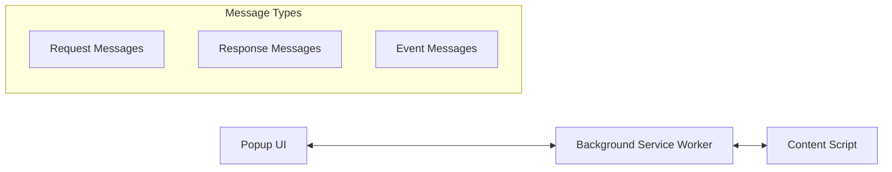

# ChatGPT Extension Message Passing Architecture

## Overview

This document details the message passing architecture for reliable communication between the three main components of the ChatGPT browser extension using Chrome runtime messages.

## Component Communication Flow



## Message Protocol Design

### Message Structure

All messages follow a consistent structure for reliability and debugging:

```typescript
interface ExtensionMessage {
  // Message metadata
  id: string;                    // Unique message ID for tracking
  timestamp: number;             // Message timestamp
  source: 'popup' | 'background' | 'content';
  target: 'popup' | 'background' | 'content';
  
  // Message content
  type: MessageType;             // Message type enum
  action?: ActionType;           // Action for EXECUTE_ACTION messages
  data?: any;                    // Message payload
  
  // Response handling
  expectsResponse?: boolean;     // Whether sender expects response
  timeout?: number;              // Response timeout in ms
}

interface ExtensionResponse {
  id: string;                    // Original message ID
  timestamp: number;             // Response timestamp
  success: boolean;              // Operation success status
  data?: any;                    // Response payload
  error?: {
    code: string;
    message: string;
    details?: any;
  };
}
```

## Message Types and Flows

### 1. Popup → Background Messages

```javascript
// Message types for Popup to Background communication
enum PopupToBackgroundMessages {
  // Project management
  CREATE_PROJECT = 'CREATE_PROJECT',
  GET_PROJECTS = 'GET_PROJECTS',
  GET_PROJECT = 'GET_PROJECT',
  UPDATE_PROJECT = 'UPDATE_PROJECT',
  DELETE_PROJECT = 'DELETE_PROJECT',
  
  // Instructions
  ADD_INSTRUCTIONS = 'ADD_INSTRUCTIONS',
  GET_INSTRUCTIONS = 'GET_INSTRUCTIONS',
  UPDATE_INSTRUCTIONS = 'UPDATE_INSTRUCTIONS',
  DELETE_INSTRUCTIONS = 'DELETE_INSTRUCTIONS',
  
  // ChatGPT actions
  EXECUTE_ACTION = 'EXECUTE_ACTION',
  
  // Status
  CHECK_CHATGPT_STATUS = 'CHECK_CHATGPT_STATUS',
  GET_ACTIVE_TAB = 'GET_ACTIVE_TAB'
}
```

### 2. Background → Content Script Messages

```javascript
// Action types for Background to Content Script communication
enum BackgroundToContentActions {
  // Core features
  CREATE_CHAT = 'CREATE_CHAT',
  SEND_PROMPT = 'SEND_PROMPT',
  REQUEST_IMAGE = 'REQUEST_IMAGE',
  DOWNLOAD_IMAGES = 'DOWNLOAD_IMAGES',
  
  // Status and control
  CHECK_STATUS = 'CHECK_STATUS',
  WAIT_FOR_RESPONSE = 'WAIT_FOR_RESPONSE',
  CANCEL_OPERATION = 'CANCEL_OPERATION'
}
```

### 3. Content Script → Background Events

```javascript
// Event types for Content Script to Background communication
enum ContentToBackgroundEvents {
  // Status events
  CHATGPT_READY = 'CHATGPT_READY',
  CHATGPT_BUSY = 'CHATGPT_BUSY',
  CHATGPT_ERROR = 'CHATGPT_ERROR',
  
  // Response events
  PROMPT_SENT = 'PROMPT_SENT',
  RESPONSE_RECEIVED = 'RESPONSE_RECEIVED',
  IMAGES_GENERATED = 'IMAGES_GENERATED',
  
  // User events
  USER_LOGGED_OUT = 'USER_LOGGED_OUT',
  PAGE_REFRESHED = 'PAGE_REFRESHED'
}
```

## Implementation Details

### 1. Message Manager Base Class

```javascript
// Shared message manager for all components
class MessageManager {
  constructor(componentType) {
    this.componentType = componentType;
    this.pendingMessages = new Map();
    this.messageHandlers = new Map();
    this.defaultTimeout = 30000; // 30 seconds
    
    this.setupMessageListener();
  }
  
  setupMessageListener() {
    chrome.runtime.onMessage.addListener((message, sender, sendResponse) => {
      // Validate message structure
      if (!this.isValidMessage(message)) {
        sendResponse({ success: false, error: { code: 'INVALID_MESSAGE' } });
        return false;
      }
      
      // Handle response to pending message
      if (message.id && this.pendingMessages.has(message.id)) {
        this.handleResponse(message);
        return false;
      }
      
      // Handle new message
      this.handleMessage(message, sender, sendResponse);
      return true; // Keep channel open for async response
    });
  }
  
  async sendMessage(target, type, data = {}, options = {}) {
    const message = {
      id: this.generateMessageId(),
      timestamp: Date.now(),
      source: this.componentType,
      target,
      type,
      data,
      expectsResponse: options.expectsResponse !== false,
      timeout: options.timeout || this.defaultTimeout
    };
    
    return new Promise((resolve, reject) => {
      if (message.expectsResponse) {
        // Set up timeout
        const timeoutId = setTimeout(() => {
          this.pendingMessages.delete(message.id);
          reject(new Error(`Message timeout: ${type}`));
        }, message.timeout);
        
        // Store pending message
        this.pendingMessages.set(message.id, {
          resolve,
          reject,
          timeoutId
        });
      }
      
      // Send message
      if (target === 'content') {
        // Send to content script via active tab
        this.sendToContentScript(message);
      } else {
        // Send via runtime
        chrome.runtime.sendMessage(message, (response) => {
          if (chrome.runtime.lastError) {
            reject(chrome.runtime.lastError);
          } else if (!message.expectsResponse) {
            resolve(response);
          }
        });
      }
    });
  }
  
  async sendToContentScript(message) {
    const tabs = await chrome.tabs.query({ active: true, currentWindow: true });
    const activeTab = tabs[0];
    
    if (!activeTab || !activeTab.url?.includes('chat.openai.com')) {
      const error = new Error('No active ChatGPT tab found');
      if (this.pendingMessages.has(message.id)) {
        const pending = this.pendingMessages.get(message.id);
        clearTimeout(pending.timeoutId);
        pending.reject(error);
        this.pendingMessages.delete(message.id);
      }
      return;
    }
    
    chrome.tabs.sendMessage(activeTab.id, message, (response) => {
      if (chrome.runtime.lastError) {
        this.handleError(message.id, chrome.runtime.lastError);
      }
    });
  }
  
  registerHandler(type, handler) {
    this.messageHandlers.set(type, handler);
  }
  
  async handleMessage(message, sender, sendResponse) {
    const handler = this.messageHandlers.get(message.type);
    
    if (!handler) {
      sendResponse({
        id: message.id,
        success: false,
        error: { code: 'NO_HANDLER', message: `No handler for ${message.type}` }
      });
      return;
    }
    
    try {
      const result = await handler(message.data, sender);
      sendResponse({
        id: message.id,
        timestamp: Date.now(),
        success: true,
        data: result
      });
    } catch (error) {
      sendResponse({
        id: message.id,
        timestamp: Date.now(),
        success: false,
        error: {
          code: error.code || 'HANDLER_ERROR',
          message: error.message,
          details: error.details
        }
      });
    }
  }
  
  handleResponse(response) {
    const pending = this.pendingMessages.get(response.id);
    if (!pending) return;
    
    clearTimeout(pending.timeoutId);
    this.pendingMessages.delete(response.id);
    
    if (response.success) {
      pending.resolve(response.data);
    } else {
      pending.reject(new Error(response.error?.message || 'Unknown error'));
    }
  }
  
  handleError(messageId, error) {
    const pending = this.pendingMessages.get(messageId);
    if (!pending) return;
    
    clearTimeout(pending.timeoutId);
    this.pendingMessages.delete(messageId);
    pending.reject(error);
  }
  
  isValidMessage(message) {
    return message &&
           typeof message.id === 'string' &&
           typeof message.type === 'string' &&
           typeof message.source === 'string' &&
           typeof message.target === 'string';
  }
  
  generateMessageId() {
    return `${this.componentType}-${Date.now()}-${Math.random().toString(36).substr(2, 9)}`;
  }
}
```

### 2. Popup Message Handler

```javascript
// popup/message-handler.js
class PopupMessageHandler extends MessageManager {
  constructor() {
    super('popup');
    this.setupHandlers();
  }
  
  setupHandlers() {
    // No handlers needed in popup - it only sends messages
  }
  
  // Project management
  async createProject(name) {
    return await this.sendMessage('background', 'CREATE_PROJECT', { name });
  }
  
  async getProjects() {
    return await this.sendMessage('background', 'GET_PROJECTS');
  }
  
  async addInstructions(projectId, instructions) {
    return await this.sendMessage('background', 'ADD_INSTRUCTIONS', {
      projectId,
      instructions
    });
  }
  
  // ChatGPT actions - these go through background to content script
  async createChat() {
    return await this.sendMessage('background', 'EXECUTE_ACTION', {
      action: 'CREATE_CHAT'
    });
  }
  
  async sendPrompt(prompt, projectId = null) {
    return await this.sendMessage('background', 'EXECUTE_ACTION', {
      action: 'SEND_PROMPT',
      data: { prompt, projectId }
    });
  }
  
  async requestImage(prompt) {
    return await this.sendMessage('background', 'EXECUTE_ACTION', {
      action: 'REQUEST_IMAGE',
      data: { prompt }
    });
  }
  
  async downloadImages() {
    return await this.sendMessage('background', 'EXECUTE_ACTION', {
      action: 'DOWNLOAD_IMAGES'
    });
  }
  
  async checkChatGPTStatus() {
    return await this.sendMessage('background', 'CHECK_CHATGPT_STATUS');
  }
}
```

### 3. Background Service Worker Handler

```javascript
// background/message-handler.js
class BackgroundMessageHandler extends MessageManager {
  constructor(storage) {
    super('background');
    this.storage = storage;
    this.setupHandlers();
  }
  
  setupHandlers() {
    // Popup message handlers
    this.registerHandler('CREATE_PROJECT', this.handleCreateProject.bind(this));
    this.registerHandler('GET_PROJECTS', this.handleGetProjects.bind(this));
    this.registerHandler('ADD_INSTRUCTIONS', this.handleAddInstructions.bind(this));
    this.registerHandler('EXECUTE_ACTION', this.handleExecuteAction.bind(this));
    this.registerHandler('CHECK_CHATGPT_STATUS', this.handleCheckStatus.bind(this));
    
    // Content script event handlers
    this.registerHandler('CHATGPT_READY', this.handleChatGPTReady.bind(this));
    this.registerHandler('RESPONSE_RECEIVED', this.handleResponseReceived.bind(this));
    this.registerHandler('IMAGES_GENERATED', this.handleImagesGenerated.bind(this));
  }
  
  async handleCreateProject(data) {
    const project = {
      id: `project-${Date.now()}`,
      name: data.name,
      instructions: [],
      created: new Date().toISOString(),
      updated: new Date().toISOString()
    };
    
    await this.storage.saveProject(project);
    return project;
  }
  
  async handleGetProjects() {
    return await this.storage.getAllProjects();
  }
  
  async handleAddInstructions(data) {
    const project = await this.storage.getProject(data.projectId);
    if (!project) {
      throw new Error('Project not found');
    }
    
    const instruction = {
      id: `inst-${Date.now()}`,
      text: data.instructions,
      created: new Date().toISOString()
    };
    
    project.instructions.push(instruction);
    project.updated = new Date().toISOString();
    
    await this.storage.saveProject(project);
    return instruction;
  }
  
  async handleExecuteAction(data, sender) {
    // Forward action to content script
    try {
      const result = await this.sendToActiveContentScript(data.action, data.data);
      return result;
    } catch (error) {
      throw {
        code: 'CONTENT_SCRIPT_ERROR',
        message: error.message,
        details: { action: data.action }
      };
    }
  }
  
  async sendToActiveContentScript(action, data) {
    const tabs = await chrome.tabs.query({ 
      active: true, 
      currentWindow: true,
      url: 'https://chat.openai.com/*'
    });
    
    if (!tabs || tabs.length === 0) {
      throw new Error('No active ChatGPT tab found. Please open chat.openai.com');
    }
    
    const activeTab = tabs[0];
    
    return new Promise((resolve, reject) => {
      chrome.tabs.sendMessage(
        activeTab.id,
        {
          id: this.generateMessageId(),
          timestamp: Date.now(),
          source: 'background',
          target: 'content',
          type: 'EXECUTE_ACTION',
          action: action,
          data: data
        },
        (response) => {
          if (chrome.runtime.lastError) {
            reject(new Error(chrome.runtime.lastError.message));
          } else if (response && response.success) {
            resolve(response.data);
          } else {
            reject(new Error(response?.error?.message || 'Action failed'));
          }
        }
      );
    });
  }
  
  async handleCheckStatus() {
    try {
      await this.sendToActiveContentScript('CHECK_STATUS', {});
      return { connected: true, ready: true };
    } catch (error) {
      return { connected: false, ready: false, error: error.message };
    }
  }
  
  handleChatGPTReady(data, sender) {
    console.log('ChatGPT interface ready', sender.tab?.id);
    // Could store tab ID for future reference
    return { acknowledged: true };
  }
  
  handleResponseReceived(data, sender) {
    // Could emit event or update storage
    console.log('ChatGPT response received', data);
    return { acknowledged: true };
  }
  
  handleImagesGenerated(data, sender) {
    console.log('Images generated', data);
    return { acknowledged: true };
  }
}
```

### 4. Content Script Message Handler

```javascript
// content/message-handler.js
class ContentMessageHandler extends MessageManager {
  constructor(chatInterface) {
    super('content');
    this.chatInterface = chatInterface;
    this.setupHandlers();
  }
  
  setupHandlers() {
    this.registerHandler('EXECUTE_ACTION', this.handleExecuteAction.bind(this));
  }
  
  async handleExecuteAction(message) {
    const { action, data } = message;
    
    switch (action) {
      case 'CREATE_CHAT':
        return await this.chatInterface.createNewChat();
        
      case 'SEND_PROMPT':
        return await this.chatInterface.sendPrompt(data.prompt);
        
      case 'REQUEST_IMAGE':
        return await this.chatInterface.requestImage(data.prompt);
        
      case 'DOWNLOAD_IMAGES':
        return await this.chatInterface.downloadImages();
        
      case 'CHECK_STATUS':
        return await this.chatInterface.checkStatus();
        
      default:
        throw new Error(`Unknown action: ${action}`);
    }
  }
  
  // Send events to background
  async notifyReady() {
    return await this.sendMessage('background', 'CHATGPT_READY', {
      url: window.location.href,
      timestamp: Date.now()
    }, { expectsResponse: false });
  }
  
  async notifyResponseReceived(response) {
    return await this.sendMessage('background', 'RESPONSE_RECEIVED', {
      response: response,
      timestamp: Date.now()
    }, { expectsResponse: false });
  }
  
  async notifyImagesGenerated(images) {
    return await this.sendMessage('background', 'IMAGES_GENERATED', {
      count: images.length,
      images: images,
      timestamp: Date.now()
    }, { expectsResponse: false });
  }
  
  async notifyError(error) {
    return await this.sendMessage('background', 'CHATGPT_ERROR', {
      error: {
        message: error.message,
        stack: error.stack,
        timestamp: Date.now()
      }
    }, { expectsResponse: false });
  }
}
```

## Error Handling Strategy

### Error Types and Handling

```javascript
// Centralized error codes
const ErrorCodes = {
  // Connection errors
  NO_CHATGPT_TAB: 'NO_CHATGPT_TAB',
  CONTENT_SCRIPT_NOT_READY: 'CONTENT_SCRIPT_NOT_READY',
  MESSAGE_TIMEOUT: 'MESSAGE_TIMEOUT',
  
  // ChatGPT errors
  NOT_LOGGED_IN: 'NOT_LOGGED_IN',
  RATE_LIMITED: 'RATE_LIMITED',
  CHATGPT_ERROR: 'CHATGPT_ERROR',
  
  // Storage errors
  STORAGE_ERROR: 'STORAGE_ERROR',
  PROJECT_NOT_FOUND: 'PROJECT_NOT_FOUND',
  
  // Validation errors
  INVALID_MESSAGE: 'INVALID_MESSAGE',
  INVALID_ACTION: 'INVALID_ACTION',
  INVALID_DATA: 'INVALID_DATA'
};

// Error handler utility
class ErrorHandler {
  static createError(code, message, details = {}) {
    return {
      code,
      message,
      details,
      timestamp: Date.now()
    };
  }
  
  static isRetryable(error) {
    const retryableCodes = [
      ErrorCodes.MESSAGE_TIMEOUT,
      ErrorCodes.CONTENT_SCRIPT_NOT_READY,
      ErrorCodes.RATE_LIMITED
    ];
    
    return retryableCodes.includes(error.code);
  }
  
  static async retry(fn, maxAttempts = 3, delay = 1000) {
    let lastError;
    
    for (let attempt = 1; attempt <= maxAttempts; attempt++) {
      try {
        return await fn();
      } catch (error) {
        lastError = error;
        
        if (!this.isRetryable(error) || attempt === maxAttempts) {
          throw error;
        }
        
        await new Promise(resolve => setTimeout(resolve, delay * attempt));
      }
    }
    
    throw lastError;
  }
}
```

## Message Flow Examples

### Example 1: Send Prompt Flow

```javascript
// 1. User clicks "Send Prompt" in popup
// popup.js
const messageHandler = new PopupMessageHandler();
try {
  const result = await messageHandler.sendPrompt("Explain quantum computing");
  console.log("Prompt sent successfully");
} catch (error) {
  console.error("Failed to send prompt:", error);
}

// 2. Background receives and forwards to content script
// Message flow: Popup -> Background -> Content Script -> ChatGPT

// 3. Content script executes and notifies background of response
// content.js
const response = await this.chatInterface.waitForResponse();
await this.messageHandler.notifyResponseReceived(response);

// 4. Response flows back: Content Script -> Background -> Popup
```

### Example 2: Create Project with Instructions

```javascript
// 1. Create project in popup
const project = await messageHandler.createProject("AI Research");

// 2. Add instructions
await messageHandler.addInstructions(project.id, "Focus on ethical AI development");

// 3. Send prompt with project context
await messageHandler.sendPrompt("What are the key ethical considerations?", project.id);
```

## Connection State Management

```javascript
class ConnectionStateManager {
  constructor() {
    this.state = {
      contentScriptReady: false,
      lastHeartbeat: null,
      activeTabId: null
    };
    
    this.startHeartbeat();
  }
  
  startHeartbeat() {
    setInterval(async () => {
      try {
        const status = await this.checkContentScriptStatus();
        this.state.contentScriptReady = status.ready;
        this.state.lastHeartbeat = Date.now();
      } catch (error) {
        this.state.contentScriptReady = false;
      }
    }, 5000); // Check every 5 seconds
  }
  
  async checkContentScriptStatus() {
    const tabs = await chrome.tabs.query({ 
      active: true, 
      url: 'https://chat.openai.com/*' 
    });
    
    if (!tabs || tabs.length === 0) {
      return { ready: false, error: 'No ChatGPT tab' };
    }
    
    try {
      const response = await chrome.tabs.sendMessage(tabs[0].id, {
        type: 'PING',
        timestamp: Date.now()
      });
      
      return { ready: true, tabId: tabs[0].id };
    } catch (error) {
      return { ready: false, error: error.message };
    }
  }
  
  isReady() {
    return this.state.contentScriptReady && 
           (Date.now() - this.state.lastHeartbeat) < 10000;
  }
}
```

## Best Practices

1. **Always validate messages** before processing
2. **Use timeouts** for all async operations
3. **Implement retry logic** for transient failures
4. **Log all message flows** for debugging
5. **Handle tab changes** and page refreshes
6. **Clean up pending messages** on errors
7. **Use consistent error codes** across components
8. **Implement heartbeat** for connection monitoring

## Summary

This message passing architecture provides:
- **Reliable communication** between all components
- **Type-safe message contracts**
- **Comprehensive error handling**
- **Retry mechanisms** for transient failures
- **Connection state management**
- **Debugging capabilities** through consistent logging

The architecture ensures all 6 core features work reliably across the extension components.