# Microservices Architecture Blueprint for Real-Time Testing Platform

## Executive Summary

This document outlines a comprehensive microservices architecture capable of supporting 100,000+ concurrent users for the Semantest real-time testing platform. The architecture leverages service mesh technology, intelligent API gateways, and distributed load balancing to achieve enterprise-scale performance with sub-100ms response times.

## Architecture Overview

```mermaid
graph TB
    subgraph "External Traffic"
        Users[100K+ Concurrent Users]
        CDN[Global CDN<br/>CloudFlare/AWS CloudFront]
        DNS[DNS Load Balancer<br/>Route 53]
    end
    
    subgraph "Edge Layer"
        WAF[Web Application Firewall<br/>Rate Limiting & DDoS Protection]
        GLB[Global Load Balancer<br/>Geographic Distribution]
    end
    
    subgraph "API Gateway Layer"
        AG1[API Gateway 1<br/>Kong/Ambassador]
        AG2[API Gateway 2<br/>Kong/Ambassador]
        AG3[API Gateway 3<br/>Kong/Ambassador]
        AG4[API Gateway 4<br/>Kong/Ambassador]
    end
    
    subgraph "Service Mesh - Istio"
        SM[Service Mesh Control Plane<br/>Traffic Management, Security, Observability]
        
        subgraph "Core Services"
            direction TB
            AS[Authentication Service<br/>OAuth2/JWT]
            US[User Management Service<br/>Profiles & Permissions]
            TS[Test Service<br/>Test Execution Engine]
            RS[Result Service<br/>Test Results & Analytics]
        end
        
        subgraph "AI Services"
            direction TB
            AITG[AI Test Generation<br/>ML-Powered Test Creation]
            AIBP[AI Bug Prediction<br/>Predictive Analytics]
            AIOPT[AI Optimization<br/>Test Suite Enhancement]
        end
        
        subgraph "Real-Time Services"
            direction TB
            WSG[WebSocket Gateway<br/>Real-Time Communication]
            ES[Event Streaming<br/>Apache Kafka]
            NS[Notification Service<br/>Push/Email/SMS]
        end
        
        subgraph "Data Services"
            direction TB
            DAS[Data Access Service<br/>CRUD Operations]
            CAS[Cache Service<br/>Redis Cluster]
            SES[Search Service<br/>Elasticsearch]
        end
    end
    
    subgraph "Data Layer"
        direction TB
        
        subgraph "Primary Databases"
            PG1[PostgreSQL Primary<br/>User & Test Data]
            PG2[PostgreSQL Primary<br/>Results & Analytics]
            MG1[MongoDB Primary<br/>Test Artifacts]
        end
        
        subgraph "Replicas & Shards"
            PGR1[PostgreSQL Replicas<br/>Read Scaling]
            PGR2[PostgreSQL Replicas<br/>Read Scaling]
            MGR1[MongoDB Shards<br/>Horizontal Scaling]
        end
        
        subgraph "Specialized Storage"
            TS1[InfluxDB<br/>Time Series Metrics]
            RC1[Redis Cluster<br/>Session & Cache]
            S3[Object Storage<br/>Artifacts & Logs]
        end
    end
    
    subgraph "Infrastructure Services"
        direction TB
        LOG[Logging<br/>ELK Stack]
        MON[Monitoring<br/>Prometheus/Grafana]
        TRC[Tracing<br/>Jaeger]
        SEC[Security<br/>Vault/Consul]
    end
    
    Users --> CDN
    CDN --> DNS
    DNS --> WAF
    WAF --> GLB
    GLB --> AG1
    GLB --> AG2
    GLB --> AG3
    GLB --> AG4
    
    AG1 --> SM
    AG2 --> SM
    AG3 --> SM
    AG4 --> SM
    
    SM --> AS
    SM --> US
    SM --> TS
    SM --> RS
    SM --> AITG
    SM --> AIBP
    SM --> AIOPT
    SM --> WSG
    SM --> ES
    SM --> NS
    SM --> DAS
    SM --> CAS
    SM --> SES
    
    DAS --> PG1
    DAS --> PG2
    DAS --> MG1
    DAS --> PGR1
    DAS --> PGR2
    DAS --> MGR1
    
    CAS --> RC1
    RS --> TS1
    DAS --> S3
    
    SM --> LOG
    SM --> MON
    SM --> TRC
    SM --> SEC
```



## Service Mesh Architecture (Istio)

### Control Plane Configuration

```yaml
# Istio Control Plane for 100K+ Users
apiVersion: install.istio.io/v1alpha1
kind: IstioOperator
metadata:
  name: semantest-control-plane
spec:
  values:
    pilot:
      resources:
        requests:
          cpu: "2"
          memory: "4Gi"
        limits:
          cpu: "4"
          memory: "8Gi"
      env:
        PILOT_SCALE_TIMEOUT: "30s"
        PILOT_PUSH_THROTTLE: 1000
        PILOT_MAX_WORKLOAD_ENTRIES: 100000
    
  components:
    pilot:
      k8s:
        replicaCount: 5  # High availability
        hpaSpec:
          minReplicas: 5
          maxReplicas: 20
          metrics:
          - type: Resource
            resource:
              name: cpu
              target:
                type: Utilization
                averageUtilization: 70
    
    proxy:
      k8s:
        resources:
          requests:
            cpu: "100m"
            memory: "128Mi"
          limits:
            cpu: "500m"
            memory: "512Mi"
```

### Traffic Management

```typescript
export class ServiceMeshTrafficManager {
    private readonly istioClient: IstioClient;
    private readonly trafficPolicies: Map<string, TrafficPolicy>;
    
    constructor() {
        this.istioClient = new IstioClient();
        this.trafficPolicies = new Map();
        this.setupTrafficPolicies();
    }
    
    private setupTrafficPolicies(): void {
        // High-priority service routing
        this.trafficPolicies.set('authentication', {
            retries: {
                attempts: 3,
                perTryTimeout: '1s',
                retryOn: '5xx,reset,connect-failure,refused-stream'
            },
            circuitBreaker: {
                consecutiveErrors: 5,
                interval: '30s',
                baseEjectionTime: '30s',
                maxEjectionPercent: 50
            },
            loadBalancer: {
                consistentHash: {
                    httpHeaderName: 'x-user-id'
                }
            }
        });
        
        // AI service routing with higher timeouts
        this.trafficPolicies.set('ai-services', {
            timeout: '30s',
            retries: {
                attempts: 2,
                perTryTimeout: '15s'
            },
            loadBalancer: {
                consistentHash: {
                    httpHeaderName: 'x-request-id'
                }
            }
        });
        
        // Real-time service routing
        this.trafficPolicies.set('realtime-services', {
            timeout: '5s',
            retries: {
                attempts: 1,
                perTryTimeout: '2s'
            },
            connectionPool: {
                tcp: {
                    maxConnections: 10000,
                    connectTimeout: '30s',
                    keepAlive: {
                        time: '7200s',
                        interval: '30s'
                    }
                },
                http: {
                    http1MaxPendingRequests: 1000,
                    http2MaxRequests: 10000,
                    maxRequestsPerConnection: 100,
                    maxRetries: 3
                }
            }
        });
    }
}
```

## API Gateway Architecture

### Kong Gateway Configuration

```yaml
# Kong Gateway for High-Scale API Management
apiVersion: configuration.konghq.com/v1
kind: KongPlugin
metadata:
  name: rate-limiting-plugin
config:
  minute: 1000
  hour: 50000
  policy: redis
  redis_host: redis-cluster.semantest.svc.cluster.local
  redis_port: 6379
  hide_client_headers: false
  
---
apiVersion: configuration.konghq.com/v1
kind: KongPlugin
metadata:
  name: prometheus-plugin
config:
  per_consumer: true
  status_code_metrics: true
  latency_metrics: true
  bandwidth_metrics: true
  
---
apiVersion: configuration.konghq.com/v1
kind: KongIngress
metadata:
  name: semantest-api-gateway
proxy:
  connect_timeout: 10000
  read_timeout: 60000
  write_timeout: 60000
  protocol: http
upstream:
  algorithm: consistent-hashing
  hash_on: header
  hash_on_header: x-user-id
  slots: 10000
  healthchecks:
    active:
      healthy:
        interval: 10
        successes: 3
      unhealthy:
        interval: 10
        http_failures: 3
        tcp_failures: 3
        timeout: 3
```

### Gateway Load Balancing Strategy

```typescript
export class APIGatewayLoadBalancer {
    private readonly gateways: APIGateway[];
    private readonly healthChecker: GatewayHealthChecker;
    private readonly trafficDistributor: TrafficDistributor;
    
    constructor() {
        this.gateways = this.initializeGateways();
        this.healthChecker = new GatewayHealthChecker();
        this.trafficDistributor = new TrafficDistributor();
        
        this.startHealthMonitoring();
    }
    
    async routeRequest(request: APIRequest): Promise<APIGateway> {
        const healthyGateways = await this.getHealthyGateways();
        
        if (healthyGateways.length === 0) {
            throw new NoHealthyGatewaysException('All API gateways are unhealthy');
        }
        
        // Multi-factor gateway selection
        const selectedGateway = this.selectOptimalGateway(healthyGateways, request);
        
        // Update gateway metrics
        await this.updateGatewayMetrics(selectedGateway, request);
        
        return selectedGateway;
    }
    
    private selectOptimalGateway(
        gateways: APIGateway[], 
        request: APIRequest
    ): APIGateway {
        const scoredGateways = gateways.map(gateway => ({
            gateway,
            score: this.calculateGatewayScore(gateway, request)
        }));
        
        // Sort by score (highest first)
        scoredGateways.sort((a, b) => b.score - a.score);
        
        return scoredGateways[0].gateway;
    }
    
    private calculateGatewayScore(gateway: APIGateway, request: APIRequest): number {
        const factors = {
            // Current load (lower is better)
            load: (1 - gateway.currentLoad) * 0.3,
            
            // Response time (lower is better)
            responseTime: Math.max(0, 1 - gateway.averageResponseTime / 1000) * 0.25,
            
            // Geographic proximity
            proximity: this.calculateProximityScore(gateway, request) * 0.2,
            
            // Connection capacity
            capacity: (1 - gateway.activeConnections / gateway.maxConnections) * 0.15,
            
            // Health score
            health: gateway.healthScore * 0.1
        };
        
        return Object.values(factors).reduce((sum, score) => sum + score, 0);
    }
}
```

## Core Microservices

### Authentication Service

```typescript
@Service('authentication-service')
export class AuthenticationService {
    private readonly jwtService: JWTService;
    private readonly userCache: RedisCache;
    private readonly rateLimiter: RateLimiter;
    
    constructor() {
        this.jwtService = new JWTService({
            algorithm: 'RS256',
            expiresIn: '1h',
            refreshExpiresIn: '7d'
        });
        
        this.userCache = new RedisCache('auth-cache');
        this.rateLimiter = new RateLimiter({
            windowMs: 900000, // 15 minutes
            max: 5, // 5 attempts per window
            standardHeaders: true
        });
    }
    
    @POST('/auth/login')
    @RateLimit({ max: 5, windowMs: 900000 })
    async login(@Body() credentials: LoginCredentials): Promise<AuthResponse> {
        // Check rate limiting
        await this.rateLimiter.checkLimit(credentials.email);
        
        // Validate credentials
        const user = await this.validateCredentials(credentials);
        if (!user) {
            throw new UnauthorizedException('Invalid credentials');
        }
        
        // Generate tokens
        const accessToken = await this.jwtService.signAccessToken(user);
        const refreshToken = await this.jwtService.signRefreshToken(user);
        
        // Cache user session
        await this.userCache.set(
            `session:${user.id}`, 
            { userId: user.id, lastActivity: Date.now() },
            { ttl: 3600 }
        );
        
        return {
            accessToken,
            refreshToken,
            user: this.sanitizeUser(user),
            expiresAt: new Date(Date.now() + 3600000)
        };
    }
    
    @POST('/auth/refresh')
    async refreshToken(@Body() request: RefreshTokenRequest): Promise<AuthResponse> {
        const payload = await this.jwtService.verifyRefreshToken(request.refreshToken);
        const user = await this.getUserById(payload.userId);
        
        if (!user || !user.isActive) {
            throw new UnauthorizedException('Invalid refresh token');
        }
        
        const newAccessToken = await this.jwtService.signAccessToken(user);
        
        return {
            accessToken: newAccessToken,
            refreshToken: request.refreshToken, // Reuse existing refresh token
            user: this.sanitizeUser(user),
            expiresAt: new Date(Date.now() + 3600000)
        };
    }
}
```

### Test Execution Service

```typescript
@Service('test-execution-service')
export class TestExecutionService {
    private readonly testQueue: TestQueue;
    private readonly resultPublisher: EventPublisher;
    private readonly resourceManager: ResourceManager;
    
    constructor() {
        this.testQueue = new TestQueue({
            maxConcurrentTests: 10000,
            queueTimeout: 300000, // 5 minutes
            priority: true
        });
        
        this.resultPublisher = new EventPublisher('test-results');
        this.resourceManager = new ResourceManager();
    }
    
    @POST('/tests/execute')
    async executeTest(@Body() testRequest: TestExecutionRequest): Promise<TestExecutionResponse> {
        // Validate test request
        await this.validateTestRequest(testRequest);
        
        // Check resource availability
        const resources = await this.resourceManager.allocateResources(testRequest);
        if (!resources) {
            throw new ResourceUnavailableException('Insufficient resources for test execution');
        }
        
        try {
            // Queue test for execution
            const testExecution = await this.testQueue.enqueue({
                testId: testRequest.testId,
                config: testRequest.config,
                priority: testRequest.priority || 'normal',
                timeout: testRequest.timeout || 300000,
                resources
            });
            
            // Start execution monitoring
            this.monitorTestExecution(testExecution);
            
            return {
                executionId: testExecution.id,
                status: 'queued',
                estimatedStartTime: testExecution.estimatedStartTime,
                queuePosition: await this.testQueue.getPosition(testExecution.id)
            };
        } catch (error) {
            // Release allocated resources on failure
            await this.resourceManager.releaseResources(resources);
            throw error;
        }
    }
    
    private async monitorTestExecution(execution: TestExecution): Promise<void> {
        execution.on('started', async (data) => {
            await this.resultPublisher.publish('test.started', {
                executionId: execution.id,
                testId: execution.testId,
                startedAt: data.startedAt
            });
        });
        
        execution.on('progress', async (data) => {
            await this.resultPublisher.publish('test.progress', {
                executionId: execution.id,
                progress: data.progress,
                currentStep: data.currentStep
            });
        });
        
        execution.on('completed', async (data) => {
            await this.resultPublisher.publish('test.completed', {
                executionId: execution.id,
                result: data.result,
                duration: data.duration,
                completedAt: data.completedAt
            });
            
            // Release resources
            await this.resourceManager.releaseResources(execution.resources);
        });
        
        execution.on('failed', async (data) => {
            await this.resultPublisher.publish('test.failed', {
                executionId: execution.id,
                error: data.error,
                failedAt: data.failedAt
            });
            
            // Release resources
            await this.resourceManager.releaseResources(execution.resources);
        });
    }
}
```

### AI Test Generation Service

```typescript
@Service('ai-test-generation-service')
export class AITestGenerationService {
    private readonly mlModelService: MLModelService;
    private readonly generationQueue: GenerationQueue;
    private readonly cacheService: CacheService;
    
    constructor() {
        this.mlModelService = new MLModelService();
        this.generationQueue = new GenerationQueue({
            maxConcurrentGenerations: 1000,
            timeout: 30000
        });
        this.cacheService = new CacheService('ai-generation-cache');
    }
    
    @POST('/ai/generate-tests')
    @CircuitBreaker({ threshold: 5, timeout: 60000 })
    async generateTests(@Body() request: TestGenerationRequest): Promise<TestGenerationResponse> {
        // Check cache for similar requests
        const cacheKey = this.generateCacheKey(request);
        const cachedResult = await this.cacheService.get(cacheKey);
        
        if (cachedResult) {
            return {
                ...cachedResult,
                fromCache: true,
                generatedAt: new Date()
            };
        }
        
        // Queue generation request
        const generation = await this.generationQueue.enqueue({
            specification: request.specification,
            framework: request.framework,
            language: request.language,
            testTypes: request.testTypes,
            complexity: request.complexity || 'medium'
        });
        
        try {
            // Load appropriate ML model
            const model = await this.mlModelService.loadModel(
                this.selectModel(request)
            );
            
            // Generate test cases
            const generatedTests = await model.generateTests({
                input: request.specification,
                parameters: {
                    framework: request.framework,
                    language: request.language,
                    maxTests: request.maxTests || 10,
                    coverage: request.coverage || 0.8
                }
            });
            
            // Post-process and validate
            const validatedTests = await this.validateGeneratedTests(
                generatedTests,
                request
            );
            
            const response: TestGenerationResponse = {
                generationId: generation.id,
                tests: validatedTests,
                metadata: {
                    model: model.version,
                    confidence: generatedTests.confidence,
                    generationTime: generation.duration,
                    framework: request.framework,
                    language: request.language
                },
                fromCache: false,
                generatedAt: new Date()
            };
            
            // Cache successful generation
            await this.cacheService.set(cacheKey, response, { ttl: 3600 });
            
            return response;
        } catch (error) {
            throw new TestGenerationException(
                `Failed to generate tests: ${error.message}`
            );
        }
    }
    
    private selectModel(request: TestGenerationRequest): string {
        // Model selection based on request characteristics
        const factors = {
            language: request.language,
            framework: request.framework,
            complexity: request.complexity,
            testTypes: request.testTypes
        };
        
        // Simple model selection logic (can be enhanced with ML)
        if (factors.complexity === 'high' || factors.testTypes.includes('integration')) {
            return 'gpt-4-test-generation-v2.1.0';
        } else if (factors.framework === 'react' || factors.framework === 'vue') {
            return 'frontend-test-generation-v1.5.0';
        } else {
            return 'general-test-generation-v1.8.0';
        }
    }
}
```

### WebSocket Gateway Service

```typescript
@Service('websocket-gateway-service')
export class WebSocketGatewayService {
    private readonly server: uWS.App;
    private readonly connectionManager: ConnectionManager;
    private readonly subscriptionManager: SubscriptionManager;
    private readonly eventBus: EventBus;
    
    constructor() {
        this.server = uWS.App({
            compression: uWS.SHARED_COMPRESSOR,
            maxPayloadLength: 1024 * 1024,
            idleTimeout: 32,
            maxBackpressure: 64 * 1024
        });
        
        this.connectionManager = new ConnectionManager();
        this.subscriptionManager = new SubscriptionManager();
        this.eventBus = new EventBus();
        
        this.setupWebSocketHandlers();
        this.setupEventListeners();
    }
    
    private setupWebSocketHandlers(): void {
        this.server.ws('/stream', {
            compression: uWS.DEDICATED_COMPRESSOR,
            maxCompressedSize: 32 * 1024,
            
            upgrade: (res, req, context) => {
                const token = req.getHeader('authorization');
                const clientId = this.authenticateWebSocketClient(token);
                
                if (!clientId) {
                    res.writeStatus('401').end();
                    return;
                }
                
                if (!this.connectionManager.canAcceptConnection()) {
                    res.writeStatus('503').end();
                    return;
                }
                
                res.upgrade({
                    clientId,
                    connectionTime: Date.now(),
                    subscriptions: new Set()
                }, 
                req.getHeader('sec-websocket-key'),
                req.getHeader('sec-websocket-protocol'),
                req.getHeader('sec-websocket-extensions'),
                context);
            },
            
            open: (ws) => {
                const clientData = ws.getUserData();
                this.connectionManager.addConnection(clientData.clientId, ws);
                
                // Send connection confirmation
                ws.send(JSON.stringify({
                    type: 'connected',
                    serverId: process.env.SERVER_ID,
                    timestamp: Date.now()
                }));
                
                // Start heartbeat
                this.startHeartbeat(ws);
            },
            
            message: async (ws, message, opCode) => {
                const clientData = ws.getUserData();
                
                try {
                    const data = JSON.parse(Buffer.from(message).toString());
                    await this.handleWebSocketMessage(clientData.clientId, data, ws);
                } catch (error) {
                    this.handleMessageError(ws, error);
                }
            },
            
            close: (ws, code, message) => {
                const clientData = ws.getUserData();
                this.connectionManager.removeConnection(clientData.clientId);
                this.subscriptionManager.cleanupClientSubscriptions(clientData.clientId);
            }
        });
    }
    
    private async handleWebSocketMessage(
        clientId: string,
        message: any,
        ws: WebSocket
    ): Promise<void> {
        switch (message.type) {
            case 'subscribe':
                await this.handleSubscription(clientId, message, ws);
                break;
                
            case 'unsubscribe':
                await this.handleUnsubscription(clientId, message, ws);
                break;
                
            case 'ping':
                ws.send(JSON.stringify({ type: 'pong', timestamp: Date.now() }));
                break;
                
            default:
                ws.send(JSON.stringify({
                    type: 'error',
                    error: 'Unknown message type'
                }));
        }
    }
    
    private setupEventListeners(): void {
        // Listen for test execution events
        this.eventBus.subscribe('test.started', async (event) => {
            await this.broadcastToSubscribers('test-execution', {
                type: 'test_started',
                data: event
            });
        });
        
        this.eventBus.subscribe('test.progress', async (event) => {
            await this.broadcastToSubscribers('test-execution', {
                type: 'test_progress',
                data: event
            });
        });
        
        this.eventBus.subscribe('test.completed', async (event) => {
            await this.broadcastToSubscribers('test-execution', {
                type: 'test_completed',
                data: event
            });
        });
        
        // Listen for AI generation events
        this.eventBus.subscribe('ai.generation.started', async (event) => {
            await this.broadcastToSubscribers('ai-generation', {
                type: 'generation_started',
                data: event
            });
        });
        
        this.eventBus.subscribe('ai.generation.completed', async (event) => {
            await this.broadcastToSubscribers('ai-generation', {
                type: 'generation_completed',
                data: event
            });
        });
    }
}
```

## Data Flow Architecture

### Event-Driven Data Flow

```typescript
export class DataFlowOrchestrator {
    private readonly eventBus: EventBus;
    private readonly streamProcessor: StreamProcessor;
    private readonly dataRouter: DataRouter;
    
    constructor() {
        this.eventBus = new EventBus({
            driver: 'kafka',
            brokers: ['kafka-1:9092', 'kafka-2:9092', 'kafka-3:9092'],
            clientId: 'semantest-data-flow',
            groupId: 'data-orchestrator'
        });
        
        this.streamProcessor = new StreamProcessor();
        this.dataRouter = new DataRouter();
        
        this.setupDataFlowPipelines();
    }
    
    private setupDataFlowPipelines(): void {
        // Test Execution Pipeline
        this.createPipeline('test-execution-flow', [
            {
                source: 'test.submitted',
                processors: [
                    new ValidationProcessor(),
                    new ResourceAllocationProcessor(),
                    new QueueProcessor()
                ],
                destinations: ['test.queued', 'user.notification']
            },
            {
                source: 'test.started',
                processors: [
                    new ExecutionTrackingProcessor(),
                    new MetricsCollectionProcessor()
                ],
                destinations: ['test.progress', 'analytics.events']
            },
            {
                source: 'test.completed',
                processors: [
                    new ResultProcessor(),
                    new AnalyticsProcessor(),
                    new NotificationProcessor()
                ],
                destinations: [
                    'test.results',
                    'analytics.results',
                    'user.notification',
                    'ai.training-data'
                ]
            }
        ]);
        
        // AI Generation Pipeline
        this.createPipeline('ai-generation-flow', [
            {
                source: 'ai.generation.requested',
                processors: [
                    new ModelSelectionProcessor(),
                    new InputPreprocessor(),
                    new GenerationQueueProcessor()
                ],
                destinations: ['ai.generation.queued']
            },
            {
                source: 'ai.generation.completed',
                processors: [
                    new ValidationProcessor(),
                    new QualityAssessmentProcessor(),
                    new CacheProcessor()
                ],
                destinations: [
                    'ai.generation.results',
                    'analytics.ai-metrics',
                    'cache.storage'
                ]
            }
        ]);
        
        // Real-time Updates Pipeline
        this.createPipeline('realtime-updates-flow', [
            {
                source: ['test.progress', 'test.completed', 'ai.generation.progress'],
                processors: [
                    new WebSocketBroadcastProcessor(),
                    new PushNotificationProcessor()
                ],
                destinations: ['websocket.broadcast', 'push.notifications']
            }
        ]);
    }
}
```

### Database Sharding Strategy

```typescript
export class DatabaseShardManager {
    private readonly shards: Map<string, DatabaseShard>;
    private readonly shardRouter: ShardRouter;
    private readonly replicationManager: ReplicationManager;
    
    constructor() {
        this.shards = new Map();
        this.shardRouter = new ShardRouter();
        this.replicationManager = new ReplicationManager();
        
        this.initializeShards();
    }
    
    private initializeShards(): void {
        // User data sharding (by user_id)
        this.shards.set('users-shard-1', new DatabaseShard({
            name: 'users-shard-1',
            database: 'semantest_users_1',
            host: 'postgres-users-1.cluster.local',
            shardKey: 'user_id',
            shardRange: { min: 0, max: 999999 }
        }));
        
        this.shards.set('users-shard-2', new DatabaseShard({
            name: 'users-shard-2',
            database: 'semantest_users_2',
            host: 'postgres-users-2.cluster.local',
            shardKey: 'user_id',
            shardRange: { min: 1000000, max: 1999999 }
        }));
        
        // Test data sharding (by test_id)
        this.shards.set('tests-shard-1', new DatabaseShard({
            name: 'tests-shard-1',
            database: 'semantest_tests_1',
            host: 'postgres-tests-1.cluster.local',
            shardKey: 'test_id',
            shardRange: { min: 0, max: 999999 }
        }));
        
        this.shards.set('tests-shard-2', new DatabaseShard({
            name: 'tests-shard-2',
            database: 'semantest_tests_2',
            host: 'postgres-tests-2.cluster.local',
            shardKey: 'test_id',
            shardRange: { min: 1000000, max: 1999999 }
        }));
        
        // Time-series data sharding (by timestamp)
        this.shards.set('metrics-shard-1', new DatabaseShard({
            name: 'metrics-shard-1',
            database: 'semantest_metrics_1',
            host: 'influxdb-1.cluster.local',
            shardKey: 'timestamp',
            shardRange: { min: Date.now() - 86400000 * 30, max: Date.now() } // Last 30 days
        }));
    }
    
    async routeQuery(query: DatabaseQuery): Promise<QueryResult> {
        const shard = this.shardRouter.selectShard(query);
        
        if (!shard) {
            throw new ShardNotFoundException(`No shard found for query: ${query.table}`);
        }
        
        try {
            return await shard.execute(query);
        } catch (error) {
            // Failover to replica if primary fails
            const replica = await this.replicationManager.getHealthyReplica(shard.name);
            if (replica) {
                return await replica.execute(query);
            }
            throw error;
        }
    }
}
```

## Load Balancing for 100K+ Users

### Multi-Layer Load Balancing

```typescript
export class GlobalLoadBalancingStrategy {
    private readonly layers: LoadBalancingLayer[];
    private readonly trafficAnalyzer: TrafficAnalyzer;
    private readonly capacityPlanner: CapacityPlanner;
    
    constructor() {
        this.layers = this.initializeLoadBalancingLayers();
        this.trafficAnalyzer = new TrafficAnalyzer();
        this.capacityPlanner = new CapacityPlanner();
        
        this.startTrafficMonitoring();
    }
    
    private initializeLoadBalancingLayers(): LoadBalancingLayer[] {
        return [
            // Layer 1: Global Traffic Distribution (DNS-based)
            new DNSLoadBalancer({
                name: 'global-dns-lb',
                strategy: 'geographic',
                regions: [
                    { name: 'us-east-1', weight: 40, capacity: 40000 },
                    { name: 'us-west-2', weight: 30, capacity: 30000 },
                    { name: 'eu-west-1', weight: 20, capacity: 20000 },
                    { name: 'ap-south-1', weight: 10, capacity: 10000 }
                ],
                healthCheckInterval: 30,
                failoverThreshold: 0.5
            }),
            
            // Layer 2: Regional Load Balancers
            new RegionalLoadBalancer({
                name: 'regional-lb',
                strategy: 'weighted-round-robin',
                algorithm: 'least-connections',
                stickySession: true,
                sessionTimeout: 1800,
                healthCheckInterval: 10
            }),
            
            // Layer 3: Service-Level Load Balancers
            new ServiceLoadBalancer({
                name: 'service-lb',
                strategy: 'consistent-hashing',
                hashKey: 'user-id',
                virtualNodes: 150,
                rebalanceThreshold: 0.15
            }),
            
            // Layer 4: Pod-Level Load Balancers (Kubernetes)
            new PodLoadBalancer({
                name: 'pod-lb',
                strategy: 'resource-aware',
                metrics: ['cpu', 'memory', 'connections'],
                weights: { cpu: 0.4, memory: 0.3, connections: 0.3 }
            })
        ];
    }
    
    async distributeTraffic(request: TrafficRequest): Promise<RouteDecision> {
        const trafficPattern = await this.trafficAnalyzer.analyze(request);
        
        // Check if we need to scale up
        if (trafficPattern.concurrentUsers > 80000) {
            await this.capacityPlanner.scaleUp({
                targetCapacity: trafficPattern.concurrentUsers * 1.2,
                urgency: 'high'
            });
        }
        
        // Route through each layer
        let routingDecision = { request };
        
        for (const layer of this.layers) {
            routingDecision = await layer.route(routingDecision);
            
            // Check if routing failed at any layer
            if (!routingDecision.success) {
                await this.handleRoutingFailure(layer, routingDecision);
                break;
            }
        }
        
        return routingDecision;
    }
}
```

### Auto-Scaling Configuration

```yaml
# Kubernetes HPA for 100K+ User Scaling
apiVersion: autoscaling/v2
kind: HorizontalPodAutoscaler
metadata:
  name: semantest-microservices-hpa
spec:
  scaleTargetRef:
    apiVersion: apps/v1
    kind: Deployment
    name: semantest-services
  minReplicas: 50
  maxReplicas: 500
  metrics:
  - type: Resource
    resource:
      name: cpu
      target:
        type: Utilization
        averageUtilization: 70
  - type: Resource
    resource:
      name: memory
      target:
        type: Utilization
        averageUtilization: 80
  - type: Pods
    pods:
      metric:
        name: concurrent_connections
      target:
        type: AverageValue
        averageValue: "200"  # 200 connections per pod
  - type: External
    external:
      metric:
        name: kafka_lag
      target:
        type: AverageValue
        averageValue: "1000"  # Max 1000 messages lag
  behavior:
    scaleUp:
      stabilizationWindowSeconds: 60
      policies:
      - type: Percent
        value: 100  # Can double pod count
        periodSeconds: 60
      - type: Pods
        value: 20   # Can add 20 pods at once
        periodSeconds: 60
    scaleDown:
      stabilizationWindowSeconds: 300
      policies:
      - type: Percent
        value: 10   # Reduce by 10% at most
        periodSeconds: 300

---
# Vertical Pod Autoscaler for Resource Optimization
apiVersion: autoscaling.k8s.io/v1
kind: VerticalPodAutoscaler
metadata:
  name: semantest-services-vpa
spec:
  targetRef:
    apiVersion: apps/v1
    kind: Deployment
    name: semantest-services
  updatePolicy:
    updateMode: "Auto"
  resourcePolicy:
    containerPolicies:
    - containerName: '*'
      minAllowed:
        cpu: 100m
        memory: 128Mi
      maxAllowed:
        cpu: "4"
        memory: 8Gi
      controlled Resources: ["cpu", "memory"]
```

## Performance Specifications

### Target Performance Metrics

```typescript
interface PerformanceTargets {
    // User Load Targets
    concurrentUsers: 100000;
    peakRequestsPerSecond: 50000;
    sustainedRequestsPerSecond: 25000;
    
    // Response Time Targets (95th percentile)
    apiResponseTime: {
        authentication: "50ms";
        testExecution: "100ms";
        aiGeneration: "5s";
        realTimeUpdates: "10ms";
    };
    
    // Throughput Targets
    testExecutionsPerHour: 1000000;
    aiGenerationsPerHour: 100000;
    webSocketMessages: 100000; // per second
    
    // Resource Utilization Targets
    cpuUtilization: "70%";     // Average
    memoryUtilization: "80%";  // Average
    networkUtilization: "60%"; // Average
    
    // Availability Targets
    uptime: "99.99%";          // 52.56 minutes downtime/year
    errorRate: "<0.01%";
    dataLoss: "0%";
    
    // Scalability Targets
    horizontalScaleTime: "60s";    // Time to add capacity
    verticalScaleTime: "30s";      // Time to adjust resources
    failoverTime: "10s";           // Service failover time
}
```

### Infrastructure Requirements

```yaml
# Infrastructure Specifications for 100K+ Users
infrastructure:
  regions: 4
  availability_zones: 12  # 3 per region
  
  compute:
    kubernetes_nodes: 200
    node_specifications:
      cpu_cores: 16
      memory: 64GB
      storage: 1TB NVMe SSD
      network: 25Gbps
    
    total_capacity:
      cpu_cores: 3200
      memory: 12.8TB
      storage: 200TB
      network_bandwidth: 5Tbps
  
  databases:
    postgresql:
      clusters: 4  # One per region
      nodes_per_cluster: 6  # 3 primary + 3 replica
      specifications:
        cpu_cores: 32
        memory: 256GB
        storage: 10TB NVMe SSD
    
    mongodb:
      shards: 8
      replica_sets: 3  # per shard
      specifications:
        cpu_cores: 16
        memory: 128GB
        storage: 5TB NVMe SSD
    
    redis:
      clusters: 4  # One per region
      nodes_per_cluster: 6
      specifications:
        cpu_cores: 8
        memory: 64GB
    
    influxdb:
      clusters: 2  # Time series data
      nodes_per_cluster: 6
      specifications:
        cpu_cores: 16
        memory: 128GB
        storage: 20TB NVMe SSD
  
  message_queues:
    kafka:
      clusters: 2
      brokers_per_cluster: 9
      specifications:
        cpu_cores: 16
        memory: 64GB
        storage: 5TB NVMe SSD
  
  load_balancers:
    global: 4  # DNS-based
    regional: 12  # 3 per region
    service: 40  # API Gateways
    
  cdn:
    edge_locations: 100
    total_cache_capacity: 1PB
    
  monitoring:
    prometheus_nodes: 12
    elasticsearch_nodes: 18
    log_storage: 100TB
```

## Monitoring and Observability

### Comprehensive Monitoring Stack

```typescript
export class ObservabilityPlatform {
    private readonly metricsCollector: PrometheusMetrics;
    private readonly tracingSystem: JaegerTracing;
    private readonly loggingSystem: ELKStack;
    private readonly alertManager: AlertManager;
    
    constructor() {
        this.metricsCollector = new PrometheusMetrics();
        this.tracingSystem = new JaegerTracing();
        this.loggingSystem = new ELKStack();
        this.alertManager = new AlertManager();
        
        this.setupObservability();
    }
    
    private setupObservability(): void {
        // Service-level metrics
        this.metricsCollector.registerMetrics([
            {
                name: 'http_requests_total',
                help: 'Total HTTP requests by service, method, and status',
                type: 'counter',
                labels: ['service', 'method', 'status_code']
            },
            {
                name: 'http_request_duration_seconds',
                help: 'HTTP request duration in seconds',
                type: 'histogram',
                labels: ['service', 'method'],
                buckets: [0.001, 0.005, 0.01, 0.025, 0.05, 0.1, 0.25, 0.5, 1, 2.5, 5, 10]
            },
            {
                name: 'active_connections',
                help: 'Number of active connections per service',
                type: 'gauge',
                labels: ['service', 'type']
            },
            {
                name: 'queue_depth',
                help: 'Number of items in queues',
                type: 'gauge',
                labels: ['queue_name', 'service']
            }
        ]);
        
        // Business metrics
        this.metricsCollector.registerMetrics([
            {
                name: 'concurrent_users',
                help: 'Number of concurrent users',
                type: 'gauge',
                labels: ['region']
            },
            {
                name: 'test_executions_total',
                help: 'Total test executions',
                type: 'counter',
                labels: ['framework', 'status']
            },
            {
                name: 'ai_generations_total',
                help: 'Total AI test generations',
                type: 'counter',
                labels: ['model', 'status']
            }
        ]);
        
        // Infrastructure metrics
        this.metricsCollector.registerMetrics([
            {
                name: 'node_cpu_utilization',
                help: 'CPU utilization per node',
                type: 'gauge',
                labels: ['node', 'region']
            },
            {
                name: 'pod_memory_usage_bytes',
                help: 'Memory usage per pod',
                type: 'gauge',
                labels: ['pod', 'service', 'node']
            }
        ]);
    }
    
    setupAlerting(): void {
        // High-priority alerts
        this.alertManager.addRule({
            name: 'HighErrorRate',
            condition: 'rate(http_requests_total{status_code=~"5.."}[5m]) > 0.01',
            severity: 'critical',
            description: 'High error rate detected',
            runbook: 'https://docs.semantest.com/runbooks/high-error-rate'
        });
        
        this.alertManager.addRule({
            name: 'HighLatency',
            condition: 'histogram_quantile(0.95, http_request_duration_seconds) > 0.5',
            severity: 'warning',
            description: 'High latency detected',
            runbook: 'https://docs.semantest.com/runbooks/high-latency'
        });
        
        this.alertManager.addRule({
            name: 'ServiceDown',
            condition: 'up == 0',
            severity: 'critical',
            description: 'Service is down',
            runbook: 'https://docs.semantest.com/runbooks/service-down'
        });
    }
}
```

## Security Architecture

### Zero-Trust Security Model

```typescript
export class ZeroTrustSecurityManager {
    private readonly authService: AuthenticationService;
    private readonly authzService: AuthorizationService;
    private readonly encryptionService: EncryptionService;
    private readonly auditLogger: AuditLogger;
    
    constructor() {
        this.authService = new AuthenticationService();
        this.authzService = new AuthorizationService();
        this.encryptionService = new EncryptionService();
        this.auditLogger = new AuditLogger();
        
        this.setupSecurityPolicies();
    }
    
    private setupSecurityPolicies(): void {
        // Network security policies
        this.applyNetworkPolicies([
            {
                name: 'deny-all-default',
                policy: 'default-deny',
                scope: 'namespace'
            },
            {
                name: 'allow-ingress-to-api-gateway',
                policy: 'allow',
                from: ['ingress-controller'],
                to: ['api-gateway'],
                ports: [80, 443]
            },
            {
                name: 'allow-service-mesh-communication',
                policy: 'allow',
                from: ['service-mesh'],
                to: ['all-services'],
                ports: [8080, 8443]
            }
        ]);
        
        // Identity and access management
        this.setupIAMPolicies([
            {
                role: 'user',
                permissions: ['read:own-tests', 'create:tests', 'read:own-results']
            },
            {
                role: 'admin',
                permissions: ['*']
            },
            {
                role: 'service',
                permissions: ['read:services', 'write:metrics', 'read:config']
            }
        ]);
        
        // Data encryption policies
        this.setupEncryptionPolicies([
            {
                data: 'user-credentials',
                encryption: 'AES-256-GCM',
                keyRotation: '90d'
            },
            {
                data: 'test-results',
                encryption: 'AES-256-CBC',
                keyRotation: '365d'
            },
            {
                data: 'communication',
                encryption: 'TLS-1.3',
                keyRotation: '30d'
            }
        ]);
    }
}
```

## Deployment Strategy

### Blue-Green Deployment with Canary

```yaml
# ArgoCD Application for GitOps Deployment
apiVersion: argoproj.io/v1alpha1
kind: Application
metadata:
  name: semantest-microservices
  namespace: argocd
spec:
  project: default
  source:
    repoURL: https://github.com/semantest/microservices-platform
    targetRevision: HEAD
    path: kubernetes/
  destination:
    server: https://kubernetes.default.svc
    namespace: semantest
  syncPolicy:
    automated:
      prune: true
      selfHeal: true
    syncOptions:
    - CreateNamespace=true
    retry:
      limit: 5
      backoff:
        duration: 5s
        factor: 2
        maxDuration: 3m

---
# Flagger Canary Deployment Configuration
apiVersion: flagger.app/v1beta1
kind: Canary
metadata:
  name: semantest-api-canary
  namespace: semantest
spec:
  targetRef:
    apiVersion: apps/v1
    kind: Deployment
    name: semantest-api
  progressDeadlineSeconds: 60
  service:
    port: 8080
    targetPort: 8080
    gateways:
    - semantest-gateway
    hosts:
    - api.semantest.com
  analysis:
    interval: 30s
    threshold: 5
    maxWeight: 50
    stepWeight: 10
    metrics:
    - name: request-success-rate
      thresholdRange:
        min: 99
      interval: 1m
    - name: request-duration
      thresholdRange:
        max: 500
      interval: 1m
    webhooks:
    - name: load-test
      url: http://flagger-loadtester.test/
      timeout: 5s
      metadata:
        cmd: "hey -z 1m -q 10 -c 2 http://semantest-api-canary.semantest:8080/"
```

## Conclusion

This microservices architecture blueprint provides a comprehensive foundation for supporting 100,000+ concurrent users with enterprise-grade performance, reliability, and scalability. The architecture leverages modern cloud-native technologies and best practices to deliver:

**Key Capabilities:**
- **Massive Scale**: 100K+ concurrent users with 50K RPS capacity
- **High Performance**: Sub-100ms API response times with real-time updates
- **Enterprise Reliability**: 99.99% uptime with automatic failover
- **Advanced AI Integration**: ML-powered test generation with intelligent optimization
- **Real-time Processing**: WebSocket streaming with event-driven architecture
- **Global Distribution**: Multi-region deployment with edge optimization

**Technology Stack:**
- **Service Mesh**: Istio for traffic management and security
- **API Gateway**: Kong for intelligent routing and rate limiting
- **Container Orchestration**: Kubernetes with advanced auto-scaling
- **Messaging**: Apache Kafka for event streaming
- **Databases**: PostgreSQL, MongoDB, InfluxDB with intelligent sharding
- **Monitoring**: Prometheus, Grafana, Jaeger, ELK stack
- **Security**: Zero-trust model with end-to-end encryption

The architecture is production-ready and designed for seamless scaling, deployment, and operations in cloud environments.