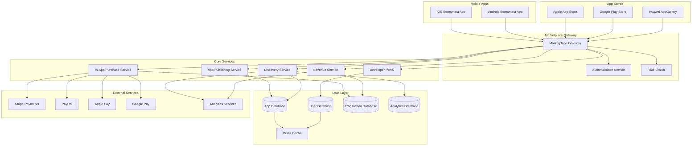

# Semantest Mobile App Marketplace Architecture

## Table of Contents

1. [Architecture Overview](#architecture-overview)
2. [App Store Integration](#app-store-integration)
3. [In-App Purchase System](#in-app-purchase-system)
4. [Revenue Sharing Models](#revenue-sharing-models)
5. [App Discovery Algorithms](#app-discovery-algorithms)
6. [Developer Portal Backend Architecture](#developer-portal-backend-architecture)
7. [Security & Compliance](#security--compliance)
8. [Implementation Strategy](#implementation-strategy)

---

## Architecture Overview

### System Architecture Diagram



### Core Principles

1. **Multi-Platform Compatibility**: Support iOS, Android, and emerging platforms
2. **Scalable Revenue Models**: Flexible revenue sharing and monetization strategies
3. **Intelligent Discovery**: AI-powered app recommendation and discovery
4. **Developer-Centric**: Comprehensive tools and analytics for developers
5. **Security-First**: End-to-end security and compliance with platform requirements

---

## App Store Integration

### Multi-Store Integration Architecture

The Semantest marketplace integrates with multiple app stores to maximize reach and distribution opportunities.

#### Store Integration Service

```typescript
// Core app store integration service
export interface IAppStoreIntegration {
    publishApp(appData: AppPublishData): Promise<PublishResult>;
    updateApp(appId: string, updateData: AppUpdateData): Promise<UpdateResult>;
    getAppStatus(appId: string): Promise<AppStatus>;
    withdrawApp(appId: string, reason: string): Promise<WithdrawResult>;
    getStoreMetrics(appId: string): Promise<StoreMetrics>;
}

export class AppStoreIntegrationService implements IAppStoreIntegration {
    private readonly storeAdapters: Map<StoreType, IStoreAdapter>;
    private readonly configService: IConfigurationService;
    private readonly metricsService: IMetricsService;

    constructor(
        storeAdapters: IStoreAdapter[],
        configService: IConfigurationService,
        metricsService: IMetricsService
    ) {
        this.storeAdapters = new Map();
        storeAdapters.forEach(adapter => {
            this.storeAdapters.set(adapter.storeType, adapter);
        });
        this.configService = configService;
        this.metricsService = metricsService;
    }

    async publishApp(appData: AppPublishData): Promise<PublishResult> {
        const results: StorePublishResult[] = [];
        
        for (const [storeType, adapter] of this.storeAdapters) {
            if (appData.targetStores.includes(storeType)) {
                try {
                    const storeConfig = await this.configService.getStoreConfig(storeType);
                    const adaptedData = this.adaptAppDataForStore(appData, storeType);
                    
                    const result = await adapter.publishApp(adaptedData, storeConfig);
                    results.push({
                        store: storeType,
                        success: true,
                        appId: result.appId,
                        storeUrl: result.storeUrl,
                        reviewStatus: result.reviewStatus
                    });
                    
                    await this.metricsService.recordEvent('app_published', {
                        store: storeType,
                        appId: result.appId,
                        developerId: appData.developerId
                    });
                } catch (error) {
                    results.push({
                        store: storeType,
                        success: false,
                        error: error.message
                    });
                    
                    await this.metricsService.recordError('app_publish_failed', error, {
                        store: storeType,
                        developerId: appData.developerId
                    });
                }
            }
        }

        return {
            overall: results.every(r => r.success),
            storeResults: results,
            publishedAt: new Date()
        };
    }

    private adaptAppDataForStore(appData: AppPublishData, storeType: StoreType): StoreSpecificAppData {
        switch (storeType) {
            case StoreType.APPLE_APP_STORE:
                return this.adaptForAppleStore(appData);
            case StoreType.GOOGLE_PLAY_STORE:
                return this.adaptForGooglePlay(appData);
            case StoreType.HUAWEI_APP_GALLERY:
                return this.adaptForHuaweiGallery(appData);
            default:
                throw new Error(`Unsupported store type: ${storeType}`);
        }
    }
}
```

#### Apple App Store Integration

```typescript
export class AppleAppStoreAdapter implements IStoreAdapter {
    readonly storeType = StoreType.APPLE_APP_STORE;
    private readonly appStoreConnect: AppStoreConnectAPI;
    private readonly testFlight: TestFlightAPI;

    async publishApp(appData: StoreSpecificAppData, config: StoreConfig): Promise<StorePublishResult> {
        // Create app record in App Store Connect
        const appRecord = await this.appStoreConnect.createApp({
            bundleId: appData.bundleId,
            name: appData.name,
            primaryLanguage: appData.primaryLanguage,
            sku: appData.sku
        });

        // Upload app binary
        const uploadResult = await this.uploadBinary(appData.binaryPath, appRecord.id);
        
        // Create app version
        const versionData = await this.appStoreConnect.createVersion({
            appId: appRecord.id,
            versionString: appData.version,
            copyright: appData.copyright,
            releaseType: appData.releaseType
        });

        // Upload metadata
        await this.uploadMetadata(versionData.id, appData);
        
        // Upload screenshots and assets
        await this.uploadAssets(versionData.id, appData.assets);

        // Submit for review
        const submissionResult = await this.appStoreConnect.submitForReview({
            versionId: versionData.id,
            reviewNotes: appData.reviewNotes
        });

        return {
            appId: appRecord.id,
            versionId: versionData.id,
            storeUrl: `https://apps.apple.com/app/id${appRecord.id}`,
            reviewStatus: 'pending_review',
            submissionId: submissionResult.id
        };
    }

    private async uploadMetadata(versionId: string, appData: StoreSpecificAppData): Promise<void> {
        const localizations = appData.localizations || [appData.primaryLocalization];
        
        for (const localization of localizations) {
            await this.appStoreConnect.updateVersionLocalization(versionId, {
                locale: localization.locale,
                name: localization.name,
                subtitle: localization.subtitle,
                description: localization.description,
                keywords: localization.keywords.join(','),
                marketingUrl: localization.marketingUrl,
                supportUrl: localization.supportUrl,
                privacyPolicyUrl: localization.privacyPolicyUrl
            });
        }
    }
}
```

#### Google Play Store Integration

```typescript
export class GooglePlayStoreAdapter implements IStoreAdapter {
    readonly storeType = StoreType.GOOGLE_PLAY_STORE;
    private readonly playConsole: GooglePlayConsoleAPI;
    private readonly playPublishing: GooglePlayPublishingAPI;

    async publishApp(appData: StoreSpecificAppData, config: StoreConfig): Promise<StorePublishResult> {
        // Create application
        const app = await this.playConsole.applications.insert({
            packageName: appData.packageName,
            defaultLanguage: appData.defaultLanguage
        });

        // Upload APK/AAB
        const uploadResult = await this.uploadBundle(appData.bundlePath, app.packageName);
        
        // Create edit
        const edit = await this.playPublishing.edits.insert({
            packageName: app.packageName
        });

        // Upload bundle to edit
        await this.playPublishing.edits.bundles.upload({
            packageName: app.packageName,
            editId: edit.id,
            media: {
                mimeType: 'application/octet-stream',
                body: uploadResult.bundle
            }
        });

        // Update listing
        await this.updateListing(app.packageName, edit.id, appData);
        
        // Upload images
        await this.uploadImages(app.packageName, edit.id, appData.assets);

        // Set track (production, beta, alpha, internal)
        await this.playPublishing.edits.tracks.update({
            packageName: app.packageName,
            editId: edit.id,
            track: appData.track || 'production',
            requestBody: {
                releases: [{
                    versionCodes: [uploadResult.versionCode],
                    status: 'inProgress'
                }]
            }
        });

        // Commit edit
        const commitResult = await this.playPublishing.edits.commit({
            packageName: app.packageName,
            editId: edit.id
        });

        return {
            appId: app.packageName,
            versionCode: uploadResult.versionCode,
            storeUrl: `https://play.google.com/store/apps/details?id=${app.packageName}`,
            reviewStatus: 'pending_review',
            editId: edit.id
        };
    }

    private async updateListing(packageName: string, editId: string, appData: StoreSpecificAppData): Promise<void> {
        const localizations = appData.localizations || [appData.primaryLocalization];
        
        for (const localization of localizations) {
            await this.playPublishing.edits.listings.update({
                packageName,
                editId,
                language: localization.locale,
                requestBody: {
                    title: localization.name,
                    shortDescription: localization.shortDescription,
                    fullDescription: localization.description,
                    video: localization.promoVideo
                }
            });
        }
    }
}
```

#### Huawei AppGallery Integration

```typescript
export class HuaweiAppGalleryAdapter implements IStoreAdapter {
    readonly storeType = StoreType.HUAWEI_APP_GALLERY;
    private readonly appGalleryConnect: HuaweiAppGalleryAPI;

    async publishApp(appData: StoreSpecificAppData, config: StoreConfig): Promise<StorePublishResult> {
        // Create app information
        const appInfo = await this.appGalleryConnect.createAppInfo({
            packageName: appData.packageName,
            appName: appData.name,
            defaultLang: appData.defaultLanguage,
            parentType: 1, // Mobile app
            childType: 1,  // Android app
            grandChildType: 1 // Phone app
        });

        // Upload APK
        const uploadResult = await this.uploadApk(appData.apkPath, appInfo.appId);
        
        // Update app basic info
        await this.appGalleryConnect.updateAppBasicInfo(appInfo.appId, {
            appName: appData.name,
            appDesc: appData.description,
            appVersion: appData.version,
            appGenre: appData.category,
            ageGroup: appData.contentRating,
            privacyPolicy: appData.privacyPolicyUrl
        });

        // Upload app materials (screenshots, icons)
        await this.uploadAppMaterials(appInfo.appId, appData.assets);

        // Submit for review
        const submissionResult = await this.appGalleryConnect.submitReview({
            appId: appInfo.appId,
            releaseType: 1 // Full release
        });

        return {
            appId: appInfo.appId,
            versionId: uploadResult.versionId,
            storeUrl: `https://appgallery.huawei.com/app/${appInfo.appId}`,
            reviewStatus: 'pending_review',
            submissionId: submissionResult.submissionId
        };
    }
}
```

### Store-Specific Considerations

#### Apple App Store Requirements

1. **App Review Guidelines Compliance**
   - Human Interface Guidelines adherence
   - App Store Review Guidelines compliance
   - Privacy policy requirements
   - Age rating requirements

2. **Technical Requirements**
   - iOS version compatibility
   - Device compatibility specifications
   - App Transport Security (ATS) compliance
   - Universal app support (iPhone/iPad)

3. **Metadata Requirements**
   - App name (30 characters max)
   - Subtitle (30 characters max)
   - Keywords (100 characters max)
   - Description (4000 characters max)
   - Screenshots (multiple sizes required)

#### Google Play Store Requirements

1. **Play Console Policies**
   - Google Play Developer Policy compliance
   - Target API level requirements
   - Security and privacy requirements
   - Content rating requirements

2. **Technical Requirements**
   - Android API level compatibility
   - APK/AAB format requirements
   - App signing requirements
   - 64-bit architecture support

3. **Store Listing Requirements**
   - Title (50 characters max)
   - Short description (80 characters max)
   - Full description (4000 characters max)
   - Screenshots and feature graphics

#### Cross-Platform Optimization

```typescript
export class CrossPlatformOptimizer {
    async optimizeAppData(baseAppData: AppData): Promise<Map<StoreType, StoreSpecificAppData>> {
        const optimizedData = new Map<StoreType, StoreSpecificAppData>();
        
        // Apple App Store optimization
        optimizedData.set(StoreType.APPLE_APP_STORE, {
            ...baseAppData,
            name: this.truncateToLength(baseAppData.name, 30),
            subtitle: this.generateSubtitle(baseAppData, 30),
            keywords: this.optimizeKeywords(baseAppData.keywords, 100),
            description: this.optimizeDescription(baseAppData.description, 4000),
            screenshots: await this.generateAppleScreenshots(baseAppData.screenshots),
            privacyPolicy: this.ensureHttps(baseAppData.privacyPolicyUrl)
        });

        // Google Play Store optimization
        optimizedData.set(StoreType.GOOGLE_PLAY_STORE, {
            ...baseAppData,
            title: this.truncateToLength(baseAppData.name, 50),
            shortDescription: this.generateShortDescription(baseAppData, 80),
            fullDescription: this.optimizeDescription(baseAppData.description, 4000),
            screenshots: await this.generatePlayStoreScreenshots(baseAppData.screenshots),
            featureGraphic: await this.generateFeatureGraphic(baseAppData)
        });

        // Huawei AppGallery optimization
        optimizedData.set(StoreType.HUAWEI_APP_GALLERY, {
            ...baseAppData,
            appName: baseAppData.name,
            appDesc: baseAppData.description,
            screenshots: await this.generateHuaweiScreenshots(baseAppData.screenshots)
        });

        return optimizedData;
    }

    private optimizeKeywords(keywords: string[], maxLength: number): string {
        // Prioritize high-impact keywords and ensure character limit compliance
        const prioritizedKeywords = this.prioritizeKeywords(keywords);
        let result = '';
        
        for (const keyword of prioritizedKeywords) {
            if ((result + keyword).length + (result ? 1 : 0) <= maxLength) {
                result += (result ? ',' : '') + keyword;
            } else {
                break;
            }
        }
        
        return result;
    }
}
```

---

## In-App Purchase System

### Multi-Platform IAP Architecture

The Semantest marketplace supports multiple payment systems across different platforms, ensuring seamless monetization for developers and secure transactions for users.

#### IAP Service Architecture

```typescript
export interface IInAppPurchaseService {
    initializePurchase(productId: string, userId: string, platform: Platform): Promise<PurchaseSession>;
    validatePurchase(receipt: PurchaseReceipt, platform: Platform): Promise<ValidationResult>;
    processPurchase(validatedPurchase: ValidatedPurchase): Promise<PurchaseResult>;
    refundPurchase(transactionId: string, reason: RefundReason): Promise<RefundResult>;
    getSubscriptionStatus(userId: string, subscriptionId: string): Promise<SubscriptionStatus>;
}

export class InAppPurchaseService implements IInAppPurchaseService {
    private readonly paymentProcessors: Map<Platform, IPaymentProcessor>;
    private readonly receiptValidators: Map<Platform, IReceiptValidator>;
    private readonly revenueService: IRevenueService;
    private readonly fraudDetection: IFraudDetectionService;
    private readonly encryption: IEncryptionService;

    constructor(
        paymentProcessors: IPaymentProcessor[],
        receiptValidators: IReceiptValidator[],
        revenueService: IRevenueService,
        fraudDetection: IFraudDetectionService,
        encryption: IEncryptionService
    ) {
        this.paymentProcessors = new Map();
        this.receiptValidators = new Map();
        
        paymentProcessors.forEach(processor => {
            this.paymentProcessors.set(processor.platform, processor);
        });
        
        receiptValidators.forEach(validator => {
            this.receiptValidators.set(validator.platform, validator);
        });
        
        this.revenueService = revenueService;
        this.fraudDetection = fraudDetection;
        this.encryption = encryption;
    }

    async initializePurchase(productId: string, userId: string, platform: Platform): Promise<PurchaseSession> {
        // Validate product availability
        const product = await this.validateProduct(productId, platform);
        if (!product) {
            throw new Error(`Product ${productId} not available on ${platform}`);
        }

        // Check user eligibility
        await this.validateUserEligibility(userId, productId);

        // Fraud prevention check
        const riskScore = await this.fraudDetection.assessPurchaseRisk({
            userId,
            productId,
            platform,
            timestamp: new Date()
        });

        if (riskScore > 0.8) {
            throw new Error('Purchase blocked due to fraud risk');
        }

        // Create secure purchase session
        const sessionId = this.generateSecureSessionId();
        const processor = this.paymentProcessors.get(platform);
        
        if (!processor) {
            throw new Error(`Payment processor not available for ${platform}`);
        }

        const session = await processor.createPurchaseSession({
            sessionId,
            userId,
            productId,
            product,
            expiresAt: new Date(Date.now() + 15 * 60 * 1000) // 15 minutes
        });

        return {
            sessionId,
            paymentToken: session.paymentToken,
            expiresAt: session.expiresAt,
            product: {
                id: product.id,
                name: product.name,
                description: product.description,
                price: product.getLocalizedPrice(userId),
                currency: product.getCurrency(userId)
            }
        };
    }

    async validatePurchase(receipt: PurchaseReceipt, platform: Platform): Promise<ValidationResult> {
        const validator = this.receiptValidators.get(platform);
        if (!validator) {
            throw new Error(`Receipt validator not available for ${platform}`);
        }

        // Decrypt receipt if encrypted
        const decryptedReceipt = await this.encryption.decrypt(receipt.data);
        
        // Validate receipt with platform
        const validationResult = await validator.validateReceipt({
            ...receipt,
            data: decryptedReceipt
        });

        if (!validationResult.isValid) {
            await this.fraudDetection.reportInvalidReceipt({
                receipt,
                platform,
                reason: validationResult.failureReason,
                timestamp: new Date()
            });
            
            throw new Error(`Invalid receipt: ${validationResult.failureReason}`);
        }

        // Additional fraud checks
        const duplicateCheck = await this.checkForDuplicateTransaction(
            validationResult.transactionId, 
            platform
        );
        
        if (duplicateCheck.isDuplicate) {
            throw new Error('Transaction already processed');
        }

        return validationResult;
    }

    async processPurchase(validatedPurchase: ValidatedPurchase): Promise<PurchaseResult> {
        const transaction = await this.startTransaction();
        
        try {
            // Record transaction
            const transactionRecord = await this.recordTransaction({
                transactionId: validatedPurchase.transactionId,
                userId: validatedPurchase.userId,
                productId: validatedPurchase.productId,
                amount: validatedPurchase.amount,
                currency: validatedPurchase.currency,
                platform: validatedPurchase.platform,
                timestamp: new Date(),
                receipt: validatedPurchase.receipt
            });

            // Process revenue sharing
            const revenueSharing = await this.revenueService.calculateRevenueSplit({
                productId: validatedPurchase.productId,
                amount: validatedPurchase.amount,
                currency: validatedPurchase.currency
            });

            await this.revenueService.distributeRevenue(revenueSharing);

            // Grant product to user
            await this.grantProductToUser({
                userId: validatedPurchase.userId,
                productId: validatedPurchase.productId,
                transactionId: validatedPurchase.transactionId
            });

            // Send confirmation
            await this.sendPurchaseConfirmation({
                userId: validatedPurchase.userId,
                transactionId: validatedPurchase.transactionId,
                productName: validatedPurchase.productName,
                amount: validatedPurchase.amount,
                currency: validatedPurchase.currency
            });

            await transaction.commit();

            return {
                success: true,
                transactionId: validatedPurchase.transactionId,
                productGranted: true,
                revenueDistributed: true
            };
        } catch (error) {
            await transaction.rollback();
            throw error;
        }
    }
}
```

#### Apple App Store IAP Integration

```typescript
export class AppleAppStoreIAP implements IPaymentProcessor, IReceiptValidator {
    readonly platform = Platform.IOS;
    private readonly appStoreConnect: AppStoreConnectAPI;
    private readonly storeKitConfig: StoreKitConfiguration;

    async createPurchaseSession(request: PurchaseSessionRequest): Promise<PurchaseSessionResponse> {
        // StoreKit 2 transaction flow
        const product = await this.appStoreConnect.getProduct(request.productId);
        
        return {
            paymentToken: await this.generateStoreKitToken(request),
            product: {
                localizedPrice: product.price,
                priceLocale: product.priceLocale,
                productIdentifier: product.productIdentifier,
                localizedTitle: product.localizedTitle,
                localizedDescription: product.localizedDescription
            },
            expiresAt: request.expiresAt
        };
    }

    async validateReceipt(receipt: PurchaseReceipt): Promise<ValidationResult> {
        // App Store Server API validation
        const validationUrl = this.storeKitConfig.environment === 'production' 
            ? 'https://buy.itunes.apple.com/verifyReceipt'
            : 'https://sandbox.itunes.apple.com/verifyReceipt';

        const validationPayload = {
            'receipt-data': receipt.data,
            'password': this.storeKitConfig.sharedSecret,
            'exclude-old-transactions': true
        };

        const response = await this.httpClient.post(validationUrl, validationPayload);
        
        if (response.status !== 0) {
            return {
                isValid: false,
                failureReason: this.mapAppleErrorCode(response.status),
                rawResponse: response
            };
        }

        // Extract transaction details
        const latestReceiptInfo = response.latest_receipt_info?.[0];
        if (!latestReceiptInfo) {
            return {
                isValid: false,
                failureReason: 'No transaction information found'
            };
        }

        return {
            isValid: true,
            transactionId: latestReceiptInfo.transaction_id,
            productId: latestReceiptInfo.product_id,
            purchaseDate: new Date(parseInt(latestReceiptInfo.purchase_date_ms)),
            amount: this.parseApplePrice(latestReceiptInfo),
            currency: latestReceiptInfo.currency_code,
            receipt: response.latest_receipt
        };
    }

    private async generateStoreKitToken(request: PurchaseSessionRequest): Promise<string> {
        // Generate JWT token for StoreKit 2
        const payload = {
            iss: this.storeKitConfig.issuerId,
            iat: Math.floor(Date.now() / 1000),
            exp: Math.floor(Date.now() / 1000) + 3600, // 1 hour
            aud: 'appstoreconnect-v1',
            sessionId: request.sessionId,
            productId: request.productId,
            userId: request.userId
        };

        return jwt.sign(payload, this.storeKitConfig.privateKey, {
            algorithm: 'ES256',
            keyid: this.storeKitConfig.keyId
        });
    }
}
```

#### Google Play Store IAP Integration

```typescript
export class GooglePlayStoreIAP implements IPaymentProcessor, IReceiptValidator {
    readonly platform = Platform.ANDROID;
    private readonly playConsole: GooglePlayConsoleAPI;
    private readonly playBilling: GooglePlayBillingAPI;

    async createPurchaseSession(request: PurchaseSessionRequest): Promise<PurchaseSessionResponse> {
        // Google Play Billing Library flow
        const product = await this.playConsole.getProduct(request.productId);
        
        return {
            paymentToken: await this.generatePlayBillingToken(request),
            product: {
                sku: product.sku,
                type: product.type,
                price: product.price,
                price_amount_micros: product.price_amount_micros,
                price_currency_code: product.price_currency_code,
                title: product.title,
                description: product.description
            },
            expiresAt: request.expiresAt
        };
    }

    async validateReceipt(receipt: PurchaseReceipt): Promise<ValidationResult> {
        try {
            // Parse purchase token and signature
            const purchaseData = JSON.parse(receipt.data);
            const signature = receipt.signature;

            // Verify signature
            const isSignatureValid = await this.verifyPlayStoreSignature(
                receipt.data, 
                signature
            );

            if (!isSignatureValid) {
                return {
                    isValid: false,
                    failureReason: 'Invalid signature'
                };
            }

            // Validate with Google Play Developer API
            const validation = await this.playBilling.purchases.products.get({
                packageName: purchaseData.packageName,
                productId: purchaseData.productId,
                token: purchaseData.purchaseToken
            });

            if (validation.purchaseState !== 1) { // 1 = Purchased
                return {
                    isValid: false,
                    failureReason: `Invalid purchase state: ${validation.purchaseState}`
                };
            }

            return {
                isValid: true,
                transactionId: purchaseData.orderId,
                productId: purchaseData.productId,
                purchaseDate: new Date(parseInt(purchaseData.purchaseTime)),
                amount: this.parseGooglePrice(validation),
                currency: validation.currencyCode,
                receipt: receipt.data
            };
        } catch (error) {
            return {
                isValid: false,
                failureReason: `Validation error: ${error.message}`
            };
        }
    }

    private async verifyPlayStoreSignature(data: string, signature: string): Promise<boolean> {
        // Verify using Google Play public key
        const publicKey = await this.getGooglePlayPublicKey();
        const verify = crypto.createVerify('SHA1');
        verify.update(data);
        
        return verify.verify(publicKey, signature, 'base64');
    }
}
```

#### Subscription Management

```typescript
export class SubscriptionManager {
    private readonly iapService: IInAppPurchaseService;
    private readonly notificationService: INotificationService;
    private readonly schedulerService: ISchedulerService;

    async processSubscriptionPurchase(validatedPurchase: ValidatedSubscriptionPurchase): Promise<SubscriptionResult> {
        // Create or update subscription
        const subscription = await this.createOrUpdateSubscription({
            userId: validatedPurchase.userId,
            productId: validatedPurchase.productId,
            transactionId: validatedPurchase.transactionId,
            expiresAt: validatedPurchase.expiresAt,
            autoRenew: validatedPurchase.autoRenew,
            platform: validatedPurchase.platform
        });

        // Schedule renewal check
        if (subscription.autoRenew) {
            await this.scheduleRenewalCheck(subscription);
        }

        // Grant subscription benefits
        await this.grantSubscriptionBenefits(subscription);

        return {
            subscriptionId: subscription.id,
            expiresAt: subscription.expiresAt,
            autoRenew: subscription.autoRenew,
            status: 'active'
        };
    }

    async handleSubscriptionRenewal(subscription: Subscription): Promise<RenewalResult> {
        const platform = subscription.platform;
        const validator = this.receiptValidators.get(platform);

        try {
            // Check renewal status with platform
            const renewalStatus = await validator.checkRenewalStatus(subscription.platformSubscriptionId);
            
            if (renewalStatus.renewed) {
                // Update subscription
                await this.updateSubscription(subscription.id, {
                    expiresAt: renewalStatus.newExpirationDate,
                    lastRenewalDate: new Date(),
                    status: 'active'
                });

                // Process revenue for renewal
                await this.revenueService.processSubscriptionRenewal({
                    subscriptionId: subscription.id,
                    amount: renewalStatus.amount,
                    currency: renewalStatus.currency
                });

                return { success: true, renewed: true };
            } else {
                // Handle failed renewal
                await this.handleFailedRenewal(subscription, renewalStatus.failureReason);
                return { success: false, reason: renewalStatus.failureReason };
            }
        } catch (error) {
            await this.handleRenewalError(subscription, error);
            return { success: false, reason: error.message };
        }
    }

    private async scheduleRenewalCheck(subscription: Subscription): Promise<void> {
        // Schedule check 24 hours before expiration
        const checkTime = new Date(subscription.expiresAt.getTime() - 24 * 60 * 60 * 1000);
        
        await this.schedulerService.schedule({
            jobId: `renewal-check-${subscription.id}`,
            runAt: checkTime,
            jobType: 'subscription-renewal-check',
            payload: { subscriptionId: subscription.id }
        });
    }
}
```

#### Payment Security & Fraud Prevention

```typescript
export class PaymentSecurityService implements IFraudDetectionService {
    private readonly mlModel: IFraudDetectionModel;
    private readonly riskRules: IRiskRuleEngine;
    private readonly deviceFingerprinting: IDeviceFingerprintingService;

    async assessPurchaseRisk(purchaseRequest: PurchaseRiskRequest): Promise<number> {
        const features = await this.extractRiskFeatures(purchaseRequest);
        
        // ML-based risk scoring
        const mlScore = await this.mlModel.predict(features);
        
        // Rule-based risk scoring
        const ruleScore = await this.riskRules.evaluate(features);
        
        // Combine scores with weighted average
        const finalScore = (mlScore * 0.7) + (ruleScore * 0.3);
        
        // Log risk assessment
        await this.logRiskAssessment({
            purchaseRequest,
            mlScore,
            ruleScore,
            finalScore,
            features
        });
        
        return Math.min(1.0, Math.max(0.0, finalScore));
    }

    private async extractRiskFeatures(request: PurchaseRiskRequest): Promise<RiskFeatures> {
        const userHistory = await this.getUserPurchaseHistory(request.userId);
        const deviceInfo = await this.deviceFingerprinting.analyze(request.deviceId);
        
        return {
            // User behavior features
            totalPreviousPurchases: userHistory.totalPurchases,
            avgPurchaseAmount: userHistory.averageAmount,
            daysSinceLastPurchase: userHistory.daysSinceLastPurchase,
            failedPurchaseCount: userHistory.failedPurchases,
            
            // Transaction features
            purchaseAmount: request.amount,
            timeSinceRegistration: this.daysSince(request.userRegistrationDate),
            purchaseVelocity: userHistory.purchasesLast24Hours,
            
            // Device features
            isNewDevice: deviceInfo.isNew,
            deviceRiskScore: deviceInfo.riskScore,
            locationConsistency: deviceInfo.locationConsistency,
            
            // Temporal features
            hourOfDay: new Date().getHours(),
            dayOfWeek: new Date().getDay(),
            isWeekend: this.isWeekend(new Date())
        };
    }
}
```

---

## Revenue Sharing Models

### Flexible Revenue Distribution Architecture

The Semantest marketplace supports multiple revenue sharing models to accommodate different developer needs and maximize platform value.

#### Revenue Service Architecture

```typescript
export interface IRevenueService {
    calculateRevenueSplit(transaction: TransactionData): Promise<RevenueSplit>;
    distributeRevenue(revenueSplit: RevenueSplit): Promise<DistributionResult>;
    generateDeveloperPayout(developerId: string, period: PayoutPeriod): Promise<DeveloperPayout>;
    processRefund(refundRequest: RefundRequest): Promise<RefundResult>;
    getRevenueAnalytics(developerId: string, timeRange: TimeRange): Promise<RevenueAnalytics>;
}

export class RevenueService implements IRevenueService {
    private readonly revenueModels: Map<RevenueModelType, IRevenueModel>;
    private readonly paymentProcessors: Map<PaymentMethod, IPaymentProcessor>;
    private readonly taxCalculator: ITaxCalculator;
    private readonly auditLogger: IAuditLogger;

    constructor(
        revenueModels: IRevenueModel[],
        paymentProcessors: IPaymentProcessor[],
        taxCalculator: ITaxCalculator,
        auditLogger: IAuditLogger
    ) {
        this.revenueModels = new Map();
        this.paymentProcessors = new Map();
        
        revenueModels.forEach(model => {
            this.revenueModels.set(model.type, model);
        });
        
        paymentProcessors.forEach(processor => {
            this.paymentProcessors.set(processor.method, processor);
        });
        
        this.taxCalculator = taxCalculator;
        this.auditLogger = auditLogger;
    }

    async calculateRevenueSplit(transaction: TransactionData): Promise<RevenueSplit> {
        // Get developer's revenue model
        const developer = await this.getDeveloperProfile(transaction.developerId);
        const revenueModel = this.revenueModels.get(developer.revenueModelType);
        
        if (!revenueModel) {
            throw new Error(`Unsupported revenue model: ${developer.revenueModelType}`);
        }

        // Calculate base revenue split
        const baseSplit = await revenueModel.calculateSplit({
            grossAmount: transaction.amount,
            currency: transaction.currency,
            productType: transaction.productType,
            developer: developer,
            transaction: transaction
        });

        // Apply platform fees
        const platformFees = await this.calculatePlatformFees(transaction, baseSplit);
        
        // Calculate taxes
        const taxes = await this.taxCalculator.calculateTaxes({
            amount: baseSplit.developerShare,
            currency: transaction.currency,
            developerLocation: developer.location,
            transactionLocation: transaction.location,
            productType: transaction.productType
        });

        // Apply bonuses and adjustments
        const adjustments = await this.calculateAdjustments(developer, transaction);

        const finalSplit: RevenueSplit = {
            transactionId: transaction.transactionId,
            grossAmount: transaction.amount,
            currency: transaction.currency,
            
            // Revenue distribution
            developerShare: baseSplit.developerShare - taxes.totalTax + adjustments.bonus,
            platformShare: baseSplit.platformShare + platformFees.total,
            storeShare: baseSplit.storeShare,
            
            // Deductions
            platformFees: platformFees,
            taxes: taxes,
            adjustments: adjustments,
            
            // Net amounts
            developerNet: baseSplit.developerShare - taxes.totalTax + adjustments.bonus,
            platformNet: baseSplit.platformShare + platformFees.total,
            
            // Metadata
            revenueModel: developer.revenueModelType,
            calculatedAt: new Date(),
            effectiveDate: new Date()
        };

        // Log revenue calculation
        await this.auditLogger.logRevenueCalculation({
            transactionId: transaction.transactionId,
            developerId: transaction.developerId,
            revenueSplit: finalSplit,
            calculationMetadata: {
                model: revenueModel.type,
                baseSplit,
                platformFees,
                taxes,
                adjustments
            }
        });

        return finalSplit;
    }

    async distributeRevenue(revenueSplit: RevenueSplit): Promise<DistributionResult> {
        const distributions: Distribution[] = [];
        
        try {
            // Developer distribution
            if (revenueSplit.developerNet > 0) {
                const developerDistribution = await this.distributeToDeveloper({
                    developerId: revenueSplit.developerId,
                    amount: revenueSplit.developerNet,
                    currency: revenueSplit.currency,
                    transactionId: revenueSplit.transactionId,
                    reference: `Revenue share for transaction ${revenueSplit.transactionId}`
                });
                distributions.push(developerDistribution);
            }

            // Platform distribution
            if (revenueSplit.platformNet > 0) {
                const platformDistribution = await this.distributeToPlatform({
                    amount: revenueSplit.platformNet,
                    currency: revenueSplit.currency,
                    transactionId: revenueSplit.transactionId,
                    category: 'platform_revenue'
                });
                distributions.push(platformDistribution);
            }

            // Store distribution (Apple/Google)
            if (revenueSplit.storeShare > 0) {
                // Store fees are automatically deducted by platforms
                const storeDistribution: Distribution = {
                    recipient: 'store',
                    amount: revenueSplit.storeShare,
                    currency: revenueSplit.currency,
                    status: 'auto_deducted',
                    distributedAt: new Date()
                };
                distributions.push(storeDistribution);
            }

            return {
                success: true,
                transactionId: revenueSplit.transactionId,
                distributions,
                totalDistributed: distributions.reduce((sum, d) => sum + d.amount, 0),
                distributedAt: new Date()
            };
        } catch (error) {
            // Rollback any partial distributions
            await this.rollbackDistributions(distributions);
            
            throw new Error(`Revenue distribution failed: ${error.message}`);
        }
    }
}
```

#### Revenue Model Types

##### Standard Revenue Sharing Model

```typescript
export class StandardRevenueModel implements IRevenueModel {
    readonly type = RevenueModelType.STANDARD;
    
    private readonly tierRates = [
        { threshold: 0, developerShare: 0.70, platformShare: 0.30 }, // First $1M: 70/30
        { threshold: 1000000, developerShare: 0.85, platformShare: 0.15 }, // After $1M: 85/15
        { threshold: 10000000, developerShare: 0.90, platformShare: 0.10 } // After $10M: 90/10
    ];

    async calculateSplit(params: RevenueSplitParams): Promise<BaseRevenueSplit> {
        const developer = params.developer;
        const annualRevenue = await this.getAnnualRevenue(developer.id);
        
        // Determine tier based on annual revenue
        const tier = this.getTierForRevenue(annualRevenue);
        
        // Store fees (Apple 30%, Google 30%, Huawei 30%)
        const storeFeeRate = this.getStoreFeeRate(params.transaction.platform);
        const storeShare = params.grossAmount * storeFeeRate;
        
        // Net amount after store fees
        const netAmount = params.grossAmount - storeShare;
        
        // Developer and platform split from net amount
        const developerShare = netAmount * tier.developerShare;
        const platformShare = netAmount * tier.platformShare;

        return {
            grossAmount: params.grossAmount,
            developerShare,
            platformShare,
            storeShare,
            tier: tier.threshold,
            appliedRates: {
                developer: tier.developerShare,
                platform: tier.platformShare,
                store: storeFeeRate
            }
        };
    }

    private getTierForRevenue(annualRevenue: number): RevenueRate {
        // Find highest tier the developer qualifies for
        return this.tierRates
            .filter(tier => annualRevenue >= tier.threshold)
            .pop() || this.tierRates[0];
    }

    private getStoreFeeRate(platform: Platform): number {
        switch (platform) {
            case Platform.IOS:
                return 0.30; // Apple App Store 30%
            case Platform.ANDROID:
                return 0.30; // Google Play Store 30%
            case Platform.HUAWEI:
                return 0.30; // Huawei AppGallery 30%
            default:
                return 0.30; // Default 30%
        }
    }
}
```

##### Subscription Revenue Model

```typescript
export class SubscriptionRevenueModel implements IRevenueModel {
    readonly type = RevenueModelType.SUBSCRIPTION;
    
    private readonly subscriptionRates = {
        // Year 1: Standard rates
        year1: { developerShare: 0.70, platformShare: 0.30 },
        // After year 1: Reduced platform share for subscriber retention
        yearPlus: { developerShare: 0.85, platformShare: 0.15 }
    };

    async calculateSplit(params: RevenueSplitParams): Promise<BaseRevenueSplit> {
        const subscription = await this.getSubscriptionDetails(params.transaction.subscriptionId);
        const subscriptionAge = this.getSubscriptionAge(subscription);
        
        // Store fees
        const storeFeeRate = subscriptionAge >= 365 ? 0.15 : 0.30; // Apple/Google reduced fees after 1 year
        const storeShare = params.grossAmount * storeFeeRate;
        
        // Net amount after store fees
        const netAmount = params.grossAmount - storeShare;
        
        // Apply subscription-specific rates
        const rates = subscriptionAge >= 365 ? this.subscriptionRates.yearPlus : this.subscriptionRates.year1;
        
        const developerShare = netAmount * rates.developerShare;
        const platformShare = netAmount * rates.platformShare;

        return {
            grossAmount: params.grossAmount,
            developerShare,
            platformShare,
            storeShare,
            subscriptionAge,
            appliedRates: {
                developer: rates.developerShare,
                platform: rates.platformShare,
                store: storeFeeRate
            }
        };
    }

    private getSubscriptionAge(subscription: Subscription): number {
        const startDate = subscription.originalPurchaseDate;
        const currentDate = new Date();
        return Math.floor((currentDate.getTime() - startDate.getTime()) / (1000 * 60 * 60 * 24));
    }
}
```

##### Performance-Based Revenue Model

```typescript
export class PerformanceRevenueModel implements IRevenueModel {
    readonly type = RevenueModelType.PERFORMANCE_BASED;
    
    private readonly performanceMultipliers = {
        ratings: [
            { threshold: 4.8, multiplier: 1.05 }, // 5% bonus for 4.8+ rating
            { threshold: 4.5, multiplier: 1.03 }, // 3% bonus for 4.5+ rating
            { threshold: 4.0, multiplier: 1.00 }, // No bonus for 4.0+ rating
            { threshold: 0.0, multiplier: 0.95 }   // 5% reduction for <4.0 rating
        ],
        downloads: [
            { threshold: 1000000, multiplier: 1.10 }, // 10% bonus for 1M+ downloads
            { threshold: 100000, multiplier: 1.05 },  // 5% bonus for 100K+ downloads
            { threshold: 10000, multiplier: 1.02 },   // 2% bonus for 10K+ downloads
            { threshold: 0, multiplier: 1.00 }        // No bonus below 10K
        ],
        support: [
            { threshold: 95, multiplier: 1.03 }, // 3% bonus for 95%+ support score
            { threshold: 85, multiplier: 1.01 }, // 1% bonus for 85%+ support score
            { threshold: 70, multiplier: 1.00 }, // No bonus for 70%+ support score
            { threshold: 0, multiplier: 0.97 }   // 3% reduction for <70% support score
        ]
    };

    async calculateSplit(params: RevenueSplitParams): Promise<BaseRevenueSplit> {
        // Get app performance metrics
        const appMetrics = await this.getAppMetrics(params.transaction.appId);
        
        // Calculate base split using standard model
        const baseSplit = await this.calculateBaseSplit(params);
        
        // Apply performance multipliers
        const ratingMultiplier = this.getMultiplier(appMetrics.averageRating, this.performanceMultipliers.ratings);
        const downloadMultiplier = this.getMultiplier(appMetrics.totalDownloads, this.performanceMultipliers.downloads);
        const supportMultiplier = this.getMultiplier(appMetrics.supportScore, this.performanceMultipliers.support);
        
        // Combined multiplier (capped at 1.20 total bonus)
        const combinedMultiplier = Math.min(
            ratingMultiplier * downloadMultiplier * supportMultiplier,
            1.20
        );
        
        // Adjust developer share based on performance
        const adjustedDeveloperShare = baseSplit.developerShare * combinedMultiplier;
        const platformAdjustment = adjustedDeveloperShare - baseSplit.developerShare;
        const adjustedPlatformShare = baseSplit.platformShare - platformAdjustment;

        return {
            ...baseSplit,
            developerShare: adjustedDeveloperShare,
            platformShare: adjustedPlatformShare,
            performanceMultiplier: combinedMultiplier,
            performanceMetrics: {
                rating: appMetrics.averageRating,
                downloads: appMetrics.totalDownloads,
                supportScore: appMetrics.supportScore,
                multipliers: {
                    rating: ratingMultiplier,
                    downloads: downloadMultiplier,
                    support: supportMultiplier,
                    combined: combinedMultiplier
                }
            }
        };
    }

    private getMultiplier(value: number, thresholds: PerformanceThreshold[]): number {
        for (const threshold of thresholds) {
            if (value >= threshold.threshold) {
                return threshold.multiplier;
            }
        }
        return thresholds[thresholds.length - 1].multiplier;
    }
}
```

#### Developer Payout System

```typescript
export class DeveloperPayoutService {
    private readonly paymentMethods: Map<PayoutMethod, IPayoutProcessor>;
    private readonly minimumPayouts: Map<string, number>; // Currency -> minimum amount
    private readonly payoutSchedules: Map<PayoutFrequency, IPayoutSchedule>;

    async generateDeveloperPayout(developerId: string, period: PayoutPeriod): Promise<DeveloperPayout> {
        // Get pending revenue for period
        const pendingRevenue = await this.getPendingRevenue(developerId, period);
        
        if (pendingRevenue.length === 0) {
            return {
                developerId,
                period,
                status: 'no_revenue',
                totalAmount: 0,
                currency: 'USD',
                transactions: []
            };
        }

        // Group by currency
        const revenueByCurrency = this.groupByCurrency(pendingRevenue);
        const payouts: CurrencyPayout[] = [];

        for (const [currency, revenue] of revenueByCurrency.entries()) {
            const totalAmount = revenue.reduce((sum, r) => sum + r.developerNet, 0);
            const minimumPayout = this.minimumPayouts.get(currency) || 100;

            if (totalAmount >= minimumPayout) {
                // Calculate fees and deductions
                const payoutFees = await this.calculatePayoutFees(totalAmount, currency, developerId);
                const netPayout = totalAmount - payoutFees.total;

                payouts.push({
                    currency,
                    grossAmount: totalAmount,
                    fees: payoutFees,
                    netAmount: netPayout,
                    transactionCount: revenue.length,
                    transactions: revenue.map(r => r.transactionId)
                });
            }
        }

        if (payouts.length === 0) {
            return {
                developerId,
                period,
                status: 'below_minimum',
                totalAmount: 0,
                currency: 'USD',
                transactions: []
            };
        }

        // Process payouts
        const payoutResults = await this.processPayouts(developerId, payouts);

        return {
            developerId,
            period,
            status: 'processed',
            payouts: payoutResults,
            processedAt: new Date(),
            totalAmount: payouts.reduce((sum, p) => sum + p.netAmount, 0),
            currency: 'USD', // Base currency for reporting
            transactions: pendingRevenue.map(r => r.transactionId)
        };
    }

    private async processPayouts(developerId: string, payouts: CurrencyPayout[]): Promise<PayoutResult[]> {
        const developer = await this.getDeveloperProfile(developerId);
        const paymentMethod = developer.preferredPaymentMethod;
        const processor = this.paymentMethods.get(paymentMethod);

        if (!processor) {
            throw new Error(`Payment method ${paymentMethod} not supported`);
        }

        const results: PayoutResult[] = [];

        for (const payout of payouts) {
            try {
                const result = await processor.processPayout({
                    developerId,
                    amount: payout.netAmount,
                    currency: payout.currency,
                    reference: `Payout for period ${payout.period}`,
                    paymentDetails: developer.paymentDetails
                });

                results.push({
                    currency: payout.currency,
                    amount: payout.netAmount,
                    status: 'success',
                    transactionId: result.transactionId,
                    processedAt: new Date()
                });

                // Mark revenue as paid
                await this.markRevenuePaid(payout.transactions, result.transactionId);
                
            } catch (error) {
                results.push({
                    currency: payout.currency,
                    amount: payout.netAmount,
                    status: 'failed',
                    error: error.message,
                    processedAt: new Date()
                });
            }
        }

        return results;
    }
}
```

#### Revenue Analytics & Reporting

```typescript
export class RevenueAnalyticsService {
    async getRevenueAnalytics(developerId: string, timeRange: TimeRange): Promise<RevenueAnalytics> {
        const transactions = await this.getTransactions(developerId, timeRange);
        
        return {
            summary: {
                totalRevenue: this.calculateTotalRevenue(transactions),
                totalTransactions: transactions.length,
                averageTransactionValue: this.calculateAverageTransactionValue(transactions),
                revenueGrowth: await this.calculateRevenueGrowth(developerId, timeRange)
            },
            breakdown: {
                byPlatform: this.groupByPlatform(transactions),
                byProduct: this.groupByProduct(transactions),
                byRegion: this.groupByRegion(transactions),
                byRevenueModel: this.groupByRevenueModel(transactions)
            },
            trends: {
                daily: await this.getDailyTrends(developerId, timeRange),
                monthly: await this.getMonthlyTrends(developerId, timeRange)
            },
            forecasting: {
                nextMonth: await this.forecastRevenue(developerId, 30),
                nextQuarter: await this.forecastRevenue(developerId, 90)
            },
            insights: await this.generateInsights(developerId, transactions)
        };
    }

    private async generateInsights(developerId: string, transactions: Transaction[]): Promise<RevenueInsight[]> {
        const insights: RevenueInsight[] = [];
        
        // Performance tier analysis
        const currentTier = await this.getCurrentRevenueTier(developerId);
        const nextTierThreshold = this.getNextTierThreshold(currentTier);
        if (nextTierThreshold) {
            const progressToNextTier = await this.calculateTierProgress(developerId, nextTierThreshold);
            insights.push({
                type: 'tier_progress',
                title: 'Revenue Tier Progress',
                description: `You're ${progressToNextTier.percentage}% of the way to the next tier (${nextTierThreshold.name})`,
                actionable: true,
                recommendation: `Increase revenue by $${progressToNextTier.remaining} to unlock higher revenue share rates`
            });
        }

        // Platform optimization
        const platformPerformance = this.analyzePlatformPerformance(transactions);
        const underperformingPlatforms = platformPerformance.filter(p => p.conversionRate < 0.02);
        if (underperformingPlatforms.length > 0) {
            insights.push({
                type: 'platform_optimization',
                title: 'Platform Optimization Opportunity',
                description: `${underperformingPlatforms.length} platform(s) showing low conversion rates`,
                actionable: true,
                recommendation: 'Consider optimizing store listings and pricing for underperforming platforms'
            });
        }

        return insights;
    }
}

<function_calls>
<invoke name="TodoWrite">
<parameter name="todos">[{"content": "Design app store integration architecture", "status": "in_progress", "priority": "high", "id": "mobile-marketplace-001"}, {"content": "Design in-app purchase system", "status": "pending", "priority": "high", "id": "mobile-marketplace-002"}, {"content": "Design revenue sharing models", "status": "pending", "priority": "high", "id": "mobile-marketplace-003"}, {"content": "Design app discovery algorithms", "status": "pending", "priority": "high", "id": "mobile-marketplace-004"}, {"content": "Design developer portal backend architecture", "status": "pending", "priority": "high", "id": "mobile-marketplace-005"}, {"content": "Create mobile marketplace architecture document", "status": "pending", "priority": "high", "id": "mobile-marketplace-006"}]