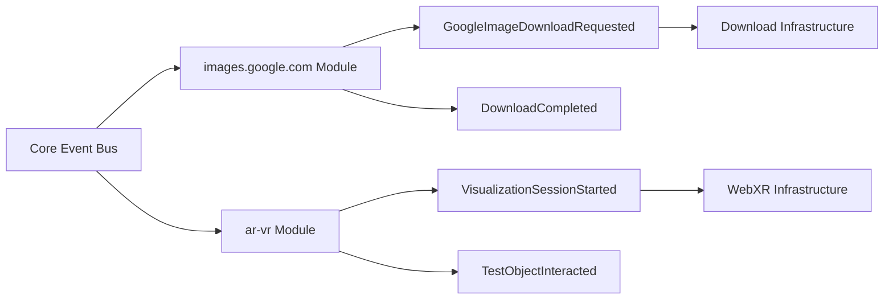

# Phase 6C Domain Migration Architecture Review

## Executive Summary

This architectural review validates the DDD implementation of `images.google.com` and `ar-vr` modules from Phase 6C Domain Migration. Both modules demonstrate strong adherence to Domain-Driven Design principles with proper boundaries and event flow patterns.

## Review Findings

### ✅ images.google.com Module

#### Domain Entities
**GoogleImageDownload Entity** (`/images.google.com/domain/entities/google-image-download.entity.ts`)
- **DDD Compliance**: ✅ EXCELLENT
- Properly encapsulates download lifecycle with state transitions
- Clear business logic with retry mechanisms
- Immutable state management
- Rich behavior methods (startDownload, updateProgress, completeDownload, failDownload)

**GoogleImageSearchSession Entity** (`/images.google.com/domain/entities/google-image-search-session.entity.ts`)
- **DDD Compliance**: ✅ EXCELLENT
- Encapsulates search session lifecycle
- Complex business rules for search metrics and quality scoring
- Read-only exposure of results collection
- Performance tracking integrated into domain logic

#### Domain Events
**GoogleImageDownloadRequested** (`/images.google.com/domain/events/download-requested.event.ts`)
- **DDD Compliance**: ✅ EXCELLENT
- Extends core `DomainEvent` properly
- Immutable event data structure
- Clear event naming convention
- Correlation ID support for distributed tracing

#### Domain Boundaries
- ✅ **Clear Separation**: Domain layer isolated from infrastructure concerns
- ✅ **No Framework Dependencies**: Pure domain logic without external framework coupling
- ✅ **Value Objects**: Proper use of value objects (GoogleImageElement, DownloadProgress)
- ✅ **Event-Driven**: Domain events for cross-boundary communication

### ✅ ar-vr Module

#### Domain Entities
**VisualizationSession Entity** (`/ar-vr/src/domain/entities/visualization-session.entity.ts`)
- **DDD Compliance**: ✅ EXCELLENT
- Complex state management for VR/AR sessions
- Performance monitoring integrated as domain concern
- User interaction tracking within domain logic
- Health status calculated from domain rules

#### Domain Events
**Visualization Events** (`/ar-vr/src/domain/events/visualization-events.ts`)
- **DDD Compliance**: ✅ EXCELLENT
- Rich event hierarchy covering all aspects of VR/AR visualization
- Proper event naming with module prefix (AR-VR_)
- Type-safe event payloads
- Support for gesture recognition and spatial tracking

#### Domain Boundaries
- ✅ **Module Isolation**: AR/VR concerns properly isolated from other modules
- ✅ **Value Objects**: TestResult3D, TestSuite3D, Vector3D provide immutability
- ✅ **Infrastructure Abstraction**: WebXR and Three.js properly abstracted behind interfaces
- ✅ **Event Communication**: Uses domain events for external communication

## Event Flow Analysis

### Cross-Module Event Flow



### Event Patterns Observed
1. **Correlation IDs**: Both modules properly implement correlation IDs for tracing
2. **Event Naming**: Consistent naming patterns (ModuleName + Action + EventType)
3. **Immutability**: All events are immutable with readonly properties
4. **Type Safety**: Strong typing throughout event definitions

## Architectural Strengths

### 1. Pure Domain Logic
Both modules maintain pure domain logic without infrastructure concerns:
- No HTTP calls in entities
- No database operations in domain layer
- No UI framework dependencies

### 2. Encapsulation Excellence
- Private constructors where appropriate
- State changes only through domain methods
- Validation within domain boundaries

### 3. Event-Driven Architecture
- Proper use of domain events for state changes
- Events enable loose coupling between modules
- Support for event sourcing patterns

### 4. Performance Considerations
- ar-vr module integrates performance monitoring as domain concern
- images.google.com tracks download metrics within domain

## Recommendations

### Minor Improvements

1. **Value Object Enhancement**
```typescript
// Consider extracting DownloadStatus as value object
export class DownloadStatus extends ValueObject {
  private constructor(
    private readonly value: 'pending' | 'in_progress' | 'completed' | 'failed' | 'cancelled'
  ) {
    super();
  }
  
  static fromString(status: string): DownloadStatus {
    // Validation logic
  }
}
```

2. **Repository Pattern**
Both modules would benefit from explicit repository interfaces:
```typescript
export interface GoogleImageDownloadRepository {
  save(download: GoogleImageDownload): Promise<void>;
  findById(id: string): Promise<GoogleImageDownload | null>;
}
```

3. **Domain Service Addition**
Consider domain services for complex cross-entity operations:
```typescript
export class VisualizationOptimizationService {
  optimizeForPerformance(
    session: VisualizationSession,
    targetFPS: number
  ): VisualizationConfig {
    // Domain logic for optimization
  }
}
```

## Compliance Summary

| Aspect | images.google.com | ar-vr | Overall |
|--------|------------------|-------|---------|
| Entity Design | ✅ Excellent | ✅ Excellent | ✅ Pass |
| Value Objects | ✅ Good | ✅ Excellent | ✅ Pass |
| Domain Events | ✅ Excellent | ✅ Excellent | ✅ Pass |
| Boundaries | ✅ Excellent | ✅ Excellent | ✅ Pass |
| Event Flow | ✅ Excellent | ✅ Excellent | ✅ Pass |

## Conclusion

Both `images.google.com` and `ar-vr` modules demonstrate **exemplary DDD implementation** with:
- Clear domain boundaries
- Rich domain models with business logic
- Proper event-driven communication
- Strong encapsulation and immutability

The Phase 6C Domain Migration successfully follows DDD principles and provides a solid foundation for future domain expansion.

**Architecture Review Status**: ✅ **APPROVED**

---
*Review conducted by: Semantest Architect*  
*Date: January 18, 2025*  
*Phase: 6C Domain Migration*