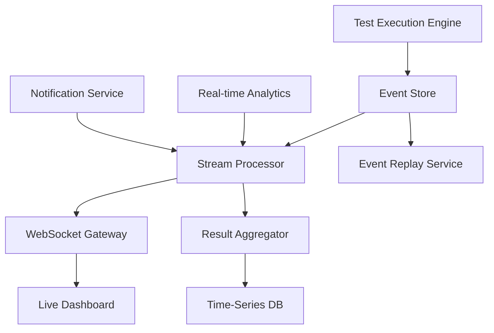

# Real-Time Test Result Streaming Architecture

## Overview

This document outlines the architecture for real-time test result streaming to enable live dashboard updates using WebSocket patterns and event sourcing. The system provides sub-second latency for test execution updates, result aggregation, and live analytics.

## Architecture Overview



## Event Sourcing Architecture

### Event Store Design

```typescript
// Core Event Structure
export interface TestEvent {
    eventId: string;
    eventType: TestEventType;
    streamId: string; // Test execution session ID
    version: number;
    timestamp: Date;
    causationId?: string; // Event that caused this event
    correlationId: string; // Business process ID
    data: TestEventData;
    metadata: EventMetadata;
}

export enum TestEventType {
    // Test Lifecycle Events
    TEST_SUITE_STARTED = 'test_suite_started',
    TEST_SUITE_COMPLETED = 'test_suite_completed',
    TEST_CASE_STARTED = 'test_case_started',
    TEST_CASE_COMPLETED = 'test_case_completed',
    
    // Result Events
    TEST_PASSED = 'test_passed',
    TEST_FAILED = 'test_failed',
    TEST_SKIPPED = 'test_skipped',
    
    // Progress Events
    ASSERTION_EVALUATED = 'assertion_evaluated',
    COVERAGE_UPDATED = 'coverage_updated',
    PERFORMANCE_MEASURED = 'performance_measured',
    
    // Error Events
    TEST_ERROR = 'test_error',
    TIMEOUT_OCCURRED = 'timeout_occurred',
    SETUP_FAILED = 'setup_failed'
}

export interface TestEventData {
    // Common fields
    testId?: string;
    testName?: string;
    testSuiteId?: string;
    testSuiteName?: string;
    
    // Result-specific data
    result?: TestResult;
    error?: TestError;
    duration?: number;
    coverage?: CoverageData;
    performance?: PerformanceMetrics;
    assertions?: AssertionResult[];
}
```

### Event Store Implementation

```typescript
export class TestEventStore {
    private readonly database: EventDatabase;
    private readonly streamProcessor: StreamProcessor;
    private readonly snapshotStore: SnapshotStore;
    
    async appendEvent(event: TestEvent): Promise<void> {
        // Validate event structure
        await this.validateEvent(event);
        
        // Check stream version for concurrency control
        await this.checkStreamVersion(event.streamId, event.version);
        
        // Append to event store
        await this.database.appendEvent(event);
        
        // Publish to stream processor
        await this.streamProcessor.publish(event);
        
        // Update projections
        await this.updateProjections(event);
    }
    
    async getEventStream(
        streamId: string,
        fromVersion?: number
    ): Promise<TestEvent[]> {
        return await this.database.getEventStream(streamId, fromVersion);
    }
    
    async replayEvents(
        streamId: string,
        toVersion?: number
    ): Promise<TestExecution> {
        // Get events from store
        const events = await this.getEventStream(streamId, 0);
        
        // Replay events to rebuild state
        const execution = new TestExecution();
        for (const event of events) {
            if (toVersion && event.version > toVersion) break;
            execution.apply(event);
        }
        
        return execution;
    }
}
```

### Event Projections

```typescript
export class TestResultProjections {
    private readonly eventStore: TestEventStore;
    private readonly timeSeriesDB: TimeSeriesDatabase;
    private readonly realTimeCache: RealTimeCache;
    
    async handleEvent(event: TestEvent): Promise<void> {
        switch (event.eventType) {
            case TestEventType.TEST_SUITE_STARTED:
                await this.updateSuiteProjection(event);
                break;
                
            case TestEventType.TEST_CASE_COMPLETED:
                await this.updateTestCaseProjection(event);
                await this.updateCoverageProjection(event);
                await this.updatePerformanceProjection(event);
                break;
                
            case TestEventType.TEST_SUITE_COMPLETED:
                await this.updateSuiteSummary(event);
                await this.triggerAnalytics(event);
                break;
        }
    }
    
    private async updateTestCaseProjection(event: TestEvent): Promise<void> {
        const projection = {
            testId: event.data.testId,
            name: event.data.testName,
            result: event.data.result,
            duration: event.data.duration,
            timestamp: event.timestamp,
            coverage: event.data.coverage,
            assertions: event.data.assertions
        };
        
        // Update real-time cache for immediate access
        await this.realTimeCache.set(
            `test:${event.data.testId}`,
            projection,
            { ttl: 3600 }
        );
        
        // Store in time-series DB for analytics
        await this.timeSeriesDB.insert('test_results', {
            timestamp: event.timestamp,
            tags: {
                testId: event.data.testId,
                suiteId: event.data.testSuiteId,
                result: event.data.result
            },
            fields: {
                duration: event.data.duration,
                coverage: event.data.coverage?.percentage || 0
            }
        });
    }
}
```

## WebSocket Streaming Patterns

### WebSocket Gateway Architecture

```typescript
export class WebSocketGateway {
    private readonly server: WebSocketServer;
    private readonly clients: Map<string, WebSocketClient>;
    private readonly subscriptions: Map<string, Set<string>>;
    private readonly rateLimiter: RateLimiter;
    
    constructor() {
        this.server = new WebSocketServer({
            port: 8080,
            maxConnections: 10000,
            pingInterval: 30000,
            compression: true
        });
        
        this.setupEventHandlers();
    }
    
    private setupEventHandlers(): void {
        this.server.on('connection', (ws, request) => {
            const clientId = this.generateClientId();
            const client = new WebSocketClient(clientId, ws);
            
            this.clients.set(clientId, client);
            
            ws.on('message', async (message) => {
                await this.handleClientMessage(client, message);
            });
            
            ws.on('close', () => {
                this.handleClientDisconnect(clientId);
            });
        });
    }
    
    async handleClientMessage(
        client: WebSocketClient,
        message: Buffer
    ): Promise<void> {
        try {
            const data = JSON.parse(message.toString());
            
            switch (data.type) {
                case 'subscribe':
                    await this.handleSubscription(client, data);
                    break;
                    
                case 'unsubscribe':
                    await this.handleUnsubscription(client, data);
                    break;
                    
                case 'ping':
                    client.send({ type: 'pong', timestamp: Date.now() });
                    break;
            }
        } catch (error) {
            client.send({
                type: 'error',
                error: 'Invalid message format'
            });
        }
    }
    
    private async handleSubscription(
        client: WebSocketClient,
        data: SubscriptionRequest
    ): Promise<void> {
        // Rate limiting
        if (!await this.rateLimiter.allow(client.id, 'subscribe', 10)) {
            client.send({
                type: 'error',
                error: 'Subscription rate limit exceeded'
            });
            return;
        }
        
        // Validate subscription
        const subscription = await this.validateSubscription(data);
        if (!subscription.isValid) {
            client.send({
                type: 'error',
                error: subscription.error
            });
            return;
        }
        
        // Add subscription
        const subscriptionKey = this.createSubscriptionKey(data);
        if (!this.subscriptions.has(subscriptionKey)) {
            this.subscriptions.set(subscriptionKey, new Set());
        }
        this.subscriptions.get(subscriptionKey)!.add(client.id);
        
        // Send initial data if available
        const initialData = await this.getInitialData(data);
        if (initialData) {
            client.send({
                type: 'initial_data',
                subscription: subscriptionKey,
                data: initialData
            });
        }
        
        client.send({
            type: 'subscription_confirmed',
            subscription: subscriptionKey
        });
    }
}
```

### Subscription Management

```typescript
export interface SubscriptionRequest {
    type: 'subscribe';
    channel: SubscriptionChannel;
    filters?: SubscriptionFilters;
    options?: SubscriptionOptions;
}

export enum SubscriptionChannel {
    // Test execution channels
    TEST_SUITE_PROGRESS = 'test_suite_progress',
    TEST_CASE_RESULTS = 'test_case_results',
    LIVE_COVERAGE = 'live_coverage',
    
    // Analytics channels
    REAL_TIME_METRICS = 'real_time_metrics',
    PERFORMANCE_FEED = 'performance_feed',
    ERROR_STREAM = 'error_stream',
    
    // Dashboard channels
    DASHBOARD_UPDATES = 'dashboard_updates',
    ALERT_NOTIFICATIONS = 'alert_notifications',
    USER_ACTIVITY = 'user_activity'
}

export interface SubscriptionFilters {
    testSuiteId?: string;
    testFramework?: string;
    userId?: string;
    severity?: 'info' | 'warning' | 'error';
    tags?: string[];
}

export interface SubscriptionOptions {
    bufferSize?: number; // Number of events to buffer
    throttleMs?: number; // Minimum interval between updates
    aggregateResults?: boolean; // Aggregate multiple events
}
```

### Stream Processing Pipeline

```typescript
export class StreamProcessor {
    private readonly kafka: KafkaClient;
    private readonly eventBus: EventBus;
    private readonly aggregators: Map<string, Aggregator>;
    
    async processTestEvent(event: TestEvent): Promise<void> {
        // Route to appropriate processors
        const processors = this.getProcessorsForEvent(event);
        
        await Promise.all(processors.map(processor => 
            processor.process(event)
        ));
    }
    
    private getProcessorsForEvent(event: TestEvent): EventProcessor[] {
        const processors: EventProcessor[] = [];
        
        // Real-time dashboard updates
        processors.push(new DashboardProcessor());
        
        // Live test progress
        if (this.isTestProgressEvent(event)) {
            processors.push(new TestProgressProcessor());
        }
        
        // Coverage tracking
        if (event.data.coverage) {
            processors.push(new CoverageProcessor());
        }
        
        // Performance monitoring
        if (event.data.performance) {
            processors.push(new PerformanceProcessor());
        }
        
        // Error analysis
        if (event.eventType === TestEventType.TEST_ERROR) {
            processors.push(new ErrorAnalysisProcessor());
        }
        
        return processors;
    }
}

class DashboardProcessor implements EventProcessor {
    private readonly wsGateway: WebSocketGateway;
    private readonly aggregator: DashboardAggregator;
    
    async process(event: TestEvent): Promise<void> {
        // Aggregate metrics
        const metrics = await this.aggregator.aggregate(event);
        
        // Broadcast to dashboard subscribers
        await this.wsGateway.broadcast('dashboard_updates', {
            eventType: event.eventType,
            metrics,
            timestamp: event.timestamp
        });
        
        // Update specific channels
        if (event.eventType === TestEventType.TEST_CASE_COMPLETED) {
            await this.wsGateway.broadcastToChannel(
                'test_case_results',
                {
                    testId: event.data.testId,
                    result: event.data.result,
                    duration: event.data.duration
                },
                { testSuiteId: event.data.testSuiteId }
            );
        }
    }
}
```

## Real-Time Aggregation

### Live Metrics Calculator

```typescript
export class LiveMetricsCalculator {
    private readonly slidingWindow: SlidingWindow;
    private readonly metricsCache: MetricsCache;
    
    async updateMetrics(event: TestEvent): Promise<LiveMetrics> {
        // Add event to sliding window
        this.slidingWindow.add(event);
        
        // Calculate real-time metrics
        const metrics = {
            // Test execution metrics
            testsPerSecond: this.calculateTestsPerSecond(),
            successRate: this.calculateSuccessRate(),
            averageDuration: this.calculateAverageDuration(),
            
            // Coverage metrics
            liveCoverage: this.calculateLiveCoverage(),
            coverageTrend: this.calculateCoverageTrend(),
            
            // Performance metrics
            performanceScore: this.calculatePerformanceScore(),
            memoryUsage: this.calculateMemoryUsage(),
            
            // Error metrics
            errorRate: this.calculateErrorRate(),
            failurePatterns: this.identifyFailurePatterns()
        };
        
        // Cache metrics for dashboard
        await this.metricsCache.set('live_metrics', metrics, { ttl: 1 });
        
        return metrics;
    }
    
    private calculateTestsPerSecond(): number {
        const recentTests = this.slidingWindow.getEventsInLastSeconds(60);
        return recentTests.length / 60;
    }
    
    private calculateSuccessRate(): number {
        const recentResults = this.slidingWindow.getEventsOfType(
            TestEventType.TEST_CASE_COMPLETED
        );
        
        if (recentResults.length === 0) return 100;
        
        const passed = recentResults.filter(e => 
            e.data.result === 'passed'
        ).length;
        
        return (passed / recentResults.length) * 100;
    }
}
```

### Event Aggregation Strategies

```typescript
export class EventAggregator {
    private readonly aggregationRules: Map<string, AggregationRule>;
    
    constructor() {
        this.setupAggregationRules();
    }
    
    private setupAggregationRules(): void {
        // Test progress aggregation
        this.aggregationRules.set('test_progress', {
            windowSize: 1000, // ms
            strategy: 'latest',
            reducer: (events) => ({
                testsCompleted: events.length,
                latestResult: events[events.length - 1]?.data.result
            })
        });
        
        // Coverage aggregation
        this.aggregationRules.set('coverage_updates', {
            windowSize: 5000, // ms
            strategy: 'merge',
            reducer: (events) => {
                const coverageData = events
                    .filter(e => e.data.coverage)
                    .map(e => e.data.coverage);
                    
                return this.mergeCoverageData(coverageData);
            }
        });
        
        // Performance aggregation
        this.aggregationRules.set('performance_metrics', {
            windowSize: 10000, // ms
            strategy: 'average',
            reducer: (events) => ({
                avgDuration: this.average(events.map(e => e.data.duration)),
                avgMemory: this.average(events.map(e => e.data.performance?.memory)),
                maxDuration: Math.max(...events.map(e => e.data.duration))
            })
        });
    }
}
```

## Scalability & Performance

### Connection Management

```typescript
export class ConnectionManager {
    private readonly connectionPools: Map<string, ConnectionPool>;
    private readonly loadBalancer: LoadBalancer;
    
    async distributeConnections(): Promise<void> {
        const servers = await this.getAvailableServers();
        
        for (const [clientId, client] of this.clients) {
            const optimalServer = this.loadBalancer.selectServer(servers, {
                clientLocation: client.location,
                subscriptionCount: client.subscriptions.size,
                bandwidth: client.bandwidth
            });
            
            if (client.server !== optimalServer) {
                await this.migrateClient(client, optimalServer);
            }
        }
    }
    
    private async migrateClient(
        client: WebSocketClient,
        targetServer: string
    ): Promise<void> {
        // Pause client updates
        client.pause();
        
        // Transfer state to target server
        await this.transferClientState(client, targetServer);
        
        // Redirect client connection
        client.send({
            type: 'redirect',
            server: targetServer,
            reason: 'load_balancing'
        });
        
        // Close current connection
        client.close();
    }
}
```

### Message Batching

```typescript
export class MessageBatcher {
    private readonly batches: Map<string, MessageBatch>;
    private readonly batchTimer: Timer;
    
    async addMessage(
        clientId: string,
        message: WebSocketMessage
    ): Promise<void> {
        if (!this.batches.has(clientId)) {
            this.batches.set(clientId, new MessageBatch());
        }
        
        const batch = this.batches.get(clientId)!;
        batch.add(message);
        
        // Send batch if full or timer expired
        if (batch.isFull() || batch.isExpired()) {
            await this.sendBatch(clientId, batch);
            this.batches.delete(clientId);
        }
    }
    
    private async sendBatch(
        clientId: string,
        batch: MessageBatch
    ): Promise<void> {
        const client = this.clients.get(clientId);
        if (!client) return;
        
        const batchedMessage = {
            type: 'batch',
            messages: batch.getMessages(),
            sequence: batch.getSequence(),
            timestamp: Date.now()
        };
        
        client.send(batchedMessage);
    }
}
```

## Error Handling & Resilience

### Circuit Breaker Pattern

```typescript
export class StreamCircuitBreaker {
    private state: 'closed' | 'open' | 'half-open' = 'closed';
    private failures = 0;
    private lastFailureTime = 0;
    private readonly threshold = 5;
    private readonly timeout = 60000; // 1 minute
    
    async execute<T>(operation: () => Promise<T>): Promise<T> {
        if (this.state === 'open') {
            if (Date.now() - this.lastFailureTime > this.timeout) {
                this.state = 'half-open';
            } else {
                throw new Error('Circuit breaker is open');
            }
        }
        
        try {
            const result = await operation();
            this.onSuccess();
            return result;
        } catch (error) {
            this.onFailure();
            throw error;
        }
    }
    
    private onSuccess(): void {
        this.failures = 0;
        this.state = 'closed';
    }
    
    private onFailure(): void {
        this.failures++;
        this.lastFailureTime = Date.now();
        
        if (this.failures >= this.threshold) {
            this.state = 'open';
        }
    }
}
```

### Retry Strategies

```typescript
export class StreamRetryHandler {
    async withRetry<T>(
        operation: () => Promise<T>,
        strategy: RetryStrategy = 'exponential'
    ): Promise<T> {
        const maxAttempts = 3;
        let attempt = 1;
        
        while (attempt <= maxAttempts) {
            try {
                return await operation();
            } catch (error) {
                if (attempt === maxAttempts) {
                    throw error;
                }
                
                const delay = this.calculateDelay(attempt, strategy);
                await this.sleep(delay);
                attempt++;
            }
        }
        
        throw new Error('Max retry attempts exceeded');
    }
    
    private calculateDelay(attempt: number, strategy: RetryStrategy): number {
        switch (strategy) {
            case 'exponential':
                return Math.pow(2, attempt) * 1000;
            case 'linear':
                return attempt * 1000;
            case 'fixed':
                return 5000;
            default:
                return 1000;
        }
    }
}
```

## Monitoring & Observability

### Stream Health Metrics

```typescript
export class StreamHealthMonitor {
    private readonly metrics: MetricsCollector;
    
    async collectMetrics(): Promise<StreamHealthMetrics> {
        return {
            // Connection metrics
            activeConnections: this.getActiveConnections(),
            connectionRate: this.getConnectionRate(),
            disconnectionRate: this.getDisconnectionRate(),
            
            // Message metrics
            messagesPerSecond: this.getMessagesPerSecond(),
            messageLatency: this.getAverageLatency(),
            queueDepth: this.getQueueDepth(),
            
            // Error metrics
            errorRate: this.getErrorRate(),
            timeoutRate: this.getTimeoutRate(),
            retryRate: this.getRetryRate(),
            
            // Resource metrics
            memoryUsage: this.getMemoryUsage(),
            cpuUsage: this.getCpuUsage(),
            networkBandwidth: this.getNetworkBandwidth()
        };
    }
    
    async detectAnomalies(): Promise<HealthAlert[]> {
        const metrics = await this.collectMetrics();
        const alerts: HealthAlert[] = [];
        
        // High latency detection
        if (metrics.messageLatency > 1000) {
            alerts.push({
                type: 'high_latency',
                severity: 'warning',
                value: metrics.messageLatency,
                threshold: 1000
            });
        }
        
        // High error rate detection
        if (metrics.errorRate > 0.05) {
            alerts.push({
                type: 'high_error_rate',
                severity: 'error',
                value: metrics.errorRate,
                threshold: 0.05
            });
        }
        
        return alerts;
    }
}
```

## Client SDK

### JavaScript/TypeScript Client

```typescript
export class SemantestStreamClient {
    private ws: WebSocket;
    private subscriptions: Map<string, SubscriptionHandler>;
    private reconnectAttempts = 0;
    private maxReconnectAttempts = 5;
    
    constructor(private config: StreamClientConfig) {
        this.subscriptions = new Map();
    }
    
    async connect(): Promise<void> {
        return new Promise((resolve, reject) => {
            this.ws = new WebSocket(this.config.url, {
                headers: {
                    'Authorization': `Bearer ${this.config.token}`
                }
            });
            
            this.ws.onopen = () => {
                this.reconnectAttempts = 0;
                resolve();
            };
            
            this.ws.onmessage = (event) => {
                this.handleMessage(JSON.parse(event.data));
            };
            
            this.ws.onclose = () => {
                this.handleDisconnection();
            };
            
            this.ws.onerror = (error) => {
                reject(error);
            };
        });
    }
    
    subscribeToTestResults(
        testSuiteId: string,
        handler: TestResultHandler
    ): Subscription {
        const subscriptionId = this.generateId();
        
        this.send({
            type: 'subscribe',
            channel: 'test_case_results',
            filters: { testSuiteId },
            subscriptionId
        });
        
        this.subscriptions.set(subscriptionId, handler);
        
        return {
            id: subscriptionId,
            unsubscribe: () => this.unsubscribe(subscriptionId)
        };
    }
    
    subscribeToLiveMetrics(handler: MetricsHandler): Subscription {
        const subscriptionId = this.generateId();
        
        this.send({
            type: 'subscribe',
            channel: 'real_time_metrics',
            subscriptionId
        });
        
        this.subscriptions.set(subscriptionId, handler);
        
        return {
            id: subscriptionId,
            unsubscribe: () => this.unsubscribe(subscriptionId)
        };
    }
}
```

## Performance Targets

### Latency Requirements
- **Event to WebSocket**: < 100ms (95th percentile)
- **WebSocket to Dashboard**: < 50ms
- **End-to-end Latency**: < 200ms
- **Message Throughput**: 100,000 messages/second

### Scalability Targets
- **Concurrent Connections**: 50,000 per server
- **Horizontal Scaling**: Auto-scale based on connection count
- **Event Storage**: 1TB+ with 99.9% availability
- **Message Retention**: 30 days for replay capability

This architecture provides a robust, scalable foundation for real-time test result streaming with sub-second latency and enterprise-grade reliability.