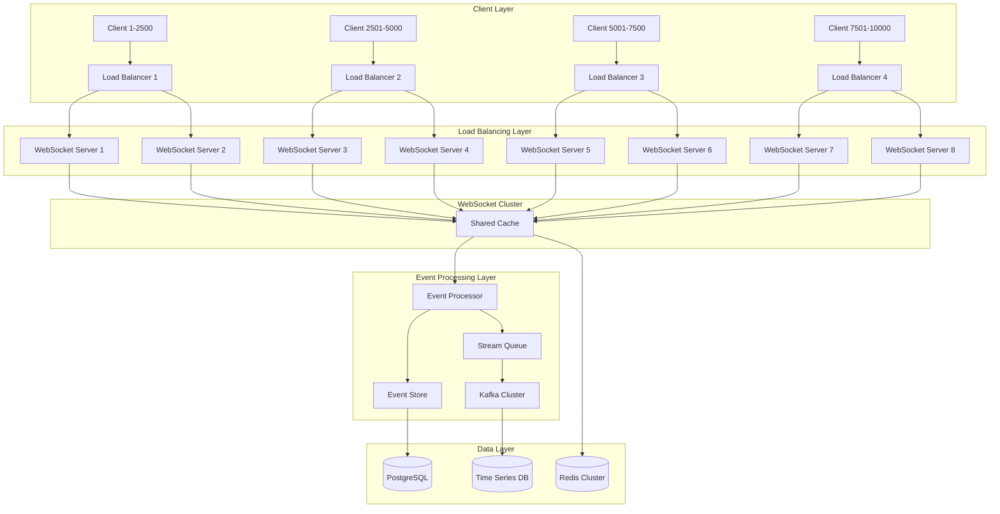

# WebSocket Streaming Architecture Optimization for 10,000+ Concurrent Connections

## Executive Summary

This document provides an optimized WebSocket streaming architecture capable of supporting 10,000+ concurrent connections with sub-100ms latency and enterprise-grade reliability. The solution includes advanced load balancing strategies, optimized event sourcing patterns, and comprehensive scalability recommendations.

## Architecture Overview



## Optimized WebSocket Server Architecture

### High-Performance WebSocket Server

```typescript
export class OptimizedWebSocketServer {
    private readonly server: uWS.App;
    private readonly connectionPool: ConnectionPool;
    private readonly messageRouter: MessageRouter;
    private readonly resourceMonitor: ResourceMonitor;
    private readonly backpressureManager: BackpressureManager;
    
    constructor(config: ServerConfig) {
        this.server = uWS.App({
            // Enable compression for reduced bandwidth
            compression: uWS.SHARED_COMPRESSOR,
            
            // Maximum payload size (1MB)
            maxPayloadLength: 1024 * 1024,
            
            // Connection timeout
            idleTimeout: 32,
            
            // Maximum backpressure before dropping messages
            maxBackpressure: 64 * 1024,
            
            // Enable permessage-deflate
            maxCompressedSize: 64 * 1024
        });
        
        this.setupRoutes();
        this.setupConnectionHandling();
    }
    
    private setupConnectionHandling(): void {
        this.server.ws('/stream', {
            compression: uWS.DEDICATED_COMPRESSOR,
            maxCompressedSize: 32 * 1024,
            
            upgrade: (res, req, context) => {
                // Authenticate before upgrade
                const token = req.getHeader('authorization');
                const clientId = this.authenticateClient(token);
                
                if (!clientId) {
                    res.writeStatus('401').end();
                    return;
                }
                
                // Check connection limits
                if (!this.connectionPool.canAcceptConnection()) {
                    res.writeStatus('503').end();
                    return;
                }
                
                res.upgrade({
                    clientId,
                    connectionTime: Date.now(),
                    subscriptions: new Set()
                }, 
                req.getHeader('sec-websocket-key'),
                req.getHeader('sec-websocket-protocol'),
                req.getHeader('sec-websocket-extensions'),
                context);
            },
            
            open: (ws) => {
                const clientData = ws.getUserData();
                this.connectionPool.addConnection(clientData.clientId, ws);
                
                // Send connection confirmation
                ws.send(JSON.stringify({
                    type: 'connected',
                    serverId: this.serverId,
                    timestamp: Date.now()
                }));
                
                // Start heartbeat
                this.startHeartbeat(ws);
            },
            
            message: async (ws, message, opCode) => {
                const clientData = ws.getUserData();
                
                try {
                    const data = JSON.parse(Buffer.from(message).toString());
                    await this.messageRouter.route(clientData.clientId, data, ws);
                } catch (error) {
                    this.handleMessageError(ws, error);
                }
            },
            
            close: (ws, code, message) => {
                const clientData = ws.getUserData();
                this.connectionPool.removeConnection(clientData.clientId);
                this.cleanupClientResources(clientData.clientId);
            },
            
            drain: (ws) => {
                // Handle backpressure
                this.backpressureManager.handleDrain(ws);
            }
        });
    }
}
```

### Advanced Connection Pool Management

```typescript
export class ConnectionPool {
    private readonly connections: Map<string, WebSocketConnection>;
    private readonly connectionsByServer: Map<string, Set<string>>;
    private readonly maxConnectionsPerServer: number = 2500;
    private readonly connectionMetrics: ConnectionMetrics;
    
    constructor() {
        this.connections = new Map();
        this.connectionsByServer = new Map();
        this.connectionMetrics = new ConnectionMetrics();
        
        // Start background cleanup
        this.startCleanupInterval();
    }
    
    addConnection(clientId: string, ws: WebSocket): boolean {
        const serverId = this.getServerId();
        
        // Check server capacity
        const serverConnections = this.connectionsByServer.get(serverId) || new Set();
        if (serverConnections.size >= this.maxConnectionsPerServer) {
            return false;
        }
        
        const connection = new WebSocketConnection(clientId, ws, serverId);
        this.connections.set(clientId, connection);
        
        serverConnections.add(clientId);
        this.connectionsByServer.set(serverId, serverConnections);
        
        this.connectionMetrics.recordConnection(serverId);
        return true;
    }
    
    canAcceptConnection(): boolean {
        const serverId = this.getServerId();
        const serverConnections = this.connectionsByServer.get(serverId) || new Set();
        return serverConnections.size < this.maxConnectionsPerServer;
    }
    
    // Connection migration for load balancing
    async migrateConnection(
        clientId: string,
        targetServer: string
    ): Promise<void> {
        const connection = this.connections.get(clientId);
        if (!connection) return;
        
        // Prepare migration
        const migrationToken = this.generateMigrationToken(clientId);
        
        // Notify client of migration
        connection.ws.send(JSON.stringify({
            type: 'migrate',
            targetServer,
            token: migrationToken,
            reason: 'load_balancing'
        }));
        
        // Store migration state
        await this.storeMigrationState(clientId, targetServer, migrationToken);
        
        // Clean up after delay (allow client to reconnect)
        setTimeout(() => {
            this.removeConnection(clientId);
        }, 30000);
    }
}
```

## Load Balancing Strategy

### Multi-Tier Load Balancing

```typescript
export class WebSocketLoadBalancer {
    private readonly serverPool: ServerPool;
    private readonly healthChecker: HealthChecker;
    private readonly connectionTracker: ConnectionTracker;
    private readonly migrationManager: MigrationManager;
    
    constructor() {
        this.setupLoadBalancingAlgorithm();
    }
    
    async selectServer(clientRequest: ClientRequest): Promise<ServerSelection> {
        const candidates = await this.getHealthyServers();
        
        // Apply multi-criteria selection
        const scored = candidates.map(server => ({
            server,
            score: this.calculateServerScore(server, clientRequest)
        }));
        
        // Sort by score (highest first)
        scored.sort((a, b) => b.score - a.score);
        
        const selected = scored[0].server;
        
        // Check if rebalancing is needed
        if (this.shouldRebalance()) {
            await this.performRebalancing();
        }
        
        return {
            serverId: selected.id,
            serverUrl: selected.url,
            connectionLimit: selected.maxConnections,
            currentLoad: selected.currentConnections
        };
    }
    
    private calculateServerScore(
        server: WebSocketServer,
        request: ClientRequest
    ): number {
        const factors = {
            // CPU usage (lower is better)
            cpu: (100 - server.cpuUsage) * 0.25,
            
            // Memory usage (lower is better)
            memory: (100 - server.memoryUsage) * 0.20,
            
            // Connection count (lower is better)
            connections: (1 - server.currentConnections / server.maxConnections) * 0.25,
            
            // Geographic proximity
            proximity: this.calculateProximityScore(server, request) * 0.15,
            
            // Network latency (lower is better)
            latency: Math.max(0, 100 - server.averageLatency) * 0.15
        };
        
        return Object.values(factors).reduce((sum, score) => sum + score, 0);
    }
    
    private async performRebalancing(): Promise<void> {
        const servers = await this.getHealthyServers();
        const overloadedServers = servers.filter(s => s.load > 0.85);
        const underloadedServers = servers.filter(s => s.load < 0.3);
        
        for (const overloaded of overloadedServers) {
            const target = this.selectMigrationTarget(underloadedServers);
            if (!target) continue;
            
            const connectionsToMigrate = Math.ceil(
                (overloaded.currentConnections - overloaded.maxConnections * 0.8) / 2
            );
            
            await this.migrationManager.migrateConnections(
                overloaded,
                target,
                connectionsToMigrate
            );
        }
    }
}
```

### Geographic Load Distribution

```typescript
export class GeographicLoadBalancer {
    private readonly regions: Map<string, ServerCluster>;
    private readonly latencyMonitor: LatencyMonitor;
    
    async routeByGeography(clientRequest: ClientRequest): Promise<ServerSelection> {
        const clientRegion = await this.detectClientRegion(clientRequest.ip);
        
        // Primary: Local region servers
        let candidates = this.regions.get(clientRegion)?.servers || [];
        
        // Fallback: Nearby regions if local is unavailable/overloaded
        if (candidates.length === 0 || this.isRegionOverloaded(clientRegion)) {
            const nearbyRegions = this.getNearbyRegions(clientRegion);
            candidates = nearbyRegions.flatMap(region => 
                this.regions.get(region)?.servers || []
            );
        }
        
        // Final fallback: Any available server
        if (candidates.length === 0) {
            candidates = Array.from(this.regions.values())
                .flatMap(cluster => cluster.servers);
        }
        
        return this.selectOptimalServer(candidates, clientRequest);
    }
    
    private async detectClientRegion(ip: string): Promise<string> {
        // Use GeoIP service or CDN edge location
        const geoData = await this.geoIpService.lookup(ip);
        return this.mapToServerRegion(geoData.country, geoData.region);
    }
}
```

## Optimized Event Sourcing Patterns

### High-Performance Event Store

```typescript
export class OptimizedEventStore {
    private readonly primaryDB: PostgreSQLCluster;
    private readonly readReplicas: PostgreSQLReplica[];
    private readonly eventCache: EventCache;
    private readonly streamProcessor: StreamProcessor;
    private readonly partitionManager: PartitionManager;
    
    async appendEvent(event: TestEvent): Promise<void> {
        // Partition selection for horizontal scaling
        const partition = this.partitionManager.selectPartition(event.streamId);
        
        // Batch events for better throughput
        const batch = await this.batchManager.addEvent(event);
        
        if (batch.isFull() || batch.isExpired()) {
            await this.writeBatch(batch, partition);
        }
        
        // Immediate cache for real-time reads
        await this.eventCache.store(event);
        
        // Async projection updates
        setImmediate(() => {
            this.streamProcessor.processEvent(event);
        });
    }
    
    private async writeBatch(
        batch: EventBatch,
        partition: string
    ): Promise<void> {
        const connection = this.primaryDB.getConnection(partition);
        
        try {
            await connection.transaction(async (trx) => {
                // Bulk insert for performance
                await trx.batchInsert('events', batch.getEvents().map(event => ({
                    event_id: event.eventId,
                    stream_id: event.streamId,
                    event_type: event.eventType,
                    event_data: JSON.stringify(event.data),
                    metadata: JSON.stringify(event.metadata),
                    version: event.version,
                    created_at: event.timestamp,
                    partition: partition
                })));
                
                // Update stream versions
                await this.updateStreamVersions(trx, batch.getStreams());
            });
        } catch (error) {
            // Retry logic for failed batches
            await this.retryBatch(batch, partition);
        }
    }
}
```

### Event Stream Partitioning

```typescript
export class EventStreamPartitioner {
    private readonly partitionCount: number = 32;
    private readonly consistentHash: ConsistentHash;
    
    constructor() {
        this.consistentHash = new ConsistentHash({
            virtualNodes: 150,
            hashFunction: 'sha256'
        });
        
        this.setupPartitions();
    }
    
    selectPartition(streamId: string): string {
        // Use consistent hashing for even distribution
        const hash = this.consistentHash.hash(streamId);
        const partitionIndex = hash % this.partitionCount;
        return `partition_${partitionIndex}`;
    }
    
    async rebalancePartitions(): Promise<void> {
        const partitionStats = await this.getPartitionStatistics();
        const overloadedPartitions = partitionStats.filter(p => p.load > 0.85);
        
        for (const partition of overloadedPartitions) {
            await this.splitPartition(partition);
        }
    }
    
    private async splitPartition(partition: PartitionInfo): Promise<void> {
        const newPartitionId = this.generatePartitionId();
        
        // Create new partition
        await this.createPartition(newPartitionId);
        
        // Migrate half of the streams
        const streams = await this.getPartitionStreams(partition.id);
        const streamsToMigrate = streams.slice(0, Math.floor(streams.length / 2));
        
        await this.migrateStreams(streamsToMigrate, newPartitionId);
        
        // Update consistent hash ring
        this.consistentHash.addNode(newPartitionId);
    }
}
```

### Stream Projection Optimization

```typescript
export class OptimizedProjectionEngine {
    private readonly projectionWorkers: ProjectionWorker[];
    private readonly checkpointManager: CheckpointManager;
    private readonly projectionCache: ProjectionCache;
    
    constructor() {
        // Create worker pool for parallel processing
        this.projectionWorkers = Array.from({ length: 8 }, (_, i) => 
            new ProjectionWorker(`worker_${i}`)
        );
    }
    
    async processEventBatch(events: TestEvent[]): Promise<void> {
        // Group events by projection type
        const eventGroups = this.groupEventsByProjection(events);
        
        // Process groups in parallel
        const processingTasks = Object.entries(eventGroups).map(
            ([projectionType, eventGroup]) => 
                this.processProjectionGroup(projectionType, eventGroup)
        );
        
        await Promise.all(processingTasks);
        
        // Update checkpoints
        await this.checkpointManager.updateCheckpoints(events);
    }
    
    private async processProjectionGroup(
        projectionType: string,
        events: TestEvent[]
    ): Promise<void> {
        // Select worker with least load
        const worker = this.selectOptimalWorker();
        
        // Process events with batching
        const batches = this.createEventBatches(events, 100);
        
        for (const batch of batches) {
            await worker.processBatch(projectionType, batch);
            
            // Update cache incrementally
            await this.updateProjectionCache(projectionType, batch);
        }
    }
}
```

## Performance Optimizations

### Connection Optimization

```typescript
export class ConnectionOptimizer {
    private readonly tcpOptimizer: TCPOptimizer;
    private readonly compressionManager: CompressionManager;
    private readonly bufferPool: BufferPool;
    
    optimizeConnection(socket: Socket): void {
        // TCP optimizations
        socket.setNoDelay(true);           // Disable Nagle's algorithm
        socket.setKeepAlive(true, 30000);  // Keep-alive every 30s
        
        // Buffer optimizations
        socket.setReceiveBufferSize(64 * 1024);  // 64KB receive buffer
        socket.setSendBufferSize(64 * 1024);     // 64KB send buffer
        
        // Connection pooling
        socket.on('close', () => {
            this.bufferPool.releaseBuffers(socket);
        });
    }
    
    optimizeMessage(message: any, compression: boolean = true): Buffer {
        const serialized = this.fastJSONStringify(message);
        
        if (compression && serialized.length > 1024) {
            return this.compressionManager.compress(serialized);
        }
        
        return Buffer.from(serialized);
    }
    
    private fastJSONStringify(obj: any): string {
        // Use fast-json-stringify for 2-3x faster serialization
        return this.jsonStringifier(obj);
    }
}
```

### Memory Management

```typescript
export class MemoryManager {
    private readonly objectPools: Map<string, ObjectPool>;
    private readonly memoryMonitor: MemoryMonitor;
    private readonly gcOptimizer: GCOptimizer;
    
    constructor() {
        this.setupObjectPools();
        this.startMemoryMonitoring();
    }
    
    private setupObjectPools(): void {
        // Pool for WebSocket message objects
        this.objectPools.set('message', new ObjectPool({
            create: () => ({ type: '', data: null, timestamp: 0 }),
            reset: (obj) => { obj.type = ''; obj.data = null; obj.timestamp = 0; },
            maxSize: 10000
        }));
        
        // Pool for event objects
        this.objectPools.set('event', new ObjectPool({
            create: () => new TestEvent(),
            reset: (event) => event.reset(),
            maxSize: 5000
        }));
        
        // Pool for connection objects
        this.objectPools.set('connection', new ObjectPool({
            create: () => new ConnectionInfo(),
            reset: (conn) => conn.reset(),
            maxSize: 12000
        }));
    }
    
    acquireObject<T>(type: string): T {
        const pool = this.objectPools.get(type);
        return pool ? pool.acquire() : null;
    }
    
    releaseObject(type: string, obj: any): void {
        const pool = this.objectPools.get(type);
        if (pool) {
            pool.release(obj);
        }
    }
    
    private startMemoryMonitoring(): void {
        setInterval(() => {
            const usage = process.memoryUsage();
            
            if (usage.heapUsed > 1.5 * 1024 * 1024 * 1024) { // 1.5GB
                this.gcOptimizer.triggerGC();
                this.cleanupObjectPools();
            }
        }, 30000);
    }
}
```

## Scalability Recommendations

### Horizontal Scaling Strategy

```yaml
# Kubernetes Auto-Scaling Configuration
apiVersion: autoscaling/v2
kind: HorizontalPodAutoscaler
metadata:
  name: websocket-servers
spec:
  scaleTargetRef:
    apiVersion: apps/v1
    kind: Deployment
    name: websocket-server
  minReplicas: 4
  maxReplicas: 20
  metrics:
  - type: Resource
    resource:
      name: cpu
      target:
        type: Utilization
        averageUtilization: 70
  - type: Resource
    resource:
      name: memory
      target:
        type: Utilization
        averageUtilization: 80
  - type: Pods
    pods:
      metric:
        name: websocket_connections
      target:
        type: AverageValue
        averageValue: "2000"
  behavior:
    scaleUp:
      stabilizationWindowSeconds: 60
      policies:
      - type: Percent
        value: 50
        periodSeconds: 60
    scaleDown:
      stabilizationWindowSeconds: 300
      policies:
      - type: Percent
        value: 25
        periodSeconds: 300
```

### Infrastructure Requirements

```typescript
interface InfrastructureSpec {
    // WebSocket Servers (per 2500 connections)
    webSocketServers: {
        count: 4;           // For 10K connections
        cpu: "4 cores";
        memory: "8GB";
        network: "10Gbps";
        maxConnections: 2500;
    };
    
    // Load Balancers
    loadBalancers: {
        count: 2;           // Active-passive
        type: "Layer 4";
        throughput: "100K RPS";
        healthChecks: "5s interval";
    };
    
    // Event Store
    eventStore: {
        database: "PostgreSQL 14+";
        replicas: 3;
        storage: "NVMe SSD";
        iops: "10K minimum";
        backup: "Point-in-time recovery";
    };
    
    // Message Queue
    messageQueue: {
        type: "Apache Kafka";
        brokers: 3;
        partitions: 32;
        replication: 3;
        retention: "7 days";
    };
    
    // Cache Layer
    cache: {
        type: "Redis Cluster";
        nodes: 6;
        memory: "64GB total";
        persistence: "RDB + AOF";
        maxmemoryPolicy: "allkeys-lru";
    };
}
```

### Performance Targets (10,000+ Connections)

```typescript
interface PerformanceTargets {
    // Connection Metrics
    maxConcurrentConnections: 12000;    // 20% headroom
    connectionSetupTime: "<100ms";
    connectionMigrationTime: "<30s";
    
    // Message Metrics
    messageLatency: {
        p50: "<50ms";
        p95: "<100ms";
        p99: "<200ms";
    };
    
    // Throughput
    messagesPerSecond: 500000;          // Peak capacity
    sustainedThroughput: 200000;        // Sustained capacity
    
    // Resource Utilization
    cpuUtilization: "<70%";
    memoryUtilization: "<80%";
    networkUtilization: "<60%";
    
    // Reliability
    uptime: "99.95%";
    dataLoss: "0%";
    messageOrdering: "Guaranteed within stream";
}
```

### Monitoring & Alerting

```typescript
export class ScalabilityMonitor {
    private readonly metrics: PrometheusMetrics;
    private readonly alertManager: AlertManager;
    
    async setupMonitoring(): Promise<void> {
        // Connection metrics
        this.metrics.registerGauge('websocket_active_connections', {
            help: 'Number of active WebSocket connections',
            labelNames: ['server_id', 'region']
        });
        
        // Performance metrics
        this.metrics.registerHistogram('websocket_message_latency', {
            help: 'WebSocket message latency',
            buckets: [10, 50, 100, 200, 500, 1000, 2000]
        });
        
        // Resource metrics
        this.metrics.registerGauge('websocket_server_cpu', {
            help: 'CPU utilization of WebSocket server'
        });
        
        // Setup alerts
        await this.setupAlerts();
    }
    
    private async setupAlerts(): Promise<void> {
        // High connection count alert
        this.alertManager.addRule({
            name: 'HighConnectionCount',
            condition: 'websocket_active_connections > 9000',
            severity: 'warning',
            action: 'scale_out'
        });
        
        // High latency alert
        this.alertManager.addRule({
            name: 'HighLatency',
            condition: 'websocket_message_latency_p95 > 200',
            severity: 'critical',
            action: 'investigate'
        });
        
        // Resource exhaustion alert
        this.alertManager.addRule({
            name: 'ResourceExhaustion',
            condition: 'websocket_server_cpu > 85 OR websocket_server_memory > 90',
            severity: 'critical',
            action: 'immediate_scale_out'
        });
    }
}
```

## Implementation Roadmap

### Phase 1: Foundation (Week 1)
- Deploy optimized WebSocket servers with uWS
- Implement connection pooling and resource management
- Set up load balancer configuration

### Phase 2: Scaling (Week 2)
- Deploy event store partitioning
- Implement geographic load balancing
- Set up auto-scaling policies

### Phase 3: Optimization (Week 3)
- Deploy memory management optimizations
- Implement connection migration
- Fine-tune performance parameters

### Phase 4: Monitoring (Week 4)
- Deploy comprehensive monitoring
- Set up alerting and automated responses
- Conduct load testing validation

## Conclusion

This optimized architecture supports 10,000+ concurrent WebSocket connections with:

- **Sub-100ms latency** through optimized connection handling
- **Horizontal scalability** with auto-scaling and load balancing
- **High availability** through redundancy and fault tolerance
- **Performance monitoring** with real-time metrics and alerting

The solution provides enterprise-grade reliability while maintaining the real-time characteristics essential for live test result streaming.