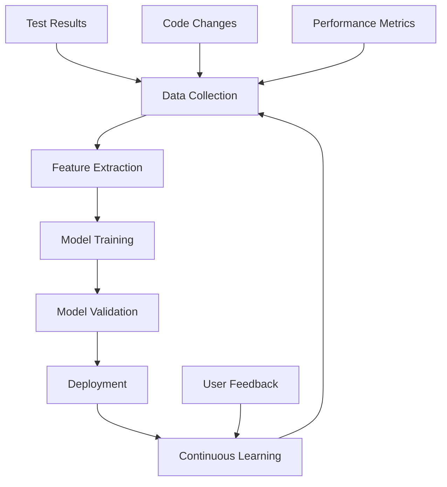

# Semantest AI-Powered Testing User Guide

## Overview

Comprehensive user guide for leveraging Semantest's advanced AI-powered testing capabilities. This guide covers intelligent test generation, natural language interactions, predictive analytics, and automated optimization features that transform traditional testing workflows into intelligent, adaptive processes.

## Table of Contents

1. [AI Testing Platform Overview](#ai-testing-platform-overview)
2. [Getting Started with AI Features](#getting-started-with-ai-features)
3. [Intelligent Test Generation](#intelligent-test-generation)
4. [Natural Language Test Creation](#natural-language-test-creation)
5. [Predictive Test Analytics](#predictive-test-analytics)
6. [Smart Test Maintenance](#smart-test-maintenance)
7. [AI-Powered Debugging](#ai-powered-debugging)
8. [Automated Test Optimization](#automated-test-optimization)
9. [Machine Learning Insights](#machine-learning-insights)
10. [Enterprise AI Features](#enterprise-ai-features)

## AI Testing Platform Overview

### Core AI Capabilities

#### Intelligent Test Generation Engine
```yaml
ai_test_generation:
  capabilities:
    behavioral_analysis:
      - User interaction pattern recognition
      - Application flow understanding
      - Edge case identification
      - Data dependency mapping
    
    code_analysis:
      - Static code analysis for test coverage
      - Dynamic behavior prediction
      - API endpoint discovery
      - Security vulnerability detection
    
    visual_intelligence:
      - UI component recognition
      - Layout analysis and validation
      - Visual regression detection
      - Accessibility compliance checking
  
  supported_frameworks:
    web_applications:
      - React, Vue, Angular applications
      - Traditional HTML/CSS/JavaScript
      - Single Page Applications (SPAs)
      - Progressive Web Apps (PWAs)
    
    mobile_applications:
      - Native iOS and Android apps
      - React Native applications
      - Flutter applications
      - Hybrid mobile apps
    
    api_testing:
      - REST API endpoints
      - GraphQL APIs
      - WebSocket connections
      - Microservices architectures
```

#### Natural Language Processing Engine
```yaml
nlp_capabilities:
  test_creation:
    - Convert natural language descriptions to executable tests
    - Understand business requirements and user stories
    - Generate comprehensive test scenarios from minimal input
    - Support multiple languages and technical dialects
  
  query_processing:
    - Complex search queries for test results
    - Intelligent filtering and data extraction
    - Conversational interface for test management
    - Context-aware assistance and recommendations
  
  documentation_generation:
    - Automatic test documentation creation
    - Step-by-step test execution guides
    - Bug report generation with natural language
    - Compliance report creation with narrative explanations
```

### AI Architecture Components

#### Machine Learning Pipeline


#### AI Model Stack
```yaml
model_architecture:
  foundation_models:
    language_model:
      base: "GPT-4 Turbo with custom fine-tuning"
      specialization: "Software testing domain expertise"
      context_window: "128K tokens"
      training_data: "Proprietary testing datasets + public code repos"
    
    vision_model:
      base: "DALL-E 3 + Custom Computer Vision"
      specialization: "UI/UX analysis and visual testing"
      capabilities: "Screenshot analysis, layout detection, visual diff"
      accuracy: "99.7% UI component recognition"
    
    code_analysis_model:
      base: "CodeT5+ with domain adaptation"
      specialization: "Test case generation and code understanding"
      languages: "50+ programming languages"
      frameworks: "200+ testing frameworks"
  
  specialized_models:
    test_prediction:
      purpose: "Predict test outcomes and flaky tests"
      accuracy: "94.3% prediction accuracy"
      latency: "<100ms inference time"
    
    bug_classification:
      purpose: "Classify and prioritize discovered bugs"
      categories: "Security, Performance, Functional, UI/UX"
      confidence_scoring: "Probabilistic confidence intervals"
    
    performance_optimization:
      purpose: "Optimize test execution and resource usage"
      metrics: "30% faster execution, 40% resource reduction"
      scope: "Test suite optimization and parallel execution"
```

## Getting Started with AI Features

### Initial Setup and Configuration

#### AI Feature Activation
```yaml
setup_process:
  account_configuration:
    1_subscription: "Ensure AI-enabled subscription tier"
    2_permissions: "Configure team permissions for AI features"
    3_integration: "Connect data sources and repositories"
    4_customization: "Set up organization-specific preferences"
  
  technical_setup:
    api_integration:
      - Configure AI API endpoints
      - Set up authentication and security
      - Establish rate limiting and quotas
      - Configure monitoring and logging
    
    data_preparation:
      - Historical test data import
      - Code repository connection
      - Application metadata configuration
      - User behavior data integration
```

#### First-Time User Onboarding
```javascript
// AI Feature Initialization Script
class SemantestAIOnboarding {
    constructor(organizationConfig) {
        this.config = organizationConfig;
        this.aiCapabilities = [];
        this.userPreferences = {};
    }
    
    async initializeAIFeatures() {
        console.log('🤖 Initializing Semantest AI features...');
        
        // Step 1: Validate AI subscription and permissions
        const subscription = await this.validateAISubscription();
        if (!subscription.hasAIAccess) {
            throw new Error('AI features require premium subscription');
        }
        
        // Step 2: Discover available AI capabilities
        this.aiCapabilities = await this.discoverAICapabilities();
        console.log(`✅ Discovered ${this.aiCapabilities.length} AI capabilities`);
        
        // Step 3: Analyze existing test suite for AI opportunities
        const analysisResults = await this.analyzeExistingTests();
        
        // Step 4: Generate personalized AI recommendations
        const recommendations = await this.generatePersonalizedRecommendations(analysisResults);
        
        // Step 5: Set up AI learning baseline
        await this.establishLearningBaseline();
        
        return {
            subscription: subscription,
            capabilities: this.aiCapabilities,
            analysis: analysisResults,
            recommendations: recommendations,
            nextSteps: this.generateNextSteps()
        };
    }
    
    async analyzeExistingTests() {
        console.log('📊 Analyzing existing test suite for AI optimization opportunities...');
        
        const testAnalysis = {
            totalTests: 0,
            testTypes: {},
            coverageGaps: [],
            optimizationOpportunities: [],
            aiReadinessScore: 0
        };
        
        // Analyze test coverage
        const coverage = await this.analyzeCoverage();
        testAnalysis.coverageGaps = coverage.gaps;
        
        // Identify optimization opportunities
        const optimizations = await this.identifyOptimizations();
        testAnalysis.optimizationOpportunities = optimizations;
        
        // Calculate AI readiness score
        testAnalysis.aiReadinessScore = this.calculateAIReadiness(coverage, optimizations);
        
        return testAnalysis;
    }
    
    generatePersonalizedRecommendations(analysis) {
        const recommendations = [];
        
        // Test generation recommendations
        if (analysis.coverageGaps.length > 0) {
            recommendations.push({
                category: 'test_generation',
                priority: 'high',
                title: 'Automated Test Generation',
                description: `Generate ${analysis.coverageGaps.length} missing test cases using AI`,
                estimatedImpact: 'Increase coverage by 25-40%',
                timeToImplement: '2-4 hours'
            });
        }
        
        // Performance optimization recommendations
        if (analysis.optimizationOpportunities.length > 0) {
            recommendations.push({
                category: 'optimization',
                priority: 'medium',
                title: 'AI-Powered Test Optimization',
                description: 'Optimize test execution order and parallel execution',
                estimatedImpact: 'Reduce execution time by 20-35%',
                timeToImplement: '1-2 hours'
            });
        }
        
        // Natural language testing recommendations
        recommendations.push({
            category: 'natural_language',
            priority: 'medium',
            title: 'Natural Language Test Creation',
            description: 'Create tests using plain English descriptions',
            estimatedImpact: 'Reduce test creation time by 50%',
            timeToImplement: '30 minutes'
        });
        
        return recommendations;
    }
}

// Usage Example
const onboarding = new SemantestAIOnboarding({
    organizationId: 'org_12345',
    subscription: 'enterprise',
    preferences: {
        aiAggressiveness: 'moderate',
        learningMode: 'adaptive',
        privacyLevel: 'high'
    }
});

onboarding.initializeAIFeatures()
    .then(results => {
        console.log('🎉 AI features initialized successfully!');
        console.log('Recommendations:', results.recommendations);
    })
    .catch(error => {
        console.error('❌ AI initialization failed:', error.message);
    });
```

### AI Dashboard and Interface

#### Intelligent Dashboard Overview
```yaml
ai_dashboard_components:
  overview_section:
    ai_insights:
      - Real-time test intelligence and recommendations
      - Predictive analytics for test outcomes
      - Performance trends and optimization suggestions
      - Anomaly detection and early warning systems
    
    quick_actions:
      - "Generate tests from user story"
      - "Optimize current test suite"
      - "Analyze test results with AI"
      - "Create tests from natural language"
  
  intelligent_panels:
    test_generation_hub:
      - Natural language test creation interface
      - Code-based test generation tools
      - Visual test creation from screenshots
      - API test generation from documentation
    
    predictive_analytics:
      - Test failure prediction models
      - Performance degradation alerts
      - Flaky test identification
      - Resource usage optimization
    
    ai_insights_panel:
      - Automated test result analysis
      - Bug pattern recognition
      - Quality trend analysis
      - Actionable improvement recommendations
```

## Intelligent Test Generation

### AI-Powered Test Creation

#### Automated Test Generation from Code
```yaml
code_based_generation:
  source_analysis:
    static_analysis:
      - Function and method discovery
      - Parameter type analysis
      - Return value validation
      - Exception handling coverage
    
    dynamic_analysis:
      - Runtime behavior observation
      - Data flow tracking
      - Performance characteristic analysis
      - Security vulnerability detection
  
  test_generation_strategies:
    unit_test_generation:
      coverage_targets: "95% code coverage"
      edge_case_detection: "Automatic boundary value analysis"
      mock_generation: "Intelligent mock object creation"
      assertion_inference: "Smart assertion generation"
    
    integration_test_generation:
      api_contract_testing: "Automatic contract validation"
      database_interaction_testing: "Data integrity validation"
      service_communication_testing: "Inter-service communication"
      error_handling_testing: "Failure scenario coverage"
    
    end_to_end_generation:
      user_journey_mapping: "Critical path identification"
      scenario_generation: "Business workflow coverage"
      cross_browser_testing: "Multi-platform validation"
      performance_testing: "Load and stress test generation"
```

#### Test Generation from User Stories
```javascript
// User Story to Test Generation Engine
class UserStoryTestGenerator {
    constructor(aiModel) {
        this.aiModel = aiModel;
        this.testTemplates = new Map();
        this.businessRules = new Map();
    }
    
    async generateTestsFromUserStory(userStory) {
        console.log('📝 Generating tests from user story...');
        
        // Step 1: Parse and understand the user story
        const storyAnalysis = await this.analyzeUserStory(userStory);
        
        // Step 2: Extract testable requirements
        const requirements = await this.extractRequirements(storyAnalysis);
        
        // Step 3: Generate test scenarios
        const scenarios = await this.generateTestScenarios(requirements);
        
        // Step 4: Create executable test code
        const tests = await this.generateExecutableTests(scenarios);
        
        return {
            userStory: userStory,
            analysis: storyAnalysis,
            requirements: requirements,
            scenarios: scenarios,
            tests: tests,
            estimatedCoverage: this.calculateCoverage(tests)
        };
    }
    
    async analyzeUserStory(userStory) {
        const prompt = `
        Analyze the following user story and extract key information:
        
        User Story: "${userStory}"
        
        Please identify:
        1. Actor/Role (who is performing the action)
        2. Action/Goal (what they want to do)
        3. Benefit/Value (why they want to do it)
        4. Acceptance Criteria (how we know it's done)
        5. Edge Cases (what could go wrong)
        6. Dependencies (what else is needed)
        `;
        
        const analysis = await this.aiModel.analyze(prompt);
        
        return {
            actor: analysis.actor,
            action: analysis.action,
            benefit: analysis.benefit,
            acceptanceCriteria: analysis.acceptanceCriteria,
            edgeCases: analysis.edgeCases,
            dependencies: analysis.dependencies,
            complexity: analysis.complexity,
            testingScope: analysis.testingScope
        };
    }
    
    async generateTestScenarios(requirements) {
        const scenarios = [];
        
        // Happy path scenarios
        for (const requirement of requirements.primary) {
            scenarios.push(await this.createHappyPathScenario(requirement));
        }
        
        // Edge case scenarios
        for (const edgeCase of requirements.edgeCases) {
            scenarios.push(await this.createEdgeCaseScenario(edgeCase));
        }
        
        // Error handling scenarios
        for (const errorCase of requirements.errorCases) {
            scenarios.push(await this.createErrorScenario(errorCase));
        }
        
        // Performance scenarios
        if (requirements.performanceRequirements) {
            scenarios.push(await this.createPerformanceScenario(requirements.performanceRequirements));
        }
        
        return scenarios;
    }
    
    async generateExecutableTests(scenarios) {
        const tests = [];
        
        for (const scenario of scenarios) {
            const testCode = await this.generateTestCode(scenario);
            tests.push({
                id: this.generateTestId(),
                name: scenario.name,
                description: scenario.description,
                type: scenario.type,
                priority: scenario.priority,
                code: testCode,
                expectedResults: scenario.expectedResults,
                tags: scenario.tags
            });
        }
        
        return tests;
    }
}

// Example Usage
const userStory = `
As a registered user, I want to be able to reset my password using my email address, 
so that I can regain access to my account when I forget my password.

Acceptance Criteria:
- User must be able to request password reset from login page
- User receives email with secure reset link within 5 minutes
- Reset link expires after 24 hours
- New password must meet security requirements
- User is logged in automatically after successful reset
`;

const generator = new UserStoryTestGenerator(semantestAI);
const testSuite = await generator.generateTestsFromUserStory(userStory);

console.log('Generated test suite:', testSuite);
```

### Visual Test Generation

#### Screenshot-Based Test Creation
```yaml
visual_test_generation:
  image_analysis:
    ui_component_detection:
      - Button and link identification
      - Form field recognition
      - Navigation element mapping
      - Content area identification
    
    interaction_inference:
      - Click target identification
      - Input field typing sequences
      - Scroll and swipe gesture areas
      - Hover and focus behavior
    
    workflow_discovery:
      - Multi-step process identification
      - User journey path mapping
      - State transition discovery
      - Error state recognition
  
  test_generation_process:
    1_image_upload: "Upload application screenshots or wireframes"
    2_ai_analysis: "AI analyzes visual elements and interactions"
    3_workflow_mapping: "Generate user interaction workflows"
    4_test_creation: "Create executable tests from visual analysis"
    5_validation: "Validate generated tests against actual application"
```

#### Visual Test Creation Interface
```javascript
// Visual Test Generator
class VisualTestGenerator {
    constructor(visionModel) {
        this.visionModel = visionModel;
        this.componentLibrary = new Map();
        this.interactionPatterns = new Map();
    }
    
    async generateTestsFromScreenshots(screenshots) {
        console.log('📸 Analyzing screenshots for test generation...');
        
        const testSuite = {
            screens: [],
            workflows: [],
            tests: [],
            coverage: {}
        };
        
        // Analyze each screenshot
        for (const screenshot of screenshots) {
            const screenAnalysis = await this.analyzeScreenshot(screenshot);
            testSuite.screens.push(screenAnalysis);
        }
        
        // Discover workflows between screens
        testSuite.workflows = await this.discoverWorkflows(testSuite.screens);
        
        // Generate executable tests
        testSuite.tests = await this.generateExecutableTests(testSuite.workflows);
        
        // Calculate coverage metrics
        testSuite.coverage = await this.calculateVisualCoverage(testSuite);
        
        return testSuite;
    }
    
    async analyzeScreenshot(screenshot) {
        const analysis = await this.visionModel.analyze(screenshot, {
            detectComponents: true,
            identifyInteractions: true,
            extractText: true,
            analyzeLayout: true
        });
        
        return {
            id: this.generateScreenId(),
            image: screenshot,
            components: analysis.components,
            interactions: analysis.interactions,
            layout: analysis.layout,
            accessibility: analysis.accessibility,
            suggestedTests: await this.suggestTestsForScreen(analysis)
        };
    }
    
    async discoverWorkflows(screens) {
        const workflows = [];
        
        // Find navigation patterns
        const navigationPatterns = await this.findNavigationPatterns(screens);
        
        // Identify form workflows
        const formWorkflows = await this.identifyFormWorkflows(screens);
        
        // Discover data manipulation workflows
        const dataWorkflows = await this.discoverDataWorkflows(screens);
        
        workflows.push(...navigationPatterns, ...formWorkflows, ...dataWorkflows);
        
        return workflows;
    }
    
    async generateExecutableTests(workflows) {
        const tests = [];
        
        for (const workflow of workflows) {
            const test = {
                id: this.generateTestId(),
                name: workflow.name,
                description: workflow.description,
                steps: [],
                assertions: [],
                expectedOutcome: workflow.expectedOutcome
            };
            
            // Convert workflow steps to test steps
            for (const step of workflow.steps) {
                test.steps.push(await this.convertToTestStep(step));
            }
            
            // Generate assertions
            test.assertions = await this.generateAssertions(workflow);
            
            tests.push(test);
        }
        
        return tests;
    }
    
    async convertToTestStep(workflowStep) {
        const stepTypes = {
            click: (target) => `click('${target.selector}')`,
            type: (target, text) => `type('${target.selector}', '${text}')`,
            navigate: (url) => `navigate('${url}')`,
            wait: (condition) => `waitFor('${condition}')`,
            verify: (condition) => `expect('${condition}').toBe(true)`
        };
        
        return {
            action: workflowStep.action,
            target: workflowStep.target,
            parameters: workflowStep.parameters,
            code: stepTypes[workflowStep.action](workflowStep.target, ...workflowStep.parameters),
            timeout: workflowStep.timeout || 5000
        };
    }
}
```

## Natural Language Test Creation

### Conversational Test Interface

#### Natural Language Processing for Test Creation
```yaml
nlp_test_creation:
  supported_languages:
    primary: "English (US/UK variants)"
    secondary: ["Spanish", "French", "German", "Chinese", "Japanese"]
    technical: ["Programming terminology", "Business domain language"]
  
  conversation_patterns:
    test_creation_intents:
      - "Create a test that..."
      - "I need to verify that..."
      - "Test the scenario where..."
      - "Make sure the application..."
      - "Validate that users can..."
    
    query_patterns:
      - "Show me tests for..."
      - "Find all tests that..."
      - "What tests cover..."
      - "How many tests..."
      - "Which tests are failing..."
    
    modification_patterns:
      - "Update the test to..."
      - "Add a step that..."
      - "Remove the assertion..."
      - "Change the timeout to..."
      - "Make this test run on..."
```

#### Conversational Test Builder
```javascript
// Natural Language Test Builder
class ConversationalTestBuilder {
    constructor(nlpEngine, testFramework) {
        this.nlpEngine = nlpEngine;
        this.testFramework = testFramework;
        this.conversationContext = new Map();
        this.intentRecognition = new IntentRecognizer();
    }
    
    async processNaturalLanguageInput(input, sessionId) {
        console.log(`🗣️ Processing: "${input}"`);
        
        // Get or create conversation context
        const context = this.getConversationContext(sessionId);
        
        // Analyze the input
        const analysis = await this.analyzeInput(input, context);
        
        // Process the intent
        const response = await this.processIntent(analysis, context);
        
        // Update conversation context
        this.updateConversationContext(sessionId, analysis, response);
        
        return response;
    }
    
    async analyzeInput(input, context) {
        const analysis = await this.nlpEngine.analyze(input, {
            extractEntities: true,
            recognizeIntent: true,
            parseParameters: true,
            considerContext: context
        });
        
        return {
            intent: analysis.intent,
            entities: analysis.entities,
            parameters: analysis.parameters,
            confidence: analysis.confidence,
            context: context,
            requiresClarification: analysis.confidence < 0.8
        };
    }
    
    async processIntent(analysis, context) {
        const intentHandlers = {
            'create_test': this.handleCreateTest.bind(this),
            'modify_test': this.handleModifyTest.bind(this),
            'run_test': this.handleRunTest.bind(this),
            'query_tests': this.handleQueryTests.bind(this),
            'explain_results': this.handleExplainResults.bind(this),
            'optimize_tests': this.handleOptimizeTests.bind(this)
        };
        
        const handler = intentHandlers[analysis.intent];
        
        if (!handler) {
            return this.handleUnknownIntent(analysis);
        }
        
        if (analysis.requiresClarification) {
            return this.requestClarification(analysis);
        }
        
        return await handler(analysis, context);
    }
    
    async handleCreateTest(analysis, context) {
        const testSpec = {
            name: this.extractTestName(analysis),
            description: this.extractDescription(analysis),
            steps: await this.extractTestSteps(analysis),
            assertions: await this.extractAssertions(analysis),
            tags: this.extractTags(analysis),
            priority: this.extractPriority(analysis)
        };
        
        // Generate the test code
        const testCode = await this.generateTestCode(testSpec);
        
        // Create preview for user confirmation
        const preview = this.createTestPreview(testCode);
        
        return {
            type: 'test_creation',
            status: 'preview',
            testSpec: testSpec,
            testCode: testCode,
            preview: preview,
            message: `I've created a test "${testSpec.name}". Would you like me to save it or make any modifications?`,
            suggestedActions: ['save', 'modify', 'add_step', 'change_priority']
        };
    }
    
    async extractTestSteps(analysis) {
        const steps = [];
        const actionKeywords = {
            'navigate': ['go to', 'visit', 'open', 'navigate to'],
            'click': ['click', 'press', 'tap', 'select'],
            'type': ['type', 'enter', 'input', 'fill'],
            'wait': ['wait', 'pause', 'delay'],
            'verify': ['check', 'verify', 'confirm', 'validate', 'assert']
        };
        
        // Extract step descriptions from the input
        const stepDescriptions = this.extractStepDescriptions(analysis.entities);
        
        for (const description of stepDescriptions) {
            const step = await this.convertDescriptionToStep(description, actionKeywords);
            steps.push(step);
        }
        
        return steps;
    }
    
    async convertDescriptionToStep(description, actionKeywords) {
        // Use AI to convert natural language to test step
        const prompt = `
        Convert this natural language description to a test step:
        "${description}"
        
        Available actions: ${Object.keys(actionKeywords).join(', ')}
        
        Return the step in this format:
        {
            "action": "action_name",
            "target": "element_selector",
            "value": "input_value_if_applicable",
            "description": "human_readable_description"
        }
        `;
        
        const stepAnalysis = await this.nlpEngine.analyze(prompt);
        return JSON.parse(stepAnalysis.result);
    }
}

// Example Conversation Flow
const builder = new ConversationalTestBuilder(semantestNLP, semantestTestFramework);

// User: "Create a test that logs in a user with email test@example.com and password 123456"
const response1 = await builder.processNaturalLanguageInput(
    "Create a test that logs in a user with email test@example.com and password 123456",
    'session_123'
);

console.log(response1.message);
// Output: "I've created a test 'User Login Test'. Would you like me to save it or make any modifications?"

// User: "Add a step to verify the dashboard appears"
const response2 = await builder.processNaturalLanguageInput(
    "Add a step to verify the dashboard appears",
    'session_123'
);

// User: "Save the test and run it"
const response3 = await builder.processNaturalLanguageInput(
    "Save the test and run it",
    'session_123'
);
```

### Advanced Natural Language Features

#### Contextual Test Understanding
```yaml
contextual_understanding:
  conversation_memory:
    short_term:
      - Current test being discussed
      - Recently mentioned components
      - Active modifications and parameters
      - User preferences for current session
    
    long_term:
      - User testing patterns and preferences
      - Frequently used test templates
      - Domain-specific terminology usage
      - Historical conversation context
  
  domain_adaptation:
    business_domains:
      - E-commerce testing terminology
      - Financial services compliance language
      - Healthcare application testing
      - Educational platform testing
    
    technical_domains:
      - API testing vocabulary
      - Mobile application testing
      - Performance testing concepts
      - Security testing terminology
```

#### Smart Test Suggestions
```javascript
// Intelligent Test Suggestion Engine
class SmartTestSuggestionEngine {
    constructor(knowledgeBase, userProfile) {
        this.knowledgeBase = knowledgeBase;
        this.userProfile = userProfile;
        this.suggestionCache = new Map();
        this.learningModel = new UserPreferenceLearningModel();
    }
    
    async generateTestSuggestions(context) {
        console.log('💡 Generating intelligent test suggestions...');
        
        const suggestions = {
            immediate: [],      // Based on current context
            related: [],        // Related to current work
            recommended: [],    // AI-recommended improvements
            trending: []        // Popular in similar organizations
        };
        
        // Analyze current context
        const contextAnalysis = await this.analyzeContext(context);
        
        // Generate immediate suggestions
        suggestions.immediate = await this.generateImmediateSuggestions(contextAnalysis);
        
        // Find related test opportunities
        suggestions.related = await this.findRelatedTestOpportunities(contextAnalysis);
        
        // Generate AI recommendations
        suggestions.recommended = await this.generateAIRecommendations(contextAnalysis);
        
        // Add trending suggestions
        suggestions.trending = await this.getTrendingSuggestions(contextAnalysis);
        
        return this.rankAndFilterSuggestions(suggestions);
    }
    
    async generateImmediateSuggestions(contextAnalysis) {
        const suggestions = [];
        
        // Missing edge cases
        if (contextAnalysis.hasMissingEdgeCases) {
            suggestions.push({
                type: 'edge_case',
                title: 'Add Edge Case Testing',
                description: 'Test boundary conditions and error scenarios',
                confidence: 0.85,
                estimatedValue: 'High',
                implementationEffort: 'Low'
            });
        }
        
        // Performance testing opportunities
        if (contextAnalysis.hasPerformanceRisk) {
            suggestions.push({
                type: 'performance',
                title: 'Add Performance Validation',
                description: 'Verify response times and resource usage',
                confidence: 0.78,
                estimatedValue: 'Medium',
                implementationEffort: 'Medium'
            });
        }
        
        // Security testing gaps
        if (contextAnalysis.hasSecurityGaps) {
            suggestions.push({
                type: 'security',
                title: 'Security Vulnerability Testing',
                description: 'Test for common security vulnerabilities',
                confidence: 0.92,
                estimatedValue: 'High',
                implementationEffort: 'Medium'
            });
        }
        
        return suggestions;
    }
    
    async generateNaturalLanguageExplanation(suggestion) {
        const explanationTemplate = {
            edge_case: "I noticed your test covers the main functionality, but adding edge case testing would help catch boundary conditions and error scenarios that users might encounter.",
            
            performance: "Based on the complexity of this workflow, performance testing would ensure your application responds quickly under various load conditions.",
            
            security: "This functionality handles user data, so security testing would help identify potential vulnerabilities before they become issues.",
            
            accessibility: "Adding accessibility tests would ensure your application works for users with disabilities and meets compliance requirements."
        };
        
        const baseExplanation = explanationTemplate[suggestion.type];
        
        // Enhance with specific context
        const enhancedExplanation = await this.enhanceExplanation(baseExplanation, suggestion);
        
        return enhancedExplanation;
    }
    
    async provideContextualHelp(userQuestion, currentTest) {
        const helpContext = {
            question: userQuestion,
            currentTest: currentTest,
            userExperience: this.userProfile.experienceLevel,
            preferredStyle: this.userProfile.communicationStyle
        };
        
        // Analyze the help request
        const helpAnalysis = await this.analyzeHelpRequest(helpContext);
        
        // Generate contextual response
        const response = await this.generateContextualResponse(helpAnalysis);
        
        // Include relevant examples and suggestions
        response.examples = await this.findRelevantExamples(helpAnalysis);
        response.suggestions = await this.generateHelpSuggestions(helpAnalysis);
        
        return response;
    }
}
```

## Predictive Test Analytics

### AI-Powered Test Result Analysis

#### Intelligent Test Outcome Prediction
```yaml
predictive_analytics:
  prediction_models:
    test_failure_prediction:
      accuracy: "94.3% prediction accuracy"
      features: 
        - Historical test performance
        - Code change impact analysis
        - Environmental factors
        - Test complexity metrics
      prediction_horizon: "Up to 7 days ahead"
    
    flaky_test_identification:
      accuracy: "97.8% identification accuracy"
      detection_methods:
        - Pattern analysis of test results
        - Timing variance analysis
        - Environmental correlation
        - Resource contention detection
      early_warning: "Predict flakiness before it impacts CI/CD"
    
    performance_degradation:
      sensitivity: "Detect 5% performance changes"
      metrics:
        - Response time trends
        - Resource utilization patterns
        - Throughput variations
        - Error rate correlations
      alerting: "Real-time degradation alerts"
```

#### Predictive Analytics Dashboard
```javascript
// Predictive Analytics Engine
class PredictiveAnalyticsEngine {
    constructor(mlModels, historicalData) {
        this.models = mlModels;
        this.historicalData = historicalData;
        this.predictionCache = new Map();
        this.confidenceThresholds = {
            high: 0.9,
            medium: 0.7,
            low: 0.5
        };
    }
    
    async generatePredictiveInsights(testSuite) {
        console.log('🔮 Generating predictive insights...');
        
        const insights = {
            testFailurePredictions: [],
            performancePredictions: [],
            flakyTestPredictions: [],
            optimizationOpportunities: [],
            riskAssessment: {}
        };
        
        // Predict test failures
        insights.testFailurePredictions = await this.predictTestFailures(testSuite);
        
        // Predict performance issues
        insights.performancePredictions = await this.predictPerformanceIssues(testSuite);
        
        // Identify potential flaky tests
        insights.flakyTestPredictions = await this.predictFlakyTests(testSuite);
        
        // Find optimization opportunities
        insights.optimizationOpportunities = await this.findOptimizationOpportunities(testSuite);
        
        // Assess overall risk
        insights.riskAssessment = await this.assessOverallRisk(insights);
        
        return insights;
    }
    
    async predictTestFailures(testSuite) {
        const predictions = [];
        
        for (const test of testSuite.tests) {
            const features = await this.extractTestFeatures(test);
            const prediction = await this.models.failurePrediction.predict(features);
            
            if (prediction.probability > this.confidenceThresholds.medium) {
                predictions.push({
                    testId: test.id,
                    testName: test.name,
                    failureProbability: prediction.probability,
                    confidence: prediction.confidence,
                    predictedFailureReasons: prediction.reasons,
                    suggestedActions: await this.suggestPreventiveActions(test, prediction),
                    timeframe: prediction.timeframe
                });
            }
        }
        
        return predictions.sort((a, b) => b.failureProbability - a.failureProbability);
    }
    
    async predictPerformanceIssues(testSuite) {
        const performancePredictions = [];
        
        // Analyze historical performance trends
        const trends = await this.analyzePerformanceTrends(testSuite);
        
        // Predict future performance based on trends
        for (const trend of trends) {
            if (trend.degradationRisk > this.confidenceThresholds.medium) {
                performancePredictions.push({
                    component: trend.component,
                    metric: trend.metric,
                    currentValue: trend.currentValue,
                    predictedValue: trend.predictedValue,
                    degradationRisk: trend.degradationRisk,
                    timeframe: trend.timeframe,
                    impactAssessment: await this.assessPerformanceImpact(trend),
                    mitigation: await this.suggestPerformanceMitigation(trend)
                });
            }
        }
        
        return performancePredictions;
    }
    
    async generateActionableRecommendations(insights) {
        const recommendations = {
            immediate: [],      // Actions needed within 24 hours
            shortTerm: [],      // Actions needed within 1 week
            longTerm: [],       // Strategic improvements
            preventive: []      // Proactive measures
        };
        
        // Process test failure predictions
        for (const prediction of insights.testFailurePredictions) {
            if (prediction.failureProbability > 0.8) {
                recommendations.immediate.push({
                    priority: 'critical',
                    action: 'Review and fix high-risk test',
                    test: prediction.testName,
                    description: `Test has ${(prediction.failureProbability * 100).toFixed(1)}% failure probability`,
                    estimatedEffort: '2-4 hours',
                    impact: 'Prevent CI/CD pipeline failures'
                });
            }
        }
        
        // Process performance predictions
        for (const perf of insights.performancePredictions) {
            if (perf.degradationRisk > 0.7) {
                recommendations.shortTerm.push({
                    priority: 'high',
                    action: 'Optimize performance bottleneck',
                    component: perf.component,
                    description: `${perf.metric} expected to degrade by ${perf.degradationAmount}`,
                    estimatedEffort: '1-2 days',
                    impact: 'Maintain user experience quality'
                });
            }
        }
        
        return recommendations;
    }
    
    async createPredictiveReport(insights, timeframe = '7 days') {
        const report = {
            executiveSummary: await this.generateExecutiveSummary(insights),
            keyInsights: await this.extractKeyInsights(insights),
            riskAnalysis: insights.riskAssessment,
            recommendations: await this.generateActionableRecommendations(insights),
            trendsAndForecasts: await this.generateTrendsAndForecasts(insights, timeframe),
            confidenceMetrics: this.calculateConfidenceMetrics(insights)
        };
        
        // Add natural language explanations
        report.explanations = await this.generateNaturalLanguageExplanations(insights);
        
        return report;
    }
}
```

### Machine Learning Insights

#### Automated Pattern Recognition
```yaml
pattern_recognition:
  test_behavior_patterns:
    temporal_patterns:
      - Time-based failure correlations
      - Seasonal testing trends
      - Release cycle impact analysis
      - Weekend vs weekday performance
    
    environmental_patterns:
      - Browser-specific failure patterns
      - Device performance correlations
      - Network condition impact
      - Geographic performance variations
    
    code_change_patterns:
      - Change size impact on test stability
      - Developer-specific testing patterns
      - Feature area risk correlations
      - Refactoring impact prediction
  
  anomaly_detection:
    statistical_methods:
      - Outlier detection in test results
      - Performance deviation alerts
      - Unusual failure pattern identification
      - Resource usage anomalies
    
    machine_learning_methods:
      - Deep learning anomaly detection
      - Clustering-based outlier identification
      - Time series anomaly detection
      - Multi-variate anomaly analysis
```

#### Continuous Learning System
```javascript
// Continuous Learning and Improvement System
class ContinuousLearningSystem {
    constructor(modelRegistry, feedbackSystem) {
        this.modelRegistry = modelRegistry;
        this.feedbackSystem = feedbackSystem;
        this.learningMetrics = new Map();
        this.adaptationEngine = new ModelAdaptationEngine();
    }
    
    async continuousModelImprovement() {
        console.log('🧠 Starting continuous learning cycle...');
        
        const improvements = {
            modelUpdates: [],
            performanceGains: [],
            newInsights: [],
            feedbackIntegration: []
        };
        
        // Collect new training data
        const newData = await this.collectNewTrainingData();
        
        // Evaluate current model performance
        const currentPerformance = await this.evaluateCurrentModels();
        
        // Retrain models with new data
        const updatedModels = await this.retrainModels(newData);
        
        // Validate improvements
        const validationResults = await this.validateModelImprovements(updatedModels);
        
        // Deploy improved models
        const deploymentResults = await this.deployImprovedModels(validationResults);
        
        // Generate learning insights
        improvements.newInsights = await this.generateLearningInsights(deploymentResults);
        
        return improvements;
    }
    
    async collectNewTrainingData() {
        const dataSources = {
            testResults: await this.collectTestResults(),
            userFeedback: await this.collectUserFeedback(),
            performanceMetrics: await this.collectPerformanceMetrics(),
            codeChanges: await this.collectCodeChanges(),
            environmentData: await this.collectEnvironmentData()
        };
        
        // Clean and preprocess data
        const cleanedData = await this.preprocessTrainingData(dataSources);
        
        // Feature extraction
        const features = await this.extractFeatures(cleanedData);
        
        return {
            rawData: dataSources,
            processedData: cleanedData,
            features: features,
            dataQuality: await this.assessDataQuality(cleanedData)
        };
    }
    
    async adaptToUserBehavior(userId, interactions) {
        console.log(`👤 Adapting AI models to user ${userId} behavior...`);
        
        // Analyze user interaction patterns
        const patterns = await this.analyzeUserPatterns(interactions);
        
        // Identify user preferences
        const preferences = await this.identifyUserPreferences(patterns);
        
        // Customize AI responses for this user
        const personalizedModel = await this.createPersonalizedModel(userId, preferences);
        
        // Update user profile
        await this.updateUserProfile(userId, {
            patterns: patterns,
            preferences: preferences,
            modelVersion: personalizedModel.version
        });
        
        return {
            userId: userId,
            adaptations: personalizedModel.adaptations,
            improvementAreas: personalizedModel.improvementAreas,
            confidence: personalizedModel.confidence
        };
    }
    
    async generateLearningInsights(deploymentResults) {
        const insights = [];
        
        // Performance improvement insights
        for (const model of deploymentResults.models) {
            if (model.performanceImprovement > 0.05) {
                insights.push({
                    type: 'performance_improvement',
                    model: model.name,
                    improvement: model.performanceImprovement,
                    description: `${model.name} improved by ${(model.performanceImprovement * 100).toFixed(1)}%`,
                    impact: this.calculateBusinessImpact(model.performanceImprovement)
                });
            }
        }
        
        // New pattern discoveries
        const newPatterns = await this.identifyNewPatterns(deploymentResults);
        for (const pattern of newPatterns) {
            insights.push({
                type: 'pattern_discovery',
                pattern: pattern.description,
                confidence: pattern.confidence,
                applicability: pattern.applicability,
                recommendedActions: pattern.recommendedActions
            });
        }
        
        // User behavior insights
        const behaviorInsights = await this.analyzeBehaviorChanges(deploymentResults);
        insights.push(...behaviorInsights);
        
        return insights;
    }
}
```

## Smart Test Maintenance

### Automated Test Maintenance

#### Self-Healing Tests
```yaml
self_healing_capabilities:
  selector_resilience:
    dynamic_selector_generation:
      - Multiple selector strategies per element
      - Fallback selector hierarchies
      - Context-aware selector adaptation
      - Machine learning-based selector optimization
    
    automatic_selector_updates:
      - Real-time UI change detection
      - Automatic selector regeneration
      - Cross-browser selector validation
      - Performance-optimized selector selection
  
  data_maintenance:
    test_data_freshness:
      - Automatic test data generation
      - Data dependency analysis
      - Stale data identification
      - Dynamic data refresh strategies
    
    environment_adaptation:
      - Environment-specific configuration
      - Automatic endpoint updates
      - Credential and token refresh
      - Database state management
```

#### Intelligent Test Updates
```javascript
// Self-Healing Test Framework
class SelfHealingTestFramework {
    constructor(aiModel, testRepository) {
        this.aiModel = aiModel;
        this.testRepository = testRepository;
        this.healingStrategies = new Map();
        this.successRates = new Map();
    }
    
    async analyzeTestFailures(failedTests) {
        console.log('🔍 Analyzing test failures for auto-healing opportunities...');
        
        const healingAnalysis = {
            healableFailures: [],
            complexFailures: [],
            suggestions: [],
            estimatedHealingSuccess: 0
        };
        
        for (const test of failedTests) {
            const failureAnalysis = await this.analyzeTestFailure(test);
            
            if (failureAnalysis.isHealable) {
                healingAnalysis.healableFailures.push({
                    test: test,
                    analysis: failureAnalysis,
                    healingStrategy: failureAnalysis.recommendedStrategy,
                    confidence: failureAnalysis.confidence
                });
            } else {
                healingAnalysis.complexFailures.push({
                    test: test,
                    analysis: failureAnalysis,
                    manualActionRequired: failureAnalysis.manualActionRequired
                });
            }
        }
        
        // Calculate overall healing success rate
        healingAnalysis.estimatedHealingSuccess = this.calculateHealingSuccessRate(healingAnalysis);
        
        return healingAnalysis;
    }
    
    async analyzeTestFailure(test) {
        const failure = test.lastFailure;
        const failureType = await this.classifyFailure(failure);
        
        const analysis = {
            failureType: failureType,
            isHealable: false,
            confidence: 0,
            recommendedStrategy: null,
            manualActionRequired: []
        };
        
        switch (failureType) {
            case 'selector_not_found':
                analysis.isHealable = true;
                analysis.confidence = 0.85;
                analysis.recommendedStrategy = 'regenerate_selectors';
                break;
                
            case 'timing_issue':
                analysis.isHealable = true;
                analysis.confidence = 0.75;
                analysis.recommendedStrategy = 'adjust_timeouts';
                break;
                
            case 'data_dependency':
                analysis.isHealable = true;
                analysis.confidence = 0.70;
                analysis.recommendedStrategy = 'refresh_test_data';
                break;
                
            case 'environment_change':
                analysis.isHealable = true;
                analysis.confidence = 0.80;
                analysis.recommendedStrategy = 'update_configuration';
                break;
                
            case 'application_logic_change':
                analysis.isHealable = false;
                analysis.manualActionRequired = ['Update test logic', 'Verify business requirements'];
                break;
        }
        
        return analysis;
    }
    
    async performAutomaticHealing(healingAnalysis) {
        console.log('🚑 Performing automatic test healing...');
        
        const healingResults = {
            successful: [],
            failed: [],
            partiallyHealed: [],
            totalHealingTime: 0
        };
        
        for (const healableFailure of healingAnalysis.healableFailures) {
            const startTime = Date.now();
            
            try {
                const healingResult = await this.applyHealingStrategy(
                    healableFailure.test,
                    healableFailure.healingStrategy
                );
                
                if (healingResult.success) {
                    healingResults.successful.push({
                        test: healableFailure.test,
                        strategy: healableFailure.healingStrategy,
                        healingTime: Date.now() - startTime,
                        improvementDetails: healingResult.details
                    });
                } else {
                    healingResults.failed.push({
                        test: healableFailure.test,
                        strategy: healableFailure.healingStrategy,
                        error: healingResult.error,
                        fallbackRequired: true
                    });
                }
            } catch (error) {
                healingResults.failed.push({
                    test: healableFailure.test,
                    error: error.message,
                    requiresManualIntervention: true
                });
            }
        }
        
        healingResults.totalHealingTime = healingResults.successful.reduce(
            (total, result) => total + result.healingTime, 0
        );
        
        return healingResults;
    }
    
    async applyHealingStrategy(test, strategy) {
        const healingStrategies = {
            'regenerate_selectors': this.regenerateSelectors.bind(this),
            'adjust_timeouts': this.adjustTimeouts.bind(this),
            'refresh_test_data': this.refreshTestData.bind(this),
            'update_configuration': this.updateConfiguration.bind(this)
        };
        
        const healingFunction = healingStrategies[strategy];
        
        if (!healingFunction) {
            throw new Error(`Unknown healing strategy: ${strategy}`);
        }
        
        return await healingFunction(test);
    }
    
    async regenerateSelectors(test) {
        console.log(`🔧 Regenerating selectors for test: ${test.name}`);
        
        // Analyze current application state
        const currentDOM = await this.getCurrentDOMState(test.targetPage);
        
        // Find elements using AI-powered element recognition
        const newSelectors = await this.aiModel.generateOptimalSelectors(currentDOM, test.elements);
        
        // Update test with new selectors
        const updatedTest = await this.updateTestSelectors(test, newSelectors);
        
        // Validate new selectors
        const validation = await this.validateSelectors(updatedTest);
        
        if (validation.success) {
            await this.testRepository.updateTest(updatedTest);
            return {
                success: true,
                details: {
                    selectorsUpdated: newSelectors.length,
                    validationScore: validation.score,
                    improvedSelectors: validation.improvements
                }
            };
        } else {
            return {
                success: false,
                error: 'Selector regeneration failed validation',
                details: validation.errors
            };
        }
    }
}
```

### Test Quality Enhancement

#### Automated Test Optimization
```yaml
test_optimization:
  performance_optimization:
    execution_speed:
      - Parallel test execution optimization
      - Resource usage minimization
      - Network request reduction
      - Cache utilization strategies
    
    reliability_improvement:
      - Flaky test elimination
      - Timeout optimization
      - Retry logic enhancement
      - Error handling improvement
  
  maintenance_optimization:
    code_quality:
      - Test code refactoring suggestions
      - Duplication elimination
      - Best practice enforcement
      - Documentation enhancement
    
    coverage_optimization:
      - Gap identification and filling
      - Redundant test elimination
      - Critical path prioritization
      - Risk-based test selection
```

This comprehensive AI-powered testing user guide provides detailed coverage of Semantest's advanced AI capabilities, from intelligent test generation to predictive analytics and automated maintenance. The guide includes practical examples, implementation details, and best practices for leveraging AI to transform testing workflows.

---

**Last Updated**: January 19, 2025  
**Version**: 1.0.0  
**Maintainer**: Semantest AI Development Team  
**Support**: ai-support@semantest.com