# Semantest Domain-Driven Design Architecture

This document provides visual representations of the Semantest platform's Domain-Driven Design (DDD) architecture.

## Table of Contents

1. [Overall Architecture](#overall-architecture)
2. [Core Module Structure](#core-module-structure)
3. [Domain Module Structure](#domain-module-structure)
4. [Event Flow Architecture](#event-flow-architecture)
5. [Layered Architecture](#layered-architecture)
6. [Aggregate Boundaries](#aggregate-boundaries)
7. [Module Dependencies](#module-dependencies)
8. [Deployment Architecture](#deployment-architecture)

## Overall Architecture

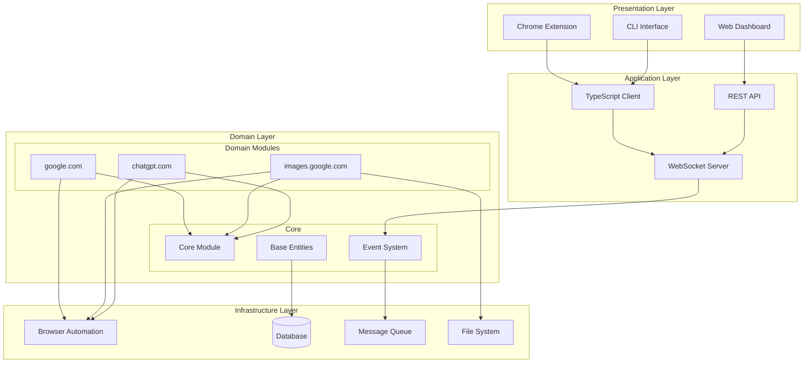

## Core Module Structure

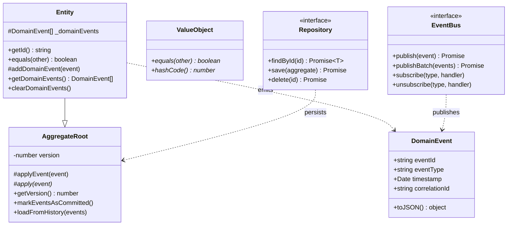

## Domain Module Structure

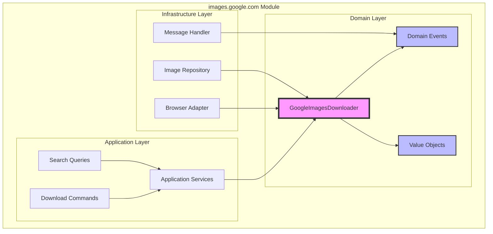

## Event Flow Architecture

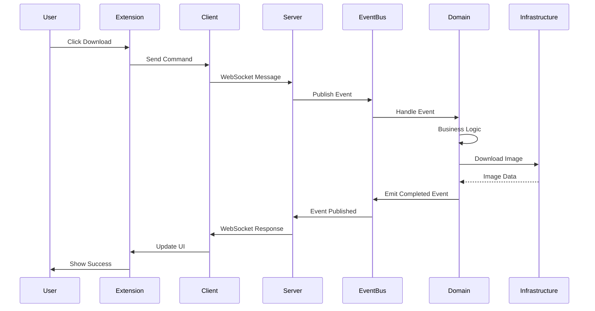

## Layered Architecture

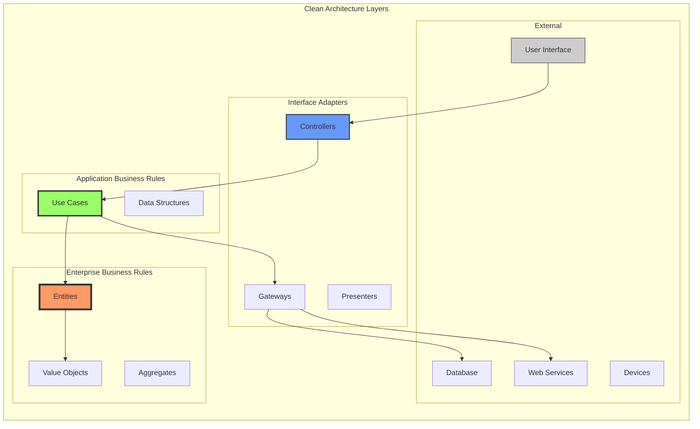

## Aggregate Boundaries

```mermaid
graph TB
    subgraph "Download Aggregate"
        DA[Download Aggregate Root]
        DI[Download Item]
        DS[Download Status]
        DM[Download Metadata]
    end
    
    subgraph "Search Aggregate"
        SA[Search Aggregate Root]
        SQ[Search Query]
        SR[Search Results]
        SF[Search Filters]
    end
    
    subgraph "User Aggregate"
        UA[User Aggregate Root]
        UP[User Preferences]
        UH[User History]
        US[User Settings]
    end
    
    DA --> DI
    DA --> DS
    DA --> DM
    
    SA --> SQ
    SA --> SR
    SA --> SF
    
    UA --> UP
    UA --> UH
    UA --> US
    
    DA -.-> UA : user reference
    SA -.-> UA : user reference
    
    style DA fill:#f96,stroke:#333,stroke-width:4px
    style SA fill:#f96,stroke:#333,stroke-width:4px
    style UA fill:#f96,stroke:#333,stroke-width:4px
```

## Module Dependencies

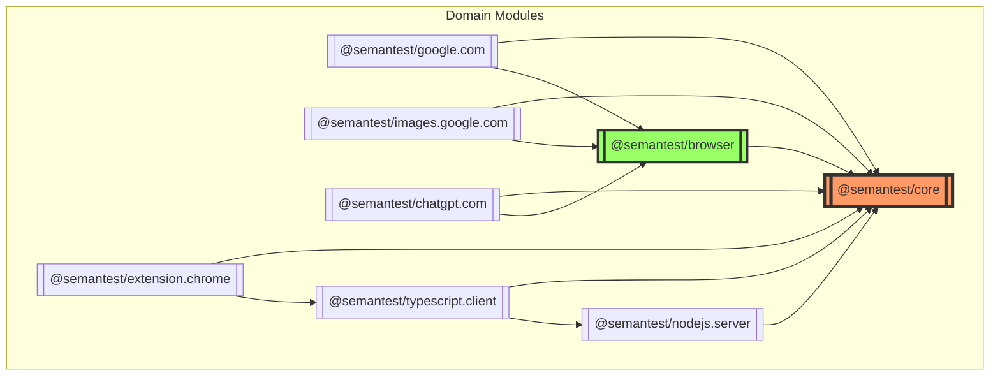

## Deployment Architecture

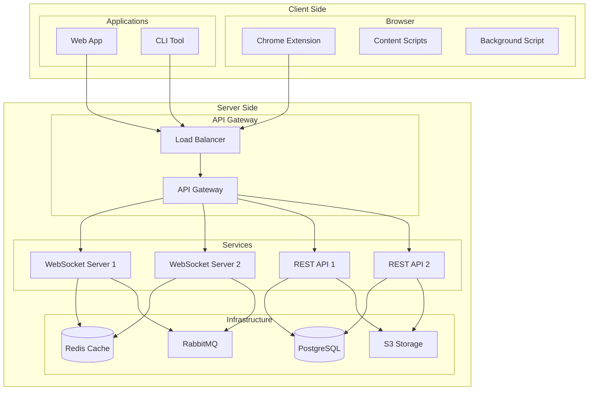

## Domain Event Flow

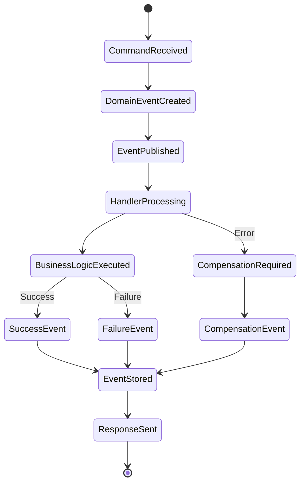

## Entity Lifecycle

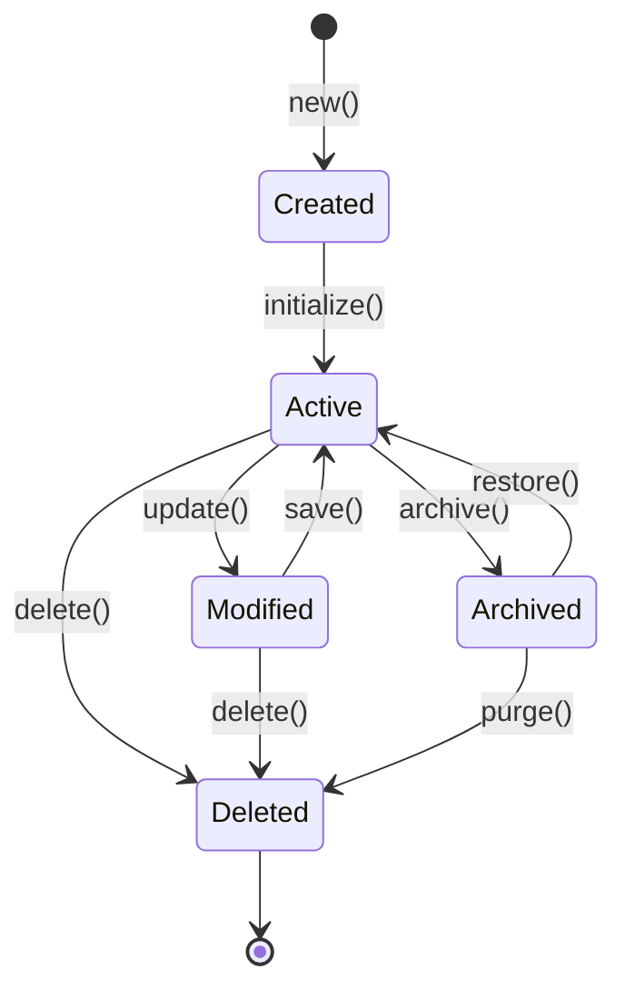

## CQRS Pattern Implementation

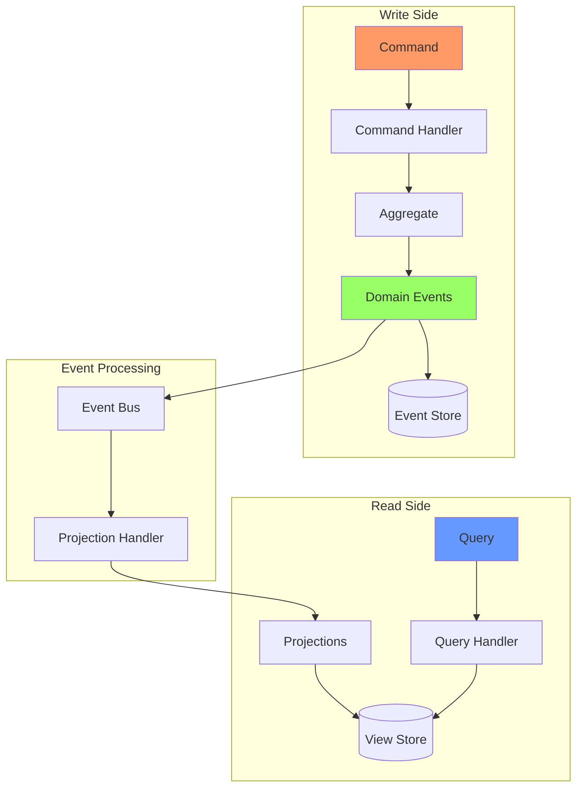

## Security Architecture

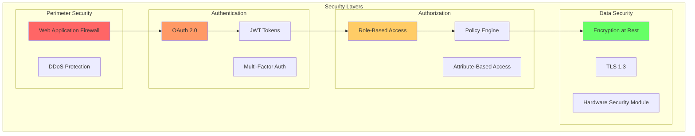

## Performance Architecture

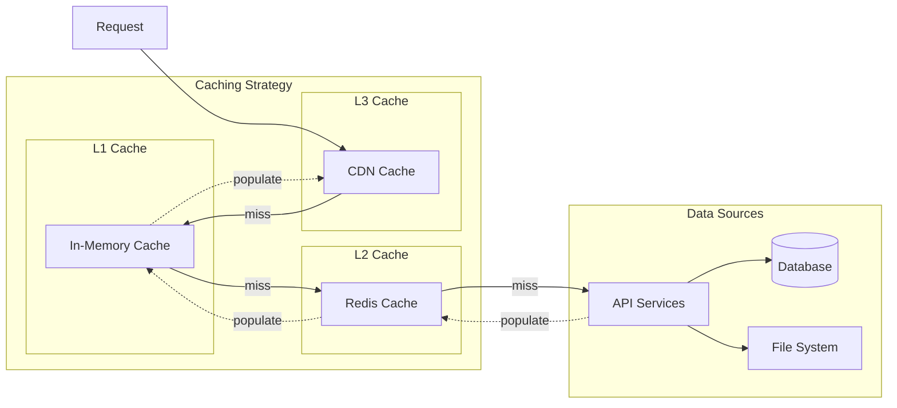

---

## Architecture Principles

### 1. Domain Isolation
Each domain module is completely isolated and can only communicate through well-defined interfaces and events.

### 2. Event-Driven Communication
All inter-module communication happens through domain events, ensuring loose coupling.

### 3. Dependency Inversion
High-level modules don't depend on low-level modules. Both depend on abstractions.

### 4. Single Responsibility
Each module, class, and method has a single, well-defined responsibility.

### 5. Open/Closed Principle
Modules are open for extension but closed for modification, achieved through proper abstraction.

## Best Practices

1. **Always emit domain events** for state changes
2. **Never bypass aggregate boundaries** when modifying state
3. **Use value objects** for domain concepts without identity
4. **Keep aggregates small** and focused on maintaining invariants
5. **Design around business capabilities**, not technical concerns