# Semantest Event-Driven Architecture

Visual representation of the event-driven architecture patterns used in the Semantest platform.

## Event System Overview

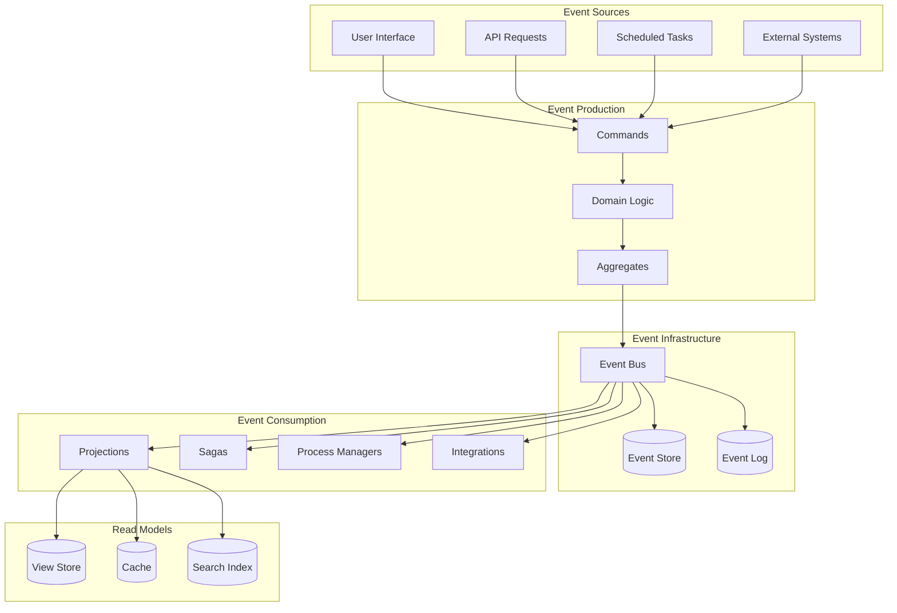

## Event Types Hierarchy

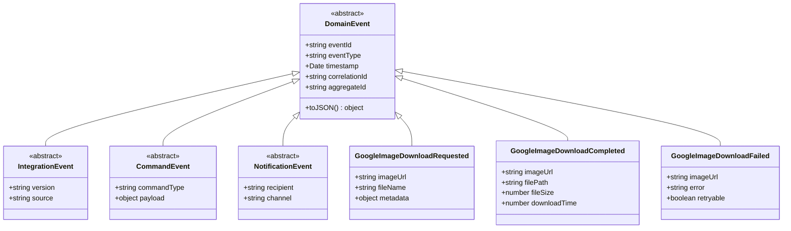

## Event Flow Patterns

### Command-Event Pattern

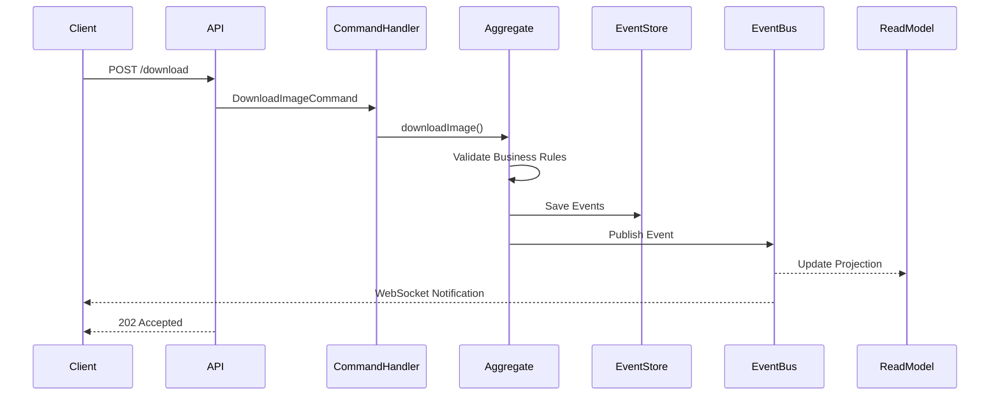

### Saga Pattern

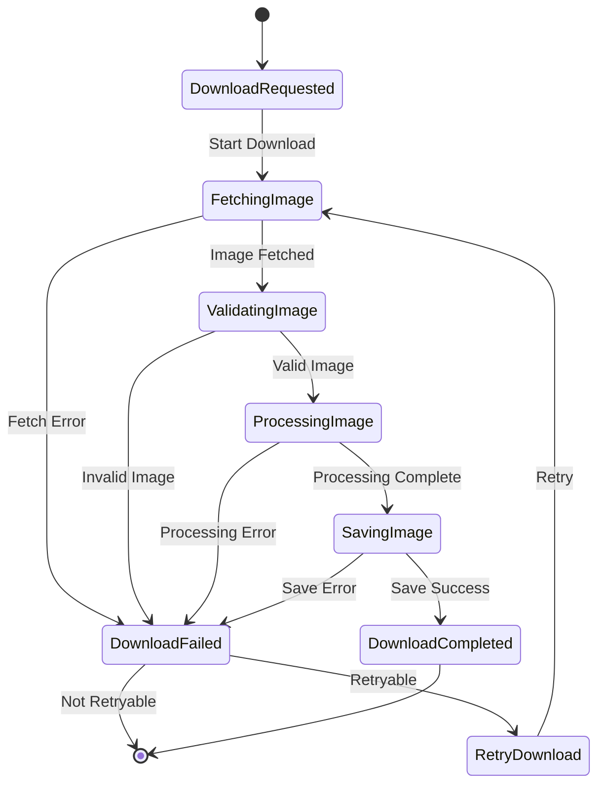

## Event Sourcing Implementation

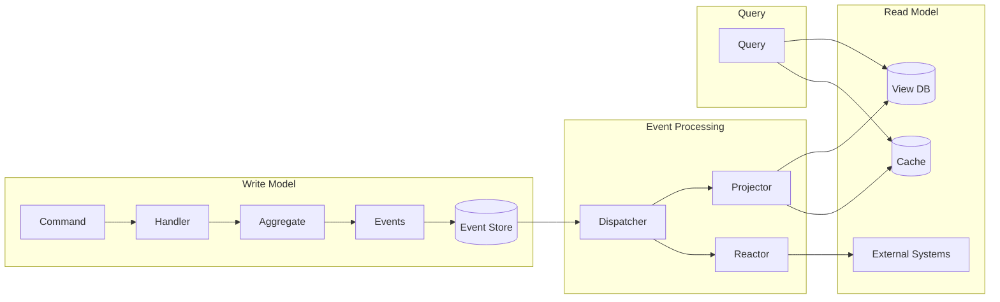

## Event Bus Architecture

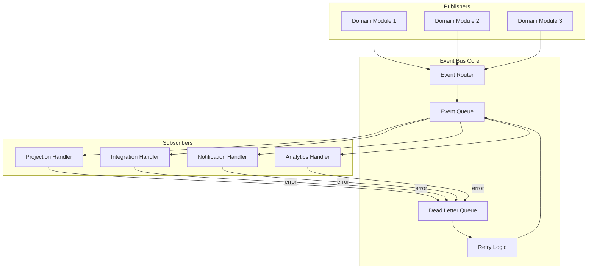

## Event Store Schema

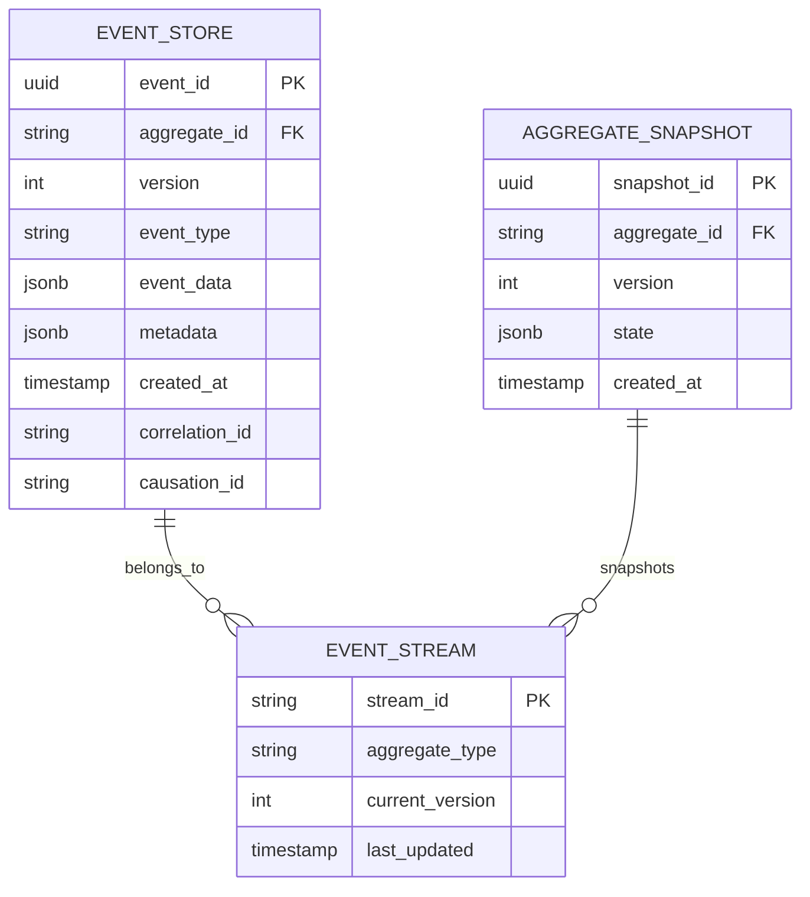

## Event Correlation

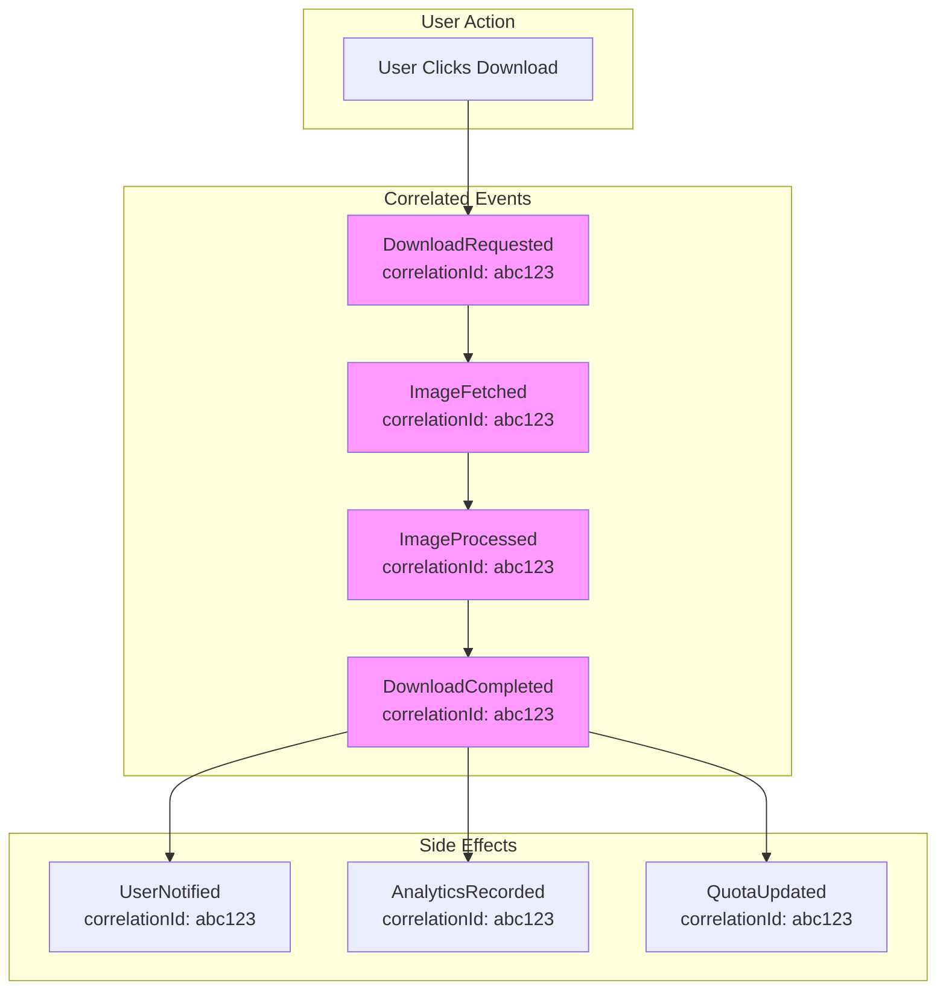

## Process Manager Pattern

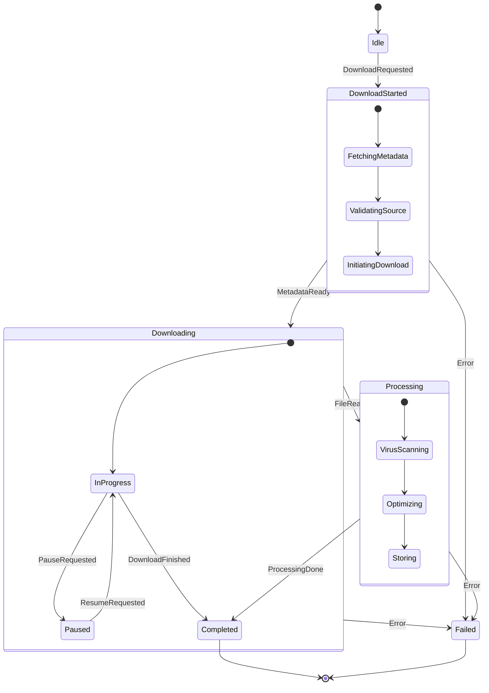

## Event Replay Architecture

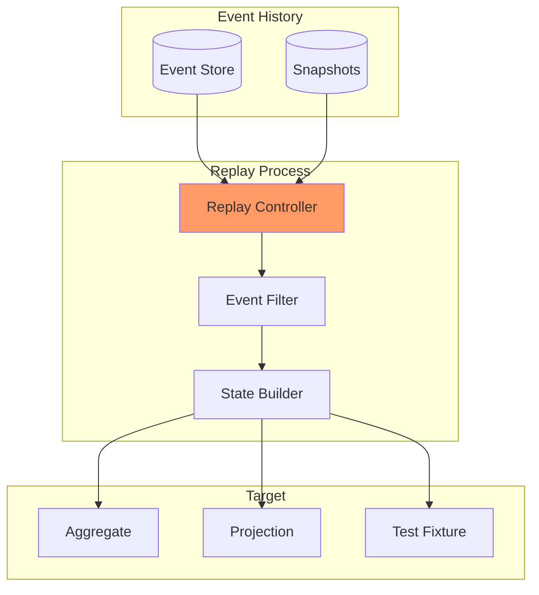

## Event-Driven Microservices

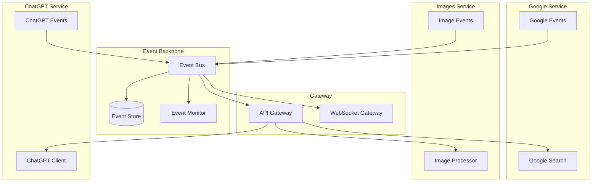

## Event Monitoring Dashboard

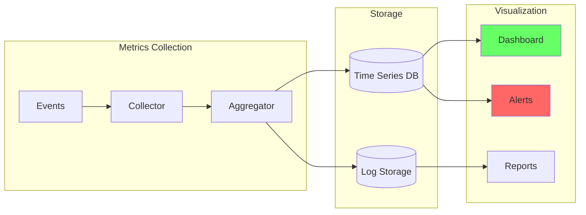

## Event-Driven Patterns

### 1. Event Notification
Simple notification that something happened, minimal data.

### 2. Event-Carried State Transfer
Event contains all data needed by consumers.

### 3. Event Sourcing
Store all changes as events, rebuild state from events.

### 4. CQRS
Separate read and write models, connected by events.

### 5. Saga Pattern
Coordinate distributed transactions through events.

## Best Practices

1. **Idempotent Event Handlers**: Handle duplicate events gracefully
2. **Event Versioning**: Support multiple event versions
3. **Correlation IDs**: Track related events across services
4. **Dead Letter Queues**: Handle failed event processing
5. **Event Replay**: Support rebuilding state from events
6. **Monitoring**: Track event flow and processing metrics
7. **Testing**: Use event fixtures for testing