# Semantest Hexagonal Architecture

Visual representation of the hexagonal (ports and adapters) architecture pattern used in the Semantest platform.

## Hexagonal Architecture Overview


## Port Definitions

```mermaid
classDiagram
    class IDownloadService {
        <<interface>>
        +downloadImage(url: string, options: DownloadOptions) Promise~DownloadResult~
        +downloadBatch(urls: string[]) Promise~BatchResult~
        +getDownloadStatus(id: string) Promise~DownloadStatus~
        +cancelDownload(id: string) Promise~void~
    }
    
    class IImageRepository {
        <<interface>>
        +save(image: Image) Promise~void~
        +findById(id: string) Promise~Image~
        +findByUrl(url: string) Promise~Image~
        +delete(id: string) Promise~void~
    }
    
    class IEventPublisher {
        <<interface>>
        +publish(event: DomainEvent) Promise~void~
        +publishBatch(events: DomainEvent[]) Promise~void~
    }
    
    class IBrowserAutomation {
        <<interface>>
        +navigate(url: string) Promise~void~
        +screenshot() Promise~Buffer~
        +click(selector: string) Promise~void~
        +evaluate(script: string) Promise~any~
    }
    
    class INotificationService {
        <<interface>>
        +notify(recipient: string, message: Message) Promise~void~
        +notifyBatch(notifications: Notification[]) Promise~void~
    }
```



## Adapter Implementations


## Use Case Flow


## Domain Module Structure


## Dependency Inversion


## Testing Strategy


## Configuration Management


## Multi-Adapter Pattern


## Port Types

### Primary Ports (Driving)
- **Use Case Interfaces**: Define application capabilities
- **Query Interfaces**: Read-only operations
- **Command Interfaces**: State-changing operations

### Secondary Ports (Driven)
- **Repository Interfaces**: Data persistence
- **Event Publisher Interfaces**: Event distribution
- **External Service Interfaces**: Third-party integrations
- **Infrastructure Interfaces**: System resources

## Advantages of Hexagonal Architecture

1. **Testability**: Easy to test with mock adapters
2. **Flexibility**: Swap implementations without changing core
3. **Maintainability**: Clear separation of concerns
4. **Portability**: Core logic independent of infrastructure
5. **Scalability**: Add new adapters without modifying core

## Implementation Guidelines

### 1. Define Ports First
```typescript
// Primary Port
interface IDownloadService {
  downloadImage(url: string): Promise<DownloadResult>;
}

// Secondary Port
interface IImageRepository {
  save(image: Image): Promise<void>;
  findByUrl(url: string): Promise<Image | null>;
}
```

### 2. Implement Core Logic
```typescript
class DownloadService implements IDownloadService {
  constructor(
    private repository: IImageRepository,
    private browser: IBrowserAutomation,
    private eventPublisher: IEventPublisher
  ) {}
  
  async downloadImage(url: string): Promise<DownloadResult> {
    // Core business logic here
  }
}
```

### 3. Create Adapters
```typescript
class MongoImageRepository implements IImageRepository {
  async save(image: Image): Promise<void> {
    // MongoDB-specific implementation
  }
  
  async findByUrl(url: string): Promise<Image | null> {
    // MongoDB-specific query
  }
}
```

### 4. Wire Everything Together
```typescript
// Dependency injection
const repository = new MongoImageRepository(mongoClient);
const browser = new PlaywrightAdapter();
const eventPublisher = new RabbitMQPublisher(connection);

const downloadService = new DownloadService(
  repository,
  browser,
  eventPublisher
);

const httpAdapter = new ExpressAdapter(downloadService);
```

## Anti-Patterns to Avoid

1. **Framework Leakage**: Don't let framework specifics leak into core
2. **Anemic Domain**: Keep business logic in domain, not in adapters
3. **Port Pollution**: Don't create too many fine-grained ports
4. **Adapter Logic**: Keep adapters thin, logic belongs in core
5. **Direct Dependencies**: Always depend on ports, not concrete implementations