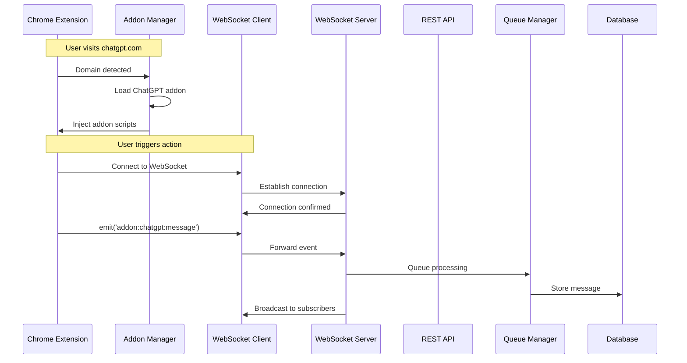
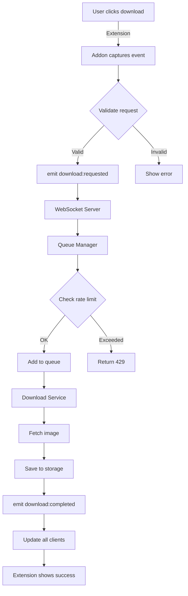
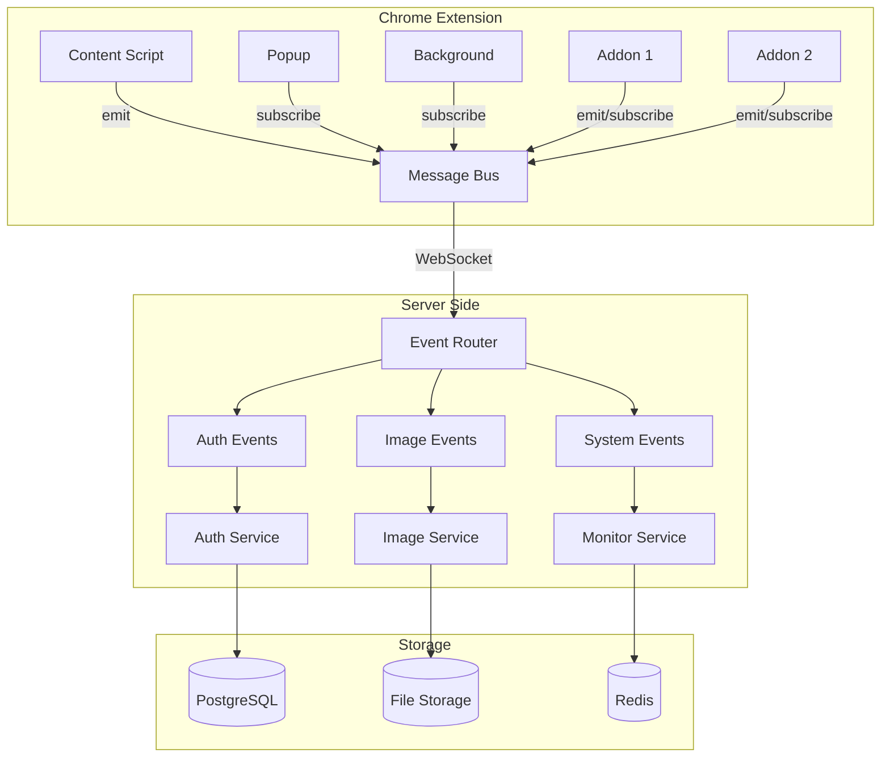
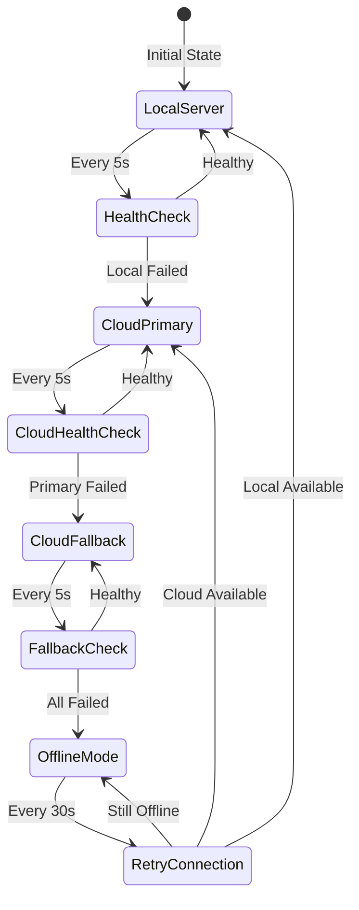
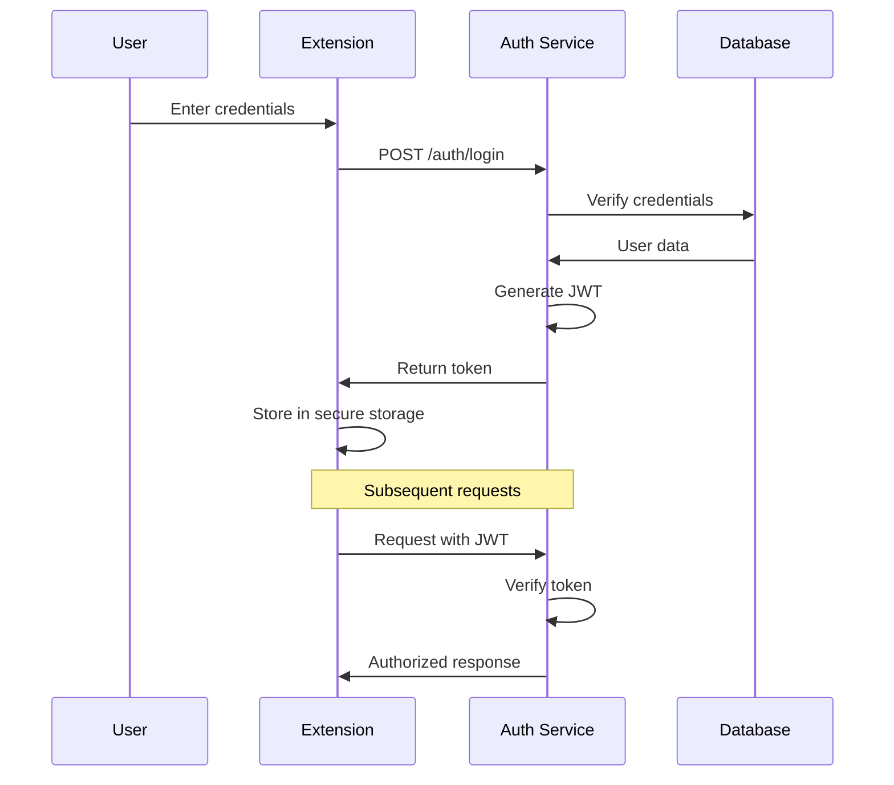

# Component Interaction Diagrams

## Overview

This document illustrates how Semantest components interact with each other through events, APIs, and data flows.

## Core Component Interactions

### 1. Extension-Server Communication Flow



### 2. Image Download Flow



### 3. Event Bus Architecture



### 4. Failover Sequence



## Detailed Component Responsibilities

### Chrome Extension Components

#### 1. Core Message Bus
```typescript
class MessageBus {
  // Central event system
  private handlers: Map<string, Set<Handler>>;
  
  emit(event: string, data: any): void
  on(event: string, handler: Handler): void
  off(event: string, handler: Handler): void
}
```

**Interactions:**
- Receives events from all extension components
- Routes events to appropriate handlers
- Manages WebSocket communication
- Handles offline queuing

#### 2. Addon Manager
```typescript
class AddonManager {
  // Dynamic addon loading
  private addons: Map<string, Addon>;
  
  loadAddon(domain: string): Promise<void>
  unloadAddon(addonId: string): void
  getActiveAddons(): Addon[]
}
```

**Interactions:**
- Monitors tab URL changes
- Loads/unloads addons dynamically
- Provides addon isolation
- Manages addon permissions

#### 3. WebSocket Client
```typescript
class WebSocketClient {
  // Server communication
  private connection: WebSocket;
  private reconnectAttempts: number;
  
  connect(): Promise<void>
  send(event: Event): void
  onMessage(handler: Handler): void
}
```

**Interactions:**
- Maintains persistent connection
- Handles reconnection logic
- Queues messages during disconnection
- Routes server events to Message Bus

### Server Components

#### 1. WebSocket Server
```typescript
class WebSocketServer {
  // Client management
  private clients: Map<string, Client>;
  private rooms: Map<string, Set<Client>>;
  
  handleConnection(ws: WebSocket): void
  broadcast(event: Event): void
  sendToRoom(room: string, event: Event): void
}
```

**Interactions:**
- Accepts client connections
- Routes events to appropriate services
- Manages client subscriptions
- Handles broadcasting

#### 2. Queue Manager
```typescript
class QueueManager {
  // Priority queue system
  private queues: PriorityQueues;
  private workers: Worker[];
  
  enqueue(item: QueueItem): void
  process(): Promise<void>
  getStatus(): QueueStatus
}
```

**Interactions:**
- Receives tasks from WebSocket Server
- Distributes work to processors
- Manages retry logic
- Reports status updates

#### 3. Service Layer
```typescript
interface Service {
  // Business logic
  handleEvent(event: Event): Promise<void>
  getStatus(): ServiceStatus
}
```

**Interactions:**
- Processes domain-specific events
- Interacts with data layer
- Emits result events
- Handles errors gracefully

## Data Flow Patterns

### 1. Request-Response Pattern
```
Client → WebSocket → Server → Service → Database
   ↑                                        ↓
   ←────────── Response Event ──────────────
```

### 2. Broadcast Pattern
```
Client A → WebSocket → Server → All Clients
                         ↓
                    Event Store
```

### 3. Queue Processing Pattern
```
Multiple Clients → Queue → Workers → Services
                     ↓
                Rate Limiter
```

## Integration Points

### 1. Extension ↔ Server
- **Protocol**: WebSocket (primary), REST (fallback)
- **Authentication**: JWT tokens
- **Events**: Namespaced (core:*, addon:*, system:*)
- **Error Handling**: Automatic retry with backoff

### 2. Server ↔ Database
- **PostgreSQL**: Primary data storage
- **Redis**: Caching and session storage
- **Connection Pooling**: Yes
- **Transactions**: ACID compliant

### 3. Server ↔ External Services
- **HTTP Client**: Axios with retry
- **Rate Limiting**: Per-service limits
- **Circuit Breaker**: Prevents cascading failures
- **Timeout**: 30s default

## Security Interactions

### Authentication Flow


### Permission Check Flow
```typescript
// Extension addon requests permission
addon.requestPermission('downloads') 
  → Core validates manifest
  → User consent dialog
  → Permission granted/denied
  → Update addon context
```

## Performance Considerations

### 1. Caching Strategy
- **Browser**: IndexedDB for offline data
- **Server**: Redis for hot data
- **CDN**: Static assets
- **TTL**: Context-dependent

### 2. Load Distribution
- **Round-robin**: WebSocket connections
- **Priority-based**: Queue processing
- **Geographic**: CDN and edge servers
- **Adaptive**: Based on server load

### 3. Resource Management
- **Connection Pooling**: Database and Redis
- **Worker Threads**: CPU-intensive tasks
- **Memory Limits**: Per-component quotas
- **Garbage Collection**: Aggressive cleanup

## Monitoring Integration

### Metrics Collection Points
```
Extension → Events → Server → Prometheus → Grafana
     ↓                  ↓
  Console Logs    Application Logs → ElasticSearch
```

### Health Check Endpoints
- `/health` - Basic liveness
- `/ready` - Readiness probe
- `/metrics` - Prometheus format
- `/status` - Detailed status

## Error Handling Flows

### 1. Client-Side Error
```
Error in Addon → Caught by Message Bus → Log to Console → Report to Server → User Notification
```

### 2. Server-Side Error
```
Service Error → Error Event → All Clients → Retry Logic → Dead Letter Queue → Alert
```

### 3. Network Error
```
Connection Lost → Offline Queue → Reconnect Attempts → Resume on Success → Sync Queue
```

## Conclusion

These interaction diagrams show how Semantest components work together to create a robust, scalable web automation platform. The event-driven architecture ensures loose coupling while maintaining reliable communication between all parts of the system.