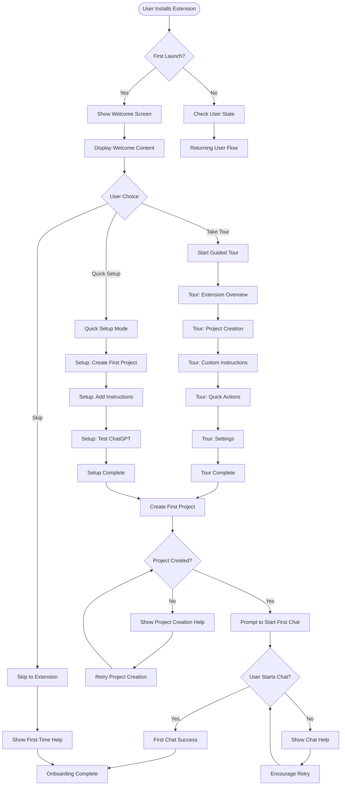
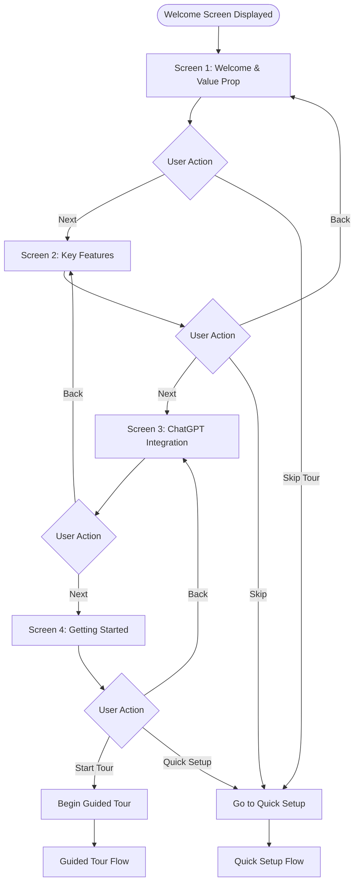
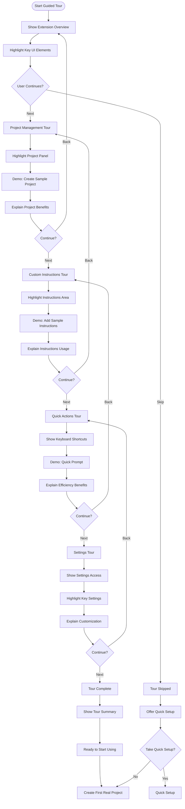
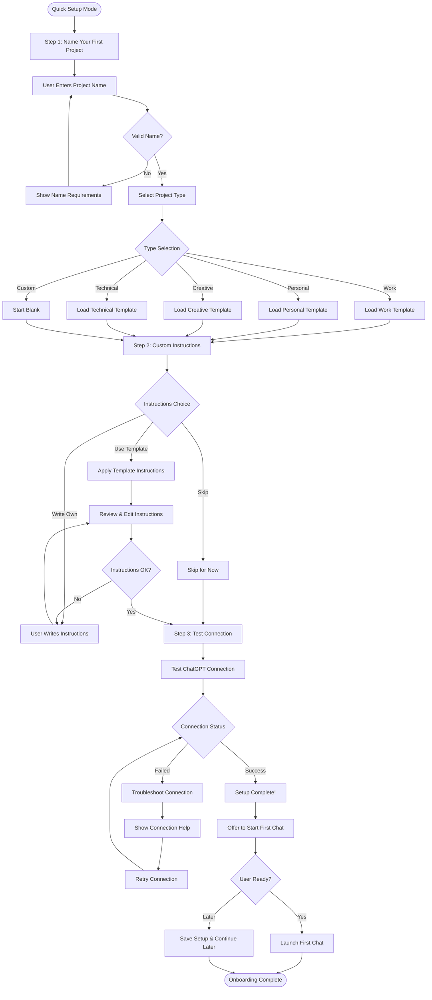
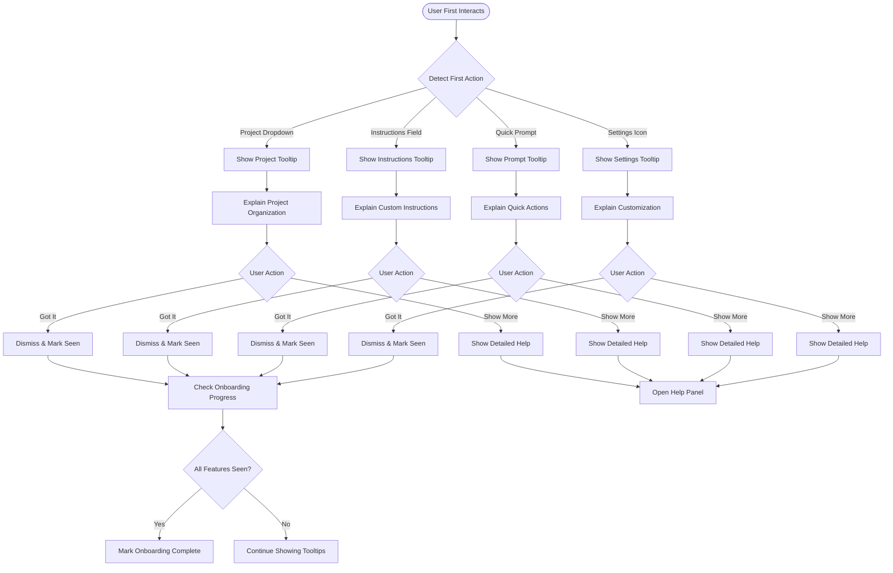
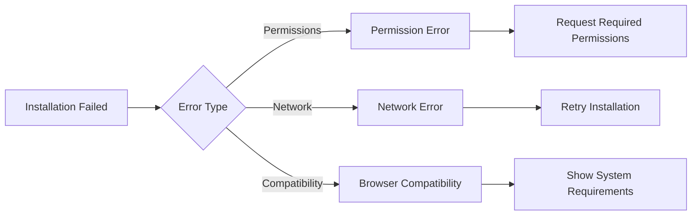
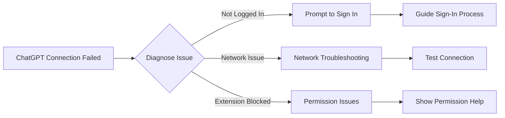

# User Onboarding Flow

## Overview
This flow describes the complete first-time user experience for the Semantest ChatGPT extension, from installation to first successful interaction.

## Installation & First Launch Flow



## Welcome Screen Sequence



## Guided Tour Flow



## Quick Setup Flow



## Feature Introduction Tooltips



## Error Handling & Recovery

### 1. Installation Issues


### 2. First Connection Failures


## Welcome Screen UI Components

### Welcome Screen 1
```
┌─────────────────────────────────────┐
│ 🎉 Welcome to Semantest!            │
├─────────────────────────────────────┤
│                                     │
│    🤖 Transform ChatGPT into       │
│       Your Professional            │
│       Workspace                    │
│                                     │
│ ✅ Organize conversations           │
│ ✅ Custom instruction templates     │
│ ✅ Quick actions & shortcuts        │
│ ✅ Download AI-generated images     │
│                                     │
│ [Take 2-min Tour] [Quick Setup]     │
│                                     │
│              [Skip for now]         │
└─────────────────────────────────────┘
```

### Project Creation Wizard
```
┌─────────────────────────────────────┐
│ Create Your First Project          │
├─────────────────────────────────────┤
│ Project Name                        │
│ ┌─────────────────────────────────┐ │
│ │ Marketing Campaign 2024         │ │
│ └─────────────────────────────────┘ │
│                                     │
│ Choose a template:                  │
│ ○ Work Projects                     │
│ ○ Personal Assistant                │
│ ○ Creative Writing                  │
│ ○ Technical Support                 │
│ ● Custom (blank)                    │
│                                     │
│ [Back] [Create Project]             │
└─────────────────────────────────────┘
```

### Guided Tour Overlay
```
┌─────────────────────────────────────┐
│ 👆 This is your project selector   │
│                                     │
│ Click here to switch between        │
│ different contexts and organize     │
│ your ChatGPT conversations.         │
│                                     │
│ Each project can have its own:      │
│ • Custom instructions               │
│ • Conversation history              │
│ • Settings and preferences          │
│                                     │
│ [Previous] [Next] [Skip Tour]       │
│                                     │
│ ● ○ ○ ○ ○  (Step 1 of 5)          │
└─────────────────────────────────────┘
```

## Onboarding Success Metrics

### Completion Tracking
```javascript
const onboardingMetrics = {
  steps: {
    welcome_viewed: false,
    tour_started: false,
    tour_completed: false,
    first_project_created: false,
    first_chat_started: false,
    first_instructions_added: false
  },
  
  success_criteria: {
    basic: ['welcome_viewed', 'first_project_created'],
    intermediate: ['tour_started', 'first_chat_started'],
    advanced: ['tour_completed', 'first_instructions_added']
  }
};
```

### User Segmentation
1. **Power Users**: Complete full tour, customize extensively
2. **Quick Adopters**: Skip tour, create project, start using
3. **Cautious Users**: View tour, minimal setup, gradual adoption
4. **Drop-offs**: Install but don't complete first project

## Accessibility Features

### Keyboard Navigation
- Tab through all onboarding elements
- Enter/Space to activate buttons
- Escape to skip current step
- Arrow keys for wizard navigation

### Screen Reader Support
```html
<div role="dialog" aria-labelledby="welcome-title" aria-describedby="welcome-desc">
  <h1 id="welcome-title">Welcome to Semantest</h1>
  <p id="welcome-desc">Get started with your AI-powered ChatGPT workspace</p>
  
  <nav aria-label="Onboarding steps">
    <ol>
      <li aria-current="step">Welcome</li>
      <li>Setup</li>
      <li>First Project</li>
    </ol>
  </nav>
</div>
```

### Visual Indicators
- Progress indicators for multi-step flows
- Clear focus states
- High contrast mode support
- Reduced motion options
- Success/error state announcements

## Performance Considerations

### Lazy Loading
- Load tour content only when needed
- Defer non-critical onboarding assets
- Preload next step content

### Analytics & Optimization
```javascript
// Track onboarding funnel
analytics.track('onboarding_step', {
  step: 'welcome_screen',
  timestamp: Date.now(),
  user_type: 'first_time'
});

// A/B test different flows
const onboardingVariant = getABTestVariant('onboarding_flow');
```

## Onboarding Completion States

### Successful Completion
- User creates first project
- Instructions added (optional)
- First ChatGPT interaction
- Basic feature awareness

### Partial Completion
- Extension installed and opened
- Welcome screen viewed
- Some features explored

### Abandonment Points
- After installation (never opened)
- After welcome screen (didn't proceed)
- During project creation (complexity)
- During first chat attempt (connection issues)