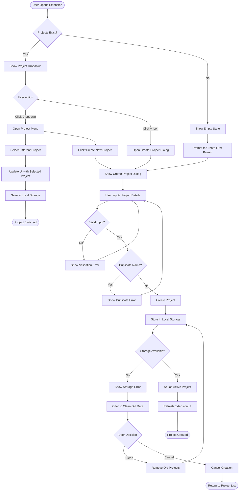
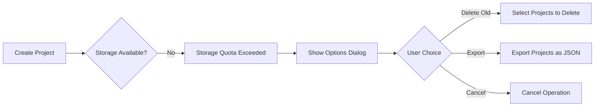
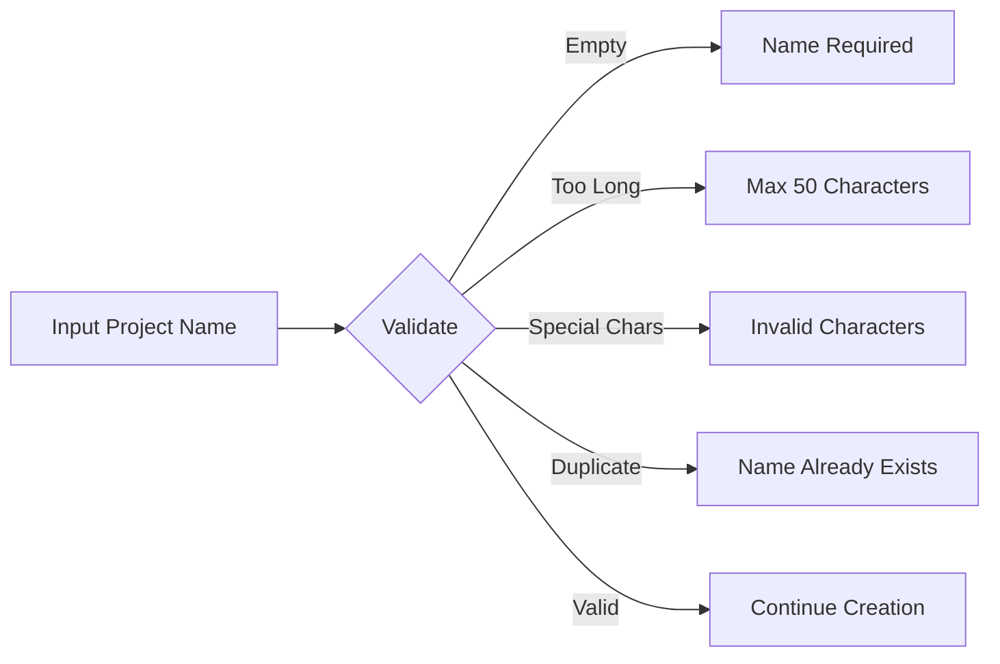
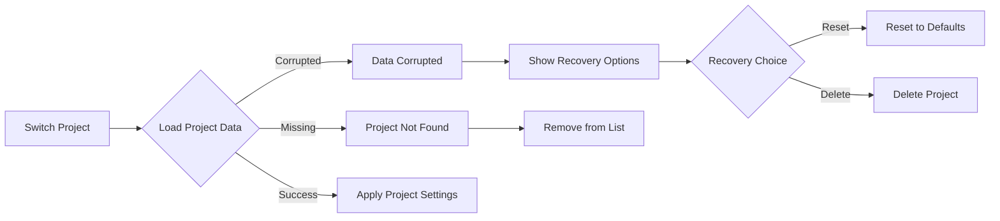
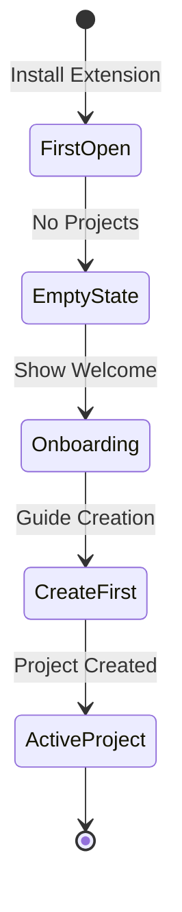
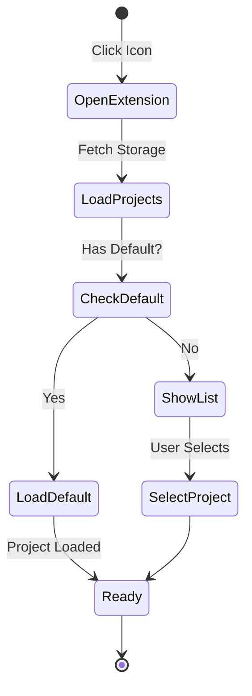

# Project Management User Flow

## Overview
This flow describes how users create, select, and manage projects within the ChatGPT extension.

## Main Flow Diagram



## Edge Cases & Error States

### 1. Storage Quota Exceeded


### 2. Project Name Validation


### 3. Project Switching Failures


## User States

### New User Flow


### Returning User Flow


## Interaction Details

### Project Creation Form
```
┌─────────────────────────────────┐
│ Create New Project              │
├─────────────────────────────────┤
│ Project Name *                  │
│ ┌─────────────────────────────┐ │
│ │ Marketing Campaign 2024     │ │
│ └─────────────────────────────┘ │
│ 23/50 characters                │
│                                 │
│ Color Theme                     │
│ ◉ Green  ○ Blue  ○ Purple     │
│ ○ Orange ○ Red   ○ Gray       │
│                                 │
│ Description (optional)          │
│ ┌─────────────────────────────┐ │
│ │ Q4 marketing strategies     │ │
│ │ and campaign planning       │ │
│ └─────────────────────────────┘ │
│                                 │
│ [Cancel]          [Create]      │
└─────────────────────────────────┘
```

### Error States Display
```
┌─────────────────────────────────┐
│ ⚠️ Project Name Already Exists  │
│                                 │
│ A project named "Marketing      │
│ Campaign" already exists.       │
│ Please choose a different name. │
│                                 │
│ [OK]                           │
└─────────────────────────────────┘
```

## Accessibility Considerations

1. **Keyboard Navigation**
   - Tab through all interactive elements
   - Enter/Space to activate buttons
   - Escape to close dialogs
   - Arrow keys for dropdown navigation

2. **Screen Reader Support**
   - ARIA labels for all buttons
   - Live regions for status updates
   - Form validation announcements
   - Role attributes for custom components

3. **Focus Management**
   - Focus trapped in modals
   - Focus returns to trigger element
   - Visual focus indicators
   - Skip links where appropriate

## Performance Considerations

1. **Local Storage Limits**
   - Monitor storage usage
   - Implement data compression
   - Automatic cleanup of old data
   - Export functionality for backup

2. **UI Responsiveness**
   - Debounce name validation
   - Optimistic UI updates
   - Loading states for async operations
   - Smooth transitions between states