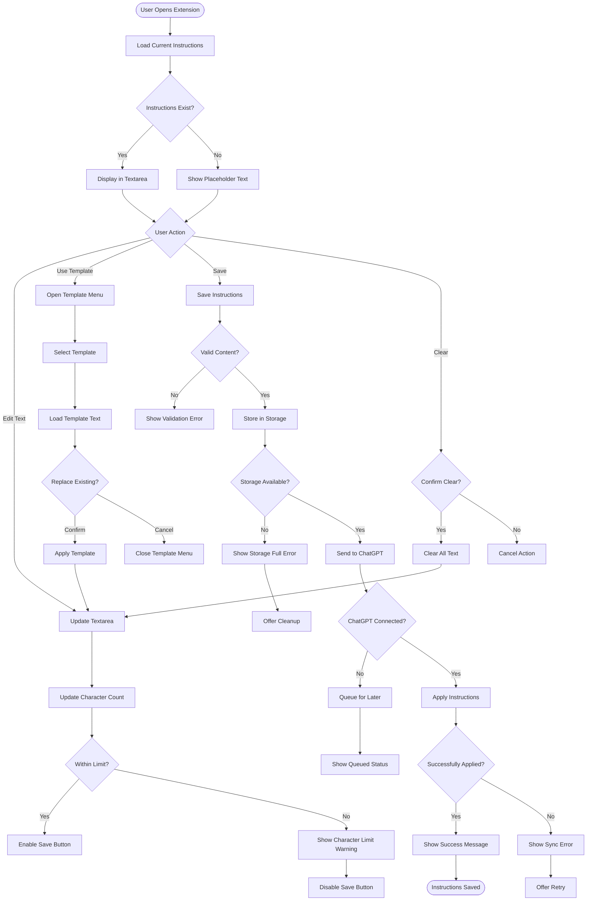
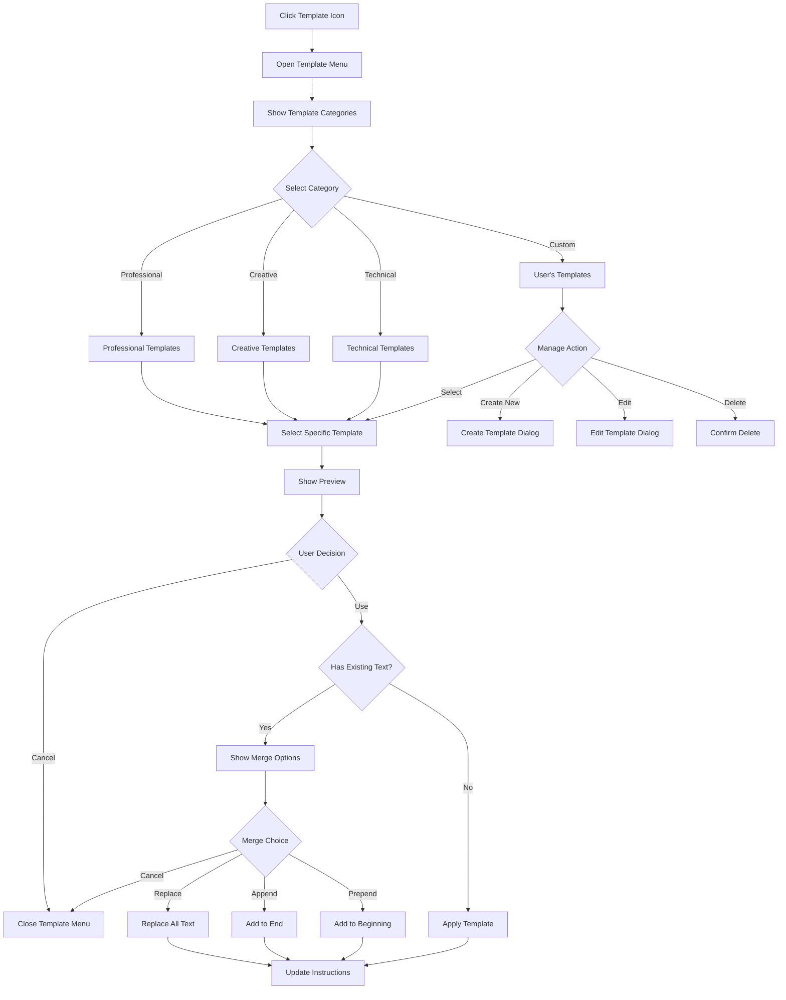
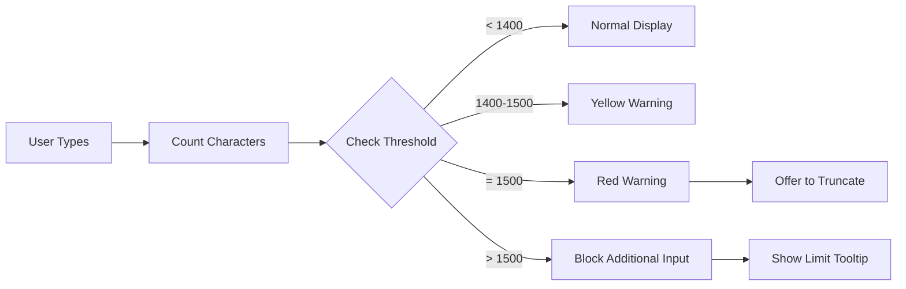
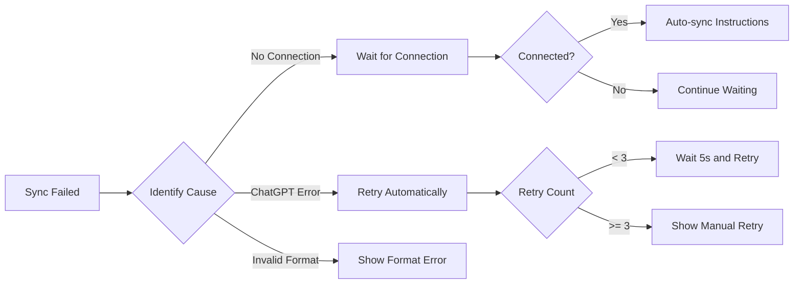
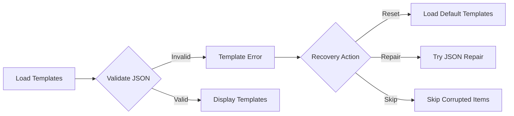
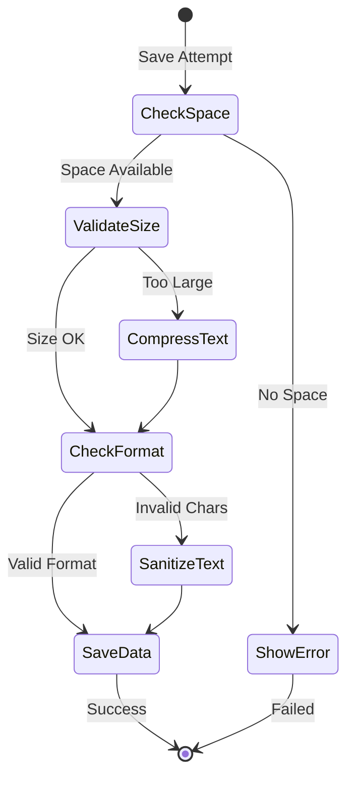

# Custom Instructions User Flow

## Overview
This flow describes how users create, edit, and manage custom instructions for ChatGPT conversations.

## Main Flow Diagram



## Template Selection Flow



## Error States & Edge Cases

### 1. Character Limit Handling


### 2. Sync Failure Recovery


### 3. Template Corruption Handling


## UI States

### Character Count Display
```
┌─────────────────────────────────────┐
│ Custom Instructions                 │
├─────────────────────────────────────┤
│ ┌─────────────────────────────────┐ │
│ │ You are a helpful assistant     │ │
│ │ focused on providing clear,     │ │
│ │ concise answers...              │ │
│ │                                 │ │
│ └─────────────────────────────────┘ │
│ 156 / 1500     [Template] [Save]    │
└─────────────────────────────────────┘

States:
- Normal: "156 / 1500" (gray)
- Warning: "1423 / 1500" (yellow)
- Limit: "1500 / 1500" (red)
- Over: "1500 / 1500 - Limit reached" (red)
```

### Template Preview Modal
```
┌─────────────────────────────────────┐
│ Professional Assistant Template     │
├─────────────────────────────────────┤
│ Preview:                            │
│ ┌─────────────────────────────────┐ │
│ │ You are a professional          │ │
│ │ assistant with expertise in     │ │
│ │ business communication. Focus   │ │
│ │ on clarity, professionalism,    │ │
│ │ and actionable advice.          │ │
│ └─────────────────────────────────┘ │
│                                     │
│ This will replace your current      │
│ instructions. Continue?             │
│                                     │
│ [Cancel]    [Append]    [Replace]   │
└─────────────────────────────────────┘
```

## Validation Rules

### Content Validation
1. **Length**: 1-1500 characters
2. **Format**: Plain text only (no HTML/Markdown)
3. **Encoding**: UTF-8 compatible
4. **Prohibited Content**:
   - No personal information (emails, phones)
   - No API keys or secrets
   - No malicious instructions

### Storage Validation


## Accessibility Features

### Keyboard Shortcuts
- `Ctrl/Cmd + S`: Save instructions
- `Ctrl/Cmd + T`: Open templates
- `Ctrl/Cmd + K`: Clear all
- `Tab`: Navigate between elements
- `Escape`: Close dialogs

### Screen Reader Support
```html
<textarea 
  aria-label="Custom instructions for ChatGPT"
  aria-describedby="char-count instructions-help"
  aria-invalid="false"
  aria-live="polite"
/>
<div id="char-count" role="status" aria-live="polite">
  156 of 1500 characters used
</div>
```

### Visual Indicators
- Focus rings on all interactive elements
- Color + icon for all status messages
- High contrast mode support
- Reduced motion options

## Performance Optimizations

### Debouncing & Throttling
```javascript
// Character count updates: throttled to 100ms
// Auto-save: debounced to 1000ms
// Template search: debounced to 300ms
// Sync attempts: exponential backoff
```

### Local Storage Strategy
1. **Primary Storage**: Current instructions
2. **Backup Storage**: Last 5 versions
3. **Template Cache**: Frequently used templates
4. **Compression**: LZ-string for large texts
5. **Cleanup**: Remove versions older than 30 days