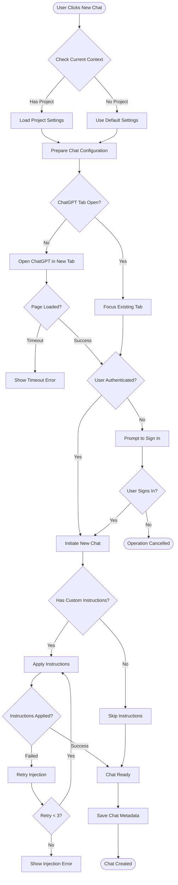
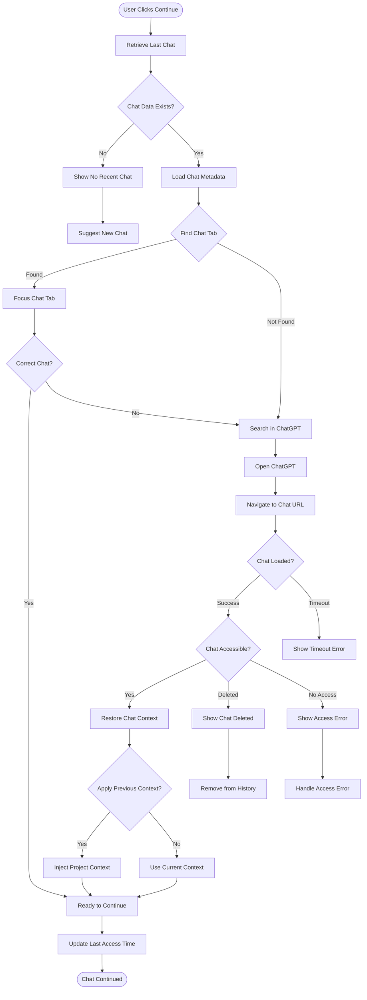
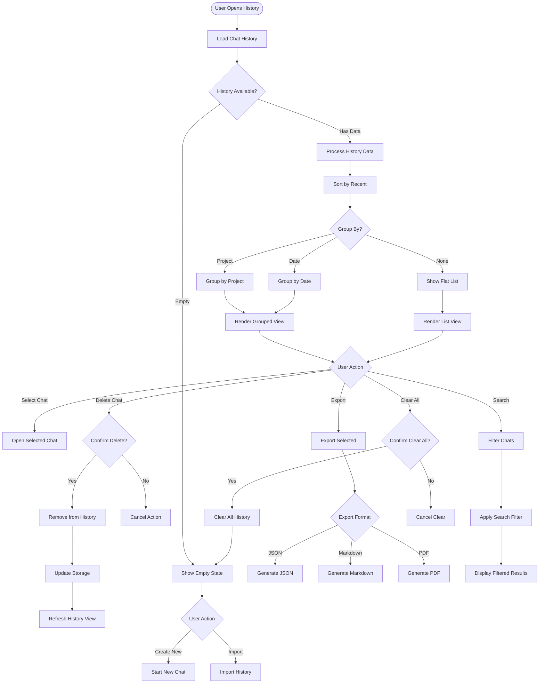
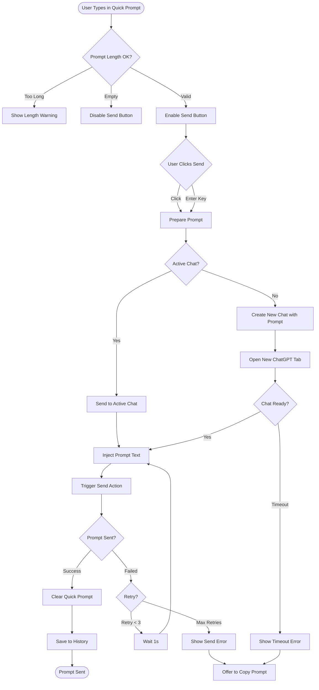
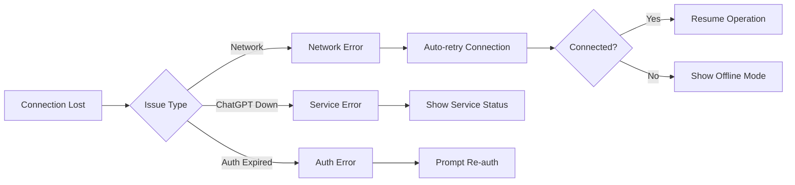
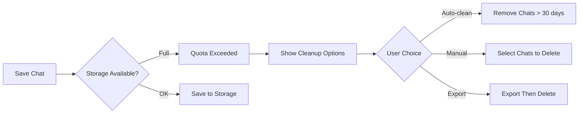
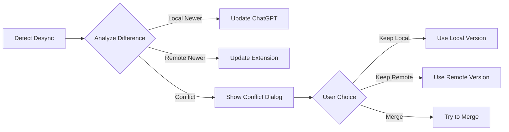

# Chat Management User Flow

## Overview
This flow describes how users create new chats, continue existing conversations, manage chat history, and organize their ChatGPT interactions.

## Main Chat Creation Flow



## Continue Chat Flow



## Chat History Management



## Quick Prompt Flow



## Error States & Recovery

### 1. ChatGPT Connection Issues


### 2. Storage Quota Management


### 3. Chat Synchronization


## UI Components

### Chat History List
```
┌─────────────────────────────────────┐
│ Chat History           [Clear All]  │
├─────────────────────────────────────┤
│ 🔍 Search chats...                  │
├─────────────────────────────────────┤
│ Today                               │
│ ┌─────────────────────────────────┐ │
│ │ 🟢 Marketing Strategy Discussion│ │
│ │ Project: Marketing Campaign     │ │
│ │ 2:30 PM • 15 messages          │ │
│ └─────────────────────────────────┘ │
│ ┌─────────────────────────────────┐ │
│ │ 🔵 Code Review: Auth Module    │ │
│ │ Project: Development           │ │
│ │ 11:45 AM • 8 messages         │ │
│ └─────────────────────────────────┘ │
│                                     │
│ Yesterday                           │
│ ┌─────────────────────────────────┐ │
│ │ 🟣 Customer Feedback Analysis  │ │
│ │ Project: Research              │ │
│ │ 4:15 PM • 23 messages         │ │
│ └─────────────────────────────────┘ │
└─────────────────────────────────────┘
```

### Quick Actions Panel
```
┌─────────────────────────────────────┐
│ Quick Actions                       │
├─────────────────────────────────────┤
│ [+ New Chat]  [↺ Continue]         │
│                                     │
│ Recent Prompts:                     │
│ • "Explain quantum computing"       │
│ • "Write a Python function for..."  │
│ • "Analyze this marketing data"     │
└─────────────────────────────────────┘
```

## Performance Considerations

### Caching Strategy
1. **Active Chat Cache**: Current chat metadata
2. **History Cache**: Last 50 chats
3. **Project Cache**: Associated project data
4. **Prompt Cache**: Last 10 quick prompts

### Optimization Techniques
```javascript
// Lazy loading for history > 50 items
// Virtual scrolling for long lists
// Debounced search (300ms)
// Throttled storage updates (1000ms)
// Background sync for chat metadata
```

## Accessibility Features

### Keyboard Navigation
- `Ctrl/Cmd + N`: New chat
- `Ctrl/Cmd + Shift + N`: New chat in background
- `Ctrl/Cmd + L`: Focus chat list
- `Ctrl/Cmd + F`: Search chats
- `Arrow keys`: Navigate chat list
- `Enter`: Open selected chat
- `Delete`: Delete selected chat

### Screen Reader Announcements
```html
<div role="status" aria-live="polite">
  New chat created with Marketing Campaign project
</div>

<ul role="list" aria-label="Chat history grouped by date">
  <li role="listitem">
    <h3>Today</h3>
    <ul role="list">
      <li role="listitem" aria-label="Marketing Strategy Discussion, 2:30 PM, 15 messages">
        ...
      </li>
    </ul>
  </li>
</ul>
```

### Visual Indicators
- Project color coding
- Active chat highlighting
- Unread message badges
- Loading spinners
- Success/error toast messages