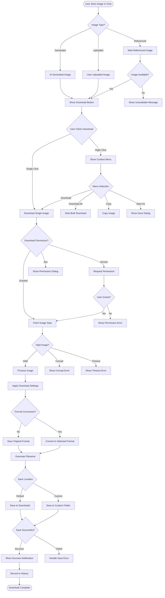
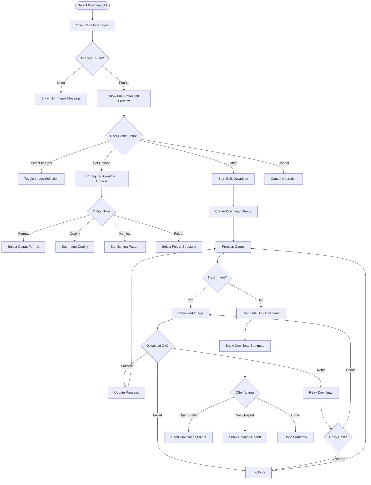
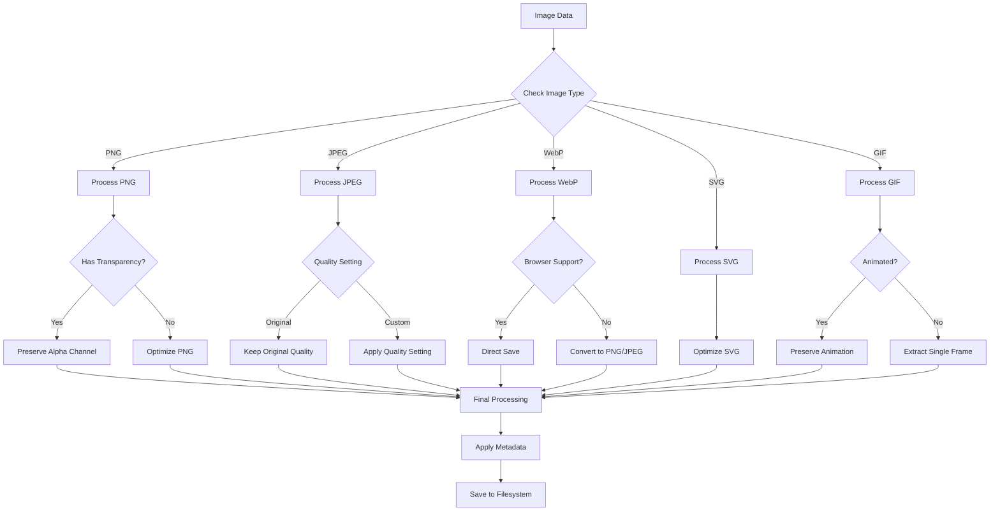
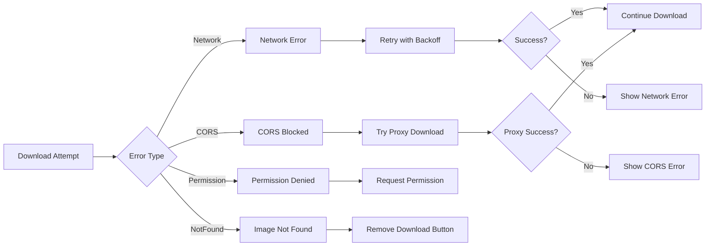
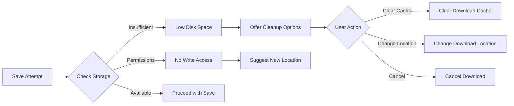
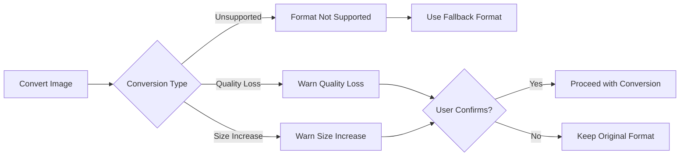

# Image Download User Flow

## Overview
This flow describes how users download images from ChatGPT conversations, including single images, bulk downloads, and handling various image formats and sources.

## Main Image Download Flow



## Bulk Download Flow



## Image Processing Pipeline



## Error Handling & Edge Cases

### 1. Network & Permission Errors


### 2. Storage & Filesystem Issues


### 3. Format Conversion Errors


## UI Components

### Download Button States
```
┌─────────────────────────────────────┐
│ [📥 Download]  - Normal State       │
│ [⏳ Downloading...] - Active State  │
│ [✓ Downloaded] - Success State      │
│ [⚠️ Error] - Error State           │
│ [🔒 Permission] - Permission Needed │
└─────────────────────────────────────┘
```

### Bulk Download Preview
```
┌─────────────────────────────────────┐
│ Download All Images (12 selected)   │
├─────────────────────────────────────┤
│ ☑ Image 1 - AI Generated (PNG)      │
│ ☑ Image 2 - Chart (SVG)            │
│ ☑ Image 3 - Screenshot (JPEG)      │
│ ☐ Image 4 - Avatar (WebP)          │
│ ... 8 more images                   │
├─────────────────────────────────────┤
│ Format: [Original ▼]                │
│ Quality: [━━━━━━●━━] 85%           │
│ Folder: Downloads/ChatGPT/2024-01   │
├─────────────────────────────────────┤
│ [Cancel]         [Download All]     │
└─────────────────────────────────────┘
```

### Download Progress
```
┌─────────────────────────────────────┐
│ Downloading Images                  │
├─────────────────────────────────────┤
│ Total Progress: 7/12               │
│ [████████████░░░░░░░] 58%         │
│                                     │
│ Current: image-8.png               │
│ [██████░░░░░░░░░░░░░] 30%         │
│                                     │
│ ✓ image-1.png (2.3 MB)            │
│ ✓ image-2.svg (45 KB)             │
│ ✓ image-3.jpg (1.8 MB)            │
│ ⚠ image-4.webp (Failed - Retry)   │
│                                     │
│ [Pause]    [Cancel]                │
└─────────────────────────────────────┘
```

## Settings & Preferences

### Download Settings Panel
```
┌─────────────────────────────────────┐
│ Image Download Settings             │
├─────────────────────────────────────┤
│ Default Format                      │
│ ○ Keep Original                     │
│ ● Convert to: [PNG ▼]              │
│                                     │
│ Image Quality (JPEG)                │
│ [━━━━━━━━━●━━━━━] 90%             │
│                                     │
│ File Naming                         │
│ ● Descriptive (chat-topic-1.png)   │
│ ○ Timestamp (2024-01-20-143052.png)│
│ ○ Sequential (image-001.png)       │
│                                     │
│ Download Location                   │
│ 📁 ~/Downloads/ChatGPT             │
│ [Change Location]                   │
│                                     │
│ ☑ Create subfolders by date        │
│ ☑ Skip duplicate files             │
│ ☐ Show download confirmation       │
└─────────────────────────────────────┘
```

## Performance Optimizations

### Download Strategies
1. **Parallel Downloads**: Up to 3 concurrent downloads
2. **Chunked Transfer**: For images > 5MB
3. **Progressive Loading**: Display while downloading
4. **Cache Management**: Store recent downloads
5. **Bandwidth Throttling**: Respect user settings

### Memory Management
```javascript
// Image processing limits
const MAX_IMAGE_SIZE = 50 * 1024 * 1024; // 50MB
const MAX_CANVAS_SIZE = 4096 * 4096; // 16MP
const CHUNK_SIZE = 1024 * 1024; // 1MB chunks

// Cleanup strategies
- Release blob URLs after download
- Clear image cache after 24 hours
- Limit preview thumbnails to 10
```

## Accessibility Features

### Keyboard Controls
- `Enter`: Download focused image
- `Space`: Toggle image selection
- `Ctrl/Cmd + A`: Select all images
- `Ctrl/Cmd + D`: Download selected
- `Escape`: Cancel operation

### Screen Reader Support
```html
<button 
  aria-label="Download AI generated image showing marketing trends chart"
  aria-describedby="download-status"
  role="button"
>
  <span id="download-status" class="sr-only">
    Ready to download, 2.3 megabytes
  </span>
</button>
```

### Visual Feedback
- Download progress bars
- Success/error animations
- Loading spinners
- Status tooltips
- Color-coded states