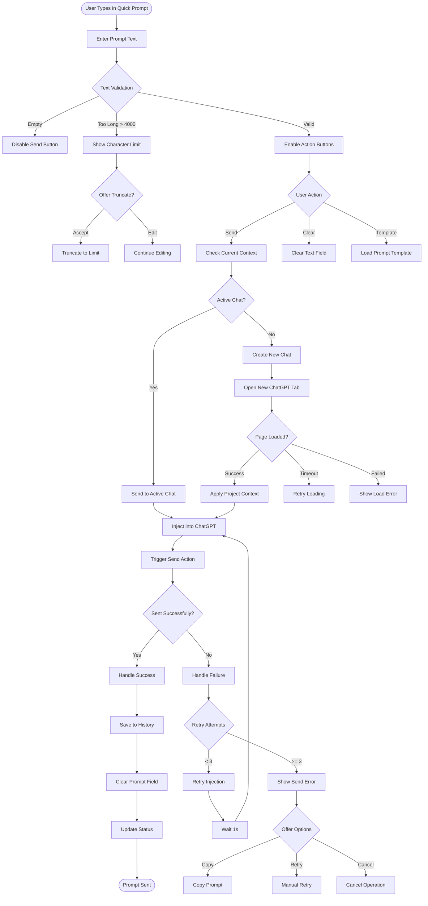
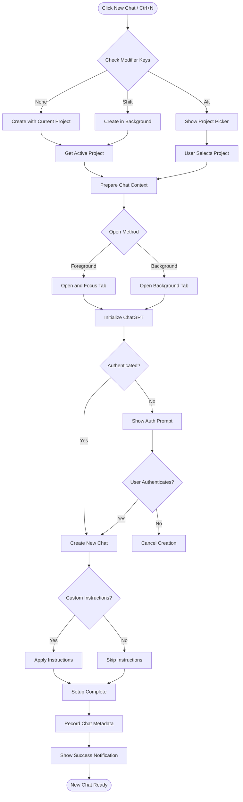
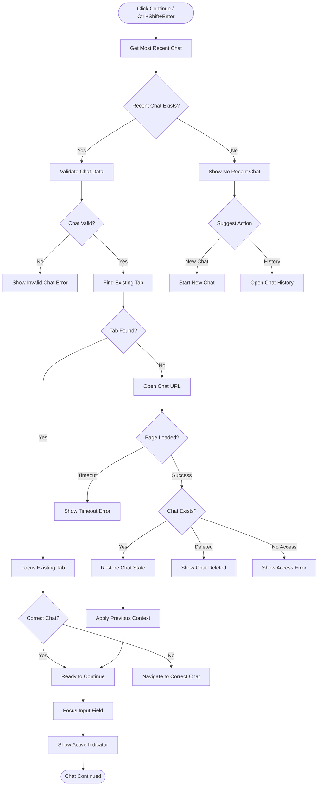
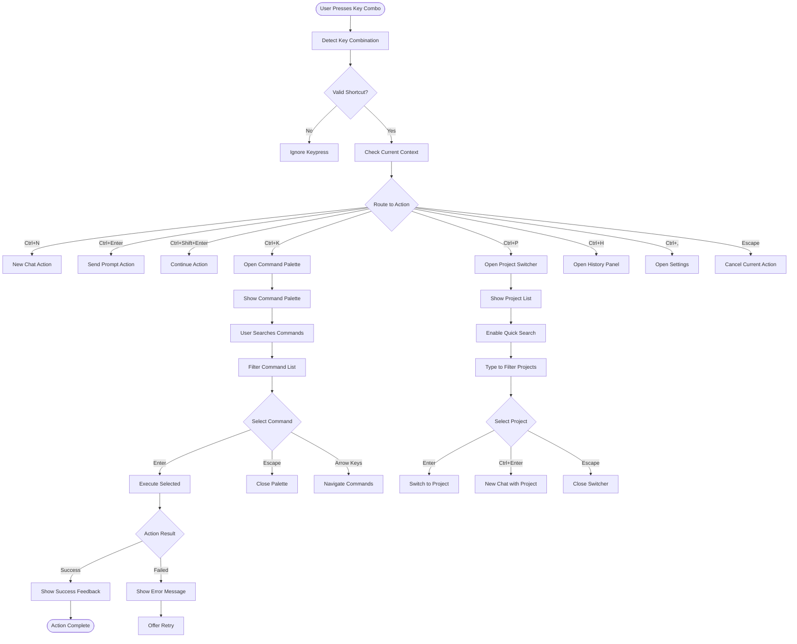
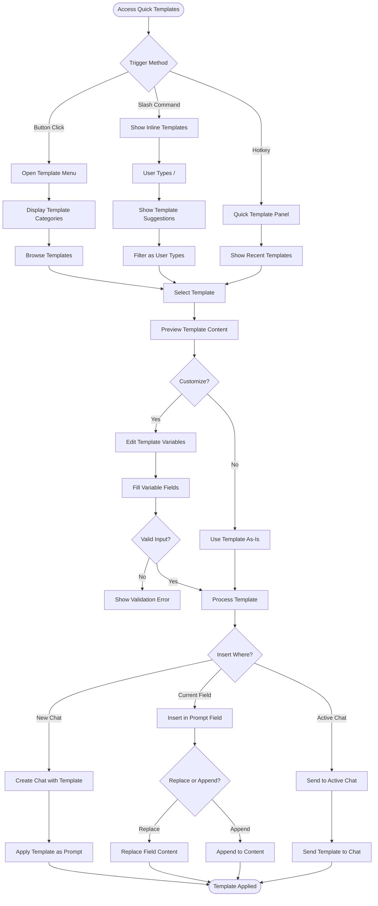
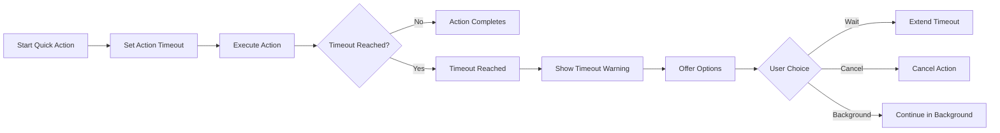
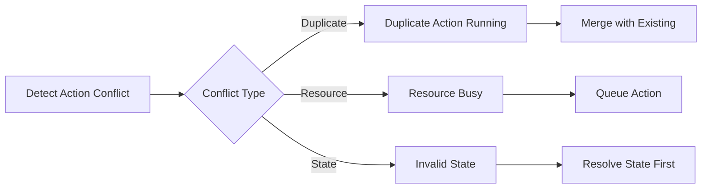

# Quick Actions User Flow

## Overview
This flow describes how users interact with quick actions including sending prompts, creating new chats, continuing conversations, and accessing frequently used commands through keyboard shortcuts and quick menus.

## Quick Prompt Send Flow



## New Chat Quick Action



## Continue Chat Quick Action



## Keyboard Shortcuts Flow



## Quick Templates Flow



## Command Palette

```mermaid
flowchart TD
    OpenPalette([Ctrl+K / Cmd+K]) --> ShowOverlay[Show Command Overlay]
    ShowOverlay --> FocusSearch[Focus Search Input]
    
    FocusSearch --> UserTypes{User Input}
    UserTypes -->|Types Query| SearchCommands[Search Commands]
    UserTypes -->|Empty| ShowAll[Show All Commands]
    UserTypes -->|>| ShowActions[Show Actions Only]
    UserTypes -->|@| ShowProjects[Show Projects Only]
    UserTypes -->|#| ShowChats[Show Recent Chats]
    UserTypes -->|?| ShowHelp[Show Help Commands]
    
    SearchCommands --> FilterResults[Filter and Rank Results]
    FilterResults --> GroupResults[Group by Category]
    GroupResults --> DisplayResults[Display Filtered List]
    
    DisplayResults --> Navigation{Navigation}
    Navigation -->|Arrow Keys| MoveSelection[Move Selection]
    Navigation -->|Tab| NextCategory[Next Category]
    Navigation -->|Enter| ExecuteSelected[Execute Selected]
    Navigation -->|Escape| ClosePalette[Close Palette]
    
    ExecuteSelected --> CommandType{Command Type}
    CommandType -->|Action| RunAction[Run Action Command]
    CommandType -->|Navigation| NavigateTo[Navigate to Location]
    CommandType -->|Toggle| ToggleSetting[Toggle Setting]
    CommandType -->|External| OpenExternal[Open External Link]
    
    RunAction --> ActionComplete{Action Complete?}
    ActionComplete -->|Success| CloseWithSuccess[Close and Show Success]
    ActionComplete -->|Failed| ShowInlineError[Show Error in Palette]
    
    ShowInlineError --> AllowRetry{Allow Retry?}
    AllowRetry -->|Yes| StayOpen[Keep Palette Open]
    AllowRetry -->|No| CloseWithError[Close with Error]
```

## Error States & Recovery

### 1. Action Timeout Handling


### 2. Conflict Resolution


## UI Components

### Quick Prompt Bar
```
┌─────────────────────────────────────┐
│ 💬 Quick Prompt                     │
├─────────────────────────────────────┤
│ ┌─────────────────────────────────┐ │
│ │ Type your prompt here...        │ │
│ │                                 │ │
│ └─────────────────────────────────┘ │
│ 0 / 4000          [/] [Clear] [Send]│
└─────────────────────────────────────┘

Slash Commands Preview:
/template - Insert template
/continue - Continue last chat
/new - New chat with options
/history - Search chat history
```

### Command Palette UI
```
┌─────────────────────────────────────┐
│ 🔍 Quick Commands    (Ctrl+K)   [×] │
├─────────────────────────────────────┤
│ > Search commands...                │
├─────────────────────────────────────┤
│ Recent                              │
│ ⚡ New Chat          Ctrl+N        │
│ 📋 Marketing Project               │
│ 💬 Continue Chat    Ctrl+Shift+N   │
│                                     │
│ Actions                             │
│ 📥 Download All Images             │
│ 🔄 Sync Instructions               │
│ 📊 Export Chat History             │
│                                     │
│ Projects                            │
│ @ Marketing Campaign               │
│ @ Development Sprint               │
│ @ Customer Research                │
└─────────────────────────────────────┘
```

### Keyboard Shortcuts Reference
```
┌─────────────────────────────────────┐
│ Keyboard Shortcuts                  │
├─────────────────────────────────────┤
│ General                             │
│ Ctrl+K         Command Palette      │
│ Ctrl+N         New Chat            │
│ Ctrl+P         Switch Project      │
│ Ctrl+,         Settings            │
│                                     │
│ Chat Actions                        │
│ Ctrl+Enter     Send Prompt         │
│ Ctrl+Shift+N   Continue Chat       │
│ Ctrl+H         Chat History        │
│                                     │
│ Quick Actions                       │
│ /              Template Menu       │
│ Ctrl+T         Insert Template     │
│ Ctrl+D         Download Image      │
│ Escape         Cancel Action       │
└─────────────────────────────────────┘
```

## Performance Considerations

### Action Queueing
```javascript
// Quick action queue management
const actionQueue = {
  maxConcurrent: 3,
  timeout: 10000, // 10s default
  retryAttempts: 3,
  retryDelay: 1000 // 1s exponential backoff
};

// Debouncing for search/filter
const SEARCH_DEBOUNCE = 300;
const COMMAND_THROTTLE = 100;
```

### Caching Strategy
1. **Command History**: Last 20 commands
2. **Template Cache**: Frequently used templates
3. **Project State**: Active project context
4. **Shortcut Mappings**: User customizations

## Accessibility Features

### Keyboard Navigation
- Full keyboard control for all actions
- Tab order follows visual hierarchy
- Escape cancels current operation
- Clear focus indicators

### Screen Reader Support
```html
<div role="combobox" 
     aria-label="Quick command palette"
     aria-expanded="true"
     aria-controls="command-list">
  <input type="text" 
         role="searchbox"
         aria-label="Search commands"
         aria-describedby="command-help"/>
</div>

<ul id="command-list" role="listbox">
  <li role="option" aria-selected="true">
    New Chat (Ctrl+N)
  </li>
</ul>
```

### Status Announcements
- Action start/complete announcements
- Error messages in live regions
- Progress updates for long operations
- Success confirmations