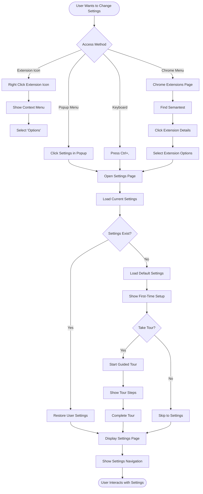
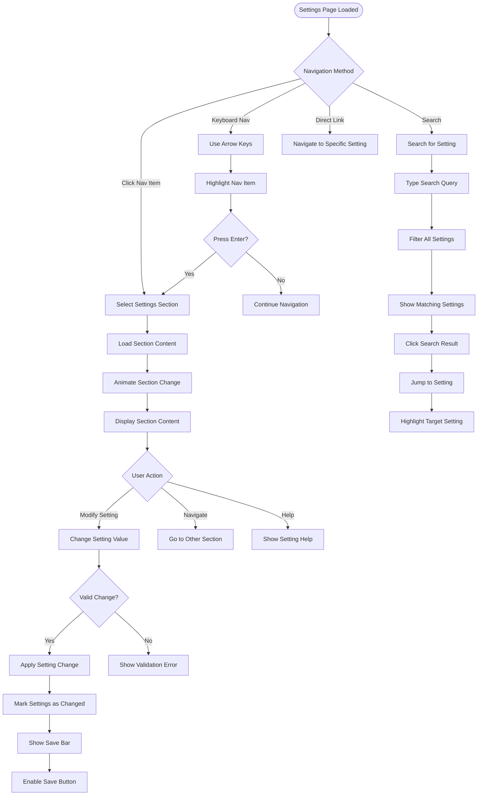
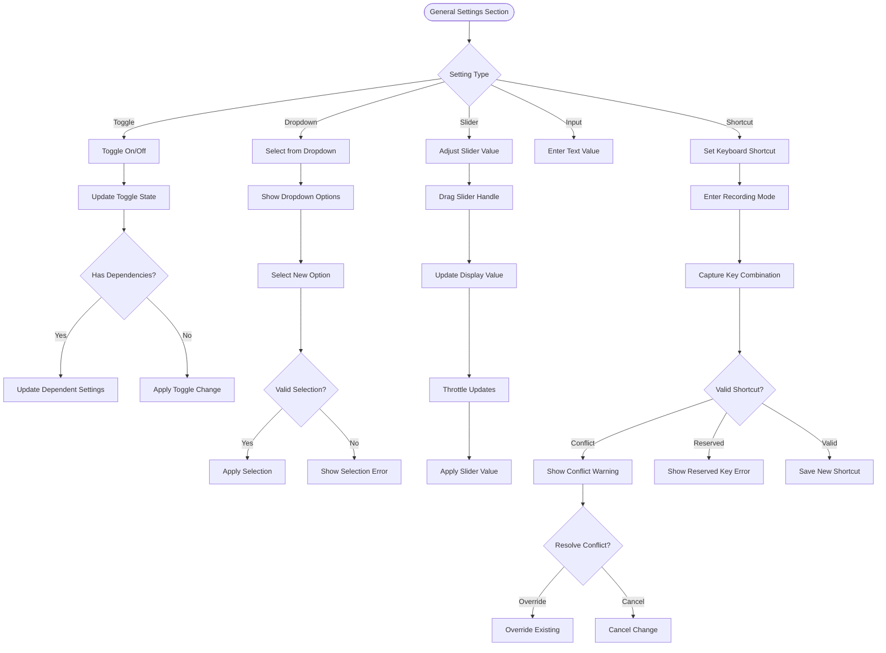
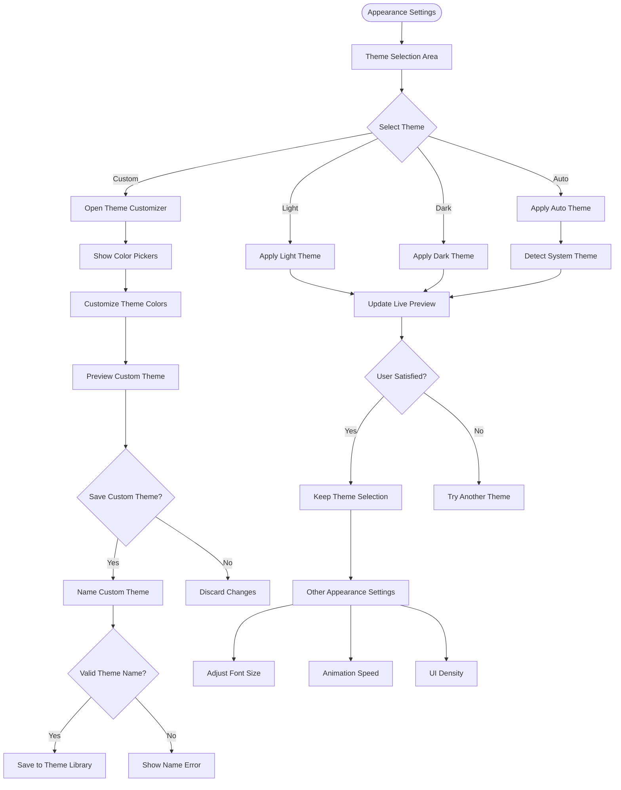
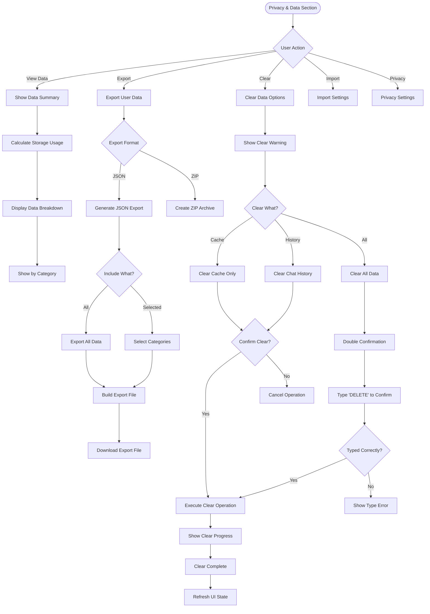
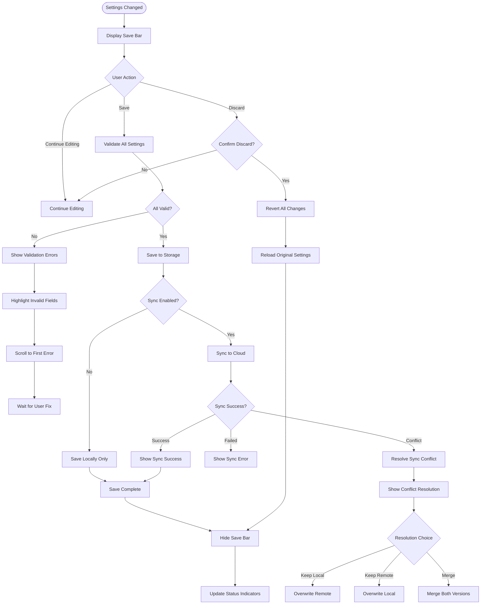
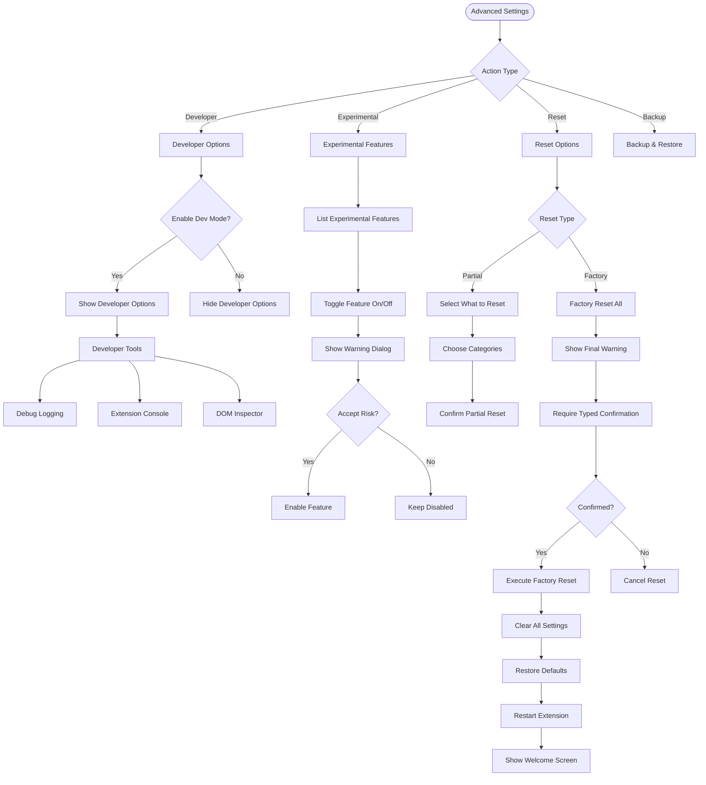

# Extension Settings User Flow

## Overview
This flow describes how users access, configure, and manage extension settings including preferences, data management, themes, keyboard shortcuts, and advanced configurations.

## Main Settings Access Flow



## Settings Navigation Flow



## General Settings Configuration



## Theme & Appearance Settings



## Privacy & Data Management



## Settings Save & Sync Flow



## Advanced Settings & Reset



## Settings UI Components

### Settings Navigation Sidebar
```
┌─────────────────────────────────────┐
│ Settings                        [×] │
├─────────────────────────────────────┤
│ 🔍 Search settings...               │
├─────────────────────────────────────┤
│ ⚙️  General                    ←    │
│ 🎨 Appearance                       │
│ 💬 ChatGPT                         │
│ ⚡ Automation                       │
│ 🔒 Privacy & Data                  │
│ ⌨️  Keyboard Shortcuts             │
│ 🔧 Advanced                        │
│ ❓ Help & Support                  │
│ ℹ️  About                          │
└─────────────────────────────────────┘
```

### Settings Section Example
```
┌─────────────────────────────────────┐
│ General Settings                    │
├─────────────────────────────────────┤
│ Extension Behavior                  │
│                                     │
│ Auto-activate on ChatGPT       [ON] │
│ When visiting ChatGPT, the         │
│ extension activates automatically   │
│                                     │
│ Default Project                     │
│ [Marketing Campaign        ▼]       │
│                                     │
│ Notifications                  [ON] │
│ Show desktop notifications for      │
│ important events                    │
│                                     │
│ Performance                         │
│ Cache Size: [━━━━━━●━━━] 100MB    │
│ Clear cache every: [30 days    ▼]  │
└─────────────────────────────────────┘
```

### Save Bar
```
┌─────────────────────────────────────┐
│ ⚠️  You have unsaved changes        │
│                                     │
│ [Discard Changes]    [Save Changes] │
└─────────────────────────────────────┘
```

## Error Handling

### Validation Errors
```
┌─────────────────────────────────────┐
│ ❌ Settings Validation Error        │
├─────────────────────────────────────┤
│ Please fix the following errors:    │
│                                     │
│ • Keyboard shortcut conflicts with  │
│   existing shortcut (Ctrl+N)       │
│ • Cache size must be between       │
│   10MB and 500MB                   │
│                                     │
│ [Review Errors]                     │
└─────────────────────────────────────┘
```

### Sync Conflicts
```
┌─────────────────────────────────────┐
│ 🔄 Settings Sync Conflict           │
├─────────────────────────────────────┤
│ Your settings have been modified    │
│ on another device.                  │
│                                     │
│ Local:  Modified 2 mins ago        │
│ Remote: Modified 5 mins ago        │
│                                     │
│ [Keep Local] [Keep Remote] [Merge]  │
└─────────────────────────────────────┘
```

## Performance Optimizations

### Settings Loading
1. **Lazy Section Loading**: Load section content on demand
2. **Virtual Scrolling**: For long settings lists
3. **Debounced Saves**: Batch setting changes
4. **Incremental Validation**: Validate on change, not on save

### Storage Strategy
```javascript
// Settings storage tiers
const storageTiers = {
  critical: 'sync',      // Cross-device settings
  user: 'local',         // User preferences
  cache: 'session',      // Temporary settings
  computed: 'memory'     // Derived values
};
```

## Accessibility Features

### Navigation
- Full keyboard navigation
- Skip links to sections
- Breadcrumb navigation
- Search with autocomplete

### Screen Reader Support
```html
<nav role="navigation" aria-label="Settings sections">
  <ul role="list">
    <li role="listitem">
      <a href="#general" 
         aria-current="page"
         aria-describedby="general-desc">
        General Settings
      </a>
    </li>
  </ul>
</nav>

<main role="main" aria-labelledby="settings-title">
  <h1 id="settings-title">Extension Settings</h1>
  <section aria-labelledby="general-heading">
    <h2 id="general-heading">General Settings</h2>
  </section>
</main>
```

### Visual Indicators
- Focus rings on all controls
- Color contrast compliance
- Error states with icons
- Loading states
- Success confirmations