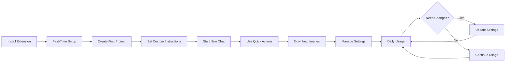

# ChatGPT Extension User Flow Documentation

## Overview
This directory contains comprehensive user flow diagrams and documentation for the Semantest ChatGPT browser extension. Each flow covers user interactions, error states, edge cases, and accessibility considerations.

## 📁 Flow Documents

### 1. [Project Management Flow](./01-project-management-flow.md)
- Creating and selecting projects
- Project switching and organization
- Storage management and quota handling
- Error recovery for corrupted data

### 2. [Custom Instructions Flow](./02-custom-instructions-flow.md)
- Creating and editing custom instructions
- Template selection and management
- Character limit handling
- Sync with ChatGPT

### 3. [Chat Management Flow](./03-chat-management-flow.md)
- Creating new chats
- Continuing existing conversations
- Chat history management
- Quick prompt functionality

### 4. [Image Download Flow](./04-image-download-flow.md)
- Single image downloads
- Bulk download operations
- Format conversion options
- Storage and organization

### 5. [Quick Actions Flow](./05-quick-actions-flow.md)
- Keyboard shortcuts
- Command palette
- Quick templates
- Action queueing and conflicts

### 6. [Extension Settings Flow](./06-extension-settings-flow.md)
- Settings navigation
- Theme customization
- Privacy and data management
- Advanced configurations

## 🎯 Key Features Covered

### Core Functionality
- **Project-based organization** - Separate contexts for different use cases
- **Custom instructions** - Persistent prompts for consistent AI behavior
- **Chat management** - Easy creation and continuation of conversations
- **Image handling** - Download AI-generated and uploaded images
- **Quick actions** - Keyboard-driven productivity features
- **Settings control** - Full customization of extension behavior

### Error Handling
Each flow includes comprehensive error handling for:
- Network failures
- Storage quota exceeded
- Permission issues
- Data corruption
- Sync conflicts
- Authentication problems

### Edge Cases
- First-time user experience
- Empty states
- Offline functionality
- Browser compatibility
- Performance optimization
- Resource constraints

### Accessibility
All flows include:
- Keyboard navigation patterns
- Screen reader support
- ARIA labels and roles
- Focus management
- Visual indicators
- High contrast support

## 🔄 User Journey Overview

## 📊 Usage Statistics Tracking

The extension tracks anonymous usage statistics to improve user experience:
- Most used features
- Common error scenarios
- Performance metrics
- Feature adoption rates

## 🛠️ Technical Implementation Notes

### State Management
- Local storage for settings and projects
- Session storage for temporary data
- Chrome sync storage for cross-device settings
- IndexedDB for chat history

### Performance Considerations
- Lazy loading of UI components
- Debounced search and filtering
- Virtual scrolling for long lists
- Optimistic UI updates
- Background processing for heavy operations

### Security & Privacy
- No sensitive data in logs
- Encrypted storage for credentials
- Content Security Policy compliance
- Permission-based access control
- Regular security audits

## 🚀 Future Enhancements

### Planned Features
1. **Voice input** for prompts
2. **Multi-language support**
3. **Team collaboration** features
4. **API integration** options
5. **Mobile companion app**
6. **Advanced analytics** dashboard

### User-Requested Improvements
- Batch operations for projects
- Enhanced template library
- Conversation branching
- Export to various formats
- Integration with other AI tools

## 📚 Related Documentation

- [Extension Architecture](/docs/CHATGPT_EXTENSION_ARCHITECTURE.md)
- [API Documentation](/docs/CHATGPT_EXTENSION_API_DOCUMENTATION.md)
- [User Guide](/docs/CHATGPT_EXTENSION_USER_GUIDE.md)
- [Developer Guide](/docs/DEVELOPER_GUIDE.md)

## 🤝 Contributing

To contribute to user flow documentation:
1. Follow the established format
2. Include all error states
3. Consider accessibility
4. Add visual mockups where helpful
5. Update this README with new flows

## 📞 Support

For questions about user flows:
- GitHub Issues: [semantest/semantest](https://github.com/semantest/semantest/issues)
- Documentation: [Semantest Docs](https://docs.semantest.com)
- Email: support@semantest.com

---

Last Updated: January 2025
Version: 2.0.0