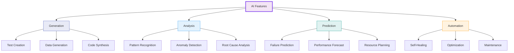

# Semantest AI Feature Visual Explanations

## Overview

Comprehensive visual explanations of Semantest's AI features, designed to integrate seamlessly with user interface elements. This guide bridges the gap between complex AI functionality and intuitive user experience through visual design patterns, interactive elements, and clear communication strategies.

## Table of Contents

1. [AI Feature Visual Framework](#ai-feature-visual-framework)
2. [Natural Language Interface Design](#natural-language-interface-design)
3. [AI Test Generation Visualizations](#ai-test-generation-visualizations)
4. [Predictive Analytics Display](#predictive-analytics-display)
5. [Machine Learning Insights UI](#machine-learning-insights-ui)
6. [AI Assistant Visual Integration](#ai-assistant-visual-integration)
7. [Visual Feedback Patterns](#visual-feedback-patterns)
8. [AI Status Indicators](#ai-status-indicators)
9. [Interactive AI Tutorials](#interactive-ai-tutorials)
10. [Accessibility for AI Features](#accessibility-for-ai-features)

## AI Feature Visual Framework

### Design Principles for AI Features

#### Visual Language for AI
```yaml
ai_visual_language:
  core_principles:
    transparency:
      - Show AI thinking process
      - Indicate confidence levels
      - Explain decision making
      - Provide audit trails
    
    predictability:
      - Consistent AI indicators
      - Clear state changes
      - Expected behaviors
      - No surprises
    
    control:
      - User can override AI
      - Manual alternatives
      - Adjustable automation
      - Clear off switches
  
  visual_elements:
    ai_indicators:
      sparkle_icon:
        - usage: "AI-powered features"
        - color: "Purple gradient #7C3AED to #A78BFA"
        - animation: "Subtle pulse"
        - size: "16px standard, 24px emphasis"
      
      brain_icon:
        - usage: "Machine learning active"
        - color: "Blue gradient #3B82F6 to #60A5FA"
        - animation: "Neural network pulse"
        - variants: "Outline, filled, animated"
      
      magic_wand:
        - usage: "AI generation/automation"
        - color: "Purple primary #7C3AED"
        - animation: "Sparkle trail on action"
        - interaction: "Hover for tooltip"
    
    confidence_indicators:
      high_confidence:
        - color: "Green #10B981"
        - visual: "Solid borders, bold text"
        - indicator: "95-100% confidence"
      
      medium_confidence:
        - color: "Yellow #F59E0B"
        - visual: "Dashed borders, regular text"
        - indicator: "70-94% confidence"
      
      low_confidence:
        - color: "Gray #6B7280"
        - visual: "Dotted borders, lighter text"
        - indicator: "Below 70% confidence"
```

### AI Feature Categories

#### Visual Hierarchy for AI Capabilities


## Natural Language Interface Design

### Conversational UI Components

#### Chat Interface Visual Design
```yaml
chat_interface_design:
  container:
    desktop:
      - width: "400px minimum, 600px optimal"
      - height: "500px minimum, 70vh maximum"
      - position: "Right panel or modal"
      - shadow: "0 20px 25px -5px rgba(0, 0, 0, 0.1)"
    
    mobile:
      - width: "100vw"
      - height: "100vh - header"
      - position: "Full screen overlay"
      - transition: "Slide up animation"
  
  visual_structure:
    header:
      background: "White/Dark theme adaptive"
      height: "56px"
      elements:
        - title:
            text: "AI Assistant"
            icon: "Sparkle icon left"
            typography: "16px medium"
        
        - status:
            indicator: "Pulsing dot"
            states:
              active: "Green pulse"
              thinking: "Blue pulse"
              error: "Red static"
        
        - actions:
            minimize: "Dash icon"
            close: "X icon"
            settings: "Gear icon"
    
    conversation_area:
      background: "Subtle gray #F9FAFB"
      padding: "16px"
      scroll: "Smooth with fade at edges"
      
      message_bubbles:
        user:
          background: "Primary #7C3AED"
          text_color: "White"
          border_radius: "18px 18px 4px 18px"
          padding: "12px 16px"
          max_width: "80%"
          alignment: "Right with 16px margin"
          
        ai:
          background: "White with border"
          border: "1px solid #E5E7EB"
          text_color: "#111827"
          border_radius: "18px 18px 18px 4px"
          padding: "12px 16px"
          max_width: "85%"
          alignment: "Left with 16px margin"
          
          thinking_state:
            animation: "Typing dots bounce"
            duration: "1.4s infinite"
            dots: "3 dots, 8px each"
    
    input_area:
      background: "White"
      border_top: "1px solid #E5E7EB"
      padding: "16px"
      
      input_field:
        background: "#F3F4F6"
        border: "1px solid transparent"
        border_radius: "24px"
        padding: "12px 48px 12px 16px"
        focus_state:
          border: "1px solid #7C3AED"
          background: "White"
          shadow: "0 0 0 3px rgba(124, 58, 237, 0.1)"
      
      send_button:
        position: "Inside input, right"
        size: "32px circle"
        background: "#7C3AED"
        icon: "Arrow up, white"
        disabled_state:
          background: "#E5E7EB"
          icon: "#9CA3AF"
```

#### Visual Examples in Chat
```yaml
chat_visual_examples:
  code_snippets:
    container:
      background: "#1E293B"
      border_radius: "8px"
      padding: "16px"
      margin: "8px 0"
    
    header:
      language_badge:
        background: "#334155"
        text: "JavaScript"
        padding: "4px 8px"
        border_radius: "4px"
      
      copy_button:
        icon: "Copy icon"
        position: "Top right"
        hover: "Show tooltip 'Copy'"
    
    syntax_highlighting:
      keywords: "#60A5FA"
      strings: "#34D399"
      comments: "#64748B"
      functions: "#F472B6"
  
  visual_diagrams:
    test_flow_preview:
      style: "Simplified flowchart"
      nodes:
        shape: "Rounded rectangles"
        colors:
          start: "#10B981"
          action: "#3B82F6"
          assertion: "#F59E0B"
          end: "#6B7280"
      
      connections:
        style: "Curved lines"
        arrow: "Triangle head"
        animation: "Flow animation on hover"
    
    inline_charts:
      mini_sparkline:
        height: "40px"
        width: "100%"
        color: "#3B82F6"
        fill: "Gradient fade"
      
      progress_bar:
        height: "8px"
        background: "#E5E7EB"
        fill: "#10B981"
        animation: "Width transition"
```

### Smart Suggestions UI

#### Suggestion Chips Design
```yaml
suggestion_chips:
  container:
    position: "Above input field"
    layout: "Horizontal scroll"
    padding: "8px 0"
    
  chip_design:
    default:
      background: "#F3F4F6"
      border: "1px solid #E5E7EB"
      text: "#4B5563"
      padding: "6px 12px"
      border_radius: "16px"
      font_size: "14px"
    
    hover:
      background: "#E5E7EB"
      border: "1px solid #D1D5DB"
      cursor: "pointer"
      transition: "all 0.2s ease"
    
    selected:
      background: "#EDE9FE"
      border: "1px solid #7C3AED"
      text: "#7C3AED"
    
    categories:
      test_creation:
        icon: "Plus circle"
        color: "#10B981"
      
      analysis:
        icon: "Chart bar"
        color: "#3B82F6"
      
      troubleshooting:
        icon: "Tool"
        color: "#F59E0B"
  
  animation:
    entry: "Fade in with slight scale"
    exit: "Fade out"
    reorder: "Smooth position transition"
```

## AI Test Generation Visualizations

### Test Generation Process Visualization

#### Step-by-Step Visual Flow
```yaml
test_generation_flow:
  container:
    layout: "Vertical timeline"
    background: "White with subtle shadow"
    padding: "24px"
    
  steps:
    1_input_analysis:
      icon:
        design: "Magnifying glass with AI sparkle"
        size: "40px"
        background: "Purple gradient circle"
      
      content:
        title: "Analyzing your request..."
        description: "AI is understanding your test requirements"
        visual_feedback:
          - "Animated text scanning effect"
          - "Keywords highlighted in purple"
          - "Progress bar showing analysis"
      
      duration: "2-3 seconds"
      
    2_test_structure:
      icon:
        design: "Blueprint/architecture icon"
        animation: "Drawing lines effect"
      
      content:
        title: "Structuring test cases"
        visual:
          type: "Tree diagram"
          nodes: "Test suite → Test cases → Steps"
          animation: "Nodes appear sequentially"
      
    3_code_generation:
      icon:
        design: "Code brackets with sparkle"
        animation: "Typing effect"
      
      content:
        title: "Generating test code"
        visual:
          type: "Code preview"
          effect: "Lines appear with typing animation"
          highlighting: "Syntax colors fade in"
      
    4_validation:
      icon:
        design: "Checkmark shield"
        animation: "Check animation"
      
      content:
        title: "Validating test logic"
        checklist:
          - "✓ Syntax valid"
          - "✓ Assertions complete"
          - "✓ Best practices followed"
        animation: "Checks appear one by one"
  
  completion:
    celebration:
      type: "Confetti burst"
      colors: ["#7C3AED", "#10B981", "#3B82F6"]
      duration: "1 second"
    
    actions:
      primary:
        text: "Run Test Now"
        style: "Filled button, green"
        icon: "Play icon"
      
      secondary:
        text: "Edit Test"
        style: "Outlined button"
        icon: "Pencil icon"
```

### Visual Test Builder Interface

#### Drag-and-Drop Test Creation
```yaml
visual_test_builder:
  canvas:
    grid:
      size: "20px"
      color: "#F3F4F6"
      visible_on_drag: true
    
    background: "White"
    border: "2px dashed #E5E7EB"
    empty_state:
      icon: "Large wand with sparkles"
      text: "Drag elements here or describe your test"
      color: "#9CA3AF"
  
  element_library:
    position: "Left sidebar"
    width: "280px"
    
    categories:
      actions:
        color: "#3B82F6"
        elements:
          - name: "Navigate"
            icon: "Globe"
            description: "Go to a URL"
          - name: "Click"
            icon: "Pointer"
            description: "Click an element"
          - name: "Type"
            icon: "Keyboard"
            description: "Enter text"
      
      assertions:
        color: "#10B981"
        elements:
          - name: "Verify Text"
            icon: "Check text"
            description: "Check text content"
          - name: "Verify Element"
            icon: "Check box"
            description: "Element exists"
      
      flow_control:
        color: "#F59E0B"
        elements:
          - name: "Wait"
            icon: "Clock"
            description: "Pause execution"
          - name: "Condition"
            icon: "Branch"
            description: "If/else logic"
  
  visual_connections:
    line_style:
      type: "Bezier curve"
      color: "#6B7280"
      width: "2px"
      arrow: "Triangle at end"
    
    active_connection:
      color: "#7C3AED"
      width: "3px"
      animation: "Pulse along line"
    
    connection_points:
      size: "8px"
      color: "#3B82F6"
      hover: "Scale to 12px"
      connected: "Fill color #3B82F6"
```

## Predictive Analytics Display

### Failure Prediction Visualization

#### Risk Assessment Dashboard
```yaml
risk_assessment_visual:
  risk_meter:
    design: "Semi-circular gauge"
    size: "200px width, 100px height"
    
    segments:
      low_risk:
        range: "0-33%"
        color: "#10B981"
        label: "Low Risk"
      
      medium_risk:
        range: "34-66%"
        color: "#F59E0B"
        label: "Medium Risk"
      
      high_risk:
        range: "67-100%"
        color: "#EF4444"
        label: "High Risk"
    
    needle:
      design: "Thin triangle"
      color: "#1F2937"
      animation: "Smooth transition 0.5s"
    
    current_value:
      display: "Center bottom"
      format: "72%"
      size: "32px bold"
  
  risk_factors:
    layout: "Horizontal cards"
    
    card_design:
      background: "White"
      border: "1px solid #E5E7EB"
      padding: "16px"
      hover: "Shadow elevation"
      
      content:
        icon:
          size: "24px"
          position: "Top left"
          color: "Inherit from risk level"
        
        factor_name:
          font: "14px medium"
          color: "#1F2937"
        
        impact_score:
          format: "+15%"
          color: "Risk color"
          position: "Top right"
        
        description:
          font: "12px regular"
          color: "#6B7280"
          margin_top: "8px"
    
    examples:
      - factor: "Recent code changes"
        impact: "+25%"
        description: "5 files modified in test path"
        icon: "Code icon"
        
      - factor: "Historical failures"
        impact: "+18%"
        description: "Failed 3 times this week"
        icon: "History icon"
        
      - factor: "Test complexity"
        impact: "+12%"
        description: "High cyclomatic complexity"
        icon: "Network icon"
```

### Performance Trend Visualizations

#### Interactive Performance Charts
```yaml
performance_charts:
  response_time_chart:
    type: "Area chart with markers"
    height: "300px"
    
    axes:
      x_axis:
        label: "Time"
        format: "MMM DD"
        grid: "Vertical dashed lines"
      
      y_axis:
        label: "Response Time (ms)"
        format: "0.0s"
        grid: "Horizontal solid lines"
    
    data_series:
      actual:
        color: "#3B82F6"
        fill: "Gradient fade to transparent"
        line_width: "2px"
        points: "4px circles on hover"
      
      predicted:
        color: "#7C3AED"
        style: "Dashed line"
        fill: "None"
        confidence_band:
          fill: "Purple 10% opacity"
          border: "None"
      
      threshold:
        color: "#EF4444"
        style: "Dotted line"
        label: "Performance threshold"
    
    interactions:
      hover:
        tooltip:
          background: "Dark #1F2937"
          text: "White"
          arrow: "Bottom center"
          content:
            - "Date/Time"
            - "Actual: X ms"
            - "Predicted: Y ms"
            - "Difference: Z%"
        
        marker:
          size: "8px"
          color: "Match series"
          animation: "Pulse"
      
      zoom:
        method: "Brush selection"
        reset: "Double click"
        animation: "Smooth transition"
    
    annotations:
      deployment_markers:
        icon: "Rocket ship"
        color: "#6B7280"
        line: "Vertical dashed"
        tooltip: "Deployment: version X.Y.Z"
      
      anomaly_indicators:
        icon: "Warning triangle"
        color: "#EF4444"
        size: "20px"
        pulse: "Red glow animation"
```

## Machine Learning Insights UI

### Pattern Recognition Displays

#### Failure Pattern Visualization
```yaml
failure_pattern_viz:
  cluster_map:
    type: "Force-directed graph"
    container:
      background: "#F9FAFB"
      border: "1px solid #E5E7EB"
      border_radius: "8px"
    
    nodes:
      test_node:
        shape: "Circle"
        size: "Based on failure frequency"
        color_scale:
          never_failed: "#10B981"
          rarely_fails: "#84CC16"
          sometimes_fails: "#F59E0B"
          often_fails: "#F97316"
          always_fails: "#EF4444"
        
        hover_state:
          scale: "1.2x"
          shadow: "0 0 20px rgba(0,0,0,0.1)"
          tooltip:
            - "Test name"
            - "Failure rate: X%"
            - "Last failed: Y hours ago"
      
      cluster_label:
        background: "White 90% opacity"
        padding: "4px 8px"
        border_radius: "4px"
        font: "12px medium"
        examples:
          - "Login Tests"
          - "API Tests"
          - "UI Tests"
    
    edges:
      correlation_strength:
        width: "1-5px based on correlation"
        opacity: "0.3-0.8 based on strength"
        color: "#6B7280"
      
      hover_highlight:
        color: "#7C3AED"
        width: "3px"
        opacity: "1"
        related_nodes: "Highlight connected"
  
  timeline_heatmap:
    grid:
      rows: "Test names"
      columns: "Time periods (hours/days)"
      cell_size: "20px square"
    
    color_scale:
      pass: "#10B981"
      fail: "#EF4444"
      skip: "#6B7280"
      running: "#3B82F6"
      no_data: "#F3F4F6"
    
    interactions:
      hover:
        outline: "2px solid #1F2937"
        tooltip:
          - "Test: [name]"
          - "Time: [period]"
          - "Status: [result]"
          - "Duration: [time]"
      
      click:
        action: "Zoom to test details"
        animation: "Smooth transition"
```

### AI Recommendation Cards

#### Insight Card Design
```yaml
ai_insight_cards:
  card_layout:
    container:
      background: "White"
      border: "1px solid #E5E7EB"
      border_radius: "8px"
      padding: "20px"
      shadow: "0 1px 3px rgba(0,0,0,0.1)"
      hover_shadow: "0 4px 6px rgba(0,0,0,0.1)"
    
    priority_indicator:
      position: "Left border"
      width: "4px"
      height: "100%"
      colors:
        critical: "#EF4444"
        high: "#F97316"
        medium: "#F59E0B"
        low: "#3B82F6"
    
    content_structure:
      header:
        icon:
          size: "24px"
          position: "Left"
          types:
            optimization: "Lightning bolt"
            warning: "Triangle alert"
            success: "Check circle"
            info: "Info circle"
        
        title:
          font: "16px semibold"
          color: "#1F2937"
          max_lines: "1"
        
        confidence:
          position: "Right"
          format: "87% confident"
          color: "#6B7280"
          font: "12px medium"
      
      body:
        description:
          font: "14px regular"
          color: "#4B5563"
          line_height: "1.5"
          max_lines: "3"
        
        impact_metrics:
          layout: "Flex row"
          gap: "16px"
          
          metric:
            label:
              font: "12px regular"
              color: "#6B7280"
            value:
              font: "16px semibold"
              color: "#1F2937"
            change:
              format: "+15%"
              color: "#10B981 or #EF4444"
      
      actions:
        layout: "Right aligned"
        gap: "8px"
        
        primary_action:
          style: "Filled button"
          size: "Small"
          text: "Apply Fix"
          icon: "Arrow right"
        
        secondary_action:
          style: "Text button"
          size: "Small"
          text: "Learn More"
          icon: "External link"
```

## AI Assistant Visual Integration

### Contextual AI Help

#### Inline AI Assistance
```yaml
inline_ai_help:
  trigger_points:
    help_bubble:
      icon: "Question mark in circle"
      size: "16px"
      color: "#6B7280"
      hover_color: "#7C3AED"
      position: "Near complex features"
    
    ai_suggestions:
      icon: "Sparkle"
      color: "#7C3AED"
      animation: "Gentle pulse"
      position: "Input fields, buttons"
  
  help_popover:
    container:
      background: "White"
      border: "1px solid #E5E7EB"
      shadow: "0 10px 15px -3px rgba(0,0,0,0.1)"
      border_radius: "8px"
      max_width: "320px"
      arrow: "8px triangle"
    
    content:
      header:
        background: "#F9FAFB"
        padding: "12px 16px"
        border_bottom: "1px solid #E5E7EB"
        
        title:
          font: "14px semibold"
          color: "#1F2937"
        
        ai_badge:
          text: "AI Powered"
          background: "#EDE9FE"
          color: "#7C3AED"
          padding: "2px 6px"
          border_radius: "4px"
          font: "11px medium"
      
      body:
        padding: "16px"
        
        explanation:
          font: "14px regular"
          color: "#4B5563"
          line_height: "1.5"
        
        examples:
          margin_top: "12px"
          background: "#F9FAFB"
          padding: "8px"
          border_radius: "4px"
          font: "13px mono"
        
        related_features:
          margin_top: "12px"
          links:
            color: "#7C3AED"
            hover: "Underline"
            icon: "Arrow right 12px"
  
  smart_tooltips:
    trigger: "Hover or focus"
    delay: "500ms"
    
    design:
      background: "#1F2937"
      text: "White"
      padding: "8px 12px"
      border_radius: "6px"
      font: "13px regular"
      max_width: "200px"
      shadow: "0 4px 6px rgba(0,0,0,0.1)"
    
    ai_enhanced:
      personalized:
        - "Based on user behavior"
        - "Learning from interactions"
        - "Context-aware content"
      
      dynamic_content:
        - "Current state information"
        - "Suggested next actions"
        - "Keyboard shortcuts"
```

### AI Command Palette

#### Universal AI Interface
```yaml
ai_command_palette:
  activation:
    keyboard: "Cmd/Ctrl + K"
    button: "Search bar in header"
    voice: "Microphone icon"
  
  modal_design:
    overlay:
      background: "rgba(0,0,0,0.5)"
      backdrop_blur: "8px"
      animation: "Fade in 200ms"
    
    container:
      position: "Center, top 20%"
      width: "600px max"
      background: "White"
      border_radius: "12px"
      shadow: "0 25px 50px -12px rgba(0,0,0,0.25)"
      animation: "Scale fade in 200ms"
    
    search_input:
      height: "56px"
      padding: "0 20px"
      border_bottom: "1px solid #E5E7EB"
      
      icon:
        position: "Left"
        size: "20px"
        color: "#6B7280"
        type: "Magnifying glass or sparkle"
      
      input:
        font: "16px regular"
        placeholder: "Ask AI anything..."
        color: "#1F2937"
        caret: "Purple #7C3AED"
      
      voice_button:
        position: "Right"
        size: "32px circle"
        icon: "Microphone"
        active: "Red pulse animation"
    
    results_area:
      max_height: "400px"
      overflow: "Scroll with fade"
      padding: "8px"
      
      result_groups:
        header:
          font: "12px medium uppercase"
          color: "#6B7280"
          padding: "8px 12px 4px"
          letter_spacing: "0.05em"
        
        items:
          padding: "8px 12px"
          border_radius: "6px"
          hover: "Background #F3F4F6"
          selected: "Background #EDE9FE"
          
          icon:
            size: "20px"
            margin_right: "12px"
            color: "Category specific"
          
          title:
            font: "14px medium"
            color: "#1F2937"
          
          description:
            font: "12px regular"
            color: "#6B7280"
            margin_top: "2px"
          
          shortcut:
            position: "Right"
            font: "12px mono"
            background: "#F3F4F6"
            padding: "2px 6px"
            border_radius: "4px"
    
    footer:
      padding: "12px 20px"
      border_top: "1px solid #E5E7EB"
      background: "#F9FAFB"
      
      tips:
        font: "12px regular"
        color: "#6B7280"
        examples:
          - "Type ? for help"
          - "Use ↑↓ to navigate"
          - "⏎ to select"
```

## Visual Feedback Patterns

### AI Processing States

#### Loading and Thinking Animations
```yaml
ai_processing_states:
  thinking_indicators:
    dots_bounce:
      dots: "3 circles, 8px each"
      spacing: "4px between"
      color: "#7C3AED"
      animation:
        type: "Bounce"
        delay: "0.15s staggered"
        duration: "1.4s infinite"
    
    brain_pulse:
      icon: "Brain outline"
      size: "24px"
      color: "#7C3AED"
      animation:
        type: "Scale and opacity pulse"
        scale: "1.0 to 1.2"
        opacity: "0.5 to 1.0"
        duration: "1.5s infinite"
    
    progress_ring:
      size: "40px"
      stroke_width: "3px"
      color: "Purple gradient"
      animation:
        type: "Rotate and fill"
        duration: "2s linear infinite"
        direction: "Clockwise"
  
  generation_progress:
    stepped_progress:
      container:
        background: "#F3F4F6"
        height: "48px"
        border_radius: "24px"
        padding: "4px"
      
      steps:
        - label: "Understanding"
          icon: "Magnifying glass"
          color: "#3B82F6"
        - label: "Planning"
          icon: "Blueprint"
          color: "#8B5CF6"
        - label: "Generating"
          icon: "Sparkles"
          color: "#7C3AED"
        - label: "Validating"
          icon: "Shield check"
          color: "#10B981"
      
      active_step:
        background: "White"
        shadow: "0 1px 3px rgba(0,0,0,0.1)"
        animation: "Slide to position"
    
    streaming_text:
      cursor:
        type: "Blinking vertical line"
        color: "#7C3AED"
        width: "2px"
        blink_rate: "1s"
      
      text_appearance:
        method: "Character by character"
        speed: "50ms per character"
        variation: "±20ms randomization"
      
      code_blocks:
        syntax_highlight: "Apply after complete"
        line_numbers: "Fade in when done"
```

### Success and Error States

#### Visual Confirmation Patterns
```yaml
confirmation_patterns:
  success_states:
    inline_success:
      icon: "Check circle"
      color: "#10B981"
      animation: "Scale bounce in"
      message_style:
        background: "#ECFDF5"
        border: "1px solid #10B981"
        text: "#065F46"
    
    toast_notification:
      position: "Top center"
      animation: "Slide down and fade in"
      duration: "4s auto-dismiss"
      
      design:
        background: "#065F46"
        text: "White"
        icon: "Check circle white"
        border_radius: "8px"
        shadow: "0 10px 15px -3px rgba(0,0,0,0.1)"
      
      action:
        text: "View Details"
        style: "Underline white"
        hover: "No underline"
    
    celebration_moments:
      confetti:
        trigger: "Major achievements"
        colors: ["#10B981", "#7C3AED", "#3B82F6"]
        particles: "50-100"
        duration: "2s"
        spread: "90 degrees"
      
      achievement_badge:
        size: "80px"
        animation: "Zoom rotate in"
        glow: "Soft pulse 3 times"
        auto_dismiss: "After 3s"
  
  error_states:
    inline_error:
      icon: "X circle"
      color: "#EF4444"
      animation: "Shake horizontal"
      
      message_style:
        background: "#FEF2F2"
        border: "1px solid #EF4444"
        text: "#991B1B"
        
      ai_help:
        text: "AI can help fix this"
        icon: "Sparkle"
        color: "#7C3AED"
        action: "Click to get suggestions"
    
    error_recovery:
      suggestions:
        container:
          margin_top: "8px"
          background: "#FFF"
          border: "1px solid #E5E7EB"
          padding: "12px"
          border_radius: "6px"
        
        header:
          text: "AI Suggestions:"
          icon: "Light bulb"
          color: "#7C3AED"
        
        options:
          style: "Numbered list"
          hover: "Highlight row"
          action: "Click to apply"
```

## AI Status Indicators

### System-Wide AI Status

#### Global AI Status Bar
```yaml
global_ai_status:
  location: "Bottom right corner"
  
  collapsed_state:
    size: "48px circle"
    background: "White"
    border: "1px solid #E5E7EB"
    shadow: "0 4px 6px rgba(0,0,0,0.1)"
    
    icon_states:
      idle:
        icon: "AI brain"
        color: "#6B7280"
        animation: "None"
      
      active:
        icon: "AI brain"
        color: "#7C3AED"
        animation: "Gentle pulse"
      
      processing:
        icon: "AI brain with dots"
        color: "#3B82F6"
        animation: "Rotate"
      
      error:
        icon: "AI brain with !"
        color: "#EF4444"
        animation: "Shake once"
  
  expanded_state:
    width: "320px"
    height: "auto"
    max_height: "400px"
    animation: "Slide up expand"
    
    header:
      title: "AI Assistant Status"
      close: "X button right"
      background: "#F9FAFB"
      border_bottom: "1px solid #E5E7EB"
    
    content:
      active_tasks:
        layout: "List"
        item_design:
          icon: "Task type icon"
          title: "Task description"
          progress: "Progress bar or spinner"
          time: "Elapsed time"
          cancel: "X button on hover"
      
      ai_insights:
        recent_insight:
          icon: "Light bulb"
          text: "Latest AI discovery"
          action: "View details →"
          timestamp: "2 min ago"
      
      quick_actions:
        layout: "Grid 2x2"
        buttons:
          - "Ask AI"
          - "Generate Test"
          - "Analyze Results"
          - "Get Help"
```

### Feature-Level AI Indicators

#### AI Enhancement Badges
```yaml
ai_enhancement_badges:
  input_fields:
    ai_powered_indicator:
      position: "Right side of label"
      design:
        icon: "Sparkle"
        size: "12px"
        color: "#7C3AED"
        tooltip: "AI will help you fill this"
    
    ai_suggestions_available:
      position: "Inside input, right"
      design:
        icon: "Magic wand"
        background: "#EDE9FE"
        padding: "4px 8px"
        border_radius: "4px"
        text: "AI"
        animation: "Gentle bounce on focus"
  
  buttons:
    ai_enhanced_action:
      design:
        gradient: "Purple gradient background"
        icon: "Sparkle before text"
        glow: "Soft purple glow on hover"
        
      states:
        default:
          background: "Linear gradient #7C3AED to #8B5CF6"
          text: "White"
        
        hover:
          background: "Linear gradient #6D28D9 to #7C3AED"
          shadow: "0 0 20px rgba(124,58,237,0.3)"
        
        processing:
          background: "Animated gradient shift"
          icon: "Spinning sparkle"
  
  feature_cards:
    ai_availability:
      corner_badge:
        position: "Top right"
        shape: "Rounded rectangle"
        background: "#7C3AED"
        text: "AI"
        padding: "2px 6px"
        font: "10px bold"
      
      hover_state:
        border: "2px solid #7C3AED"
        background: "Subtle purple tint"
        message: "Click to use AI features"
```

## Interactive AI Tutorials

### Onboarding Flow Visualizations

#### AI Feature Walkthroughs
```yaml
ai_walkthrough:
  overlay:
    background: "rgba(0,0,0,0.7)"
    blur: "None on highlighted area"
    animation: "Fade in"
  
  spotlight:
    shape: "Rounded rectangle"
    padding: "8px around target"
    border: "2px solid #7C3AED"
    glow: "0 0 40px rgba(124,58,237,0.5)"
    animation: "Gentle pulse"
  
  tooltip_coach:
    character:
      design: "Friendly AI assistant avatar"
      size: "60px"
      position: "Near tooltip"
      expressions:
        - happy: "Default state"
        - thinking: "During processing"
        - celebrating: "On success"
    
    tooltip:
      max_width: "320px"
      background: "White"
      border: "2px solid #7C3AED"
      shadow: "0 20px 25px -5px rgba(0,0,0,0.1)"
      arrow: "Pointing to spotlight"
      
      content:
        title:
          font: "16px semibold"
          color: "#1F2937"
        
        description:
          font: "14px regular"
          color: "#4B5563"
          line_height: "1.5"
        
        example:
          background: "#F9FAFB"
          padding: "8px"
          border_radius: "4px"
          font: "13px mono"
      
      navigation:
        progress:
          type: "Dots"
          current: "Filled #7C3AED"
          remaining: "Outline #E5E7EB"
        
        buttons:
          back:
            style: "Text button"
            text: "Previous"
          
          next:
            style: "Filled button"
            background: "#7C3AED"
            text: "Next"
          
          skip:
            position: "Top right of overlay"
            style: "Text white"
  
  interactive_elements:
    try_it_yourself:
      prompt:
        text: "Now you try!"
        animation: "Bounce in from avatar"
      
      input_highlight:
        outline: "2px dashed #7C3AED"
        animation: "Marching ants"
      
      success_feedback:
        confetti: "Mini burst"
        message: "Great job!"
        sound: "Pleasant chime"
```

### Progressive Disclosure

#### AI Capability Revelation
```yaml
progressive_ai_disclosure:
  initial_state:
    basic_features:
      visibility: "Always visible"
      label: "Standard"
      style: "Normal UI elements"
    
    ai_features:
      visibility: "Subtle indicators"
      label: "AI Enhanced"
      style: "Purple accents"
  
  discovery_moments:
    hover_reveal:
      trigger: "Hover on AI indicator"
      animation: "Expand with glow"
      content: "Tooltip explaining AI capability"
    
    first_use:
      trigger: "Click AI feature"
      experience:
        - "Spotlight on feature"
        - "Explanation modal"
        - "Demo animation"
        - "Try it yourself"
    
    level_up:
      trigger: "Complete basic tasks"
      unlock_animation:
        type: "Badge appears"
        text: "AI Features Unlocked!"
        effect: "Sparkle burst"
        new_features: "Highlight newly available"
  
  skill_progression:
    levels:
      beginner:
        features: ["Basic AI suggestions", "Simple prompts"]
        color: "#10B981"
        badge: "🌱 AI Beginner"
      
      intermediate:
        features: ["Natural language", "Bulk actions"]
        color: "#3B82F6"
        badge: "🚀 AI Explorer"
      
      advanced:
        features: ["Custom models", "API access"]
        color: "#7C3AED"
        badge: "🧙 AI Master"
    
    progress_visualization:
      type: "Skill tree"
      unlocked: "Bright with connections"
      locked: "Grayed out"
      in_progress: "Pulsing glow"
```

## Accessibility for AI Features

### Screen Reader Support

#### AI Feature Announcements
```yaml
screen_reader_ai:
  aria_labels:
    ai_indicators:
      sparkle_icon: "AI-powered feature"
      brain_icon: "Machine learning active"
      magic_wand: "AI generation available"
    
    confidence_levels:
      high: "High confidence, 95 percent"
      medium: "Medium confidence, 75 percent"
      low: "Low confidence, consider manual review"
    
    processing_states:
      thinking: "AI is thinking, please wait"
      generating: "AI is generating content"
      complete: "AI processing complete"
  
  live_regions:
    ai_updates:
      politeness: "polite"
      atomic: "true"
      relevant: "additions"
      
      examples:
        - "AI suggestion available"
        - "Test generation started"
        - "Analysis complete, 3 insights found"
    
    progress_updates:
      politeness: "assertive"
      announcements:
        - "25 percent complete"
        - "50 percent complete"
        - "75 percent complete"
        - "Generation finished"
  
  keyboard_navigation:
    ai_shortcuts:
      - "Alt+A": "Open AI assistant"
      - "Alt+G": "Generate with AI"
      - "Alt+S": "Get AI suggestions"
      - "Escape": "Cancel AI operation"
    
    focus_management:
      ai_popups: "Focus moves to popup"
      ai_results: "Focus moves to first result"
      ai_errors: "Focus moves to error message"
```

### Visual Accessibility

#### High Contrast AI Features
```yaml
high_contrast_ai:
  color_replacements:
    purple_gradient:
      normal: "Linear gradient #7C3AED to #8B5CF6"
      high_contrast: "Solid #7C3AED with 3px border"
    
    confidence_colors:
      high:
        normal: "#10B981"
        high_contrast: "#00FF00 with pattern"
      medium:
        normal: "#F59E0B"
        high_contrast: "#FFFF00 with pattern"
      low:
        normal: "#6B7280"
        high_contrast: "#FFFFFF with dots"
  
  pattern_indicators:
    instead_of_color:
      high_confidence: "Solid thick border"
      medium_confidence: "Dashed medium border"
      low_confidence: "Dotted thin border"
    
    ai_states:
      idle: "No pattern"
      active: "Moving dots border"
      error: "X pattern overlay"
  
  motion_preferences:
    reduced_motion:
      sparkle_animation: "Static sparkle icon"
      thinking_dots: "Static three dots"
      progress_bars: "Jump to position"
      celebrations: "Simple check mark"
    
    user_control:
      settings_location: "Preferences > Accessibility"
      options:
        - "Disable all AI animations"
        - "Reduce AI animation speed"
        - "Use simple transitions"
        - "Disable particle effects"
```

This comprehensive visual guide ensures that AI features are presented in an intuitive, accessible, and visually cohesive manner throughout the Semantest platform, with careful attention to user understanding and engagement.

---

**Last Updated**: January 19, 2025  
**Version**: 1.0.0  
**Maintainer**: Semantest UX/AI Integration Team  
**Support**: ux-ai@semantest.com