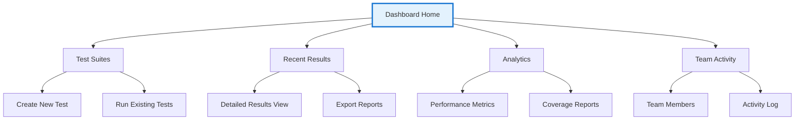
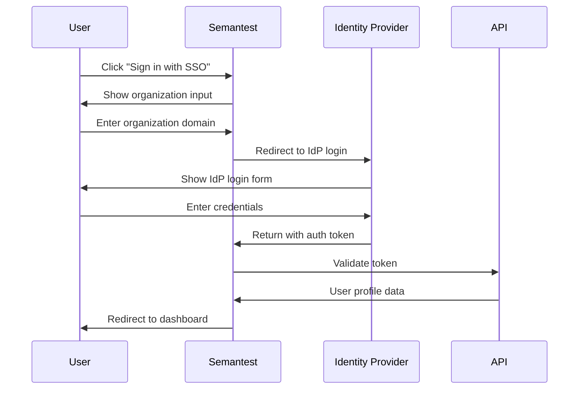
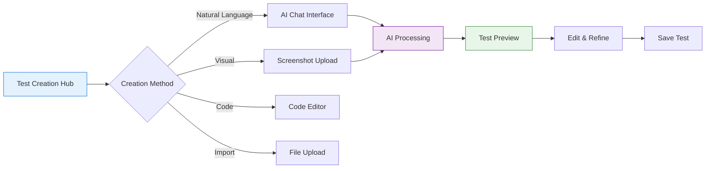
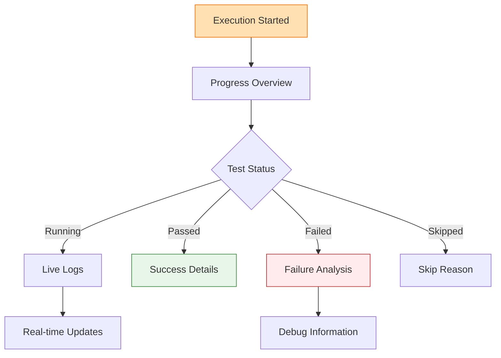
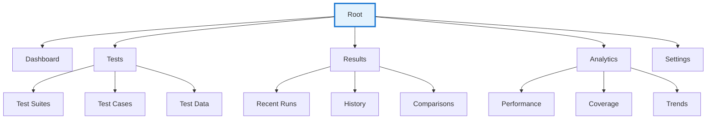

# Semantest User Flow Documentation

## Overview

Comprehensive documentation of user flows within the Semantest platform, aligned with UX design specifications. This guide maps user journeys, interaction patterns, and navigation paths with visual design references to ensure consistency between documentation and user interface implementation.

## Table of Contents

1. [Core User Journeys](#core-user-journeys)
2. [Authentication Flows](#authentication-flows)
3. [Test Creation Workflows](#test-creation-workflows)
4. [Test Execution Flows](#test-execution-flows)
5. [Results Analysis Journeys](#results-analysis-journeys)
6. [AI-Powered Interactions](#ai-powered-interactions)
7. [Mobile User Flows](#mobile-user-flows)
8. [Enterprise Workflows](#enterprise-workflows)
9. [Navigation Patterns](#navigation-patterns)
10. [Accessibility Flows](#accessibility-flows)

## Core User Journeys

### New User Onboarding Flow

#### Journey Overview

```mermaid
flowchart LR
    A[Landing Page] --> B[Sign Up]
    B --> C[Email Verification]
    C --> D[Organization Setup]
    D --> E[Project Creation]
    E --> F[First Test Creation]
    F --> G[Dashboard Overview]
    
    style A fill:#E3F2FD,stroke:#1976D2
    style B fill:#E8F5E9,stroke:#388E3C
    style C fill:#FFF3E0,stroke:#F57C00
    style D fill:#F3E5F5,stroke:#7B1FA2
    style E fill:#FFE0B2,stroke:#FF6F00
    style F fill:#FFEBEE,stroke:#D32F2F
    style G fill:#E0F2F1,stroke:#00796B
```


#### Detailed Step Documentation

##### 1. Landing Page Interaction
```yaml
screen: landing_page
visual_elements:
  hero_section:
    - location: "Top center"
    - content: "Welcome message with value proposition"
    - cta_button: "Get Started - primary button, top right"
  
  navigation:
    - position: "Fixed header"
    - items: ["Features", "Pricing", "Documentation", "Sign In"]
    - mobile_menu: "Hamburger icon for screens < 768px"

user_actions:
  primary_path:
    - action: "Click 'Get Started' CTA"
    - result: "Navigate to Sign Up screen"
    - animation: "Slide transition from right"
  
  secondary_paths:
    - action: "Click 'Sign In' in navigation"
    - result: "Navigate to login screen"
    - animation: "Fade transition"

interaction_states:
  hover:
    - element: "CTA button"
    - effect: "Elevation increase, color shift"
  
  loading:
    - trigger: "Navigation click"
    - indicator: "Progress bar at top of screen"
```

##### 2. Sign Up Process
```yaml
screen: sign_up
layout: "Split screen - form left, benefits right"

form_elements:
  email_input:
    - type: "Email field with validation"
    - placeholder: "work@company.com"
    - validation: "Real-time email format checking"
    - error_display: "Inline below field"
  
  password_input:
    - type: "Password with strength indicator"
    - requirements: "8+ chars, mixed case, number, symbol"
    - visual_feedback: "Color-coded strength bar"
  
  organization_field:
    - type: "Text input with suggestions"
    - autocomplete: "Based on email domain"
    - optional: "Can be set later"

interaction_flow:
  1_enter_email:
    - validation: "Check format and domain"
    - feedback: "Green checkmark for valid"
  
  2_create_password:
    - strength_indicator: "Updates in real-time"
    - tips: "Tooltip with requirements"
  
  3_submit:
    - loading_state: "Button transforms to spinner"
    - success: "Redirect to email verification"
    - error: "Shake animation with error message"

visual_feedback:
  success_states:
    - color: "#4CAF50"
    - icon: "checkmark"
    - animation: "fade-in"
  
  error_states:
    - color: "#F44336"
    - icon: "warning"
    - animation: "shake"
```

##### 3. Email Verification
```yaml
screen: email_verification
design_pattern: "Centered card with illustration"

ui_elements:
  illustration:
    - position: "Top center"
    - content: "Email sent animation"
    - responsive: "Scales for mobile"
  
  instruction_text:
    - content: "Check your email for verification link"
    - typography: "H2 heading with body text"
    - emphasis: "Email address highlighted"
  
  action_buttons:
    - resend_email:
        text: "Resend Email"
        style: "Secondary button"
        cooldown: "60 seconds between sends"
    
    - open_email_client:
        text: "Open Email App"
        style: "Primary button"
        behavior: "Deep link to default email"

user_flow_states:
  waiting:
    - animation: "Pulsing email icon"
    - auto_check: "Poll for verification every 5 seconds"
  
  verified:
    - animation: "Success checkmark"
    - auto_redirect: "After 2 seconds to organization setup"
  
  error:
    - display: "Error message with retry option"
    - support_link: "Contact support prominently displayed"
```

### Returning User Dashboard Flow

#### Dashboard Navigation Map


#### Dashboard Layout Structure
```yaml
dashboard_layout:
  header:
    height: "64px"
    elements:
      - logo: "Left aligned, clickable to home"
      - search_bar: "Center, expandable on focus"
      - user_menu: "Right aligned with avatar"
      - notifications: "Bell icon with badge"
  
  sidebar:
    width: "240px collapsed, 280px expanded"
    sections:
      primary_navigation:
        - item: "Dashboard"
          icon: "dashboard"
          badge: null
        - item: "Test Suites"
          icon: "folder"
          badge: "test_count"
        - item: "Results"
          icon: "assessment"
          badge: "unread_count"
        - item: "Analytics"
          icon: "insights"
          badge: null
      
      secondary_navigation:
        - item: "Team"
          icon: "group"
        - item: "Settings"
          icon: "settings"
        - item: "Help"
          icon: "help"
  
  main_content:
    grid_layout: "12 column responsive grid"
    widgets:
      - test_execution_status:
          columns: "span 8 on desktop, 12 on mobile"
          position: "row 1"
      - quick_actions:
          columns: "span 4 on desktop, 12 on mobile"
          position: "row 1"
      - recent_results:
          columns: "span 6"
          position: "row 2"
      - team_activity:
          columns: "span 6"
          position: "row 2"
```

## Authentication Flows

### Single Sign-On (SSO) Flow

#### SSO Journey Map


#### SSO UI Components
```yaml
sso_login_screen:
  layout: "Centered card design"
  
  initial_state:
    organization_input:
      - placeholder: "Enter your organization domain"
      - helper_text: "e.g., company.semantest.com"
      - validation: "Domain format checking"
      - autocomplete: "From previous sessions"
    
    alternative_options:
      - standard_login: "Link below SSO option"
      - trouble_signing_in: "Support link"
  
  redirect_flow:
    loading_state:
      - message: "Redirecting to your identity provider..."
      - animation: "Spinner with progress"
      - branding: "Maintain Semantest colors"
    
    return_handling:
      - success: "Brief success message then dashboard"
      - failure: "Error with retry option"
      - timeout: "Timeout message with alternatives"

visual_consistency:
  branding_preservation:
    - header: "Semantest logo remains visible"
    - colors: "Consistent color scheme"
    - typography: "Maintain font hierarchy"
  
  responsive_behavior:
    - mobile: "Full screen takeover"
    - tablet: "Centered modal"
    - desktop: "Inline frame option"
```

### Multi-Factor Authentication Flow

#### MFA Setup Journey
```yaml
mfa_setup_flow:
  trigger_screen:
    context: "After initial login or from security settings"
    layout: "Step indicator with current progress"
    
    step_1_selection:
      title: "Choose your authentication method"
      options:
        - authenticator_app:
            icon: "smartphone"
            title: "Authenticator App"
            description: "Use Google Authenticator or similar"
            recommended: true
        
        - sms:
            icon: "message"
            title: "SMS Text Message"
            description: "Receive codes via text"
            disclaimer: "Standard rates apply"
        
        - email:
            icon: "email"
            title: "Email"
            description: "Receive codes via email"
            security_note: "Less secure option"
    
    step_2_configuration:
      authenticator_setup:
        - display_qr: "Large QR code center screen"
        - manual_entry: "Secret key below QR"
        - instructions: "Step-by-step setup guide"
        - test_code: "Verify setup with test code"
      
      sms_setup:
        - phone_input: "International format support"
        - verification: "Send test code immediately"
        - backup_options: "Alternative number setup"
      
      email_setup:
        - confirm_email: "Display current email"
        - backup_email: "Option to add backup"
        - verification: "Send verification code"
    
    step_3_confirmation:
      success_screen:
        - message: "MFA successfully enabled"
        - backup_codes: "Display one-time codes"
        - download_option: "Save backup codes"
        - next_steps: "Return to dashboard"
```

## Test Creation Workflows

### AI-Powered Test Generation Flow

#### Natural Language Test Creation


#### AI Chat Interface Design
```yaml
ai_chat_interface:
  layout:
    container: "Right panel slide-in or modal"
    width: "480px desktop, full screen mobile"
    
  components:
    chat_header:
      - title: "AI Test Assistant"
      - subtitle: "Describe what you want to test"
      - close_button: "Top right corner"
      - minimize_option: "Collapse to bottom bar"
    
    conversation_area:
      message_bubbles:
        user:
          - alignment: "Right aligned"
          - color: "Primary color background"
          - typography: "Body text, white"
          - timestamp: "Below message, subtle"
        
        ai:
          - alignment: "Left aligned"
          - color: "Light gray background"
          - typography: "Body text, dark"
          - typing_indicator: "Three dots animation"
      
      suggested_prompts:
        - display: "Chips above input field"
        - examples:
          - "Test user login flow"
          - "Verify shopping cart functionality"
          - "Check API response times"
          - "Test mobile responsiveness"
    
    input_area:
      text_input:
        - placeholder: "Describe your test scenario..."
        - multiline: "Expands up to 4 lines"
        - char_limit: "500 characters"
        - send_button: "Arrow icon or Enter key"
      
      attachments:
        - button: "Paperclip icon"
        - supported: "Images, JSON, CSV"
        - preview: "Thumbnail in message"

interaction_flow:
  1_initial_input:
    user: "I need to test the checkout process with different payment methods"
    ai_response:
      - processing: "Thinking animation (1-2 seconds)"
      - response: "I'll create a comprehensive checkout test. Let me clarify a few details:"
      - follow_up_questions:
        - "Which payment methods should I include?"
        - "Should I test successful and failed payments?"
        - "Do you need to test guest checkout?"
  
  2_refinement:
    quick_options:
      - display: "Interactive buttons in chat"
      - examples:
        - "✓ Credit Card"
        - "✓ PayPal"
        - "✓ Apple Pay"
        - "+ Add custom"
  
  3_generation:
    progress_indicator:
      - message: "Generating your test..."
      - steps_shown:
        - "Analyzing requirements ✓"
        - "Creating test steps ✓"
        - "Adding validations ✓"
        - "Optimizing execution..."
  
  4_preview:
    test_preview:
      - format: "Collapsible code view"
      - highlights: "Key steps highlighted"
      - edit_option: "Edit button for each step"
      - run_option: "Run test immediately"
```

### Visual Test Creation Flow

#### Screenshot-Based Test Builder
```yaml
screenshot_test_builder:
  upload_interface:
    drop_zone:
      - size: "Full modal or 400x300px minimum"
      - states:
        idle: "Dashed border, upload icon"
        hover: "Solid border, highlight effect"
        uploading: "Progress bar overlay"
        processing: "AI analysis animation"
      - supported_formats: "PNG, JPG, GIF"
      - multi_file: "Up to 10 screenshots"
    
    preview_gallery:
      - layout: "Horizontal scroll or grid"
      - thumbnails: "16:9 aspect ratio"
      - reorder: "Drag and drop enabled"
      - delete: "X button on hover"
  
  annotation_tools:
    toolbar:
      position: "Floating above screenshot"
      tools:
        - select: "Rectangle selection tool"
        - click: "Click point marker"
        - type: "Text input indicator"
        - assert: "Validation marker"
        - note: "Comment annotation"
    
    interaction_markers:
      click_marker:
        - icon: "Pointer with ripple effect"
        - color: "Primary action color"
        - number: "Step sequence number"
      
      input_marker:
        - icon: "Text cursor"
        - field_highlight: "Dotted outline"
        - sample_text: "Editable placeholder"
      
      validation_marker:
        - icon: "Checkmark in circle"
        - color: "Success green"
        - description: "What to validate"
  
  ai_recognition:
    auto_detection:
      - buttons: "Highlighted with suggested action"
      - forms: "Field detection and labeling"
      - navigation: "Menu and link recognition"
      - content: "Text and image areas"
    
    suggestions_panel:
      - position: "Right sidebar"
      - content: "AI-detected elements"
      - actions: "One-click to add to test"
      - confidence: "Percentage for each suggestion"
```

### Manual Test Editor

#### Code Editor Interface
```yaml
code_editor_interface:
  layout:
    split_view:
      - left_panel: "Code editor (60%)"
      - right_panel: "Live preview (40%)"
      - resizable: "Draggable divider"
      - fullscreen: "Toggle option"
  
  editor_features:
    syntax_highlighting:
      - language: "JavaScript/TypeScript"
      - theme: "Semantest Dark/Light"
      - customizable: "User preferences"
    
    autocomplete:
      - commands: "Test framework methods"
      - selectors: "From page analysis"
      - variables: "From test context"
      - snippets: "Common patterns"
    
    inline_help:
      - hover_docs: "Method documentation"
      - parameter_hints: "As you type"
      - error_underlining: "Real-time validation"
      - quick_fixes: "Suggested corrections"
  
  toolbar:
    primary_actions:
      - run: "Play button - execute test"
      - debug: "Bug icon - step through"
      - save: "Disk icon - save changes"
      - settings: "Gear - editor preferences"
    
    view_options:
      - preview: "Toggle preview pane"
      - outline: "Show test structure"
      - problems: "Show errors/warnings"
      - terminal: "Show output console"
  
  preview_panel:
    capabilities:
      - real_time: "Updates as you type"
      - interactive: "Click elements to generate selectors"
      - responsive: "Device size presets"
      - state_management: "Show different app states"
    
    controls:
      - device_selector: "Desktop/tablet/mobile"
      - browser_selector: "Chrome/Firefox/Safari"
      - zoom: "50% to 200%"
      - refresh: "Reload preview"
```

## Test Execution Flows

### Test Run Configuration

#### Execution Setup Interface
```yaml
test_execution_setup:
  configuration_modal:
    layout: "Multi-step wizard or single form"
    
    step_1_test_selection:
      selection_methods:
        - individual: "Checkbox list"
        - suite: "Folder tree selection"
        - tags: "Tag-based filtering"
        - smart: "AI recommendations"
      
      bulk_actions:
        - select_all: "Header checkbox"
        - filter: "Search and filter bar"
        - sort: "Name, date, duration"
        - group: "By suite, tag, or type"
    
    step_2_environment:
      environment_grid:
        browsers:
          - chrome: "Latest, Latest-1, Latest-2"
          - firefox: "Latest, ESR"
          - safari: "Latest (macOS only)"
          - edge: "Latest"
        
        devices:
          - desktop: "1920x1080, 1366x768"
          - tablet: "iPad, Android Tablet"
          - mobile: "iPhone 12, Pixel 5"
        
        locations:
          - regions: "US, EU, Asia"
          - languages: "Based on region"
      
      visual_selector:
        - type: "Interactive grid"
        - icons: "Browser and device icons"
        - presets: "Common combinations"
        - custom: "Advanced settings"
    
    step_3_execution_options:
      parallel_execution:
        - slider: "1 to 10 parallel threads"
        - estimation: "Time estimate updates"
        - warning: "Resource usage indicator"
      
      advanced_options:
        - retry_failed: "0-3 attempts"
        - timeout: "Global timeout setting"
        - notifications: "Email, Slack, webhook"
        - video_recording: "Always, on failure, never"
  
  confirmation_screen:
    summary:
      - test_count: "X tests selected"
      - environment_count: "Y browser/device combos"
      - estimated_time: "~Z minutes"
      - resource_usage: "Low/Medium/High"
    
    actions:
      - run_now: "Primary action button"
      - schedule: "Calendar picker"
      - save_config: "Save as template"
      - cancel: "Return to selection"
```

### Real-Time Execution Monitoring

#### Live Execution Dashboard


#### Execution Monitoring Interface
```yaml
live_monitoring_dashboard:
  layout:
    header:
      - title: "Test Execution #12345"
      - status_badge: "Running/Complete/Failed"
      - elapsed_time: "Live counter"
      - actions: "Pause, Stop, Restart"
    
    progress_section:
      overall_progress:
        - bar: "Segmented by test status"
        - colors:
          running: "#2196F3"
          passed: "#4CAF50"
          failed: "#F44336"
          skipped: "#9E9E9E"
        - percentage: "Large font, center"
        - stats: "X of Y tests complete"
      
      execution_timeline:
        - type: "Gantt-style chart"
        - rows: "Parallel execution lanes"
        - interactive: "Click for test details"
        - live_update: "Smooth animations"
    
    test_grid:
      layout: "Responsive card grid"
      card_states:
        queued:
          - color: "Gray background"
          - icon: "Clock icon"
          - info: "Position in queue"
        
        running:
          - color: "Blue background"
          - icon: "Spinning loader"
          - info: "Current step, progress"
          - action: "View live"
        
        passed:
          - color: "Green background"
          - icon: "Checkmark"
          - info: "Duration, screenshot"
          - action: "View details"
        
        failed:
          - color: "Red background"
          - icon: "X mark"
          - info: "Error preview"
          - action: "Debug"
    
    live_feed:
      position: "Right sidebar or bottom panel"
      content:
        - test_logs: "Scrolling log entries"
        - screenshots: "Thumbnail previews"
        - metrics: "Performance indicators"
      
      filters:
        - level: "Error, Warning, Info"
        - test: "Current test only"
        - search: "Text search in logs"
```

## Results Analysis Journeys

### Test Results Overview

#### Results Dashboard Layout
```yaml
results_dashboard:
  summary_header:
    layout: "Full-width card"
    metrics:
      - pass_rate:
          value: "87%"
          trend: "+5% from last run"
          visualization: "Donut chart"
      
      - total_duration:
          value: "45m 23s"
          comparison: "-12% faster"
          visualization: "Line graph"
      
      - failed_tests:
          value: "23"
          severity: "5 critical, 18 minor"
          action: "View all failures"
    
    quick_filters:
      - status: "All, Passed, Failed, Skipped"
      - priority: "Critical, High, Medium, Low"
      - duration: "Long running (>5m)"
      - new_failures: "First time failures"
  
  results_table:
    columns:
      - test_name: "Sortable, searchable"
      - status: "Icon and text"
      - duration: "Bar visualization"
      - browser: "Icon grid"
      - last_run: "Relative time"
      - actions: "View, Rerun, Debug"
    
    row_expansion:
      - trigger: "Click anywhere on row"
      - content:
        - error_message: "If failed"
        - stack_trace: "Collapsible"
        - screenshots: "Gallery view"
        - video: "Inline player"
        - logs: "Formatted output"
    
    bulk_operations:
      - select: "Checkbox per row"
      - actions: "Rerun selected, Export, Share"
```

### Detailed Test Analysis

#### Individual Test Result View
```yaml
test_detail_view:
  layout: "Full page with sidebar"
  
  header:
    breadcrumb: "Results > Suite Name > Test Name"
    test_info:
      - name: "H1 heading"
      - status: "Large status badge"
      - duration: "With comparison to average"
      - tags: "Clickable chips"
    
    action_bar:
      - rerun: "Split button with options"
      - share: "Copy link, email, Slack"
      - export: "PDF, JSON, CSV"
      - debug: "Open in debug mode"
  
  main_content:
    execution_timeline:
      - type: "Step-by-step waterfall"
      - columns: "Step, Duration, Status"
      - expandable: "Click for details"
      - screenshots: "Inline thumbnails"
      
    failure_analysis:
      - ai_insights:
          position: "Highlighted box"
          content: "AI-generated failure reason"
          confidence: "Percentage indicator"
          suggestions: "Fix recommendations"
      
      - error_details:
          message: "Syntax highlighted"
          line_number: "Link to code"
          stack_trace: "Expandable"
          related_failures: "Similar errors"
    
    artifacts:
      screenshots:
        - layout: "Grid gallery"
        - viewer: "Lightbox with zoom"
        - comparison: "Side-by-side diff"
        - annotations: "AI-highlighted issues"
      
      video:
        - player: "Custom controls"
        - timeline: "Sync with steps"
        - speed: "0.5x to 2x"
        - download: "Multiple formats"
      
      logs:
        - viewer: "Syntax highlighted"
        - search: "Find in logs"
        - filter: "By level, timestamp"
        - export: "Download raw logs"
  
  sidebar:
    related_information:
      - history: "Past 10 runs"
      - environment: "Full config details"
      - dependencies: "Related tests"
      - documentation: "Test docs, guides"
    
    quick_actions:
      - edit_test: "Open in editor"
      - view_code: "GitHub link"
      - report_issue: "Create bug report"
      - add_to_suite: "Organize tests"
```

### Comparative Analysis Views

#### Test Comparison Interface
```yaml
comparison_view:
  layout: "Split screen or overlay"
  
  selection_interface:
    method_1_dropdown:
      - recent_runs: "Last 10 executions"
      - branches: "Compare branches"
      - environments: "Dev vs Prod"
      - time_periods: "This week vs last"
    
    method_2_search:
      - test_name: "Autocomplete"
      - execution_id: "Direct input"
      - date_picker: "Calendar selection"
  
  comparison_display:
    side_by_side:
      - sync_scroll: "Locked scrolling"
      - diff_highlighting: "Changes highlighted"
      - metrics_comparison: "Delta values"
      - visual_diff: "Screenshot overlay"
    
    overlay_mode:
      - transparency: "Adjustable slider"
      - toggle: "Quick switch A/B"
      - markers: "Difference indicators"
    
    insights_panel:
      - performance_delta: "Timing changes"
      - new_failures: "Regression detection"
      - improvements: "Fixed issues"
      - recommendations: "AI suggestions"
```

## AI-Powered Interactions

### Natural Language Command Interface

#### AI Assistant Integration Points
```yaml
ai_assistant_integration:
  global_command_bar:
    trigger: "Cmd/Ctrl + K"
    position: "Center modal"
    
    interface:
      search_input:
        - placeholder: "Ask me anything..."
        - autocomplete: "Recent commands"
        - voice_input: "Microphone icon"
      
      suggestions:
        - recent: "Last 5 commands"
        - popular: "Common actions"
        - contextual: "Based on current page"
      
      results:
        - instant: "As you type"
        - grouped: "By result type"
        - actions: "Direct execution"
  
  contextual_ai_help:
    trigger_points:
      - help_icon: "? button on each section"
      - right_click: "Context menu option"
      - keyboard: "F1 for help"
    
    help_bubble:
      - position: "Near trigger point"
      - content: "Contextual explanation"
      - actions: "Learn more, examples"
      - dismiss: "X or click outside"
  
  inline_ai_suggestions:
    test_editor:
      - ghost_text: "Gray preview text"
      - tab_complete: "Accept suggestion"
      - alternatives: "Cycle with arrows"
    
    form_fields:
      - smart_defaults: "AI-predicted values"
      - validation_help: "Fix suggestions"
      - batch_fill: "Fill similar fields"
```

### AI-Powered Test Insights

#### Intelligent Analysis Dashboard
```yaml
ai_insights_dashboard:
  layout: "Dedicated insights page"
  
  insight_cards:
    pattern_detection:
      - title: "Failure Patterns Detected"
      - visualization: "Heat map or timeline"
      - details: "Collapsible list"
      - actions: "View affected tests"
    
    predictive_alerts:
      - title: "Predicted Issues"
      - confidence: "Percentage with indicator"
      - timeline: "When issues may occur"
      - prevention: "Suggested actions"
    
    optimization_opportunities:
      - title: "Test Suite Optimization"
      - impact: "Time/resource savings"
      - effort: "Implementation effort"
      - priority: "AI-ranked list"
  
  interactive_visualizations:
    failure_correlation_map:
      - type: "Network diagram"
      - nodes: "Tests, colored by status"
      - edges: "Correlation strength"
      - interaction: "Click to explore"
    
    performance_trends:
      - type: "Multi-line chart"
      - lines: "Different metrics"
      - annotations: "AI-detected anomalies"
      - zoom: "Brush to zoom"
    
    test_health_matrix:
      - type: "Grid heat map"
      - axes: "Tests vs time/environment"
      - colors: "Health score gradient"
      - details: "Hover for specifics"
```

## Mobile User Flows

### Mobile App Navigation

#### Bottom Navigation Pattern
```yaml
mobile_navigation:
  bottom_tabs:
    structure:
      - home:
          icon: "house"
          label: "Home"
          badge: null
      - tests:
          icon: "flask"
          label: "Tests"
          badge: "running_count"
      - results:
          icon: "chart"
          label: "Results"
          badge: "new_count"
      - notifications:
          icon: "bell"
          label: "Alerts"
          badge: "unread_count"
      - menu:
          icon: "menu"
          label: "More"
          badge: null
    
    behavior:
      - selection: "Color change and label"
      - animation: "Scale and fade"
      - gesture: "Swipe between tabs"
      - haptic: "Subtle feedback on tap"
  
  screen_transitions:
    navigation:
      - push: "Slide from right"
      - pop: "Slide to right"
      - modal: "Slide from bottom"
      - tab: "Fade transition"
    
    gestures:
      - back_swipe: "iOS edge swipe"
      - android_back: "System back button"
      - pull_refresh: "Elastic bounce"
```

#### Mobile Test Execution Flow
```yaml
mobile_test_execution:
  test_selection:
    list_view:
      - cards: "Test suite cards"
      - swipe_actions: "Run, edit, delete"
      - multi_select: "Long press to start"
      - search: "Pull down to reveal"
    
    quick_run:
      - fab: "Floating action button"
      - options: "Recent, favorites, all"
      - confirmation: "Bottom sheet summary"
  
  execution_view:
    compact_progress:
      - header: "Collapsible statistics"
      - progress: "Circular or linear"
      - test_list: "Scrollable list below"
      - live_log: "Expandable section"
    
    notifications:
      - in_app: "Banner notifications"
      - system: "Progress in notification"
      - completion: "Summary notification"
  
  results_mobile:
    summary_card:
      - swipe: "Between test results"
      - expand: "Tap for details"
      - share: "Native share sheet"
      - actions: "Bottom action bar"
```

### Mobile-Specific Gestures

#### Touch Interaction Patterns
```yaml
mobile_gestures:
  navigation_gestures:
    swipe_navigation:
      - left_right: "Between tabs/screens"
      - up_down: "Scroll content"
      - edge_swipe: "Back navigation"
      - two_finger: "Special actions"
    
    pinch_zoom:
      - screenshots: "Zoom test artifacts"
      - charts: "Zoom data visualizations"
      - logs: "Text size adjustment"
  
  content_interactions:
    long_press:
      - test_cards: "Multi-select mode"
      - results: "Context menu"
      - text: "Copy/share options"
    
    drag_drop:
      - reorder: "Test execution order"
      - organize: "Move between suites"
      - threshold: "40px before activate"
  
  shortcuts:
    shake_gesture:
      - action: "Report bug/feedback"
      - sensitivity: "Adjustable in settings"
    
    force_touch:
      - preview: "Peek at test details"
      - actions: "Quick action menu"
```

## Enterprise Workflows

### Team Collaboration Flows

#### Project Setup and Permissions
```yaml
enterprise_project_setup:
  project_creation:
    wizard_steps:
      1_basic_info:
        - name: "Project name input"
        - description: "Optional textarea"
        - visibility: "Public/Private toggle"
        - template: "Dropdown selection"
      
      2_team_setup:
        - invite_method: "Email, link, or bulk CSV"
        - role_assignment: "Drag into role buckets"
        - permissions_preview: "Live permission grid"
        - notification_settings: "Per-role configs"
      
      3_integrations:
        - source_control: "GitHub, GitLab, etc."
        - ci_cd: "Jenkins, CircleCI, etc."
        - communication: "Slack, Teams, etc."
        - issue_tracking: "Jira, Azure DevOps"
      
      4_confirmation:
        - summary: "All settings review"
        - test_connection: "Verify integrations"
        - create_action: "Create and redirect"
  
  permission_management:
    role_hierarchy:
      - admin: "Full access"
      - lead: "Manage tests and team"
      - developer: "Create and run tests"
      - viewer: "Read-only access"
    
    permission_grid:
      layout: "Matrix visualization"
      customization: "Click cells to toggle"
      inheritance: "Show inherited permissions"
      audit: "Change history log"
```

#### Approval Workflows

#### Test Review and Approval
```yaml
approval_workflow:
  submission_flow:
    initiator_view:
      - submit_button: "Request review"
      - reviewer_selection: "Dropdown or search"
      - message: "Optional context"
      - urgency: "Priority level"
    
    review_queue:
      - list_view: "Pending reviews"
      - filters: "By status, date, priority"
      - bulk_actions: "Approve/reject multiple"
      - delegation: "Reassign to others"
  
  review_interface:
    split_view:
      - left: "Test code/changes"
      - right: "Comments and actions"
      - diff_view: "Show changes only"
      
    review_actions:
      - approve: "Green button with message"
      - reject: "Red with required reason"
      - request_changes: "Yellow with specifics"
      - delegate: "Forward to expert"
    
    inline_comments:
      - selection: "Highlight code to comment"
      - threading: "Reply to comments"
      - suggestions: "Propose changes"
      - resolution: "Mark as resolved"
```

### Enterprise Analytics Flows

#### Executive Dashboard
```yaml
executive_dashboard:
  layout: "Configurable widget grid"
  
  key_metrics_widgets:
    test_coverage:
      - visualization: "Gauge chart"
      - target_line: "90% goal"
      - trend: "6-month sparkline"
      - drill_down: "By team/project"
    
    quality_trends:
      - visualization: "Area chart"
      - metrics: "Pass rate over time"
      - annotations: "Release markers"
      - comparison: "YoY overlay"
    
    team_productivity:
      - visualization: "Bar chart"
      - grouping: "By team"
      - metrics: "Tests created/maintained"
      - efficiency: "Time per test"
    
    cost_analysis:
      - visualization: "Donut chart"
      - breakdown: "By resource type"
      - savings: "vs manual testing"
      - projection: "Next quarter estimate"
  
  interactive_features:
    date_range:
      - preset: "Last 30/90/365 days"
      - custom: "Date picker"
      - comparison: "Previous period"
    
    export_options:
      - pdf: "Formatted report"
      - pptx: "Presentation ready"
      - csv: "Raw data export"
      - api: "Scheduled delivery"
    
    customization:
      - add_widget: "From gallery"
      - resize: "Drag corners"
      - rearrange: "Drag and drop"
      - save_layout: "Named configs"
```

## Navigation Patterns

### Global Navigation Structure

#### Information Architecture


#### Breadcrumb Navigation
```yaml
breadcrumb_patterns:
  structure:
    separator: "/"
    max_items: 4
    truncation: "... in middle"
    
  interactive_elements:
    clickable: "All except current"
    dropdown: "On truncated sections"
    hover: "Full path tooltip"
    
  responsive_behavior:
    mobile: "Show current only"
    tablet: "Show last 2 levels"
    desktop: "Show full path"
```

### Search and Filter Patterns

#### Global Search Experience
```yaml
global_search:
  search_interface:
    trigger: "Search icon or Cmd+K"
    
    search_modal:
      input:
        - placeholder: "Search tests, results, or ask a question..."
        - icon: "Magnifying glass"
        - clear: "X button when typing"
      
      live_results:
        - grouping: "By type (tests, results, docs)"
        - highlighting: "Match highlighting"
        - count: "Number per category"
        - loading: "Skeleton screens"
      
      result_actions:
        - primary: "Enter to navigate"
        - secondary: "Cmd+Enter to open new tab"
        - preview: "Space to preview"
    
    search_filters:
      type_filters:
        - tests: "Test cases and suites"
        - results: "Execution results"
        - analytics: "Reports and insights"
        - help: "Documentation"
      
      time_filters:
        - today: "Last 24 hours"
        - week: "Last 7 days"
        - month: "Last 30 days"
        - custom: "Date range picker"
      
      advanced_filters:
        - status: "Passed, failed, running"
        - author: "Team member selector"
        - tags: "Multi-select chips"
        - regex: "Pattern matching"
```

## Accessibility Flows

### Keyboard Navigation

#### Complete Keyboard Support
```yaml
keyboard_navigation:
  global_shortcuts:
    navigation:
      - "Cmd/Ctrl + K": "Open command palette"
      - "Cmd/Ctrl + /": "Toggle help"
      - "Cmd/Ctrl + ,": "Open settings"
      - "Esc": "Close modal/cancel"
    
    actions:
      - "Cmd/Ctrl + N": "New test"
      - "Cmd/Ctrl + R": "Run selected"
      - "Cmd/Ctrl + S": "Save current"
      - "Cmd/Ctrl + F": "Find in page"
  
  focus_management:
    tab_order:
      - logical: "Left to right, top to bottom"
      - skip_links: "Jump to main content"
      - focus_visible: "Clear focus indicators"
      - trap: "Within modals and menus"
    
    aria_landmarks:
      - navigation: "role='navigation'"
      - main: "role='main'"
      - search: "role='search'"
      - form: "role='form'"
  
  screen_reader_support:
    announcements:
      - live_regions: "Status updates"
      - labels: "Descriptive labels"
      - descriptions: "Helper text"
      - states: "Expanded/collapsed"
    
    semantic_html:
      - headings: "Proper hierarchy"
      - lists: "Ordered/unordered"
      - tables: "Headers and captions"
      - forms: "Fieldsets and legends"
```

### High Contrast and Theme Support

#### Accessibility Themes
```yaml
accessibility_themes:
  high_contrast:
    colors:
      - background: "#000000"
      - foreground: "#FFFFFF"
      - primary: "#00D4FF"
      - error: "#FF6B6B"
      - success: "#51F551"
      - warning: "#FFD93D"
    
    borders:
      - width: "2px minimum"
      - style: "Solid for important elements"
      - focus: "3px with offset"
    
    text:
      - size: "16px minimum"
      - weight: "Medium or bold"
      - spacing: "1.5 line height"
  
  reduced_motion:
    preferences:
      - animations: "Respect prefers-reduced-motion"
      - transitions: "Instant or very fast"
      - parallax: "Disabled completely"
      - auto_play: "Stopped by default"
    
    alternatives:
      - loading: "Progress text instead of spinners"
      - transitions: "Fade instead of slide"
      - feedback: "Color change instead of bounce"
```

This comprehensive user flow documentation provides detailed mapping of user journeys throughout the Semantest platform, with specific attention to visual design elements, interaction patterns, and accessibility considerations. Each flow is documented with both technical specifications and visual design guidance to ensure consistency between documentation and implementation.

---

**Last Updated**: January 19, 2025  
**Version**: 1.0.0  
**Maintainer**: Semantest UX Documentation Team  
**Support**: ux-team@semantest.com